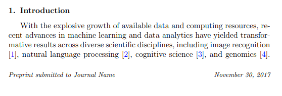
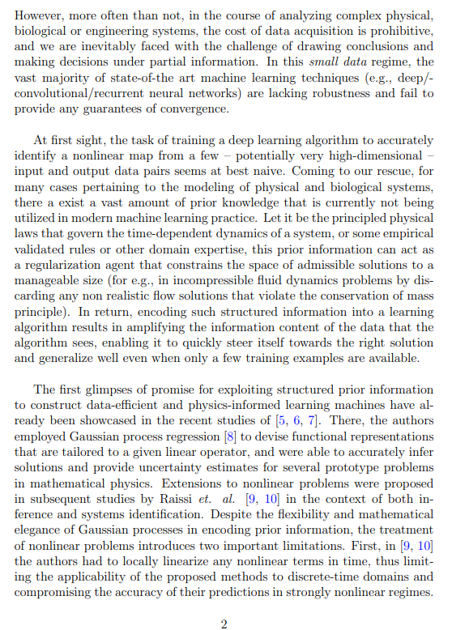
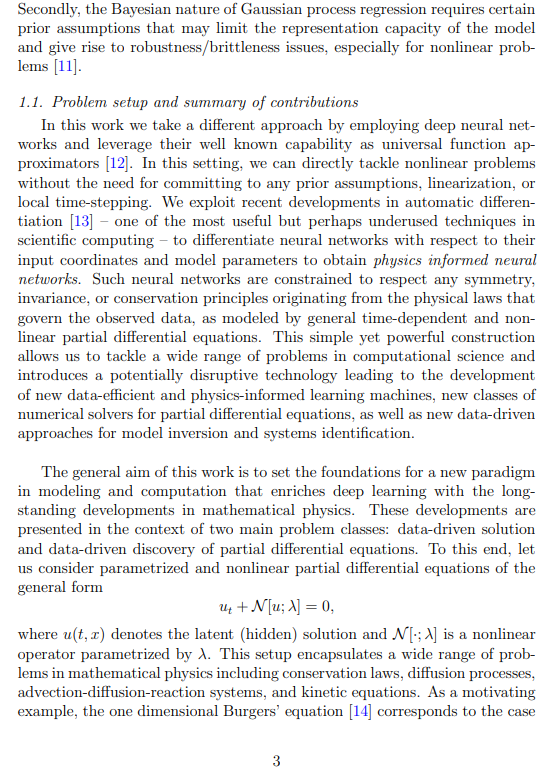
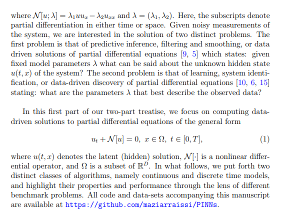

# 環境セットアップ

## 動作環境セットアップ



:::: {.columns}
::: {.column style="width: 50%; height:100%"}

:::{.border-bottom-header style="width:80%; margin-left: 10%;"}

必要ツール

:::

:::::{.keypoints-container style="height:70%; padding-left:1em; padding-top: 0em;"}

::: {.vertical-keypoints-block style="width:80%;"}
::: {.block}
:::{.block-header-centered}

{width=1.8em}

Quarto

:::

- ドキュメントやスライド作成のためのオープンソースツール
- Reveal.jsスライドの生成が可能

:::

::: {.no-border-block}

:::{.block-header-centered}

{width=1.8em}

VSCode

:::



- 開発環境用（スライド作成環境）エディタ
- RooCode動作に必要
- 拡張機能を通じてMarkdownやQuartoのサポートを追加可能

:::
:::
:::::

:::

::: {.column style="width: 50%; height:100%"}

:::{.border-bottom-header style="margin-right:7.5%;" }

インストール手順

:::

:::{ style="font-size: 0.8em;"}
- 下記の方法はUbuntu 22.04LTSでのインストールを想定
- macOSやWindowsの場合は公式ドキュメントを参照してください
:::



```bash
# VSCodeのインストール
sudo apt update
sudo apt install code

# Quartoのインストール
export QUARTO_VERSION="1.5.54"
sudo mkdir -p /opt/quarto/${QUARTO_VERSION}
sudo curl -o quarto.tar.gz -L \
    "https://github.com/quarto-dev/quarto-cli/releases/download/v${QUARTO_VERSION}/quarto-${QUARTO_VERSION}-linux-amd64.tar.gz"
sudo tar -zxvf quarto.tar.gz \
    -C "/opt/quarto/${QUARTO_VERSION}" \
    --strip-components=1
sudo rm quarto.tar.gz

# Quartoの動作確認
/opt/quarto/"${QUARTO_VERSION}"/bin/quarto check

# Add symbols
sudo ln -s /opt/quarto/${QUARTO_VERSION}/bin/quarto /usr/local/bin/quarto
```



:::
::::

## Quartoスライド作成に必要なツール: RooCodeとReveal.js



:::: {.columns}
::: {.column style="width: 50%; height:80%"}

::: {.horizontal-keypoints-block style="height:100%;"}

::: {.block-header}

{width=1.5em}

[RooCode]{ style="padding-left:0.5em;"}

:::



::: {.block}

- **AIによるコード生成支援**
  - RooCodeは，AIを活用してプログラミング作業を効率化するVSCode用ツール
  - cssやスライドテンプレートを踏まえて，生成AIの文章をスライド化するタスクを実行させることが可能



- **VSCode拡張機能経由インストール**
  - `ext install RooVeterinaryInc.roo-cline`

:::
:::
:::

::: {.column style="width: 50%; height:100%"}

::: {.horizontal-keypoints-block-no-border style="height:100%;"}

::: {.block-header}

{width=1.5em}

[Reveal.js]{ style="padding-left:0.5em;"}

:::



::: {.block}

- **ウェブベースのスライドフレームワーク**
  - `Reveal.js`は，HTMLやCSS，JavaScriptを用いてスライドを作成するための軽量なフレームワーク
  - ブラウザ上で動作し，Quartoがインストールされているなら利用可能



- **カスタマイズ性**
  - css，プラグインを活用して，スライドのデザインや機能を自由にカスタマイズ可能



- **多言語対応**
  - 複数のプログラミング言語に対応
  - `js`を用いた可視化など，スライドごとの細かなニーズに対応可能
:::
:::
:::

::::

# Reveal.jsスライドの作成


## Roo Code用Slide generator modeの作成

[要約やテンプレートフォーマットを効率的に行うためのスライド生成に特化したモードを定義]{.h2-submessage}

:::: {.columns}
::: {.column width="50%"}

:::{.border-bottom-header style="width:90%; margin-left: 5%;"}

Roo Code custom mode setting

:::

```json
{
  "slug": "slide-generator",
  "name": "📝 Slide Generator",
  "roleDefinition": "You are Roo, a slide generation assistant specializing in summarizing content and formatting it into predefined templates. Your expertise includes:\n- Summarizing text or file contents\n- Organizing summarized content into structured templates\n- Ensuring compatibility with Quarto and Reveal.js formats\n- Ensuring the output is concise, structured into sections (e.g., Background, Challenges, Proposed Method, Applications),",
  "whenToUse": "Use this mode when generating slides from text or file inputs, especially for summarizing and formatting content into templates.",
  "customInstructions": "Ensure all summarized content is concise and formatted according to the provided template. Validate compatibility with Quarto and Reveal.js.",
  "groups": [
    "read",
    [
      "edit",
      {
        "fileRegex": "\\.qmd$",
        "description": "Quarto Markdown files only"
      }
    ],
    "mcp"
  ],
  "source": "global"
}
```

:::
::: {.column style="width:45%; padding-left:1em;"}

:::{.border-bottom-header style="width:90%; margin-left: 5%;"}

Configの説明

:::

:::{style="font-size:0.9em"}

- **`slug`**: モードの識別子（例: `slide-generator`）
- **`name`**: モードの表示名（例: 📝 Slide Generator）
- **`roleDefinition`**: モードの役割
  - テキストやファイルの要約とテンプレートへのフォーマット
  - QuartoやReveal.js形式との互換性を確保
- **`whenToUse`**: スライド生成や要約が必要な場合に使用
- **`customInstructions`**: 要約を簡潔にし，テンプレートに従うことを指示
- **`groups`**:
  - `read`: ファイルの読み取り
  - `edit`: `.qmd`ファイルの編集
  - `mcp`: 高度な操作を許可
- **`source`**: グローバル設定からのモード

:::

:::
::::

## Azure summaryスライドの作成

:::: {.columns}
::: {.column width="50%"}

:::{.border-bottom-header style="width:90%; margin-left: 5%;"}

Roo Code自動生成結果

:::

:::: {.summary-container style="font-size:0.8em;"}

::: {.block-azureblue }
::: {.headline}
背景
:::

- 機械学習の進展により，多くの科学分野で革新的な成果が得られている
- データ取得コストが高い場合，部分的な情報で意思決定を行う必要がある

:::

::: {.block-azureblue }
::: {.headline}
課題
:::

- 少量データでは従来の機械学習手法が収束性やロバスト性に欠ける
- 非線形問題において，既存のガウス過程回帰法には限界がある

:::

::: {.block-azureblue }
::: {.headline}
提案手法
:::

- 物理法則を組み込んだニューラルネットワークを活用
- 自動微分技術を用いて，入力座標やモデルパラメータに基づく微分を実現

:::

::: {.block-azureblue }
::: {.headline}
応用
:::

- データ駆動型の偏微分方程式の解法と発見
- 新しい数値解法やモデル反転手法の開発

:::

::::

:::
::: {.column width="50%"}

:::{.border-bottom-header style="width:90%; margin-left: 5%;"}

Roo Code Prompt

:::



```{.prompt filename="Prompt"}
1. Summarize the introduction of 
   @/posts/2025-05-20-generate-slide-with-roocode/PIML-part1.pdf  
   into Japanese. 

2. Format the summary using the @/template/azureblue-summary.qmd file. 

3. Ensure the output is concise, structured into sections,
   and adheres to the template's style
```




::: {#fig-paper-intro layout-ncol=4}

{#fig-page1}

{#fig-page2}

{#fig-page3}

{#fig-page4}

[Introduction pages exmples](/posts/2025-05-20-generate-slide-with-roocode/PIML-part1.pdf)
:::

:::
::::
---


## hop-step-jumpスライドの作成

:::: {.columns}
::: {.column width="60%"}

:::{.border-bottom-header style="width:90%; margin-left: 5%;"}

Roo Code自動生成結果

:::

::: {.hop-step-jump-container style="height:640px; font-size:0.8em;"}

::: {.step .step-1}

::: {.step-number}
1 Step
:::

::: {.step-title}
分析設計
:::

::: {.step-description}
プロジェクトの目標を明確にし，必要なデータと分析手法を設計します
:::

::: {.info-box}

::: {.info-label}
目的
:::
::: {.info-content}
分析の方向性を定め，必要なリソースを特定する
:::

::: {.info-label}
成果物
:::
::: {.info-content}
分析計画書
:::
:::

:::

::: {.step .step-2}

::: {.step-number}
2 Step
:::

::: {.step-title}
ベースラインモデル作成
:::

::: {.step-description}
基本的なモデルを構築し，初期のパフォーマンスを評価します
:::

::: {.info-box}

::: {.info-label}
目的
:::
::: {.info-content}
モデルの基準となるパフォーマンスを確立する
:::

::: {.info-label}
成果物
:::
::: {.info-content}
ベースラインモデルとその評価結果
:::
:::

:::

::: {.step .step-3}

::: {.step-number}
3 Step
:::

::: {.step-title}
モデル精緻化
:::

::: {.step-description}
モデルを改良し，最適化してパフォーマンスを向上させます
:::

::: {.info-box}

::: {.info-label}
目的
:::
::: {.info-content}
モデルの精度と信頼性を向上させる
:::

::: {.info-label}
成果物
:::
::: {.info-content}
最適化されたモデルとその評価結果
:::
:::
:::

:::


:::
::: {.column width="40%"}

:::{.border-bottom-header style="width:90%; margin-left: 5%;"}

Roo Code Prompt

:::



```{.prompt filename="Prompt"}
1. summarize 3 steps for datascience 
   project into japanese

2. Format the summary using the 
   @/template/hop-step-jump.qmd  file. 

3. insert contensts at <!-- insert contents --> 
   in @/posts/2025-05-20-generate-slide-with-roocode/index.qmd
```




:::{.border-bottom-header style="width:90%; margin-left: 5%;"}

`/template/hop-step-jump.qmd`

:::

- 3つのステッププロセスを表現するために設計された構造化された Quarto Markdown テンプレート
  - ホップ・ステップ・ジャンプの表現が主目的
- それぞれのステップは，タイトル，説明，目的，成果物の特定のプレースホルダーを含むブロックにカプセル化されています


:::
::::

<!-- ## Decision Treeスライドの作成 -->


<!-- ## Slide Title {.colored-slide-30}

:::: {.columns}
::: {.column width="70%"}

test

:::
::: {.column style="width: 30%"}


test


:::
:::: -->
