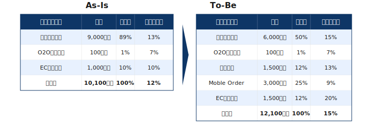
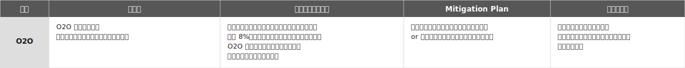

## プロジェクト収益管理のあり方



::::{.message-card .font-10}

:::{.message-card-title-no-margin .center}

プロジェクト収益管理の目的

:::

:::{.message-card-body .squaredmark .font-09}

- 従来の事業別PLだけでなく，大型投資を伴うようなプロジェクトレベルでもPL観点から分析を行うことで，採算性を踏まえた優先順位付け，意思決定を促す
- 新規投資だけでなく既存投資も対象とし，公平に判断を行うための統一のガイドライン・チェックリストを作成する．また分析・判断の考え方・プロセスを標準化の上で明文化し，チームとして効率的で非属人的な業務体制を構築する

:::

::::




::::{.message-card .font-10}

:::{.message-card-title-no-margin .center}

収益管理プロジェクトのゴール

:::

:::: {.columns}
::: {.column width="47.5%"}

:::{.message-card-body .squaredmark .font-09}

- 施策実施により，売上の構成および利益率がどう変わるのかを明らかにする
- 事業利益を最大化させる事業別/地域別での最適な方法を提案・実行する

:::

:::
::: {.column width="52.5%"}



:::


::::

::::


## リスクは「事象・影響・対応・現状」の4点で構造化して管理する



::: {.padding-L-10}



:::



::: {.regmonkey_index style="width:95%" .padding-L-10}

```yml
regmonkey_index:
  title_fontsize: 1.2em
  bullet_fontsize: 1.0em
  numbering: false
  children:
    - title: リスク
      description:
        - 将来発生しうる不確実な事象を1文で特定する
        - 「誰から・何を要求されるか」など主語と条件を明示し，確定事実とは区別する
      width: [26,74]
    - title: リスク顕在化の影響
      description:
        - 事象が起きた場合の事業インパクトを定量で示す
        - 売上比・利益率・コスト増などの数値と，影響の波及経路（起点と効き先）を書く
      width: [26,74]
    - title: Mitigation Plan
      description:
        - 影響を低減・回避するための打ち手を具体化する
        - 交渉・代替案・条件付き合意など，誰が・いつ・どう動くか想定できる粒度で書く
      width: [26,74]
    - title: ステータス
      description:
        - 現時点の対応状況を日付つきで記録する
        - どの会議で・いつ提起し，議論中・合意済など進捗を一目で分かるようにする
      width: [26,74]

```

:::
