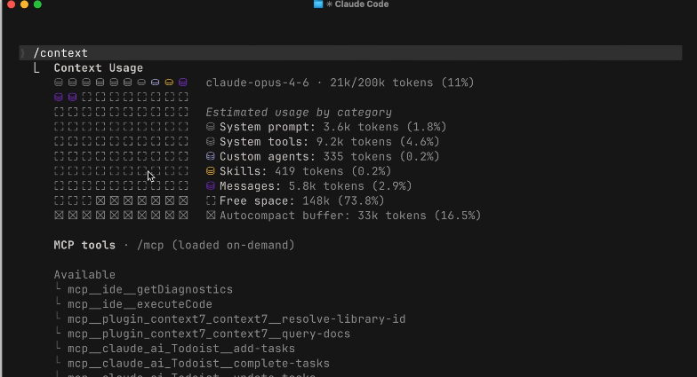

# コーディングエージェント概論

## コーディングエージェントとは何か？



:::{.info-box}



:::{.info-contents .font-10 .padding-L-05}

- コーディングエージェントとは，[LLMが自律的にコードの読み書き・コマンド実行・検証を行うAIエージェント[^footer-ao-agent]]{.regmonkey-bold}のこと
- ユーザーの指示を受けて「[計画 → 実行 → 検証 → 修正]{.regmonkey-bold}」のループを自走し，タスク完了まで反復する
  - 従来ソフトウェア: 人間が アルゴリズム・分岐・例外処理を事前にすべて設計し，その手順に従う
  - コーディングエージェント: 手順そのものを動的に生成・修正

:::

:::



[コーディングエージェントの進化[^footer1]]{.mini-section}

::::{ .width-105 .position-left-10 .font-09}
:::{.vuetify-timeline-container}

```yml
pipeline:
  title: "LLM登場前"
  content:
    - 'バッチ処理やワークフローによる処理自動化'
    - '処理は自動化されるがロジックは固定'
  opposite: "2010年代後半"
  color: "#B4D7FF"

copilot:
  title: "LLMコーディング支援"
  content:
    - 'コード補完・生成（Copilot, ChatGPTなど）'
    - 'コード補完や関数の生成'
    - '試行錯誤は人間が実施'
  opposite: "2020年代前半"
  color: "#0E3666"

agent_v1:
  title: "対話型エージェント"
  content:
    - 'IDE + AIモデル(Cursorが代表例)'
    - 'レポジトリ内容を踏まえて，コード生成と実行を自動化'
    - 対話的な開発フロー中心
  opposite: "2023〜2024"
  color: "#0E3666"

agent_v2:
  title: "自律型エージェント"
  content:
    - 'Devin, Claude Code'
    - '計画→実行→検証→修正のループを確立'
    - 'バックグラウンド実行，非同期・並列実行'
  opposite: "2024〜"
  color: "#428CE6"

```
:::
::::

<!-- footer -->

[^footer1]: 進化の背景にはLLMの推論性能の向上(ゴールを踏まえた計画の立案力)や長文コンテキスト対応(レポジトリ内容の理解力)といった技術的進歩がある
[^footer-ao-agent]: AIエージェントとは，環境と相互作用しながら，定義された目標を達成するために行動を実行できるソフトウェアのこと

## コーディングエージェントの特徴
[「計画 → 実行 → 検証 → 修正」の自律ループ[^footer-agentic-loop]で動く]{.h2-submessage}

:::::::::{.shannon-model .font-09}

::::{.shannon-component}

:::{.shannon-icon-box}
<i class="fa-solid fa-bullseye"></i>
:::

[指示・ゴール]{.shannon-label}



:::{.shannon-annotation-box style="border: none"}

- ユーザー要件
- 成功条件の把握

:::


::::

:::{.shannon-arrow}



<i class="fa-solid fa-arrow-right"></i>

:::

::::{.shannon-component}

:::{.shannon-icon-box}

<i class="fa-solid fa-list-check"></i>

:::

[計画立案]{.shannon-label}



:::{.shannon-annotation-box style="border: none"}

- タスク分解・要件具体化
- 手順の動的設計

:::

::::

:::{.shannon-arrow}



<i class="fa-solid fa-arrow-right"></i>

:::

::::{.shannon-component}

:::{.shannon-icon-box}
<i class="fa-solid fa-terminal"></i>

:::

[実行]{.shannon-label}



:::{.shannon-annotation-box style="border: none"}

- Read/Edit/Bash
- 環境への作用

:::

::::

:::{.shannon-arrow}



<i class="fa-solid fa-arrow-right"></i>
:::

::::{.shannon-component}

:::{.shannon-icon-box}
<i class="fa-solid fa-eye"></i>
:::

[検証]{.shannon-label}



:::{.shannon-annotation-box style="border: none"}

- 出力・エラー確認
- テスト結果検証

:::

::::

:::{.shannon-arrow}



<i class="fa-solid fa-arrow-right"></i>
:::

::::{.shannon-component}

:::{.shannon-icon-box}
<i class="fa-solid fa-arrows-rotate"></i>
:::

[修正・再計画]{.shannon-label}



:::{.shannon-annotation-box style="border: none"}

- 誤り訂正
- 方針転換

:::

::::

:::::::::

:::{.shannon-overview-arrow .font-11}
<div class="shannon-overview-arrow-head" style="border-left: none; border-right: 10px solid #0e3666;"></div><div class="shannon-overview-arrow-line"></div><div class="shannon-overview-arrow-text">フィードバックループ：完了条件を満たすまで自走反復</div><div class="shannon-overview-arrow-line"></div>
:::



[コーディングエージェントの中核機能]{.mini-section .font-09}



:::: {.columns}
::: {.column width="50%"}

::::{.width-100}

:::{.regmonkey_abstract_summary}

```yaml
regmonkey_abstract_summary:
  title_fontsize: 1em
  bullet_fontsize: 0.8em
  keystat_fontsize: 0.8em
  children:
    - title: 目的駆動
      description:
        - 操作ではなく「やりたいこと（Goal）」を与える
        - 完了条件・成功基準をもとに自走
      width: [25,75]

    - title: 動的生成
      description:
        - 手順・コード・コマンドを状況に応じて生成
        - 固定ロジックではなく都度設計・変更
      width: [25,75]
```

:::
::::

:::
::: {.column width="50%"}

::::{.width-100}
:::{.regmonkey_abstract_summary}

```yaml
regmonkey_abstract_summary:
  title_fontsize: 1em
  bullet_fontsize: 0.8em
  keystat_fontsize: 0.8em
  children:
    - title: ツール実行
      description:
        - Git，APIなどのツールを自律的に操作
        - ファイル操作・シェル実行・検索を使い分け
      width: [25,75]

    - title: 自己修正
      description:
        - 実行結果を確認し，エラーに応じて修正
        - 完了条件を満たすまで反復
      width: [25,75]
```

:::
::::

:::
::::

<!-- footer -->

[^footer-agentic-loop]: プロンプト以降の「計画立案・実行・検証」Loopを特にAgentic Loopと呼ぶ場合がある


## Bare LLM vs Coding Assistant

[ファイル読込など環境作用が必要な質問は、LLM単体では完結せずアシスタント層が必須]{.h2-submessage}



:::: {.columns}
::: {.column width="50%"}

[Bare LLM：ファイルにアクセスできない]{.mini-section}



```{mermaid}
sequenceDiagram
    participant U as User
    participant L as LLM

    U->>L: what's written in main.go?
    L-->>U: ファイル参照手段を持たず<br/>内容を貼り付けるよう促すしかない
```

:::: {.message-box style="font-size:0.8em; position: absolute; top: 65%; right: 50%" #focus-message}

- コーディングアシスタントは，リクエストにツール利用指示(`ReadFile`)を付加
- Claude 系モデル（Opus / Sonnet / Haiku）は，ツールの役割の充実という強みがある
- 新しいツールを容易に追加できるという意味で，拡張可能性もある

:::


:::
::: {.column width="50%"}

[Coding Assistant：ツール経由でファイルを読む]{.mini-section}



```{mermaid}
sequenceDiagram
    participant U as User
    participant CA as Coding Assistant
    participant L as LLM

    U->>CA: what's written in main.go?
    CA->>L: what's written in main.go?<br/>If you want to read a file,<br/>respond with "ReadFile: name"
    L-->>CA: ReadFile: main.go
    Note over CA: read main.go
    CA->>L: <Contents of main.go>
    L-->>CA: ファイル内容に基づく回答
    CA-->>U: 回答を表示
```

:::
::::

[]{#read-note-anchor style="position: absolute; top: 45%; left: 76%; width: 1px; height: 1px; display: block;"}

[]{.leaderline start="#focus-message" end="#read-note-anchor"
    color="#1a1a1a" size="2" dash=true
    start-socket="right" end-socket="left"
    path="straight"
    end-plug="arrow1"
    }


# 標準ワークフローと活用

## Explore → Plan → Code → Commit Workflow

[いきなり実装ではなく，Plan Modeで設計を固めてから実装・レビューに進める4段の標準フロー]{.h2-submessage}



:::{.info-box}



:::{.info-contents .pl-5 .font-10 .lh-14}

- いきなり実装依頼に進むと[**後工程の軌道修正コスト**]{.regmonkey-bold}が大きくなる：先に Explore / Plan で固める
- Plan の段階で確定した方針が，Code 以降の[**Claudeの判断軸**]{.regmonkey-bold}として効き続ける

:::

:::



::::{.custom-table style="width:100%; height:65%; font-size: 0.8em !important;"}
:::{.yaml2table .yaml2table-custom-top #yaml-epcc-workflow data-col-widths="[18, 35, 47]"}

```yaml
record1:
  category: Explore
  rule:
    - 関連ファイル・依存関係を<span class="regmonkey-bold">読み取り専用</span>で網羅させる
  actions:
    - 「実装場所・依存追加要否・アプローチ」をまとめて指示
    - 計画前提でなくてもexploreサブエージェント単体で起動可

record2:
  category: Plan
  rule:
    - <span class="regmonkey-bold">コードを書く前</span>に方針をレビュー・修正する
    - <code>Shift</code> + <code>Enter</code>でPlanモードに切り替え
  actions:
    - 提案された計画を読み，妥当性を確認
    - 不足箇所は「ここを直して」と指摘して再提案させる
    - approve / 個別修正 / 質問 を選んで進行を制御

record3:
  category: Code
  rule:
    - <span class="regmonkey-bold">「正しい」の定義</span>を渡し，検証可能な状態を保つ
  actions:
    - 成功条件を明示：何をもって完了とするか定義
    - 信頼できるテストスイートを継続検証の拠り所に

record4:
  category: Commit
  rule:
    - <span class="regmonkey-bold">第三者視点</span>で差分を確認してからpushする
  actions:
    - <code>code-reviewer</code> サブエージェントに新コンテキストでレビュー
    - スタイルを指定してClaudeにcommit messageを生成
```

:::
::::

## コーディングエージェントを使いこなすには？

[仕様書駆動（Spec-Driven）でエージェントのコンテキストを整える]{.h2-submessage}



:::{.info-box}



:::{.info-contents .font-10 .padding-L-05}

- エージェントは**コンテキストの質で精度が決まる** ⇔ 曖昧な指示は動的生成を暴走させる
- **コードではなく仕様書を「正」として扱い**，仕様 → 実装の方向性を固定することでズレを抑える
- **小さく切った仕様**に沿わせることで自律ループの予測可能性が高まる

:::

:::



:::::{.grid .grid-cols-2 .gap-4 .mb-4 style="font-size: 0.85em;"}

<!-- 仕様書を先に書く -->

::::{.component-card .p-3}

:::{.flex .items-center .mb-2}

:::{.p-2 .rounded-full .mr-3}


:::

### 📋 仕様書を先に書く

:::

- **REQUIREMENTS → DESIGN → TASKS[^footer-docs]** の順で書く
- コードより仕様書を「正」として扱う
- 実装詳細ではなく意図と制約を明文化

::::

<!-- 仕様書をコンテキストとして渡す -->

::::{.component-card .p-3}

:::{.flex .items-center .mb-2}

:::{.p-2 .rounded-full .mr-3}


:::

### 🤖 仕様書をコンテキストとして渡す

:::

- 会話のたびに仕様書を参照させる(`CLAUD.md`で制御)
- エージェントの**外部記憶**として機能させる
- セッション間での一貫性を担保

::::

<!-- 変更は仕様書から -->

::::{.component-card .p-3}

:::{.flex .items-center .mb-2}

:::{.p-2 .rounded-full .mr-3}


:::

### 🔄 変更は仕様書から

:::

- 要件変更があれば**仕様書を先に更新**
- コードへの直接パッチは仕様との乖離を生む
- 仕様 ↔ 実装の整合性を維持

::::

<!-- タスクを細かく切る -->

::::{.component-card .p-3}

:::{.flex .items-center .mb-2}

:::{.p-2 .rounded-full .mr-3}

:::

### 📏 タスクを細かく切る

:::

- **小さなタスク = 高い予測可能性**
- エージェントが迷わず実装できる粒度に分解
- 検証・修正ループを短く保つ

::::

:::::

<!-- footer -->

[^footer-docs]: REQURIEMENTS:機能要件・制約・完了定義． DESIGN: アーキテクチャ・API設計． TASKS: 具体実装チェックリスト

# Context Management

## Context Windowは入出力が共有する作業メモリ

[エージェントの「作業メモリ」として，あらゆる入出力が同じ有限リソースを共有する]{.h2-submessage}



:::{.info-box}

:::{.info-contents .font-10 .padding-L-05 .lh-12}



- Context Window = エージェントが [一度の会話で参照できるトークンの上限]{.regmonkey-bold}
- ユーザー入力・ツール結果・読込ファイル・MCPツール定義が[同じリソースを共有]{.regmonkey-bold}する
- 容量に限りがあるため，[何を入れ・何を残すか]{.regmonkey-bold}を能動的に設計する必要がある

:::

:::






::::: {.columns}
:::: {.column width="50%"}




::::
:::: {.column width="50%"}

[Context Windowを消費する代表的な要素]{.mini-section}

:::{.font-09 .padding-L-05 .lh-14}

- ユーザープロンプト・アシスタント応答
- `Read` / `Bash` / `Grep` などツール実行結果
- システムプロンプト・組み込みツール定義
- MCPサーバーが提供するツール一覧
- Skill / Subagent の読み込み内容
- 自動Compactionバッファ領域

:::

::::
:::::

## 上限到達時は自動Compactionで要約圧縮される

[会話は途切れず継続できるが，要約により細部の情報が落ちるリスクがある]{.h2-submessage}



:::{.info-box}

[Compactionの仕組み]{.info-box-title}

:::{.info-contents .font-10 .padding-L-05 .lh-12}

- 上限に近づくと Claude Code は [重要情報を要約し，古いツール結果を捨てる]{.regmonkey-bold}
- 圧縮後の要約が新しい文脈として保持され，会話を中断せずに作業を継続できる
- 画面上には `Compacting conversation...` と表示され，要約結果が直後に展開される

:::

:::



:::{.caution-box}

[詳細喪失のリスク]{.info-box-title}

:::{.info-contents .font-10 .padding-L-05 .lh-12}

- 要約は [固有値・コードの細部・微妙なやり取りを取りこぼす]{.regmonkey-bold}ことがある
- 重要な仕様・前提条件は [Compaction前に `CLAUDE.md` やファイルへ書き出す]{.regmonkey-bold}べき
- 自動任せにせず，区切りで `/compact` か `/clear` を能動的に呼ぶ方が安全

:::

:::

## 3つのスラッシュコマンドで容量を能動管理

[`/context` で現状把握 → 状況に応じて `/compact` か `/clear` を使い分ける]{.h2-submessage}



::::{.custom-table style="width:100%; height:75%; font-size: 0.85em !important;"}
:::{.yaml2table .yaml2table-custom-top #yaml-context-commands data-col-widths="[18, 35, 47]"}

```yaml
record1:
  category: /context
  rule:
    - 現在のコンテキスト使用量を<span class="regmonkey-bold">カテゴリ別に可視化</span>する
  actions:
    - System prompt / Tools / Messages / Free space の内訳をバーで確認
    - どのカテゴリが圧迫しているかを特定し，対策の起点にする

record2:
  category: /compact
  rule:
    - その時点までの会話を<span class="regmonkey-bold">手動で要約・圧縮</span>する
  actions:
    - 同一feature内で作業を続けたい時に空き容量を確保
    - 自動Compactionより制御性が高く，区切りを意図的に置ける

record3:
  category: /clear
  rule:
    - 会話を<span class="regmonkey-bold">完全にリセット</span>し，記憶を持ち越さない
  actions:
    - 別タスクへ切り替える時に前文脈のバイアスを断つ
    - 永続化したい知識は <code>CLAUDE.md</code> に書き出してから実行
```

:::
::::

## feature継続なら/compact，切替なら/clear

[作業が続くか切り替わるかでコマンドを選び，永続記憶は `CLAUDE.md` に逃がす]{.h2-submessage}



:::::: {.columns}
::::: {.column width="50%"}

::::{.pentagon-box-500}

:::{.border-bottom-header-left}
同じfeatureを継続したい
:::

:::{.squaredmark style="font-size: 0.9em"}

- `/compact` を使う：[直近の作業文脈を要約として残す]{.regmonkey-bold}
- 同じ実装タスクの途中で容量が逼迫してきた時に有効
- 設計判断・既読ファイル・進捗の文脈が引き継がれる
- 自動Compactionを待たず，[キリの良いタイミングで自分で発火]{.regmonkey-bold}するのが安全

:::

::::
:::::

::::: {.column width="50%"}

::::{.square-box-500}

:::{.border-bottom-header-left}
別タスク・別featureへ切り替える
:::

:::{.squaredmark style="font-size: 0.9em"}

- `/clear` を使う：[過去の文脈を一切持ち越さない]{.regmonkey-bold}
- 前タスクの想定や思い込みが新タスクに混入しない
- セッション間で覚えていてほしい知識は [`CLAUDE.md` に書く]{.regmonkey-bold}
  - 起動時に自動読み込みされ，毎回の再発見コストを削減
- プロジェクト共通のコマンド・規約・アーキテクチャを集約

:::

::::
:::::
::::::

## コンテキスト節約は具体性・MCP整理・委譲

[曖昧な指示・不要なMCP・本体での雑用がコンテキストを最も食う]{.h2-submessage}

::::: {.columns}

:::: {.column style="width: 33.3%; height:100%"}



:::{.horizontal-keypoints-block style="height:65%;"}

:::{.block-header}

具体的に書く
:::



:::{.block .checkmark style="font-size:0.8em; padding-right:0.5em;"}

- 曖昧プロンプトはClaudeが探索・推論で[逆に消費]{.regmonkey-bold}
- ファイル名・関数名・成功条件を明示
- 詳細プロンプトの方が結果として節約

:::

:::

::::

:::: {.column style="width: 33.3%; height:100%"}



:::{.horizontal-keypoints-block style="height:65%;"}

:::{.block-header}

MCPサーバーを管理
:::



:::{.block .checkmark style="font-size:0.8em; padding-right:0.5em;"}

- MCPは全ツール定義を[起動時にロード]{.regmonkey-bold}
- 不要なサーバーは無効化する
- Skillsはon-demandで読み込まれ常駐しない

:::

:::

::::

:::: {.column style="width: 33.3%; height:100%"}



:::{.horizontal-keypoints-block-no-border style="height:65%;"}

:::{.block-header}

サブエージェントに委譲
:::



:::{.block .checkmark style="font-size:0.8em; padding-right:0.5em;"}

- 別コンテキストで実行し[要約だけ親に返す]{.regmonkey-bold}
- 「認証エンドポイントの場所」など探索系で有効
- 親コンテキストを汚さずに調査結果を取得

:::

:::

::::

:::::


# Appendix {.no-auto-agenda}


## プロンプトトラブルシューティング

[Claudeの返答が期待と外れた時に，原因と対処を症状別に切り分ける早見表]{.h2-submessage}



::::{.custom-table style="width:100%; height:80%; font-size: 0.78em !important;"}
:::{.yaml2table .yaml2table-custom-top #yaml-prompt-troubleshooting data-col-widths="[20, 33, 47]"}

```yaml
record1:
  category: 返答が<br>抽象的すぎる
  rule:
    - プロンプトに<span class="regmonkey-bold">具体的状況の文脈</span>が不足している
  actions:
    - 対象読者・役割・制約条件などの詳細を追加する
    - 例：「遅延メールを書いて」→「ソフト統合が2週間遅れる旨を伝える，2回目の遅延，謝意を含むプロフェッショナルなトーン」と具体化

record2:
  category: 返答が<br>長すぎる/短すぎる
  rule:
    - Claudeが<span class="regmonkey-bold">適切な長さを推測</span>するしかない状態
  actions:
    - 「2段落で要約して」「100語以内」など長さを具体的に明示する
    - 詳細解析が必要なら「長さは気にせず包括的に」と逆方向にも指定

record3:
  category: 指定フォーマットに<br>従わない
  rule:
    - 「何を」は理解したが「<span class="regmonkey-bold">どう提示するか</span>」が伝わっていない
  actions:
    - フォーマット例を直接見せるか，構造を明示する
    - 例：「各セクションに太字見出しを付けた箇条書きで書いて」

record4:
  category: 自信ありげに<br>誤情報を出す
  rule:
    - 専門領域や具体事実で<span class="regmonkey-bold">もっともらしい誤答</span>を生成しうる
  actions:
    - 重要用途では重要事実を独立に検証する
    - <code>出典提示</code>や<code>確信度表示</code>を要求する
    - Web検索を有効化して最新情報に基づかせる

record5:
  category: トーンが<br>合わない
  rule:
    - デフォルトの<span class="regmonkey-bold">親切でプロフェッショナル</span>な口調が目的と合わない
  actions:
    - 「もっと会話的に」「権威的でフォーマルに」と自然言語でトーンを説明
    - 望む文体の例を与える
```

:::
::::


## AI Fluencyの4D Framework[^4d-framework]

[Delegation・Description・Discernment・Diligence の4つでAI協働の能力を分解する]{.h2-submessage}



:::::{.width-100}
:::{.regmonkey_abstract_summary}

```yaml
regmonkey_abstract_summary:
  title_fontsize: 1.3em
  bullet_fontsize: 0.95em
  children:
    - title: Delegation
      description:
        - 何を人，何をAI，どう分担するかを<strong>戦略的に決める</strong>
        - 自分のゴール・AIの能力・タスクの性質を踏まえて配分
        - 例：下書き・要約はAI，最終レビューと意思決定は人で切り分ける
      width: [25, 75]
    - title: Description
      description:
        - AIシステムと<strong>効果的に意思疎通</strong>する技能
        - 出力の定義・プロセスの誘導・望ましい挙動の指定
        - 例：制約条件・フォーマット・トーンを明示して精度を高める
      width: [25, 75]
    - title: Discernment
      description:
        - AIの出力・プロセス・挙動を<strong>批判的に評価</strong>する
        - 品質・正確性・適切性を見極め，改善点を特定
        - 例：ハルシネーションや論理破綻を検知して修正する
      width: [25, 75]
    - title: Diligence
      description:
        - AIを<strong>責任を持って倫理的に使う</strong>
        - 透明性・説明責任・人による最終確認を維持
        - 例：機密情報・著作権・バイアスへの配慮を行う
      width: [25, 75]
```

:::
:::::

<!-- footer -->


[^4d-framework]: Prof. Rick Dakan (Ringling College of Art and Design) と Prof. Joseph Feller (University College Cork) の共同研究に基づくフレームワーク

## REQUIREMENTS → DESIGN → TASKS



:::: {.info-box}



::: {.info-contents .font-10 .padding-L-10}

- コードを書く前に機械が読める以下の仕様書を作ることで，仕様書をエージェントの「外部記憶」として機能させる
- 一義的には，人間のためのドキュメントではなく，エージェントのためのコンテキストとして設計
- 変更が起きたらコードより仕様書を先に更新すること

:::
::::

::: {.columns}



::: {.column width="33.3%"}

[WHATの明確化]{.mini-section}



```md
# REQUIREMENTS.md

## ゴール

CSV をアップロードし
グラフを生成・DLできるアプリ

## 機能要件

- [ ] ドラッグ&ドロップでCSV読込
- [ ] X/Y 軸を選択できる
- [ ] 折れ線・棒・散布図に対応
- [ ] PNG/SVG でダウンロード

## 非機能要件

- 1,000行以下は 300ms 以内
- サーバーレス（フロントのみ）

## 制約

- 外部APIへのデータ送信禁止

## 完了の定義（DoD）

- 全要件の [ ] が ✅ になること
```


:::
::: {.column width="33.3%" height="70%"}

[HOWの明確化]{.mini-section}



```md
# DESIGN.md

## アーキテクチャ

単一HTML + Vanilla JS + d3.js

## コンポーネント構成

┌────────────────────┐
│ DropZone     │ CSV受け取り
├────────────────────┤
│ AxisSelector │ 列選択UI
├────────────────────┤
│ ChartRenderer│ d3で描画
├────────────────────┤
│ ExportButton │ PNG/SVG出力
└────────────────────┘

## データフロー

CSV → Papa.parse → rawData[]
→ { xCol, yCol, chartType }
→ d3.select('#chart') → SVG
```

:::

::: {.column width="33.2%"}

[TODOの明確化]{.mini-section}



```md
# TASKS.md

## Phase 1: 基盤構築

- [x] index.html 骨格作成
- [x] d3.js CDN 動作確認
- [ ] CSS Grid レイアウト

## Phase 2: CSV処理

- [ ] DropZone 実装
  - [ ] drag/drop イベント
  - [ ] File API 読み込み
  - [ ] Papa.parse で変換
- [ ] 数値列の自動検出

## Phase 3: 可視化

- [ ] 折れ線グラフ（d3.line）
- [ ] 棒グラフ（d3.scaleBand）
- [ ] 散布図（d3.scaleLinear）
```


:::
:::
<!-- end columns -->
