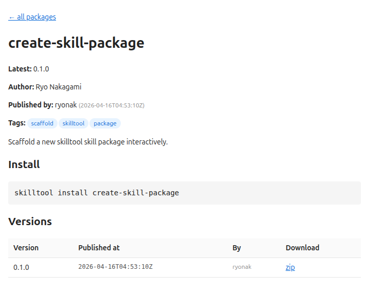

# SKILLTOOLユーザーマニュアル

## なぜskilltoolが必要か？

[Skillの散在 → 属人化 → 再発明のループを断ち切る]{.h2-submessage}



:::{.info-box}



:::{.info-contents .font-10 .padding-L-05}

- Claude Agent Skillは**個人のローカル環境に閉じがち**で，チーム内の再利用が進まない
- skilltoolは[Skillパッケージの publish / install / search を提供するCLI＋レジストリ]{.regmonkey-bold}で，この問題を解決する
- PyPI/npmと同じ感覚でskillを扱える — **作る → 公開する → 使う**のサイクルをチーム標準化する

:::

:::



:::: {.columns}
::: {.column width="50%" .font-09}



::::{.pentagon-box-500}

:::{.border-bottom-header .font-10}

skilltoolなしの世界 = Skillの散在 → 属人化 → 再発明

:::

:::{.squaredmark style="font-size: 1em; padding-left: 0.5em;"}


1. Skillファイルが各個人の `.claude/` に散在
2. 「あのskill誰が持ってたっけ？」 → Slackで聞く
3. 同じような機能を複数人が再発明
4. バージョン管理なし，どれが最新か不明
5. チームの**ナレッジが蓄積されず**，個人の退職・異動で失われる

:::

::::

:::
::: {.column width="50.0%" .padding-L-12 .font-09}



::::{ .square-box-500}

:::{.border-bottom-header}

skilltoolありの世界 = 共有・発見・再利用のサイクル確立

:::

:::{.squaredmark style="font-size: 0.9em; padding-right: 1em"}

**検索と導入**

- `skilltool search "docx"` で即座に発見
- `skilltool install docx` でワンコマンド導入



**管理と追跡**

- SemVerでバージョン管理，publishログで変更追跡
- **作る人**と**使う人**の役割分離が可能に

:::

::::

:::
::::


## skilltoolの全体像

[skill.mdをパッケージとして管理し，pip-likeに活用する]{.h2-submessage}



:::::::::{.shannon-model .font-09}

::::{.shannon-component}

:::{.shannon-icon-box}
<i class="fa-solid fa-cubes"></i>
:::

[Skillパッケージ]{.shannon-label}



:::{.shannon-annotation-box style="border: none"}

- `skill.toml` + `SKILL.md`
- メタデータと指示書

:::

::::

:::{.shannon-arrow}



<i class="fa-solid fa-arrow-right"></i>

:::

::::{.shannon-component}

:::{.shannon-icon-box}
<i class="fa-solid fa-terminal"></i>
:::

[CLI]{.shannon-label}



:::{.shannon-annotation-box style="border: none"}

- publish / install
- search / show / list

:::

::::

:::{.shannon-arrow}



<i class="fa-solid fa-arrow-right"></i>

:::

::::{.shannon-component}

:::{.shannon-icon-box}
<i class="fa-solid fa-route"></i>
:::

[Transport]{.shannon-label}



:::{.shannon-annotation-box style="border: none"}

- HTTP (default)
- SSH (代替)

:::

::::

:::{.shannon-arrow}



<i class="fa-solid fa-arrow-right"></i>

:::

::::{.shannon-component}

:::{.shannon-icon-box}
<i class="fa-solid fa-server"></i>
:::

[Registry]{.shannon-label}



:::{.shannon-annotation-box style="border: none"}

- FastAPI (認証・保存)
- Tailscale内部公開

:::

::::

:::{.shannon-arrow}



<i class="fa-solid fa-arrow-right"></i>

:::

::::{.shannon-component}

:::{.shannon-icon-box}
<i class="fa-solid fa-hard-drive"></i>
:::

[Storage]{.shannon-label}



:::{.shannon-annotation-box style="border: none"}

- `.zip` + `.yaml`
- 監査ログ(append-only)

:::

::::

:::::::::



:::{.font-10 style="line-height: 2.2; "}

| skilltoolの概念 | 対応するツール | 具体的な役割 |
|:----------------|:----------------------|:-------------|
| **Skill** | 関数 / npm パッケージ | `SKILL.md`(指示本体) + `skill.toml`(メタデータ)で構成される再利用単位 |
| **Registry** | PyPI / npm registry | Skillの保存・検索・バージョン管理．Tailscale経由でチーム内に公開 |
| **CLI** | `pip` / `npm` コマンド | `skilltool install`, `publish`, `search` レジストリへのインターフェース |

: {tbl-colwidths="[18,23,59]"}

:::


## Skillパッケージの構造

[skill.toml（**何を**パッケージするか） + SKILL.md（**何を実行**させるか）]{.h2-submessage}



:::: {.columns}
::: {.column width="50%"}

[skill.toml — パッケージマニフェスト]{.mini-section}



```toml
[skill]
name        = "create-skill-package"
version     = "0.1.0"
description = "Scaffold a new skilltool skill
               package interactively."
author      = "Ryo Nakagami"
entry       = "SKILL.md"
include = [
    "SKILL.md",
    "scripts/**",       # glob pattern
    "templates/*.txt",
]
tags = ["scaffold", "skilltool"]
```



:::{style="font-size:0.90em"}

| フィールド | 必須 | 説明 | デフォルト |
|:-----------|:-----|:-----|:-----------|
| `name` | Yes | `^[a-z0-9][a-z0-9._-]*$` | — |
| `version` | Yes | SemVer (`MAJOR.MINOR.PATCH`) | — |
| `description` | Yes | 1行の概要（検索対象） | — |
| `author` | No | チーム名推奨 (e.g. `team-doc`) | — |
| `entry` | No | Agentが読む起点ファイル | `SKILL.md` |
| `include` | No | zip同梱対象のglobパターン | `[entry]` |
| `tags` | No | 検索用ラベル | — |

:::

:::
::: {.column width="50%"}

[SKILL.md — Claude向け指示書]{.mini-section}



```markdown
# create-skill-package

新しい skilltool skill package をインタラクティブに scaffold する skill

## When to use

ユーザーが以下のような依頼をしたとき，この skill を使う:
- 「新しい skill を作りたい」
- 「skill package を作って」

## Instructions

### Step 1: ヒアリング
ユーザーに以下を確認する（既知の項目はスキップ）:
| 項目 | 必須 | 説明 |
| skill名 | Yes | ^[a-z0-9][a-z0-9._-]*$ に合致 |
| 説明 | Yes | 1行程度の短い概要 |
| author | No | チーム名を推奨 |

### Step 2: ディレクトリ作成
skill.toml と SKILL.md を生成する

### Step 3: 確認とガイド
publish 手順を案内する

## Rules
- skill.toml 形式で生成すること
- SKILL.md は大文字．entry と完全一致させる
```



:::{.info-box}

:::{.info-contents .font-09 .padding-L-05}

- SKILL.mdは人間向けドキュメントではなく**Claudeが実行する指示書** 
- 曖昧さを排除し，手順・制約・エッジケースを明記する

:::

:::

:::
::::


## Quick Start: インストールから動作確認まで

[3ステップで完了: install → config → verify]{.h2-submessage}



::::: {.columns}
::::: {.column width="50%"}

:::{.border-bottom-header}

skilltool Quick Start ワークフロー

:::

:::: {.tool-item style="min-height: 5.5em;"}
::: {.tool-icon .text-blue-700}



:::

::: {.tool-content}
::: {.tool-name}

Step 1: CLIインストール

:::
::: {.tool-description}

`uv tool install` でGitHubリポジトリから直接インストール

:::
:::
::::

:::: {.tool-item style="min-height: 9em;"}
::: {.tool-icon .text-blue-700}



:::

::: {.tool-content}
::: {.tool-name}

Step 2: 接続設定

:::

::: {.tool-description}

環境変数またはconfig.tomlでレジストリURLとトークンを設定

:::

:::

::::

:::: {.tool-item style="min-height: 5em;"}

::: {.tool-icon .text-blue-700}



:::

::: {.tool-content}
::: {.tool-name}

Step 3: 動作確認

:::
::: {.tool-description}

`skilltool config` で設定の解決結果を確認し，`skilltool search` で接続テスト

:::
:::

::::
:::::

:::::{.column width="50%"}

:::{.border-bottom-header}

Quick Start Tips

:::



::::{.info-box style="min-height: 5.5em;"}

:::{.info-box-title}

① インストール

:::

:::{.info-contents}

:::{style="font-size:1.5em; width: 95%"}

```bash
uv tool install \
  git+https://github.com/RyoNakagami/\
  skilltool-infra.git#subdirectory=client
```

:::
:::
::::



::::{.info-box style="min-height: 9em;"}

:::{.info-box-title}

② 接続設定（環境変数 or config.toml）

:::

:::{.info-contents}

:::{style="font-size:1.5em; width: 95%"}

```bash
export SKILLTOOL_REGISTRY=http://100.x.x.x:8765
export SKILLTOOL_TOKEN=tok_alice_deadbeef
```

:::



:::{style="font-size:1.5em; width: 95%"}

```toml
# ~/.config/skilltool/config.toml
registry = "http://100.x.x.x:8765"
token    = "tok_alice_..."
```

:::
:::
::::



::::{.info-box style="min-height: 5em;"}

:::{.info-box-title}

③ 設定の優先順位

:::

:::{.info-contents}

- 環境変数 > config.toml > localhost自動検出 > デフォルト値
- トークンは管理者が `add-user.sh` で発行

:::
::::

:::::
:::::


## CLIコマンド一覧

[6コマンドでSkillパッケージのライフサイクルをカバー]{.h2-submessage}



:::: {.columns}
::: {.column width="50%"}

[検索・取得系]{.mini-section}



::::{.component-card .p-3 style="font-size: 0.8em; min-height: 10em;"}

**`skilltool search "<regex>"`** — 正規表現でskillを検索

:::{.font-15}
```bash
$ skilltool search "word|pdf"
│ name │ latest │ description          │
├──────┼────────┼──────────────────────┤
│ docx │ 1.2.0  │ Author .docx files.  │
```
:::

::::



::::{.component-card .p-3 style="font-size: 0.8em; min-height: 10em;"}

**`skilltool show <name>`** — メタデータ・全バージョン・publish履歴

:::{.font-15}
```bash
$ skilltool show docx
name:   docx       latest: 1.2.0
author: team-doc   tags: office, docx
versions: 1.2.0, 1.1.0, 1.0.0
```
:::

::::



::::{.component-card .p-3 style="font-size: 0.8em; min-height: 10em;"}

**`skilltool install <name>`** — skillをローカルにダウンロード・展開

:::{.font-15}
```bash
$ skilltool install docx --dest ./skills --version 1.2.0
$ ls ./skills/docx/
skill.toml  SKILL.md  scripts/
```
:::

::::

:::
::: {.column width="50%"}

[公開・管理系]{.mini-section}



::::{.component-card .p-3 style="font-size: 0.8em; min-height: 10em;"}

**`skilltool publish <dir>`** — skillをレジストリに公開

:::{.font-15}
```bash
$ skilltool publish ./my-skill/
✓ published my-skill 0.1.0
  by alice  2026-04-15T10:23:45Z
```
:::

::::



::::{.component-card .p-3 style="font-size: 0.8em; min-height: 10em;"}

**`skilltool list`** — ローカルにinstall済みのskillを一覧

:::{.font-15}
```bash
$ skilltool list --dest ./skills
│ name │ version │ entry    │
├──────┼─────────┼──────────┤
│ docx │ 1.2.0   │ SKILL.md │
```
:::

::::



::::{.component-card .p-3 style="font-size: 0.8em; min-height: 10em;"}

**`skilltool config`** — 現在の設定と解決元を表示

:::{.font-15}
```bash
$ skilltool config
registry:  http://100.x.x.x:8765
transport: http
token:     tok_alice_****
```
:::

::::

:::
::::


## publishの内部フロー

[CLIからStorageまで — 1コマンドの裏側で何が起きるか]{.h2-submessage}

:::{.info-box}

:::{.info-contents .font-10 .padding-L-05}

- `skilltool publish ./dir/` を実行すると，CLIがmanifest解析 → zip作成 → Transport経由でRegistryに送信
- HTTPとSSHの**2つのTransport**が選択可能だが，内部では同じ`publish_logic()`を呼ぶ

:::

:::

:::{style="padding-left: 7em;"}

```{mermaid}
%%| fig-width: 28
%%| fig-height: 9
%%{ init: {
    'theme': 'default',
    'themeVariables': {
        'fontFamily': 'Meiryo'
    },
    'sequence': {
        'noteMargin': 8,
        'messageMargin': 30
    }
} }%%
sequenceDiagram
    participant U as Client (CLI)
    participant T as Transport
    participant R as Registry
    participant S as Storage

    U->>U: ① manifest解析 + zip作成
    U->>T: ② POST /api/publish (Bearer token)
    T->>R: ③ HTTP or SSH で転送
    R->>R: ④ 認証 → メタデータ抽出 → 重複チェック
    R->>S: ⑤ zip + yaml + publish.log 書き込み
    R-->>T: 200 OK
    T-->>U: ✓ published my-skill 0.1.0
```

:::


## 実践: skillの作成からClaudeでの利用まで

[create → publish → search → install → use の一気通貫デモ]{.h2-submessage}




:::: {.tool-item .pt-2 .pb-2 .font-12 style="align-items: flex-start;"}
::: {.tool-icon .text-blue-700 style="margin-top: -0.3em;"}



:::

::: {.tool-content}
::: {.tool-name}

Step 1: パッケージを作成する

:::
::: {.tool-description style="font-size:0.75em;"}

- `skill.toml`（メタデータ）と `SKILL.md`（Claude向け指示書）を含むディレクトリを作成
- 例: `my-first-skill/{skill.toml, SKILL.md}`

:::
:::
::::

:::: {.tool-item .pt-2 .pb-2 .font-12 style="align-items: flex-start;"}
::: {.tool-icon .text-blue-700 style="margin-top: -0.3em;"}



:::

::: {.tool-content}
::: {.tool-name}

Step 2: Registryにpublish

:::
::: {.tool-description style="font-size:0.75em;"}

- `skilltool publish ./my-first-skill/`


:::
:::
::::

:::: {.tool-item .pt-2 .pb-2 .font-12 style="align-items: flex-start;"}
::: {.tool-icon .text-blue-700 style="margin-top: -0.3em;"}



:::

::: {.tool-content}
::: {.tool-name}

Step 3: チームメンバーがsearch → install

:::
::: {.tool-description style="font-size:0.75em;"}

- `skilltool install my-first-skill` でローカルにダウンロード
- バージョン指定: `skilltool install my-first-skill --version 0.1.0`

:::
:::
::::

:::: {.tool-item .pt-2 .pb-2 .font-12 style="align-items: flex-start;"}
::: {.tool-icon .text-blue-700 style="margin-top: -0.3em;"}



:::

::: {.tool-content}
::: {.tool-name}

Step 4: Claude Codeで利用する

:::
::: {.tool-description style="font-size:0.75em;"}

- `cp -r ./my-first-skill .claude/commands/` でプロジェクトに配置
- `/my-first-skill` でスラッシュコマンドとして利用可能

:::
:::
::::


## ブラウザUIによるRegistry操作

[CLIだけでなく，ブラウザからもパッケージの検索・詳細確認・publish が可能]{.h2-submessage}

:::{.info-box}



:::{.info-contents .font-10 .padding-L-05}

- Registryサーバー（FastAPI）はHTMLページも提供しており，`http://100.x.x.x:8765/` にブラウザでアクセスするだけで利用可能
- CLIと同じデータを参照するため，ブラウザで検索→ CLIで `install` といった流れも可能

:::

:::


::::: {.columns}
::::: {.column width="55%"}

:::{.border-bottom-header}

ブラウザUI 3つの機能

:::

:::: {.tool-item .pt-2 .pb-2 style="align-items: flex-start;"}
::: {.tool-icon .text-blue-700 style="margin-top: 0.3em;"}



:::

::: {.tool-content}
::: {.tool-name}

パッケージ検索 (`/`)

:::
::: {.tool-description style="font-size:0.75em;"}

- トップページで Name / Tag / Description の**正規表現フィルタ**が利用可能
- 一覧表から各パッケージの詳細ページへリンク

:::
:::
::::

:::: {.tool-item .pt-2 .pb-2 style="align-items: flex-start;"}
::: {.tool-icon .text-blue-700 style="margin-top: 0.3em;"}



:::

::: {.tool-content}
::: {.tool-name}

パッケージ詳細・ダウンロード (`/packages/{name}`)

:::
::: {.tool-description style="font-size:0.75em;"}

- メタデータ（Author，Tags，Published by）を確認
- 全バージョン一覧から任意のバージョンの**zipを直接ダウンロード**
- `skilltool install` コマンド例も表示

:::
:::
::::

:::: {.tool-item .pt-2 .pb-2 style="align-items: flex-start;"}
::: {.tool-icon .text-blue-700 style="margin-top: 0.3em;"}



:::

::: {.tool-content}
::: {.tool-name}

ブラウザpublish (`/publish`)

:::
::: {.tool-description style="font-size:0.75em;"}

- トークンとzipファイルを指定してブラウザからpublish可能
- CLIが使えない環境でもブラウザ経由でパッケージを公開できる

:::
:::
::::

:::::

:::::{.column width="45%"}

:::{.border-bottom-header}

ブラウザUIスクリーンショット

:::



{style="width:100%; border: 1px solid #ddd; border-radius: 4px;"}

:::::
:::::

# SKILL + スラッシュコマンドの活用方法

## Claude Codeスラッシュコマンドの2形式

[SKILLパッケージは`.claude/skills/` または `.claude/commands/` に配置する]{.h2-submessage}

:::{.info-box}

:::{.info-contents .font-10 .padding-L-05}



- Claude Codeのスラッシュコマンドは**Skill形式（推奨）**と**commands形式（レガシー）**の2種類
- 自動起動・補助ファイル同梱が必要なら**Skill形式**を選ぶ（skilltoolで配布されるskillもこの形式）
- 配置先を `.claude/` 直下にしないよう注意． 必ず `skills/` または `commands/` サブディレクトリが必要

:::

:::



:::: {.columns}
::: {.column width="55%"}

[2形式の比較]{.mini-section}



:::{.font-08}

| 項目 | Skill形式 (推奨) | commands形式 |
|:-------|:----------------|:-------------|
| **配置場所** | `.claude/skills/<name>/SKILL.md` | `.claude/commands/<name>.md` |
| **ファイル名** | `SKILL.md` (大文字必須) | 任意 (`<name>.md`) |
| **手動起動** `/name` | ✅ | ✅ |
| **自動起動** | ✅ description連動 | ❌ |
| **補助ファイル** | ✅ 複数ファイルOK | ❌ 単一ファイル |
| **用途** | 複雑な指示書・Skill | 簡単なプロンプト |

: {tbl-colwidths="[30,35,35]"}

:::


:::
::: {.column width="45%"}

[スコープと配置例]{.mini-section}



:::{.font-09}

| スコープ | パス | 用途 |
|:---------|:-----|:-----|
| **プロジェクト** | `.claude/skills/` | Git共有・チーム共通 |
| **ユーザー** | `~/.claude/skills/` | 全プロジェクトで利用 |

:::



::::{.font-09 .padding-L-05}

❌ **NG配置**（認識されない）

:::{.font-15}
```text
.claude/
└── create-skill-package/   ← .claude/ 直下はダメ
    └── SKILL.md
```
:::



✅ **OK配置**

:::{.font-15}
```text
.claude/
└── skills/
    └── create-skill-package/
        └── SKILL.md        ← 大文字必須
```
:::

::::

:::
::::


## FAQ: よくあるハマりどころ



:::: {.columns}
::: {.column width="50%"}

:::{.border-bottom-header}

skilltool × Claude Code 編

:::

<!-- sidebar start -->
::::: {.sidebar .font-09}

::::{.component-card-index .pl-4 .pr-4 .pt-1 .pb-2 .border-gray-500 style="min-height: 10.8em;"}

:::{.flex .items-center .title}

Q1: `skill.toml` と `SKILL.md` の関係は？

:::

:::{.pl-5}

- `skill.toml` は[**skilltool独自のマニフェスト**]{.regmonkey-bold}で，パッケージ化・配布のために使う
- Claude Code標準では `skill.toml` は**読まれない** — すべての設定は `SKILL.md` のfrontmatterに書く

:::

::::



::::{.component-card-index .pl-4 .pr-4 .pt-1 .pb-2 .border-gray-500 style="min-height: 12.2em;"}

:::{.flex .items-center .title}

Q2: `skill.md` (小文字) で認識されない

:::

:::{.pl-5}

- Claude Codeは[**`SKILL.md` (大文字必須)**]{.regmonkey-bold}しか認識しない
- skilltoolの `entry` フィールドも，互換性のため大文字 `SKILL.md` を指定するのが安全

:::{.font-13 .pt-1}

```bash
.claude/skills/my-skill/SKILL.md  # OK
.claude/skills/my-skill/skill.md  # NG
```

:::
:::

::::



::::{.component-card-index .pl-4 .pr-4 .pt-1 .pb-2 .border-gray-500 style="min-height: 10.5em;"}

:::{.flex .items-center .title}

Q3: Skillと同名のcommandsがある

:::

:::{.pl-5}

優先順位は下記のとおり:

- 形式: **Skill > commands**
- スコープ: `enterprise > ~/.claude/ > .claude/`

:::

::::

<!-- sidebar end -->
:::::

:::
::: {.column width="50%"}

:::{.border-bottom-header}

配置・設定 編

:::

<!-- sidebar start -->
::::: {.sidebar .font-09}

::::{.component-card-index .pl-4 .pr-4 .pt-1 .pb-2 .border-gray-500 style="min-height: 10.8em;"}

:::{.flex .items-center .title}

Q4: コマンドが認識されない

:::

:::{.pl-5}

- `.claude/` 直下ではなく `skills/` または `commands/` サブディレクトリに配置しているか
- **セッション中に新規作成した場合は Claude Code を再起動**

:::

::::



::::{.component-card-index .pl-4 .pr-4 .pt-1 .pb-2 .border-gray-500 style="min-height: 12.2em;"}

:::{.flex .items-center .title}

Q5: `@file` 指定のパス基準は？

:::

:::{.pl-5}

- [**ワークスペースルートからの相対パス**]{.regmonkey-bold}
- `SKILL.md` からの相対ではないので注意

:::{.font-13 .pt-1}

```markdown
@.claude/skills/<name>/task.md    ← OK
@./task.md                        ← NG
```

:::
:::

::::



::::{.component-card-index .pl-4 .pr-4 .pt-1 .pb-2 .border-gray-500 style="min-height: 10.5em;"}

:::{.flex .items-center .title}

Q6: publish時にversion衝突 (409 Conflict)

:::

:::{.pl-5}

- 同名・同バージョンのパッケージは**再publish不可** (immutable)
- `skill.toml` の `version` をSemVerで更新してから再publishする

:::{.font-13 .pt-1}

```toml
version = "0.1.0"   # → "0.2.0" に更新
```

:::
:::

::::

<!-- sidebar end -->
:::::

:::
::::
