# CLAUDE.mdの役割

## CLAUDE.mdは毎リクエスト自動添付の永続コンテキスト

[`/init` で初期生成し，プロジェクトの規約・アーキテクチャをエージェントの外部記憶として渡す]{.h2-submessage}



:::{.info-box}



:::{.info-contents .font-10 .padding-L-05 .lh-12}

- CLAUDE.md = [Claude Codeが起動時に自動読込し，毎リクエストの先頭に添付する]{.regmonkey-bold} 永続メモリファイル
- `/init` を一度走らせるとリポジトリ全体を解析し，[サマリー・主要ファイル・アーキテクチャ]{.regmonkey-bold} を雛形として書き出す
- DBスキーマ・命名規約・テスト方針など [毎回参照して欲しい知識]{.regmonkey-bold} を集約しておくと再発見コストを削減できる

:::

:::



:::: {.columns}
::: {.column width="50%"}




:::
::: {.column width="50%"}



[コンテキスト管理上の位置付け]{.mini-section}



:::{.font-09 .padding-L-05 .lh-14}

- セッション横断で情報を残せる [唯一の標準的な仕組み]{.regmonkey-bold}：`/clear` や `/compact` を跨いで保持される
- ただし [毎回送信される＝Context Windowを常時消費する]{.regmonkey-bold} ため，肥大化はトークン浪費に直結する
- 重要度の高い前提のみを集約し，補足は別ファイル化して `@` で都度参照する設計が望ましい

:::

:::
::::

# 3階層と優先順位

## Project・Local・Userの3層を共有範囲で使い分ける

[3階層は理想論では順序ではなくスコープの違い：チーム規約と個人のパターンを分離して置く]{.h2-submessage}



::::: {.columns}

:::: {.column style="width: 33.3%; height:100%"}



:::{.horizontal-keypoints-block style="height:65%;"}

:::{.block-header}

Project
:::



:::{.block  style="font-size:0.8em; padding-right:0.5em;" .lh-14}

- 配置：`./CLAUDE.md` or `.claude/CLAUDE.md`
- 共有範囲：[Gitに含めチーム全員に配布]{.regmonkey-bold}
- 内容例：アーキテクチャ・命名規約・主要コマンド
- 用途：プロジェクト全員に効かせたい前提
- `/init` で生成されるファイル

:::

:::
::::

:::: {.column style="width: 33.3%; height:100%"}



:::{.horizontal-keypoints-block style="height:65%;"}

:::{.block-header}

Local
:::



:::{.block style="font-size:0.8em; padding-right:0.5em;" .lh-14}

- 配置：`./CLAUDE.local.md`
- 共有範囲：[`.gitignore` で個人専用]{.regmonkey-bold}
- 内容例：実験中の指示・個人的なショートカット
- 用途：チームに押し付けたくないパターン
  - Personal project-specific

:::

:::
::::

:::: {.column style="width: 33.3%; height:100%"}



:::{.horizontal-keypoints-block-no-border style="height:65%;"}

:::{.block-header}

Machine
:::



:::{.block  style="font-size:0.8em; padding-right:0.1em;" .lh-14}

- 配置：`~/.claude/CLAUDE.md`
- 共有範囲：[ログインユーザーの全プロジェクト]{.regmonkey-bold}
- 内容例：返答スタイル・常用ツール・言語選好
- 用途：プロジェクト間で効かせたいパターン

:::

:::
::::

:::::



## より具体的な階層が後勝ちで優先される

[Subdirectory > Project > User の順に，cwdに近い指示で上書きされる]{.h2-submessage}



:::{.info-box}

[Anthropic Docsの記述]{.info-box-title}

:::{.info-contents .font-10 .padding-L-05 .lh-12}

- ["More specific locations take precedence over broader ones."]{.regmonkey-bold}（より具体的な階層が広範な階層に優先する）
- 同じトリガー指示が複数階層に書かれても [最終的に効くのは最も深い階層の指示のみ]{.regmonkey-bold}
- 広く効かせたい規約は上位階層に，[局所的な例外は深い階層に]{.regmonkey-bold} と粒度で分離する設計が原則

:::

:::



[優先度の階段とロードタイミング]{.mini-section}



::::{.custom-table style="width:100%; height:42%; font-size: 0.82em !important;"}
:::{.yaml2table .yaml2table-custom-top #yaml-claudemd-precedence data-col-widths="[20, 35, 45]"}

```yaml
record1:
  category: ① 弱<br>User
  rule:
    - パス：<code>~/.claude/CLAUDE.md</code>
  actions:
    - スコープ：ログインユーザーの<span class="regmonkey-bold">全プロジェクト</span>
    - ロード：セッション起動時に自動読込

record2:
  category: ② 中<br>Project
  rule:
    - パス：<code>./CLAUDE.md</code>（cwd直下）
  actions:
    - スコープ：当該<span class="regmonkey-bold">プロジェクト全体</span>
    - ロード：セッション起動時に自動読込

record3:
  category: ③ 強<br>Subdir
  rule:
    - パス：<code>./&lt;subdir&gt;/CLAUDE.md</code>
  actions:
    - スコープ：当該<span class="regmonkey-bold">サブディレクトリ配下のみ</span>
    - ロード：配下ファイルに触れた時点で<span class="regmonkey-bold">オンデマンド読込</span>
```

:::
::::

## 競合ルールを3階層に置いて実機で検証する

[同一トリガー語に異なる応答を仕込み，どの階層が勝つかを段階的に観察する]{.h2-submessage}



:::{.info-box}

[セットアップ：3階層に同じトリガーを置く]{.info-box-title}

:::{.info-contents .font-09 .padding-L-05 .lh-12}

- 各階層の `CLAUDE.md` に「`precedence-test` と入力されたら `LEVEL=USER`・`LEVEL=PROJECT`・`LEVEL=SUBDIR` のいずれかを返答」と互いに矛盾する指示を仕込む
- claude code sessionで `precedence-test` と入力し，claude codeからのレスポンスを確認する

:::

:::




::::{.custom-table style="width:100%; height:50%; font-size: 0.78em !important;"}
:::{.yaml2table .yaml2table-custom-top #yaml-precedence-verify data-col-widths="[18, 35, 47]"}

```yaml
record1:
  検証: Test 1<br>Project &gt; User
  Action:
    - 新セッションで <code>precedence-test</code> を送信
  結果:
    - <code>LEVEL=PROJECT</code>（User より Project が勝つ）
    - この時点では Subdir はまだ未ロードのため候補外

record2:
  検証: Test 2<br>Subdir &gt; Project
  Action:
    - <code>subdir/sample.txt を読んで</code> で Subdir をロードさせ <code>precedence-test</code>
  結果:
    - <code>LEVEL=SUBDIR</code>（Project より Subdir が勝つ）
    - <span class="regmonkey-bold">オンデマンドロードのトリガー</span>を踏むのが要点

record3:
  検証: Test 3<br>User 単独
  Action:
    - <code>mv CLAUDE.md CLAUDE.md.bak</code> で Project を退避し新セッションで送信
  結果:
    - <code>LEVEL=USER</code>（上位階層が無いと User が露出）
```

:::
::::


# 編集と参照

## `#`メモリ入力と`@`ファイル参照で日常運用する

[CLAUDE.mdへの追記は`#`，その場限りの取り込みは`@`，と書込みと参照の手段を分ける]{.h2-submessage}



:::::: {.columns}
::::: {.column width="50%"}


:::{.border-bottom-header-left}
`#` メモリモードで永続化
:::

:::{.squaredmark style="font-size: 0.9em"}

- 入力先頭に `#` を付けると [メモリモード]{.regmonkey-bold} に切替
- 自然言語の指示で [Claudeが該当のCLAUDE.mdを編集]{.regmonkey-bold}
- 「Project・Local・Userのどこに書くか」を都度選択
- 「同じ間違いを繰り返した時の予防策」として [Escape で停止 → `#` で記録]{.regmonkey-bold} のセットが一般的
- 例：`# このプロジェクトでは pnpm を使う`

:::

:::::

::::: {.column width="50%" .padding-L-10}


:::{.border-bottom-header-left}
`@` でその場限りに取込み
:::

:::{.squaredmark style="font-size: 0.9em"}

- 入力中に `@filepath` と書くと [そのファイル内容をセッションに添付]{.regmonkey-bold}
- 検索させずに [読んでほしい場所をピンポイント指定]{.regmonkey-bold} できる
- CLAUDE.md内に `@docs/spec.md` と書けば [リンクされたファイルも自動展開]{.regmonkey-bold}
- DBスキーマや仕様書など毎回見せたい資料は [本体に直書きせず `@` 参照に切り出す]{.regmonkey-bold} と肥大化を防げる
- 例：`@src/db/schema.ts に沿って実装して`

:::

:::::
::::::

# 設計指針

## 必要十分を意識し詰め込みすぎを避ける

[毎リクエストに添付されるためノイズはコストに直結する：書く・書かないの線引きを明確に]{.h2-submessage}



::::{.custom-table style="width:100%; height:70%; font-size: 0.8em !important;"}
:::{.yaml2table .yaml2table-custom-top #yaml-claude-md-design data-col-widths="[20, 35, 45]"}

```yaml
record1:
  category: 書くべきこと
  rule:
    - エージェントが<span class="regmonkey-bold">毎回参照しないと判断を誤る</span>前提を集約
  actions:
    - 主要コマンド（テスト・lint・dev起動）
    - リポジトリ構造の地図と主要ディレクトリの責務
    - 命名規約・コード規約・コミットメッセージ規約
    - DBスキーマや型定義など重要ファイルへの <code>@</code> 参照

record2:
  category: 書かないこと
  rule:
    - <span class="regmonkey-bold">必要時に取り込めば足りる</span>情報は本体に積まない
  actions:
    - 個別タスクの一時的な指示はセッションで渡す
    - 巨大なAPIリファレンスや生コードは <code>@</code> で都度参照
    - 「いつか使うかも」の機能説明は別ドキュメントへ
    - 機密情報（鍵・トークン）は絶対に書かない

record3:
  category: 階層の選択
  rule:
    - スコープに合わせ<span class="regmonkey-bold">3階層へ振り分け</span>る
  actions:
    - チーム共有の規約 → Project（コミット対象）
    - 個人の実験的指示 → Local（gitignore）
    - 言語選好や返答スタイル → User（マシン全体）

record4:
  category: 改善ループ
  rule:
    - <span class="regmonkey-bold">繰り返しの修正を観測したら即追記</span>する
  actions:
    - Escapeで停止 → <code>#</code> で予防策をメモリに記録
    - 同じ指摘を2回したら本体に昇格させる
    - 不要になった項目は積極的に削除し肥大化を抑える
    - 定期的に通読し，現実とのズレを是正する
```

:::
::::
