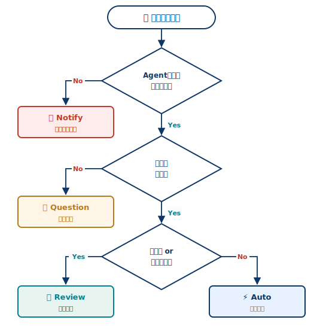

## アンビエントエージェントとは？

[人が毎回話しかけるのではなく，イベントストリームを常時監視するエージェント]{.h2-submessage}



:::{.info-box}



:::{.info-contents .font-10 .padding-L-05 style="line-height: 1.2"}

- チャット型のように[人が毎回話しかける]{.regmonkey-bold}のではなく，カレンダー・Slackなどの[イベントストリーム]{.regmonkey-bold}を常時監視するエージェント
- ほとんどのタスクは裏側で自律処理し，[必要な時だけ]{.regmonkey-bold}人に通知・質問・承認を求める
- 1度に1会話しか扱えないチャット型と違い，[複数タスクを並列処理]{.regmonkey-bold}できるため，人の注意資源を重要判断に集中できる

:::

:::



:::: {.columns}
::: {.column width="50%" .font-09}



::::{.pentagon-box-500}

:::{.border-bottom-header .font-10}

従来のチャット型 = 人の起動待ちで並列性なし

:::

:::{.squaredmark style="font-size: 1em; padding-left: 0.5em; line-height: 2"}

1. 人が**毎回メッセージ送信**しないと起動しない
2. 1度に**1会話**しか処理できない
3. 待機中の時間は活用されない
4. 人の注意は**常時必要** ⇔ スケールしない
5. 入力が来るまでエージェントは**何もしない**

:::

::::

:::
::: {.column width="50.0%" .padding-L-12 .font-09}



::::{ .square-box-500}

:::{.border-bottom-header}

アンビエント型 = イベント駆動で並列処理可能

:::

:::{.squaredmark style="font-size: 0.9em; padding-right: 1em"}



[**起動の仕組み**]{.mini-section}

- **イベント**が起点（メール / Slack / Cron 等）
- 人が話しかけなくても自律的に動く



[**処理の特徴**]{.mini-section}

- **複数タスクを並列処理**できる
- 人の注意は**重要な時だけ**使う
- 長期メモリで**判断が改善されていく**

:::

::::

:::
::::


## アンビエントエージェントの動作フロー

[イベント検知 → 判断 → 自動実行 or 人に相談 → 長期メモリで学習]{.h2-submessage}



:::::::::{.shannon-model .font-09}

::::{.shannon-component}

:::{.shannon-icon-box}
<i class="fa-solid fa-inbox"></i>
:::

[イベント発生]{.shannon-label}



:::{.shannon-annotation-box style="border: none"}

- メール / Slack / Cron
- カレンダー / Webhook

:::

::::

:::{.shannon-arrow}



<i class="fa-solid fa-arrow-right"></i>

:::

::::{.shannon-component}

:::{.shannon-icon-box}

<i class="fa-solid fa-robot"></i>

:::

[Agentが検知・判断]{.shannon-label}



:::{.shannon-annotation-box style="border: none"}

- 処理すべきか判定
- 必要な情報を収集

:::

::::

:::{.shannon-arrow}



<i class="fa-solid fa-arrow-right"></i>

:::

::::{.shannon-component}

:::{.shannon-icon-box}
<i class="fa-solid fa-code-branch"></i>

:::

[自動実行 or 人に相談]{.shannon-label}



:::{.shannon-annotation-box style="border: none"}

- 安全な操作は自動実行
- 重要判断はHITLへ

:::

::::

:::{.shannon-arrow}



<i class="fa-solid fa-arrow-right"></i>
:::

::::{.shannon-component}

:::{.shannon-icon-box}
<i class="fa-solid fa-brain"></i>
:::

[長期メモリで学習]{.shannon-label}



:::{.shannon-annotation-box style="border: none"}

- 判断結果を蓄積
- 次回以降に反映

:::

::::

:::::::::

:::{.shannon-overview-arrow .font-11}
<div class="shannon-overview-arrow-head" style="border-left: none; border-right: 10px solid #0e3666;"></div><div class="shannon-overview-arrow-line"></div><div class="shannon-overview-arrow-text">イベント駆動ループ：人の介入は「重要な時だけ」</div><div class="shannon-overview-arrow-line"></div>
:::



:::: {.callout-note}
## [REMARKS: チャット型との違いをフロー視点で整理[^footer-flow]]{.padding-L-05 .font-12}

:::{.padding-L-10}

- **起点**: チャット型は人のメッセージ送信で起動するが，アンビエント型は外部イベント（メール / Slack / Cron）が起点になる
- **並列度**: チャット型は1会話ずつ逐次処理するのに対し，アンビエント型は複数タスクを並列処理できる
- **人の関与**: チャット型は毎ターン対話が必要だが，アンビエント型は Notify / Question / Review の3点のみ
- **記憶**: チャット型はセッション内に閉じるが，アンビエント型は長期メモリで判断を継続改善する

:::

::::

<!-- footer -->

[^footer-flow]: イベントを起点にするためには，永続化・スケジューリング・HITL・長期メモリといった基盤機能が必要になる（後述）


## Human-in-the-loop：人との関わり方3パターン

[すべてを自動化しない，人の判断を組み込む3つの型]{.h2-submessage}



:::{.info-box}

:::{.info-contents .font-10 .padding-L-05 style="line-height: 1.2"}

- アンビエントエージェントは**全自動ではない** ── 適切なタイミングで人の判断を組み込む
- 関与の型は **Notify（通知） / Question（質問） / Review（承認）** の3つに整理できる
- 型を区別することで，[どの操作を自動化し，どこで人を介在させるか]{.regmonkey-bold}を設計できる

:::

:::



:::: {.columns}
::: {.column width="33.3%"}

::::{.component-card .p-2 style="height: 15em; border: 2px solid #0E3666; display: flex; flex-direction: column;"}

[🔔 Notify（通知）]{.mini-section}

- 重要だがAgentが処理できない事を**人に知らせる**
- 人の行動を**ブロックしない**． 見逃し防止が目的
- 通知先は Agent Inbox や Slack など

:::{.font-09 style="color:#666; font-style: italic; border-top: 1px dashed #ccc; padding-top: 6px; margin-top: auto;"}

例: 受信箱のDocuSign書類

:::

::::

:::
::: {.column width="33.3%"}

::::{.component-card .p-2 style="height: 15em; border: 2px solid #0E3666; display: flex; flex-direction: column;"}

[❓ Question（質問）]{.mini-section}

- 情報が不足している時，**憶測せずに人へ確認**
- 間違った前提で実行するより停止して聞く方が安全
- 回答はメモリに蓄積され次回以降の判断に活用

:::{.font-09 style="color:#666; font-style: italic; border-top: 1px dashed #ccc; padding-top: 6px; margin-top: auto;"}

例: この会議に出席しますか？

:::

::::

:::
::: {.column width="33.3%"}

::::{.component-card .p-2 style="height: 15em; border: 2px solid #0E3666; display: flex; flex-direction: column;"}

[✅ Review（承認）]{.mini-section}

- 危険な操作は人が**承認・編集・差戻し**
- 外部に影響が出る不可逆操作（送信・決済等）が対象
- 承認前なら書き換えや中止が可能

:::{.font-09 style="color:#666; font-style: italic; border-top: 1px dashed #ccc; padding-top: 6px; margin-top: auto;"}

例: 送信前のメール草稿

:::

::::

:::
::::

## HITLパターンの選び方

[3段階の判定で Notify / Question / Review / 自動実行 に振り分け]{.h2-submessage}



:::{.info-box}

:::{.info-contents .font-10 .padding-L-05 style="line-height: 1.2"}



- 受信したイベントに対し，Agentは[**3段階の判断**]{.regmonkey-bold}を経て動作モードを決定する
- [**重要度 / 情報量 / 影響範囲**]{.regmonkey-bold}に応じて，人の関与レベルを最小限に抑える

:::

:::



:::: {.columns}
::: {.column width="46%"}

[意思決定フロー]{.mini-section}



:::{style="background:#FAFBFD; border:1px solid #D4DDE8; border-radius:6px; padding:8px;"}

```{=html}

```

:::

:::
::: {.column width="54%"}

[4パターンの選択基準]{.mini-section}



:::: {.tool-item style="align-items: flex-start;"}
::: {.tool-icon style="color: #C0392B;"}



:::
::: {.tool-content}
::: {.tool-name}

🔔 Notify: 重要なイベントを知らせる

:::
::: {.tool-description style="font-size:0.8em;"}

ユーザーが判断すべき事実を通知（Agentは特段アクションは取らない）

:::
:::
::::

:::: {.tool-item style="align-items: flex-start;"}
::: {.tool-icon style="color: #B7791F;"}



:::
::: {.tool-content}
::: {.tool-name}

❓ Question — 情報不足

:::
::: {.tool-description style="font-size:0.8em;"}

処理は可能だが判断に必要な情報が欠けている．憶測せず人に聞く

:::
:::
::::

:::: {.tool-item style="align-items: flex-start;"}
::: {.tool-icon style="color: #028090;"}



:::
::: {.tool-content}
::: {.tool-name}

✅ Review — 不可逆・外部影響

:::
::: {.tool-description style="font-size:0.8em;"}

情報は十分だが失敗が取り返せない操作（送信・決済等）は人が承認

:::
:::
::::

:::: {.tool-item style="align-items: flex-start;"}
::: {.tool-icon style="color: #0E3666;"}



:::
::: {.tool-content}
::: {.tool-name}

⚡ 自動実行 — 可逆 + 情報十分

:::
::: {.tool-description style="font-size:0.8em;"}

失敗しても戻せる & 必要情報が揃う操作は人を介さず自走

:::
:::
::::

:::
::::


## アンビエントエージェントを支える基盤[^footer-source]

[LangGraphが永続化・HITL・長期メモリ・Cronを内蔵]{.h2-submessage}



:::{.info-box}

:::{.info-contents .font-10 .padding-L-05}

- アンビエント型はチャット型と違い，**バックグラウンドで走り続ける基盤**が必要
- LangGraphは，[永続化 / Human-in-the-Loop / 長期メモリ / Cron]{.regmonkey-bold}をランタイム機能として提供
- 人との対話は **Agent Inbox** に集約し，複数エージェントからの通知・質問・承認を一元管理する

:::

:::



:::: {.columns}
::: {.column width="50%"}

[LangGraphが提供するランタイム機能]{.mini-section}



::::{.width-100}

:::{.regmonkey_abstract_summary}

```yaml
regmonkey_abstract_summary:
  title_fontsize: 1em
  bullet_fontsize: 0.8em
  keystat_fontsize: 0.8em
  children:
    - title: 永続化
      description:
        - 長時間動作する状態を保存
        - 再起動・クラッシュにも耐える
      width: [25,75]

    - title: HITL
      description:
        - Notify / Question / Review をAPIで表現
        - 中断・再開可能なワークフロー
      width: [25,75]

    - title: 長期メモリ
      description:
        - 過去の判断・回答を蓄積
        - 次回以降の自動判断精度を改善
      width: [25,75]

    - title: Cron
      description:
        - 定期的なイベントを自前で発火
        - 外部イベントがない時も動ける
      width: [25,75]
```

:::
::::

:::
::: {.column width="50%"}

[Agent Inboxによる対話集約]{.mini-section}



:::: {.tool-item style="min-height: 5em;"}
::: {.tool-icon .text-blue-700}



:::

::: {.tool-content}
::: {.tool-name}

複数エージェントからの通知を一元管理

:::
::: {.tool-description}

Notify / Question / Review はすべてInboxに集まり，人は1か所で確認・回答できる

:::
:::
::::

:::: {.tool-item style="min-height: 5em;"}
::: {.tool-icon .text-blue-700}



:::

::: {.tool-content}
::: {.tool-name}

人の回答がエージェントへ戻る

:::
::: {.tool-description}

Inboxでの承認・回答は長期メモリに蓄積され，次回以降の判断に反映される

:::
:::
::::

:::: {.tool-item style="min-height: 5em;"}
::: {.tool-icon .text-blue-700}



:::

::: {.tool-content}
::: {.tool-name}

エージェントの横断運用が可能

:::
::: {.tool-description}

メール対応・カレンダー調整・Slackトリアージ等，複数エージェントを同じInboxで運用できる

:::
:::
::::

:::
::::


## アンビエントエージェント with Claude Code

[CLI + Hooks + Schedule + Subagents でClaude Codeをアンビエント化する]{.h2-submessage}



:::{.info-box}

:::{.info-contents .font-10 .padding-L-05}



- Claude Code では，[**Hooks** / **Schedule** / **Headlessモード**]{.regmonkey-bold}を組み合わせると，外部イベントを起点に自走させられる
- 人との対話は[**AskUserQuestion** / **Permission Prompt** / **ExitPlanMode**]{.regmonkey-bold}で4パターン（Notify / Question / Review / Auto）に対応可能

:::

:::



:::: {.columns}
::: {.column width="50%"}

[HITL 4パターン → Claude Code機能マッピング]{.mini-section}



:::{.font-09 style="line-height: 1.5; margin-left: 1em;"}

| HITLパターン | Claude Code の実現手段 |
|:-----|:-----|
| 🔔 **Notify** | `Stop` / `Notification` **Hook** で Slack / デスクトップ通知を発火 |
| ❓ **Question** | `AskUserQuestion` ツール．Headlessなら Slack DM 等にリレー |
| ✅ **Review** | **Permission Prompt** / `ExitPlanMode` で実行前に人が承認 |
| ⚡ **Auto** | `--dangerously-skip-permissions` / allowlist / auto-accept で自走 |

: {tbl-colwidths="[28,72]"}

:::


:::
::: {.column width="50%"}

[ユースケース例]{.mini-section}



:::: {.tool-item style="align-items: flex-start; min-height: 2em; margin-left: 1em;"}
::: {.tool-content}
::: {.tool-name}

PRレビューの自動化 (`/ultrareview`)

:::
::: {.tool-description style="font-size:0.8em;"}

GitHub Webhook → Claude Code → マルチエージェント並列レビュー → PR コメント投稿

:::
:::
::::

:::: {.tool-item style="align-items: flex-start; min-height: 2em; margin-left: 1em;"}

::: {.tool-content}
::: {.tool-name}

定期タスクの Headless 実行

:::
::: {.tool-description style="font-size:0.8em;"}

`claude -p "check open PRs & summarize"` を cron で日次実行．結果は Slack に Notify

:::
:::
::::

:::: {.tool-item style="align-items: flex-start; min-height: 2em; margin-left: 1em;"}

::: {.tool-content}
::: {.tool-name}

ビルド監視・自動修復

:::
::: {.tool-description style="font-size:0.8em;"}

CI failure → Claude Code が原因解析 → 修正パッチをドラフト PR → 人が Review で承認

:::
:::
::::

:::
::::

<!-- footer -->

[^footer-source]: Source: [*Introducing Ambient Agents*](https://www.langchain.com/blog/introducing-ambient-agents) — langchain.com, Jan 14, 2025
