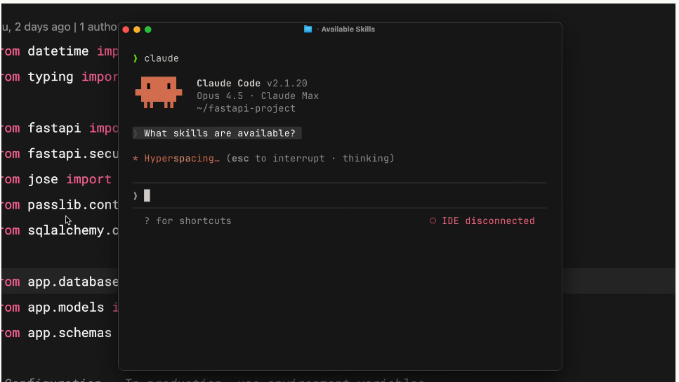
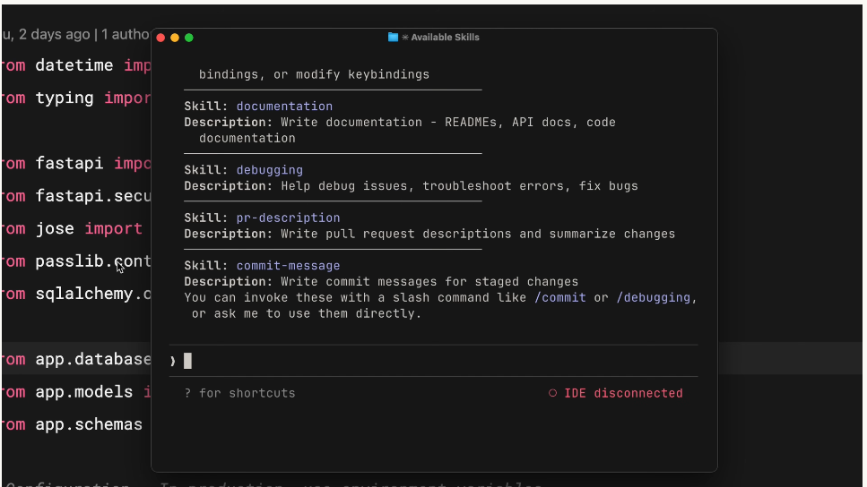
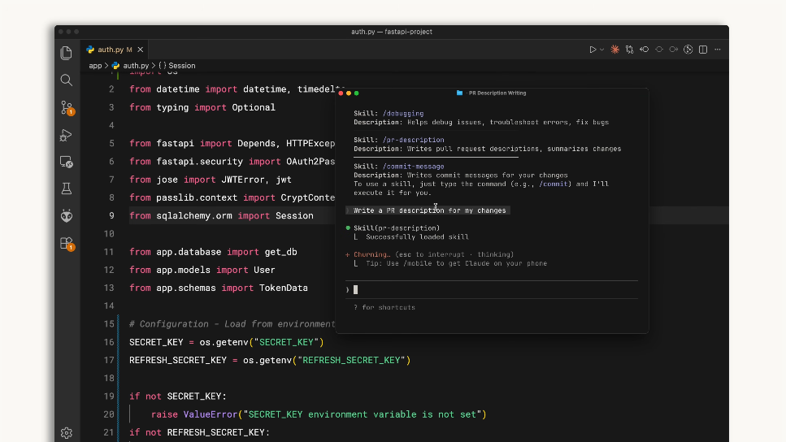

## Index {.regmonkey-index-slide-no-title}

::::: {.columns}



:::: {.column width="30%"}



:::: {.sidebar}

::::{.component-card-index .pl-4 .pr-4 .pt-1 .pb-6 .border-blue-500}

:::{.flex .items-center .mb-2}



### 学習目標

:::

- SKILL.md をスクラッチで作成・検証できる
- マッチング機構と優先順位を説明できる

::::



::::{.component-card-index .pl-4 .pr-4 .pt-1 .pb-6 .border-blue-500}

:::{.flex .items-center .mb-2}



### 対象レベル

:::

- Claude Code を触ったことがある人
- 自分の作業を Skill 化したい開発者・データ分析者

::::



::::{.component-card-index .pl-4 .pr-4 .pt-1 .pb-6 .border-blue-500}

:::{.flex .items-center .mb-2}



### 前提知識 & 必要環境

:::

- claude-code 101「Skill とは何か」を読了
- `~/.claude/skills/` への書き込み権限

::::

::::
::::

::: {.column width="70%" style="padding-left:1em;"}
::: {.regmonkey_index style="width:1100px; line-height: 1.1"}

```yaml
regmonkey_index:
  title_fontsize: 1.2em
  bullet_fontsize: 0.85em
  children:
    - title: 1. Skill 作成の実践
      description:
        - ディレクトリ作成 → <strong>SKILL.md</strong> 編集 → 再起動の3ステップで完成
        - frontmatter（<strong>name・description</strong>）と本文（指示書）の二層構造
      width: [38, 62]
    - title: 2. 動作確認
      description:
        - 自然文「What skills are available?」で <strong>登録一覧を取得</strong>
        - 実依頼を投げ，IDE に Skill 名と説明が出れば <strong>auto-match 成功</strong>
        - 一覧に出ない・発火しない場合は <strong>frontmatter 構文・再起動忘れ</strong>を疑う
      width: [38, 62]
    - title: 3. ロードとマッチング
      description:
        - スキャン対象は Enterprise・Personal・Project・Plugins の <strong>4ヶ所</strong>
        - 起動時は <strong>name + description のみ先読み</strong>，本文は遅延ロード
        - 依頼との <strong>意味マッチで発火</strong> → 確認プロンプト → 本文展開
      width: [38, 62]
    - title: 4. 運用とTips
      description:
        - 更新は SKILL.md 編集，削除はディレクトリ削除，<strong>どちらも再起動が必須</strong>
        - 誤発火・空振りを観察して <strong>description を磨き続ける</strong>運用が鍵
      width: [38, 62]
```

:::
:::
:::::

# Skill 作成の実践

## Skill 作成は「ディレクトリ → SKILL.md → 再起動」の3ステップ



:::::{.hop-step-jump-container}
::::{.step .step-1}
:::{.step-number}
Step 1
:::
:::{.step-title}
ディレクトリを作成
:::
:::{.info-content}
- 配置先：`~/.claude/skills/<skill-name>/`
- ディレクトリ名は **`name` と一致**させる
- 例：`mkdir -p ~/.claude/skills/pr-description`
:::
::::
::::{.step .step-2}
:::{.step-number}
Step 2
:::
:::{.step-title}
`SKILL.md` を作成
:::
:::{.info-content}
- frontmatter に `name` と `description` を記述
- `---` 以降に **Claude への指示書本文**
- description は「Use when ...」を含めると誤発火が減る
:::
::::
::::{.step .step-3}
:::{.step-number}
Step 3
:::
:::{.step-title}
Claude Code を再起動
:::
:::{.info-content}
- Skill は **起動時にスキャン**される
- 利用可能 Skill 一覧で名前を確認
- 自然文で依頼してロードされるか検証
:::
::::
:::::

## `SKILL.md` は「frontmatter = 看板」「本文 = 中身」の二層構造

[`name` は識別子，`description` がマッチングキー，本文が指示書]{.h2-submessage}



:::{.info-box}

:::{.info-contents .font-10 .padding-L-05 .lh-12}



- frontmatter は `---` で囲み，`name`（kebab-case[^footer-rule]）と `description`（自然文）を必ず書く
- frontmatter 以下は [**Claude が Skill を発火したときに読み込む指示書**]{.regmonkey-bold}
- description は具体的に書くほど [**意図したタイミングだけで起動**]{.regmonkey-bold}するようになる

:::

:::



:::: {.columns}
::: {.column width="50%"}

[最小構造の例]{.mini-section}



:::{.font-10}

````markdown
---
name: pr-description
description: Writes pull request descriptions.
  Use when creating a PR, writing a PR, or when
  the user asks to summarize changes for a pull
  request.
---

When writing a PR description:

1. Run `git diff main...HEAD` to see all changes
2. Write a description following this format:

## What
One sentence explaining what this PR does.

## Why
Brief context on why this change is needed.

## Changes
- Bullet points of specific changes made
````

:::

:::
::: {.column width="50%"}

[フィールドの役割]{.mini-section}



:::{.font-09 .lh-16}

| フィールド | 役割 | 書き方のコツ |
|:----------|:-----|:-----|
| `name` | 識別子 | kebab-case，**ディレクトリ名と一致** |
| `description` | マッチング | "Use when ..." を含め具体的に |
| 本文 | 指示書 | 手順・出力テンプレを明示 |

:::



[コツ]{.mini-section}

:::{.padding-L-10 .font-09 .lh-16}

- frontmatter を変えたら [**Claude Code を再起動**]{.regmonkey-bold}しないと反映されない
- 本文はマッチ後に遅延ロード．長くてもコンテキストを圧迫しない

:::

:::
::::

<!-- footer -->

[^footer-rule]: 最大64文字．小文字，数字，ハイフンのみ使用可能．先頭．末尾ハイフン禁止 `^[a-z0-9]+(-[a-z0-9]+)*$`


# 動作確認

## 「Skill 一覧の質問」と「ターミナル出力」で登録を目視確認

[作成直後はまず一覧で名前が出るかを見る．これで frontmatter 構文ミスを早期検知できる]{.h2-submessage}



:::: {.columns}
::: {.column width="50%"}

[① 自然文で問い合わせる]{.mini-section}



{fig-alt="Claude Code に What skills are available? と問い合わせている画面" width="100%"}

:::{.font-09 .padding-L-05 .lh-14}

- `What skills are available?` と聞くだけ
- スラッシュコマンドではなく [**自然文で OK**]{.regmonkey-bold}

:::

:::
::: {.column width="50%"}

[② 一覧出力を確認]{.mini-section}



{fig-alt="Skill 一覧（documentation・debugging・pr-description 等）が表示された画面" width="100%"}

:::{.font-09 .padding-L-05 .lh-14}

- `Skill: <name>` と `Description: ...` が並ぶ
- 期待した [**`pr-description` が含まれているか**]{.regmonkey-bold}を目視
- 出ていなければ frontmatter 構文・ディレクトリ名を疑う

:::

:::
::::

## 指示に応じて Skill が自動マッチされロードログが可視化される

[Skill 名を呼ばずとも．`description` の意味マッチで Claude が選定し，ログ表示される]{.h2-submessage}



:::: {.columns}
::: {.column width="55%"}



{fig-alt="VS Code 上で Skill が auto-load されている様子" width="100%"}

:::
::: {.column width="45%" .font-09}



[起動の流れ]{.mini-section}

:::{.padding-L-10 .lh-14}

1. ユーザーが [**自然文で依頼**]{.regmonkey-bold}を入力
    - 例：`Write a PR description for my changes.`
2. Claude Code が登録 Skill の `description` と意味マッチ
3. マッチした Skill 名と説明が [**IDE 上に表示**]{.regmonkey-bold}される
4. 確認後，本文がコンテキストに展開され実行される

:::



[ここがデバッグの勘所]{.mini-section}

:::{.padding-L-10 .lh-14}

- 表示が出れば [**`description` が効いている**]{.regmonkey-bold}証拠
- 出ない・別 Skill が出る → description の文言を見直す

:::

:::
::::

# ロード & マッチング

## Claude Code は4ヶ所をスキャンし「name + description」だけを先読みする



:::: {.columns}
::: {.column width="50%" .font-09}

::::{.pentagon-box-500}

:::{.border-bottom-header-left .font-10}

起動時：軽量メタロード

:::

:::{.squaredmark style="font-size: 0.95em; padding-left: 0.5em; line-height: 1.6"}

- スキャン対象は4ヶ所
    - `managed-settings.json`（Enterprise）
    - `~/.claude/skills/`（Personal）
    - `<repo>/.claude/skills/`（Project）
    - `<repo>/.claude-plugin/plugin.json`（Plugins）
- 各 SKILL.md から [**`name` と `description` のみ**]{.regmonkey-bold}を読む
- 本文はこの段階では読み込まない

:::

::::

:::
::: {.column width="50%" .padding-L-12 .font-09}

::::{.square-box-500}

:::{.border-bottom-header-left}

リクエスト時：意味マッチ + 確認

:::

:::{.squaredmark style="font-size: 0.95em; padding-right: 1em; line-height: 1.6"}

- ユーザー依頼を [**全 description と意味的に照合**]{.regmonkey-bold}
- 例：「この関数を説明して」と「explain code with diagrams」が一致
- マッチした Skill はロード前に [**確認プロンプト**]{.regmonkey-bold}が出る
- 承認後に本文が読み込まれ，指示書に従って実行

:::

::::

:::
::::



[REMARKS]{.mini-section}

:::{.padding-L-10 .font-09 .lh-14}

- メタ情報だけ先読みする設計のおかげで，[**何十個 Skill を置いてもコンテキストを圧迫しない**]{.regmonkey-bold}
- 確認プロンプトがあるので「どの Skill が動いたか」を毎回ユーザーが把握できる

:::

## 同名 Skill 衝突は，Enterprise → Personal → Project → Plugins の順で優先される



:::{.info-box}



:::{.info-contents .font-10 .padding-L-05 .lh-14}

| 順位 | 種別 | 配置場所 | 役割 |
|:----:|:------|:----------|:------|
| 1st | [**Enterprise**]{.regmonkey-bold} | `managed-settings.json` | 組織が強制する標準（全社統一のレビュー基準など） |
| 2nd | [**Personal**]{.regmonkey-bold} | `~/.claude/skills/` | 個人の作法を全プロジェクトに適用 |
| 3rd | [**Project**]{.regmonkey-bold} | `<repo>/.claude/skills/` | リポジトリ同梱でチームに配布 |
| 4th | [**Plugins**]{.regmonkey-bold} | `<repo>/.claude-plugin/plugin.json` | インストールしたプラグイン由来 |

: {tbl-colwidths="[8,18,32,42]"}

:::

:::



:::: {.columns}
::: {.column width="50%"}

[衝突を避ける命名のコツ]{.mini-section}

:::{.padding-L-10 .font-09 .lh-16}

- 汎用的な名前（例：`review`）は避ける
- 用途を含めて命名：`frontend-review`，`backend-review`
- チーム独自なら `<team>-<task>` の prefix も有効

:::

:::
::: {.column width="50%"}

[この順序の意図]{.mini-section}

:::{.padding-L-10 .font-09 .lh-16}

- Enterprise が最優先：[**組織の合意がローカル設定に勝つ**]{.regmonkey-bold}思想
- Plugins が最下位：[**個人・プロジェクト側で上書き可能**]{.regmonkey-bold}な拡張ポイント
- 衝突時の解は [**命名整理**]{.regmonkey-bold}が原則

:::

:::
::::

# 運用とTips

## `SKILL.md` 更新・削除は，どちらもセッション再起動が必須

[ファイル操作はシンプルだが「再起動忘れ」が最頻出のハマりポイント]{.h2-submessage}



:::{.info-box}

:::{.info-contents .font-10 .padding-L-05 .lh-14}



- 更新したいとき：`SKILL.md` を編集して [**Claude Code を再起動**]{.regmonkey-bold}
- 削除したいとき：Skill ディレクトリを丸ごと削除して [**再起動**]{.regmonkey-bold}
- description だけの変更でも再起動が必要．**起動時にしかメタを読み直さない**ため

:::

:::



:::: {.columns}
::: {.column width="50%"}

[よくある事故]{.mini-section}

:::{.padding-L-10 .font-09 .lh-16}

- 編集したのに古い挙動 → [**再起動漏れ**]{.regmonkey-bold}
- 起動しなくなった → ディレクトリ名と `name` の不一致
- 想定外に発火する → `description` が抽象的すぎ

:::

:::
::: {.column width="50%"}

[改善サイクル]{.mini-section}

:::{.padding-L-10 .font-09 .lh-16}

- 誤発火・空振りを観察し description を磨く
- 本文は試行を重ねながら手順を具体化
- 安定したら個人 → プロジェクトへ昇格も検討

:::

:::
::::

## 良い description は「何をする」と「いつ使う」を両方含む

[漠然とした description は誤発火・空振りの元．具体的なキーワードと発動条件をセットで書く]{.h2-submessage}



:::{.info-box}

:::{.info-contents .font-10 .padding-L-05 .lh-12}



- description は Claude が[**マッチングに使う唯一の手がかり**]{.regmonkey-bold}．本文は読まれない
- What（何をする Skill か）と When（いつ使うか）を両方書く．`Use when ...` は便利なテンプレ
- 発火しないときは[**ユーザーが実際に使う言い回し**]{.regmonkey-bold}を description に追記する

:::

:::



:::: {.columns}
::: {.column width="50%"}

::::{.pentagon-box-500}

:::{.border-bottom-header-left .font-10}
弱い description（誤発火しやすい）
:::

:::{.squaredmark style="font-size: 0.9em; padding-left: 0.5em; line-height: 1.5"}

- `Helps with docs.`
    - 何を「help」するかが不明瞭
    - 「docs」もカバー範囲が広すぎる
- 結果：[**意図しない依頼**]{.regmonkey-bold}でも発火しがち

:::

::::

:::
::: {.column width="50%"}

::::{.square-box-500}

:::{.border-bottom-header-left .font-10}
強い description（誤発火しにくい）
:::

:::{.squaredmark style="font-size: 0.9em; padding-left: 0.5em; line-height: 1.5"}

- `Writes pull request descriptions. Use when creating a PR or summarizing changes for review.`
    - What：「PR description を書く」
    - When：「PR を作るとき」「変更を要約するとき」

:::

::::

:::
::::
