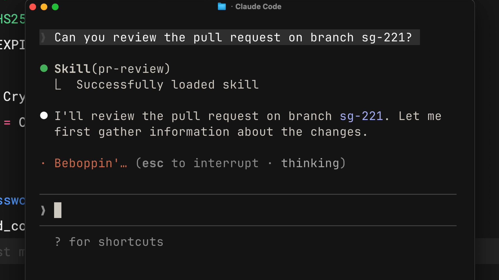

# Skill の基礎

## Skill とは何か

[同じ説明を毎回繰り返さず，Claudeに「やり方」を一度だけ教え込む仕組み]{.h2-submessage}



:::{.info-box}



:::{.info-contents .font-10 .padding-L-05 style="line-height: 1.2"}

- Skillとは，Claude Codeが[**特定タスクを正確にこなすための指示・リソースをまとめたフォルダ**]{.regmonkey-bold}
- 各Skillは `SKILL.md` 一枚を中核とし，frontmatterの `name` / `description` でClaudeに自身の役割を共有する
- ユーザーの依頼内容と `description` がマッチすると，[**Claudeが自動的に該当Skillを読み込んで適用**]{.regmonkey-bold}する
- コミットメッセージ・PRレビュー・コーディング規約など，[**毎回説明していた内容**]{.regmonkey-bold}を一度書けば永続化できる

:::

:::



:::: {.columns}
::: {.column width="50%" .font-09}



::::{.pentagon-box-500}

:::{.border-bottom-header .font-10}

Skillなしの世界 = 同じ指示を毎セッション再入力

:::

:::{.squaredmark style="font-size: 1em; padding-left: 0.5em; line-height: 2"}

1. PRレビュー時に**毎回フォーマット**を再説明
2. コミットメッセージのスタイルを**毎回**注意
3. コーディング規約を**毎回**伝える
4. 同じ説明をチームメンバーが**個別に**反復
5. ナレッジが個人セッションに閉じ込められる

:::

::::

:::
::: {.column width="50.0%" .padding-L-12 .font-09}



::::{ .square-box-500}

:::{.border-bottom-header}

Skillありの世界 = 自動マッチ＆オンデマンド適用

:::

:::{.squaredmark style="font-size: 0.9em; padding-right: 1em"}



[**起動の仕組み**]{.mini-section}

:::{.padding-L-10}

- Claudeが`description`を見て自動判定
- 関連タスク発生時のみ読み込まれる

:::



[**運用上のメリット**]{.mini-section}

:::{.padding-L-10}

- 個人 / プロジェクト単位で**切り替え可能**
- Git管理でき**チーム横断で共有**できる

:::

:::

::::

:::
::::


## Skill の構造

[`SKILL.md` の frontmatter が "看板"，本文が "中身"]{.h2-submessage}



:::{.info-box}

:::{.info-contents .font-10 .padding-L-05 .lh-12}

- Skillは[**フォルダ単位で構成され，`SKILL.md` をエントリーポイント**]{.regmonkey-bold}とする
- frontmatterの `description` は[**Claudeが「このSkillを使うか」を判断する唯一のキー**]{.regmonkey-bold}．具体的に書くほど誤発火が減る
- frontmatter以下の本文に，チェックリスト・整形ルール・出力テンプレートなど Claude に知って欲しい中身を記述する

:::

:::



:::: {.columns}
::: {.column width="50%"}

[SKILL.md の最小例]{.mini-section}



:::{.font-12}

````markdown
---
name: pr-review
description: Reviews pull requests for code
  quality. Use when reviewing PRs or
  checking code changes.
---

# PR Review Checklist

1. Type safety: 型推論・narrowing が
   壊れていないか
2. Error handling: 例外パスが網羅されているか
3. Test coverage: テストが追加されているか
4. ...
````

:::

:::
::: {.column width="50%"}

[フィールドの役割]{.mini-section}



:::{.font-09 style="line-height: 1.8"}

| フィールド | 役割 | 書き方のコツ |
|:----------|:-----|:-----|
| `name` | 識別子 | kebab-case，ユニーク |
| `description` | マッチング用 | "Use when ..." を含める |
| 本文 | 指示の中身 | チェックリスト形式が読みやすい |

:::



[REMARKS]{.mini-section}

:::{.padding-L-10 .font-09}

- 初期ロードは`name` + `description`のみ．本文は[**マッチ後に遅延ロード**]{.regmonkey-bold}される
- そのため大量のSkillを置いてもコンテキストを圧迫しない

:::

:::
::::


## 実例: Skill が自動で読み込まれる様子

[`description` にマッチした瞬間，Claude Code が該当Skillを識別しターミナルに表示]{.h2-submessage}



:::: {.columns}
::: {.column width="55%"}



{fig-alt="Claude Code が pr-review Skill を自動でロードする様子" width="100%"}

:::
::: {.column width="45%" .font-09}



[読み込みまでの3ステップ]{.mini-section}

:::{.padding-L-10 .lh-12}


1. ユーザーが**自然言語で依頼**を入力
    - 例: `Can you review the pull request on branch sg-221?`
2. Claude Code が登録されたSkillの **`description` と照合** → `pr-review` を自動選定
3. ターミナルに `Skill(pr-review)` と[**ロードログが可視化**]{.regmonkey-bold}され，本文がコンテキストに展開される

:::




[ここがSkillsの本質]{.mini-section}

:::{.padding-L-10 style="line-height: 1.6"}

- ユーザーは **`/pr-review` を明示的に呼んでいない**のに自動マッチ
- ロードが**視覚的に確認できる**ので「期待した Skill が起動したか」をその場でデバッグ可能
- 不発火なら `description` の文言を見直すサイン

:::

:::
::::


## Skill の保管場所

[個人用は `~/.claude/skills`，プロジェクト用は `.claude/skills`]{.h2-submessage}



:::: {.columns}
::: {.column width="50%" .font-09}

::::{.pentagon-box-500}

:::{.border-bottom-header .font-10}

Personal skills = 個人の作法を全プロジェクトに

:::

:::{.squaredmark style="font-size: 0.95em; padding-left: 0.5em; line-height: 1.8"}

- 配置先: `~/.claude/skills/<skill-name>/`
- Windows: `C:/Users/<user>/.claude/skills`
- 自分のあらゆるClaude Code実行で[**自動的に有効**]{.regmonkey-bold}
- ユースケース:
    - コミットメッセージの個人的な好み
    - 文書スタイル
    - コードの説明レベルの調整

:::

::::

:::
::: {.column width="50%" .padding-L-12 .font-09}

::::{.square-box-500}

:::{.border-bottom-header}

Project skills = チーム標準をリポジトリと同梱

:::

:::{.squaredmark style="font-size: 0.95em; padding-right: 1em; line-height: 1.8"}

- 配置先: `<repo>/.claude/skills/<skill-name>/`
- リポジトリにcommitすれば[**clone した全員に同じSkillが配布**]{.regmonkey-bold}
- ユースケース:
    - チームのコードレビュー基準
    - PRテンプレート / ブランチ命名規則
    - 会社のブランドガイドライン
    - 特定フレームワーク向けデバッグチェックリスト

:::

::::

:::
::::

## Skill の優先順位と4階層

[名前衝突時は Enterprise > Personal > Project，Plugin は名前空間で隔離]{.h2-submessage}



:::{.info-box}

:::{.info-contents .font-10 .padding-L-05 .lh-12}



- Skillの配置先は[**Enterprise / Personal / Project / Plugin の4階層**]{.regmonkey-bold}に分かれており，それぞれ適用範囲が異なる
- 同名 Skill が複数レベルに存在する場合，[**上位レベルが下位を上書き**]{.regmonkey-bold}する（IT管理の Enterprise 設定が個人や Project の設定より優先される）
- Plugin Skill のみ `<plugin>:<skill>` の名前空間を持つため他レベルと衝突しない

:::

:::



:::: {.columns}
::: {.column width="58%" .font-09}

:::{.font-09 style="line-height: 1.5"}

| レベル | 配置パス | 適用範囲 |
|:------|:---------|:---------|
| **Enterprise** | managed settings 参照（IT管理） | 組織内の[**全ユーザー**]{.regmonkey-bold}に適用 |
| **Personal** | `~/.claude/skills/<name>/SKILL.md` | 自分の[**全プロジェクト**]{.regmonkey-bold}に適用 |
| **Project** | `.claude/skills/<name>/SKILL.md` | [**そのリポジトリ内のみ**]{.regmonkey-bold}に適用 |
| **Plugin** | `<plugin>/skills/<name>/SKILL.md` | plugin が[**有効な場所**]{.regmonkey-bold}すべてに適用 |

: {tbl-colwidths="[18,42,40]"}

:::
:::
::: {.column width="42%" .font-09}

[使い分けの指針]{.mini-section}

:::{.padding-L-10 style="line-height: 1.6"}

- **Personal**: コミット文体・説明レベルなど自分の作法
- **Project**: チームのレビュー基準・ブランドガイド（repo に commit して配布）
- **Enterprise**: 全社統一ルール（IT 部門が managed settings で配布）
- **Plugin**: `skilltool` や OSS 経由で配布する再利用 Skill

:::

:::
::::


# 他のカスタマイズ手段との比較

## Skills vs CLAUDE.md vs Slash Commands

[「いつロードされるか」と「誰が起動するか」が3者の本質的な違い]{.h2-submessage}



:::{.font-09 style="line-height: 1.8"}

| 仕組み | ロードのタイミング | 起動者 | 主なユースケース |
|:------|:------|:------|:------|
| **CLAUDE.md** | 全会話の冒頭で**常時ロード** | 自動（不可避） | プロジェクト全体に必ず守って欲しい絶対ルール（例: `strict` モード必須） |
| **Skill** | descriptionがマッチした時だけ**オンデマンド** | Claudeが自動判定 | 特定タスクで必要な専門知識（PRレビュー基準・ブランドガイド等） |
| **Slash command** | ユーザーが `/cmd` と打った時のみ | ユーザーが明示起動 | 確定的に呼び出したい定型ワークフロー（`/review` `/security-review`等） |

: {tbl-colwidths="[18,32,18,32]"}

:::



:::: {.columns}
::: {.column width="50%"}

[使い分けの原則]{.mini-section}

:::{.padding-L-10 .font-09 style="line-height: 1.8"}

- **必ず守らせたい** → `CLAUDE.md`
- **状況依存で適用したい** → Skill
- **明示的に呼び出したい** → Slash command

:::

:::
::: {.column width="50%"}

[コンテキスト消費の観点]{.mini-section}

:::{.padding-L-10 .font-09 style="line-height: 1.8"}

- `CLAUDE.md` は[**全会話で消費**]{.regmonkey-bold} → 肥大化に注意
- Skillは[**マッチ時のみ消費**]{.regmonkey-bold} → 大量に置けるのが強み
- Slash commandも[**呼び出し時のみ**]{.regmonkey-bold}

:::

:::
::::


## いつ Skill にすべきか

[「同じ説明を2回以上した」が Skill 化のシグナル]{.h2-submessage}



:::{.info-box}

:::{.info-contents .font-10 .padding-L-05 .lh-12}

- Skill化の判断基準はシンプル: [**「自分が同じ説明をClaudeに繰り返している」と気づいた瞬間**]{.regmonkey-bold}が，それは Skill になるべき知識
- 一般のCLAUDE.mdに入れるには**特定的すぎる**が，毎回手で説明するには**汎用的すぎる** → そのスイートスポットがSkill
- チームで共有したいか，個人だけで使うかで保管場所を切り替える

:::

:::



:::: {.columns}
::: {.column width="50%" .font-09}

[Skill化に向いているもの]{.mini-section}

:::{.padding-L-10 style="line-height: 1.8"}

- チームのコードレビュー基準
- 好みのコミットメッセージ書式
- 組織のブランドガイドライン
- 特定文書タイプのテンプレート
- フレームワーク固有のデバッグ手順
- リリースノート整形ルール

:::

:::
::: {.column width="50%" .font-09}

[Skill化に向かないもの]{.mini-section}

:::{.padding-L-10 style="line-height: 1.8"}

- プロジェクト全体で**常に**守って欲しい掟 → `CLAUDE.md`
- 一回限りのタスク → 直接プロンプト
- 確定的に毎回呼び出したい処理 → Slash command
- コード本体に書くべきロジック

:::

:::
::::


# まとめ

## Skill 導入の3ステップ

[「気づく → 書く → 置く」のサイクルを回せば，Claude Codeの再現性が劇的に上がる]{.h2-submessage}



:::::::::{.shannon-model .font-09}

::::{.shannon-component}

:::{.shannon-icon-box}
<i class="fa-solid fa-magnifying-glass"></i>
:::

[気づく]{.shannon-label}



:::{.shannon-annotation-box style="border: none"}

- 同じ説明の繰り返しを検知
- 「またこれ書いてる」を捉える

:::

::::

:::{.shannon-arrow}



<i class="fa-solid fa-arrow-right"></i>

:::

::::{.shannon-component}

:::{.shannon-icon-box}
<i class="fa-solid fa-pen-to-square"></i>
:::

[書く]{.shannon-label}



:::{.shannon-annotation-box style="border: none"}

- `SKILL.md` を作成
- `description` を具体的に

:::

::::

:::{.shannon-arrow}



<i class="fa-solid fa-arrow-right"></i>

:::

::::{.shannon-component}

:::{.shannon-icon-box}
<i class="fa-solid fa-folder-tree"></i>
:::

[置く]{.shannon-label}



:::{.shannon-annotation-box style="border: none"}

- 個人なら `~/.claude/skills`
- チームなら `.claude/skills`

:::

::::

:::{.shannon-arrow}



<i class="fa-solid fa-arrow-right"></i>

:::

::::{.shannon-component}

:::{.shannon-icon-box}
<i class="fa-solid fa-rotate"></i>
:::

[改善]{.shannon-label}



:::{.shannon-annotation-box style="border: none"}

- 誤発火・空振りを観察
- `description` を磨き続ける

:::

::::

:::::::::



[Key Takeaways]{.mini-section}

:::{.padding-L-10 .font-10 style="line-height: 1.2"}

- Skillとは「[**Claudeに一度だけやり方を教えるmarkdownファイル**]{.regmonkey-bold}」．以降は自動適用
- frontmatterの `description` がマッチング鍵 — 具体的に書くこと
- 個人用は `~/.claude/skills`，チーム用は repo の `.claude/skills`
- CLAUDE.md（常時） / Slash command（明示起動）と違い，[**状況に応じて自動ロード**]{.regmonkey-bold}される
- 同じ説明を繰り返している自分に気づいたら，それは新しいSkillの種

:::
