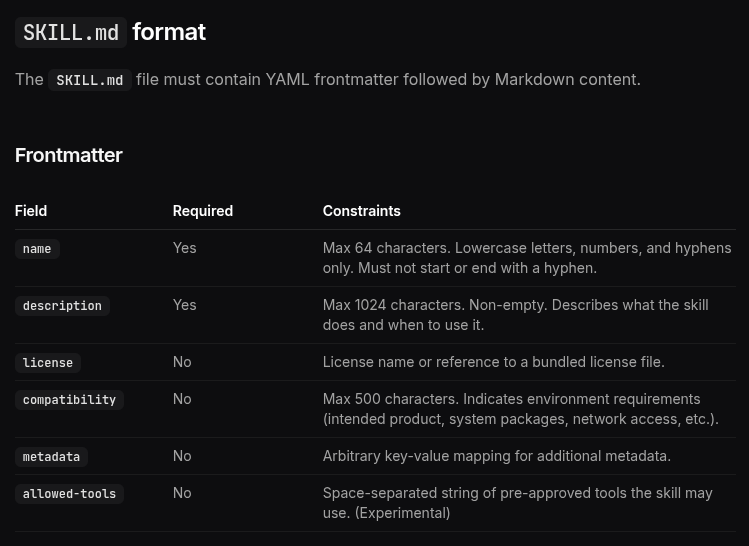
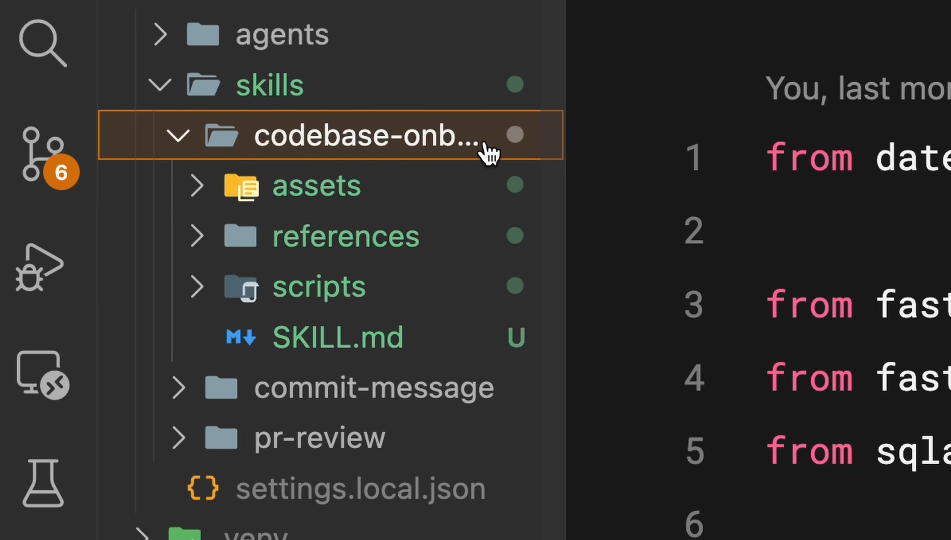

## Index {.regmonkey-index-slide-no-title}

::::: {.columns}



:::: {.column width="25%"}



:::: {.sidebar}

::::{.component-card-index .pl-4 .pr-4 .pt-1 .pb-6 .border-blue-500}

:::{.flex .items-center .mb-2}



### 学習目標

:::

- 6 つの metadata field を理解し使い分けられる
- allowed-tools で読み取り専用 Skill を書ける

::::



::::{.component-card-index .pl-4 .pr-4 .pt-1 .pb-6 .border-blue-500}

:::{.flex .items-center .mb-2}



### 対象レベル

:::

- 自作 Skill を運用し始めた開発者
- 肥大化した SKILL.md を整理したい人

::::



::::{.component-card-index .pl-4 .pr-4 .pt-1 .pb-6 .border-blue-500}

:::{.flex .items-center .mb-2}



### 前提知識 & 必要環境

:::

- 「Skill を自作する」を読了
- name + description で発火する Skill を作ったことがある

::::

::::
::::

::: {.column width="75%" style="padding-left:0.5em;"}



::: {.regmonkey_index style="width:1200px; line-height: 1.1"}

```yaml
regmonkey_index:
  title_fontsize: 1.1em
  bullet_fontsize: 0.85em
  children:
    - title: 1. メタデータの全体像
      description:
        - frontmatter は <strong>6 フィールド</strong>．必須は name と description のみ
        - license・compatibility・allowed-tools・model はオプションの強化要素
      width: [40, 60]
    - title: 2. allowed-tools
      description:
        - 良い description は <strong>「何をする」+「いつ使う」</strong>の二点を含む
        - allowed-tools で <strong>使えるツールを絞り</strong>，読み取り専用 Skill を作れる
      width: [40, 60]
    - title: 3. Progressive Disclosure
      description:
        - SKILL.md は <strong>500 行以内</strong>．scripts・references・assets に分割
        - Scripts は<strong>実行のみ</strong>．本体は context を消費せず出力だけが乗る
        - 既存ツールは <strong>uvx・npx</strong>，独自処理は <strong>PEP 723</strong> で同梱
        - <strong>非対話・--help・構造化出力・冪等性</strong>を満たすよう設計する
      width: [40, 60]
    - title: 4. バリデーションチェック
      description:
        - <strong>シンプルから始め</strong>，必要に応じて高度な field を追加する
        - 500 行を超えたら分割を検討．description は磨き続ける
        - <strong>skills-ref</strong> CLI で公開前に frontmatter と構造をバリデーション
      width: [40, 60]
```

:::
:::
:::::

# メタデータの全体像

## 任意フィールドを活用することでSKILL運用力を底上げする
[制約や権限を宣言，context windowsの削減したい場面でOptionsを活用する]{.h2-submessage}



:::: {.columns}
::: {.column width="55%"}



{fig-alt="SKILL.md の frontmatter フィールド一覧表（name・description・license・compatibility・metadata・allowed-tools）" width="100%"}

:::
::: {.column width="45%" .font-09}



[必須フィールド]{.mini-section}

:::{.padding-L-10 .lh-14}

- `name`：識別子．[**最大 64 文字**]{.regmonkey-bold}．小文字・数字・ハイフンのみ
- `description`：マッチング基準．[**最大 1024 文字**]{.regmonkey-bold}．非空

:::



[任意フィールド]{.mini-section}

:::{.padding-L-10 .lh-14}

- `license`：ライセンス名 or バンドルファイル参照
- `compatibility`：環境要件（最大 500 文字）
- `metadata`：任意の key-value マッピング
- `allowed-tools`：使用可能ツール（実験的）
- `model`：使用するモデルの指定

:::

:::
::::

# allowed-tools


## allowed-tools で読み取り専用 Skill を実現できる

[セキュリティ用途や副作用を避けたい workflow で，Claude の権限に明示的なガードレールを敷く]{.h2-submessage}



:::: {.columns}
::: {.column width="47.5%"}

[最小例：onboarding Skill]{.mini-section}



:::{.font-10}

````markdown
---
name: codebase-onboarding
description: Helps new developers
  understand how the system works.
allowed-tools: Read, Grep, Glob, Bash
model: sonnet
---

When a new developer asks how the
system works:

1. Use Glob to map the directory tree
2. Use Grep to locate entry points
3. Read key modules and explain
````

:::

:::
::: {.column width="52.5%" .padding-L-10}

[allowed-tools の効果]{.mini-section}

:::{.padding-L-10 .font-09 .lh-16}

- 列挙したツールは [**確認なしで利用可**]{.regmonkey-bold}(= without permission)
- 列挙外のツール（`Edit`，`Write` 等）は [**使えない**]{.regmonkey-bold}
- 省略時は[**通常の権限モデル**]{.regmonkey-bold}が適用される

:::



[使いどころ]{.mini-section}

:::{.padding-L-10 .font-09 .lh-16}

- 調査・要約など [**書き換えを伴わない作業**]{.regmonkey-bold}
- セキュリティ感度が高い workflow
- 「うっかり Edit が走る」事故の予防

:::

:::
::::

# Progressive Disclosure

## SKILL.md は 500 行以内．詳細はサブディレクトリに逃がす

[全部を SKILL.md に詰めると context を圧迫する．本文は目次に徹し，詳細は別ファイルへ]{.h2-submessage}



:::: {.columns}
::: {.column width="40%"}



{fig-alt="codebase-onboarding skill のディレクトリツリー（assets/・references/・scripts/・SKILL.md）" width="100%"}

:::
::: {.column width="60%" .font-09}



[3 つのオプションディレクトリ]{.mini-section}

:::{.padding-L-10 .lh-14}

- `scripts/`：[**実行可能コード**]{.regmonkey-bold}．自己完結 or 依存を明記
- `references/`：[**追加ドキュメント**]{.regmonkey-bold}．`REFERENCE.md` `FORMS.md` などを置き，[**必要なときだけ**]{.regmonkey-bold}読ませる
- `assets/`：[**静的リソース**]{.regmonkey-bold}．テンプレ・図・データファイル

:::



[なぜ分離するのか]{.mini-section}

:::{.padding-L-10 .lh-14}

- 全部を SKILL.md に詰めると[**コンテキストを圧迫**]{.regmonkey-bold}しメンテも辛い
- 個別ファイルは[**ロード対象に含めるかを Claude が判断**]{.regmonkey-bold}できる
- SKILL.md は[**目次**]{.regmonkey-bold}としての役割に徹し，詳細は別ファイルに逃がす

:::

:::
::::

## Scripts は実行のみで context を消費しない

[本体は読まれず，実行結果（出力）だけが context に乗る．コードで書ける処理は scripts へ]{.h2-submessage}



:::{.info-box}

:::{.info-contents .font-10 .padding-L-05 .lh-12}



- SKILL.md には「[**スクリプトを実行する**]{.regmonkey-bold}」と書く．[**読ませない**]{.regmonkey-bold}
- 実行結果（出力）だけが context に乗る．本体ファイルの行数は無関係
- 検証・データ変換・定型処理など[**コードで書いた方が信頼できる作業**]{.regmonkey-bold}に最適

:::

:::



:::: {.columns}
::: {.column width="50%"}

[向いている処理]{.mini-section}

:::{.padding-L-10 .font-09 .lh-16}

- 環境バリデーション（依存・バージョンチェック）
- 一貫性が必要な[**データ変換**]{.regmonkey-bold}
- 「コード化した方が安定する」定型操作

:::

:::
::: {.column width="50%"}

[Skill 設計の判断軸]{.mini-section}

:::{.padding-L-10 .font-09 .lh-16}

- 自然言語で Claude に毎回考えさせる？ → [**SKILL.md 本文**]{.regmonkey-bold}に書く
- 決まった処理を毎回流す？ → `scripts/` に置いて[**実行を指示**]{.regmonkey-bold}する

:::

:::
::::

## 既存ツールは uvx・npx で呼び，独自処理は scripts/ に同梱する

[依存解決を実行時に任せれば環境構築が要らない．独自ロジックは PEP 723 で依存をインライン宣言]{.h2-submessage}



:::: {.columns}
::: {.column width="50%"}

[One-off：既存ツールをそのまま呼ぶ]{.mini-section}



:::{.font-09}

```bash
uvx ruff@0.8.0 check .
uvx black@24.10.0 .
npx eslint@9.0.0 src/
```

:::



:::{.padding-L-10 .font-09 .lh-16}

- バージョンを [**ピン留め**]{.regmonkey-bold}して再現性を確保
- 前提環境は `compatibility` フィールドで宣言
- フラグが増えて複雑化したら[**`scripts/` へ移行**]{.regmonkey-bold}

:::

:::
::: {.column width="50%"}

[Bundled：PEP 723 で依存をインライン宣言]{.mini-section}



:::{.font-09}

````python
# /// script
# dependencies = ["beautifulsoup4>=4.12,<5"]
# ///
from bs4 import BeautifulSoup
...
````

:::



:::{.padding-L-10 .font-09 .lh-16}

- `uv run scripts/extract.py` で[**隔離環境＋自動依存解決**]{.regmonkey-bold}
- `uv lock --script` で完全再現用のロックファイル生成
- スキルルートからの[**相対パス**]{.regmonkey-bold}で参照

:::

:::
::::

## エージェント実行を前提に「非対話・自己説明・構造化」で書く

[エージェントは stdout / stderr を読んで次の行動を決める．書き方が成功率を直接左右する]{.h2-submessage}



::::: {.columns}
:::: {.column width="50%"}

:::{.info-box}

[① 対話プロンプトは禁止]{.info-box-title}

:::{.info-contents .font-09 .lh-14}
- 非対話シェルでは [**TTY プロンプトでハング**]{.regmonkey-bold}する
- 入力は CLI フラグ・環境変数・stdin で受ける
- 必須引数欠落は使い方を出して[**即終了**]{.regmonkey-bold}
:::

:::



:::{.info-box}

[② `--help` で interface を自己文書化]{.info-box-title}

:::{.info-contents .font-09 .lh-14}
- エージェントは `--help` を読んで[**スクリプトを学ぶ**]{.regmonkey-bold}
- 説明・フラグ・実行例を簡潔に
- context を圧迫しないよう短く保つ
:::

:::

::::
:::: {.column width="50%"}

:::{.info-box}

[③ 親切なエラーメッセージ]{.info-box-title}

:::{.info-contents .font-09 .lh-14}
- 「[**何がダメ・何を期待・どう直せばよいか**]{.regmonkey-bold}」を1メッセージに
- 例：`--format must be one of: json, csv, table. Received: "xml"`
- 曖昧なエラーはエージェントの[**1ターン分を浪費**]{.regmonkey-bold}する
:::

:::



:::{.info-box}

[④ 構造化出力を stdout，診断は stderr]{.info-box-title}

:::{.info-contents .font-09 .lh-14}
- JSON・CSV・TSV など [**機械可読**]{.regmonkey-bold}な形式
- データは stdout，進捗・警告は stderr に分離
- `jq` 等との[**パイプライン合成**]{.regmonkey-bold}が容易に
:::

:::

::::
:::::

## 冪等性・dry-run・終了コードで運用上の安全装置を仕込む

[エージェントはリトライする．副作用と出力サイズの暴走を抑える設計が事故を減らす]{.h2-submessage}



::::: {.columns}
:::: {.column width="50%"}

:::{.info-box}

[① 冪等性]{.info-box-title}

:::{.info-contents .font-09 .lh-14 .padding-L-10}
- エージェントはリトライ前提．何度呼ばれても結果が同じ設計に
- 「create if not exists」を「create and fail」より優先する
:::
:::



:::{.info-box}

[② 入力制約]{.info-box-title}

:::{.info-contents .font-09 .lh-14 .padding-L-10}

- 曖昧な入力を推測で実行しない．推測は誤実行のもと
- enum・closed set を使い，曖昧な入力は[**明確にエラー**]{.regmonkey-bold}



:::
:::



:::{.info-box}

[③ dry-run]{.info-box-title}

:::{.info-contents .font-09 .lh-14 .padding-L-10}
- 副作用ありの操作は未然に防ぎたい
- `--dry-run` フラグで先に[**プレビュー**]{.regmonkey-bold}させる
:::
:::

::::
:::: {.column width="50%"}

:::{.info-box}

[④ 意味のある終了コード]{.info-box-title}

:::{.info-contents .font-09 .lh-14 .padding-L-10}
- 失敗の種類を区別できないと，エージェントが対処を選べない
- 失敗種別ごとに別 code を返し，`--help` に[**意味を明記**]{.regmonkey-bold}
:::
:::



:::{.info-box}

[⑤ 安全なデフォルト]{.info-box-title}

:::{.info-contents .font-09 .lh-14 .padding-L-10}
- うっかり破壊的操作が走る事故を防ぐ
- `--confirm`・`--force` などの[**明示フラグを必須化**]{.regmonkey-bold}
:::
:::



:::{.info-box}

[⑥ 出力サイズの予測可能性]{.info-box-title}

:::{.info-contents .font-09 .lh-14 .padding-L-10}
- harness は 10〜30K 字で truncate．重要情報が消えうる
- 要約をデフォルトに．`--offset` で[**追加取得を許可**]{.regmonkey-bold}
:::
:::

::::
:::::

# バリデーションチェック

## skills-ref CLI で公開前にバリデーションする

[frontmatter のスキーマと include 構造を機械チェック．CI に載せれば壊れた Skill をマージ前で止められる]{.h2-submessage}



:::: {.columns}
::: {.column width="50%"}

[使い方]{.mini-section}



:::{.font-12}

```bash
skills-ref validate ./my-skill
```

:::



:::{.padding-L-10 .font-09 .lh-16}

- agentskills が提供する [**リファレンス実装**]{.regmonkey-bold}の CLI
- ディレクトリを引数に指定して実行するだけ
- 参考：[agentskills/skills-ref](https://github.com/agentskills/agentskills/tree/main/skills-ref)

:::

:::
::: {.column width="50%"}

[使いどころ]{.mini-section}

:::{.padding-L-10 .font-09 .lh-16}

- 公開前のチェック：[**name の文字数・構文**]{.regmonkey-bold}・description 必須を機械検証
- CI への組み込み：壊れた Skill を[**マージ前にブロック**]{.regmonkey-bold}
- 配布リポジトリで[**品質を担保**]{.regmonkey-bold}し，受け取り側の事故を減らす

:::



[validate でカバーできること]{.mini-section}

:::{.padding-L-10 .font-09 .lh-16}

- frontmatter のスキーマ準拠
- `include` の glob と実ファイルの整合
- 必須フィールドの欠落・命名規則違反の検出

:::

:::
::::

## Summary



::::{.custom-table style="width:100%; height:80%; font-size: 0.8em !important;"}
:::{.yaml2table .yaml2table-custom-top #yaml-tidy-table data-col-widths="[15, 30, 55]"}

```yaml
record1:
  category: メタデータ
  rule: 
    - name と description が必須．残りはオプションで<span class="regmonkey-bold">段階的に拡張</span>する
  actions:
    - name は最大 64 文字．小文字・数字・ハイフンのみ
    - description は最大 1024 文字．非空
    - 必要に応じてcompatibility・allowed-tools・model を活用

record3:
  category: allowed-tools
  rule: 
    - 使えるツールを限定し<span class="regmonkey-bold">read-only Skill</span>を実現する
  actions:
    - 列挙したツールは確認なしで利用可，列挙外は使えない
    - 調査・要約など書き換えを伴わない workflow に最適
    - 「うっかり Edit が走る」事故を予防

record4:
  category: Progressive<br>Disclosure
  rule:
    - SKILL.md は<span class="regmonkey-bold">500 行以内</span>．詳細は別ファイルに逃がす
  actions:
    - scripts・references・assets の 3 サブディレクトリで整理
    - Scripts は実行のみ．本体は context を消費せず出力だけが乗る
    - SKILL.md は目次に徹し，個別ファイルは遅延ロード

record5:
  category: スクリプト<br>設計
  rule:
    - エージェント実行を前提に<span class="regmonkey-bold">「非対話・自己説明・構造化」</span>で書く
  actions:
    - 既存ツールは <code>uvx</code>・<code>npx</code>，独自処理は PEP 723 で依存をインライン宣言
    - 非対話必須．<code>--help</code> と親切なエラーで自己文書化．構造化出力は stdout
    - 冪等性・dry-run・終了コードで運用上の安全装置を仕込む

record6:
  category: バリデーション
  rule:
    - 公開前に<span class="regmonkey-bold">skills-ref validate</span>で機械チェック
  actions:
    - <code>skills-ref validate ./my-skill</code> を CI に組み込む
    - frontmatter のスキーマ準拠と include 整合を確認
    - 壊れた Skill をマージ前にブロック
```

:::
::::
