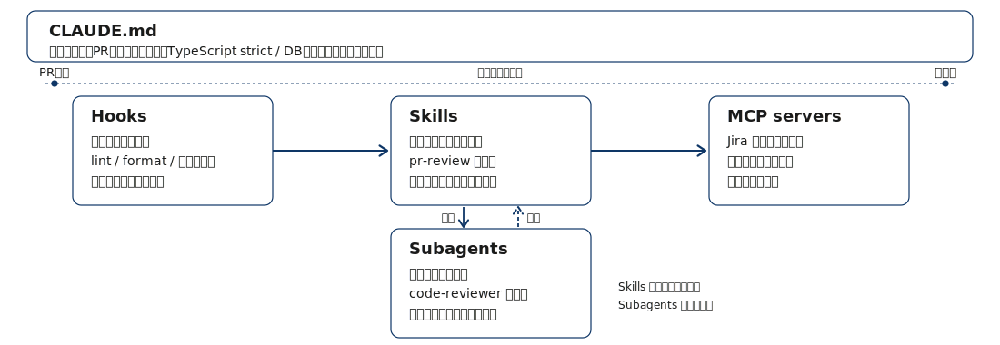
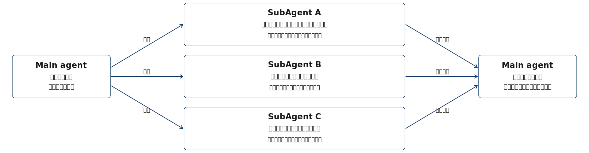
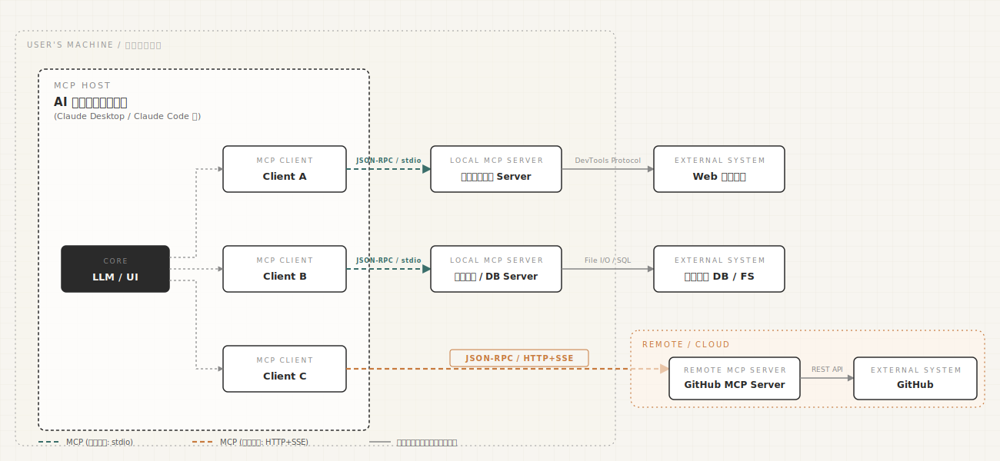

## Index {.regmonkey-index-slide-no-title}

::::: {.columns}



:::: {.column width="30%"}



:::: {.sidebar}

::::{.component-card-index .pl-4 .pr-4 .pt-1 .pb-6 .border-blue-500}

:::{.flex .items-center .mb-2}



### 学習目標

:::

- 5つのカスタマイズ機能の役割の違いを説明できる
- ユースケースに対し適切な機能を選べる
- 複数機能を組み合わせた設計ができる

::::



::::{.component-card-index .pl-4 .pr-4 .pt-1 .pb-6 .border-blue-500}

:::{.flex .items-center .mb-2}



### 対象レベル

:::

- Skill 自作の運用経験がある開発者
- どの機能をどこに置くか迷うことがある

::::



::::{.component-card-index .pl-4 .pr-4 .pt-1 .pb-6 .border-blue-500}

:::{.flex .items-center .mb-2}



### 前提知識 & 必要環境

:::

- CLAUDE.md・hooks・MCPの存在を知っている

::::

::::
::::

::: {.column width="70%" style="padding-left:0.5em;"}



::: {.regmonkey_index style="width:1200px; line-height: 1.1"}

```yaml
regmonkey_index:
  title_fontsize: 1.1em
  bullet_fontsize: 0.9em
  children:
    - title: 1. 5つの機能の全体像
      description:
        - Claude Codeのカスタマイズ手段は <strong>5種類</strong>．それぞれが固有の専門領域を持つ
        - 1機能に詰め込まず，<strong>適材適所で組み合わせる</strong>のが基本
      width: [40, 60]
    - title: 2. Skills vs CLAUDE.md
      description:
        - CLAUDE.mdは<strong>常時ロード</strong>．プロジェクト共通の恒久ルール向け
        - Skillsは<strong>オンデマンド</strong>．タスク特有の専門知識を必要時のみ
      width: [40, 60]
    - title: 3. Skills vs Subagents
      description:
        - Skillsは<strong>現セッションに知識を追加</strong>．推論をその場で補強する
        - Subagentsは<strong>別コンテキストで委譲</strong>．独立した作業として隔離
      width: [40, 60]
    - title: 4. Skills vs Hooks
      description:
        - Skillsは<strong>リクエスト駆動</strong>．依頼内容に応じて起動
        - Hooksは<strong>イベント駆動</strong>．ファイル保存・ツール呼び出しで発火
      width: [40, 60]
    - title: 5. Skills vs MCP servers
      description:
        - Skillsは<strong>指示・手順の知識</strong>を与える
        - MCPは<strong>外部ツール・統合</strong>を提供
      width: [40, 60]
```

:::
:::
:::::

# 5つの機能の全体像

## 機能はそれぞれ独自の専門領域を持つ：組み合わせて使う

[1機能に詰め込まず，常時ロード・オンデマンド・隔離実行・イベント駆動・外部統合を適材適所で配置する]{.h2-submessage}




:::::{.width-100}
:::{.regmonkey_abstract_summary}

```yaml
regmonkey_abstract_summary:
  title_fontsize: 1.2em
  bullet_fontsize: 1.0em
  children:
    - title: CLAUDE.md
      description:
        - <strong>常時ロード</strong>．全セッションの冒頭に必ず読み込まれる
        - プロジェクト共通の<strong>恒久ルール</strong>（標準・制約・スタイル）を置く
      width: [25, 75]
    - title: Skills
      description:
        - <strong>オンデマンドロード</strong>．リクエストにマッチしたときだけセッションに合流
        - タスク特有の<strong>専門知識・手順</strong>を必要時に注入する
      width: [25, 75]
    - title: Subagents
      description:
        - <strong>隔離コンテキスト</strong>で作業を委譲し，結果だけ回収する
        - 別ツール権限・並列実行・本セッションの<strong>コンテキスト保護</strong>に有効
      width: [25, 75]
    - title: Hooks
      description:
        - <strong>イベント駆動</strong>．ファイル保存・ツール呼び出しの前後で自動発火
        - lint/format・事前検証など「毎回走らせたい」副作用を仕込む
      width: [25, 75]
    - title: MCP servers
      description:
        - <strong>外部ツール・統合</strong>を Claude に接続する：使える道具を増やす
        - Jira・Slack・社内DB等への API 接続，標準ツールにない追加機能
      width: [25, 75]
```

:::
:::::

## Claude Code 機能の使い分け判断の3原則



:::: {.info-box style="font-size: 1.0em;"}

[判断の3原則]{.info-box-title}

::: {.info-contents .pl-5 .font-09 .lh-12}

- 「[**いつロードされるか**]{.regmonkey-bold}」「[**何を提供するか**]{.regmonkey-bold}」の2軸で機能を区別する
- 各機能は[**専門領域が重ならない**]{.regmonkey-bold}：別の機能で代替するのは無理がある
- 1つで賄おうとせず，複数を[**重ねて構成**]{.regmonkey-bold}するのが現実的な使い方

:::
:::

[具体例：PR レビュー支援フローでの5機能の役割分担]{.mini-section}

:::{style="text-align:center;"}
{fig-alt="PRレビューフローでの5機能の役割分担。CLAUDE.mdが土台として常時適用され，主軸はHooks→Skills→MCP serversの時系列。SkillsからSubagentsへ別軸で委譲" width="100%"}
:::

# Skills vs CLAUDE.md

## 常時ロードのCLAUDE.md と 必要時のみのSkills

[全セッション共通ルールはCLAUDE.mdへ．セッションに応じた必要専門知識はSkillsに分離]{.h2-submessage}

:::: {.info-box style="font-size: 1.0em;"}

[ロードのタイミングが本質的な違い]{.info-box-title}

::: {.info-contents .pl-5 .font-09 .lh-14}

- CLAUDE.md[^claudemd]は[**セッションの開始時**]{.regmonkey-bold}に必ず読み込まれる：プロジェクト全体の前提
- Skillsは[**マッチしたときだけ**]{.regmonkey-bold}セッションに追加される：必要なときに必要な知識

:::
::::

:::: {.columns}
::: {.column width="50%" .font-09}



::::{ .square-box-500}

:::{.border-bottom-header-left}

CLAUDE.md を使う場面

:::

:::{.squaredmark style="font-size: 0.9em; padding-right: 1em"}

- プロジェクト全体に[**常に適用される**]{.regmonkey-bold}標準
  - 例：TypeScriptはstrictモードで書く
- 「[**絶対にやってはいけない**]{.regmonkey-bold}」制約
  - 例：DBスキーマを直接変更しない
- フレームワーク選定・コーディングスタイル

[Tips]{.mini-section}

- [**複数ステップの手順**]{.regmonkey-bold}や[**一部のコードのみに関わる事項**]{.regmonkey-bold}は CLAUDE.md ではなく，Skill か path-scoped rule（ネストした CLAUDE.md）へ移す

:::

::::

:::
::: {.column width="50%" .padding-L-12 .font-09}





::::{ .square-box-500}

:::{.border-bottom-header-left}

Skills を使う場面

:::

:::{.squaredmark style="font-size: 0.9em; padding-right: 1em"}

- 特定タスクのときだけ必要な[**専門知識**]{.regmonkey-bold}
  - 例：PRレビュー用のチェックリスト
- 一部の場面でのみ意味を持つ知識
- [**コンテキストを圧迫**]{.regmonkey-bold}する可能性のある詳細な手順
  - skillsは常に読み込まれるのではなく，タスクマッチ時点で全文が読み込まれる（=**段階的開示（progressive disclosure）**で動作）
  - タスクに応じて呼び出す形にするとContext Windowsを節約できる

:::

::::

:::
::::

<!-- footer -->

[^claudemd]: Claude Code が読むのは `CLAUDE.md`．他ツールで採用される `AGENTS.md` ではない点に注意．


# Skills vs Subagents

## 別コンテキストで実行するSubagents

[Skillsは推論をその場で強化．Subagentsは作業を委譲して結果だけを受け渡す]{.h2-submessage}



:::: {.info-box style="font-size: 1.0em;"}

[コンテキストの扱いが本質的な違い]{.info-box-title}

::: {.info-contents .pl-5 .font-09 .lh-14}

- Subagentsは[**独立コンテキストで実行**]{.regmonkey-bold}：タスクを渡して結果を回収する
- Subagentsが大量のログを読み込んでも，親エージェントのコンテキストには影響しない（[メモリ汚染の防止]{.regmonkey-bold}）

:::
::::

:::: {.columns}
::: {.column width="50%" .font-09}



::::{ .square-box-500}

:::{.border-bottom-header-left}

Subagents を使う場面

:::

:::{.squaredmark style="font-size: 0.9em; padding-right: 1em"}

- 作業を[**別コンテキスト**]{.regmonkey-bold}に委譲したい
  - 例：広範な検索・調査の並列実行
- 異なる[**ツール権限**]{.regmonkey-bold}を与えたい
- 委譲作業と本セッションの[**コンテキスト分離**]{.regmonkey-bold}が必要
  
[REMARKS]{.mini-section}  

- Subagentsは[親エージェントのコンテキストを参照できない]{.regmonkey-bold}
- 情報を共有させたい場合は相互に参照できるログファイルを媒体にして，情報連携したりする

:::


::::

:::
::: {.column width="50%" .padding-L-12 .font-09}





::::{ .square-box-500}

:::{.border-bottom-header-left}

Skills を使う場面

:::

:::{.squaredmark style="font-size: 0.9em; padding-right: 1em"}

- 現タスクの[**Claudeの知識を補強**]{.regmonkey-bold}したい
  - 例：自社流のスライド作法をセッションに注入
- 専門知識を[**セッション全体**]{.regmonkey-bold}で参照する
- 隔離せず[**継続して使う**]{.regmonkey-bold}知識・指示

:::

::::

:::
::::

## サブエージェントによるコンテキスト分離

[親はタスクを委譲し，サブエージェントが独立コンテキストで作業．本コンテキストには要約だけが返る]{.h2-submessage}



:::{style="text-align:center;"}
{fig-alt="親エージェントが3つのサブエージェント（A・B・C）にタスクを委譲し，それぞれが独立コンテキストで作業した結果の要約だけを親が受領する図" width="100%"}
:::

[もしSubAgentsがなかったら]{.mini-section}

:::{.padding-L-10}

1. 膨大なログ分析やテスト実行ログを読み込むことでAgentのメモリが汚染
2. 重要な要件や設計判断が圧縮[^footer-compaction]で失われる
3. 重要度の低い情報に引きずられることで推論の一貫性が崩れる

:::

<!-- footer -->

[^footer-compaction]: コンテキストウィンドウの容量が限界(デフォルトでは95%)に近づいたときに，セッション履歴を要約して記憶管理すること


# Skills vs Hooks

## リクエスト駆動のSkills と イベント駆動のHooks

[何を依頼されたかで動くのがSkills．何が起きたかで動くのがHooks．発火条件のレイヤーが違う]{.h2-submessage}



:::: {.info-box style="font-size: 1.0em;"}

[起動トリガーが本質的な違い]{.info-box-title}

::: {.info-contents .pl-5 .font-09 .lh-14}

- Hooksは[**イベントで発火**]{.regmonkey-bold}：ファイル保存・ツール呼び出しの前後で自動実行
  - プロンプトとしてではなく，プログラムとして動作する
- Skillsは[**リクエストで発火**]{.regmonkey-bold}：ユーザーの依頼内容にマッチして起動

:::
::::

:::: {.columns}
::: {.column width="50%" .font-09}



::::{ .square-box-500}

:::{.border-bottom-header-left}

Hooks を使う場面

:::

:::{.squaredmark style="font-size: 0.9em; padding-right: 1em"}

- ファイル編集・保存ごとに走らせたい[**自動処理**]{.regmonkey-bold}
  - 例：保存時にlint・formatを自動実行
- 特定ツール呼び出し前の[**事前検証**]{.regmonkey-bold}
  - 例: Bash呼び出し時に，実行予定スクリプトをログに吐き出す
- Claude Codeの作業状態の通知
  - 例: Slackに長時間タスクの完了通知を投げる

:::

::::

:::
::: {.column width="50%" .padding-L-12 .font-09}





::::{ .square-box-500}

:::{.border-bottom-header-left}

Skills を使う場面

:::

:::{.squaredmark style="font-size: 0.9em; padding-right: 1em"}

- リクエストの[**処理方針**]{.regmonkey-bold}を変える知識
  - 例：レビュー依頼時のみチェック観点を提供
- 状況に応じて，Claudeの[**推論を導く**]{.regmonkey-bold}ガイドライン
- 「やるかどうか」自体をリクエストに応じてモデルが[**判定する**]{.regmonkey-bold}

[REMARKS]{.mini-section}

- Hooksと異なり，スキル実行の判断はモデルが行うので，「絶対xxxしろ」とSKILLに記述したとしても，100%遵守の保証はない
- 確実に走らせたい処理はHooks，文脈に応じた知識注入はSkills

:::

::::

:::
::::

## Hookの種類：セッション・プロンプト系



::::{.custom-table style="width:100%; height:70%; font-size: 0.9em !important;"}
:::{.yaml2table .yaml2table-custom-top #yaml-hooks-1 data-col-widths="[20, 28, 6, 46]"}

```yaml
record1:
  Hook名: SessionStart
  タイミング: セッション開始時・再開時
  Block: ×
  主な用途: 開発コンテキスト（Issue・最近の変更など）の読み込み、環境変数のセットアップ

record2:
  Hook名: Setup
  タイミング: <code>--init-only</code> または <code>-p</code> モードで <code>--init</code> / <code>--maintenance</code> 起動時
  Block: ×
  主な用途: CIやスクリプトから明示的にトリガーする一回限りの依存関係インストール・スケジュールクリーンアップ

record3:
  Hook名: UserPromptSubmit
  タイミング: ユーザがプロンプトを送信し、Claudeが処理する前
  Block: ○
  主な用途: プロンプトに基づくコンテキスト追加・プロンプトの検証・特定種類のプロンプトのブロック

record4:
  Hook名: UserPromptExpansion
  タイミング: スラッシュコマンドがプロンプトに展開され、Claudeに届く前
  Block: ○
  主な用途: 特定コマンドの直接呼び出しブロック・スキル用コンテキスト注入・コマンド利用ログ

record5:
  Hook名: SessionEnd
  タイミング: セッションが終了したとき
  Block: ×
  主な用途: セッション終了ログ・後処理
```

:::
::::

## Hookの種類：ツール実行系



::::{.custom-table style="width:100%; height:80%; font-size: 0.9em !important;"}
:::{.yaml2table .yaml2table-custom-top #yaml-hooks-2 data-col-widths="[20, 28, 6, 46]"}

```yaml
record1:
  Hook名: PreToolUse
  タイミング: Claudeがツールパラメータを生成した後、ツール呼び出しの処理前
  Block: ○
  主な用途: 危険コマンドのブロック・ツール入力の修正・許可/拒否/確認の制御

record2:
  Hook名: PermissionRequest
  タイミング: 権限ダイアログが表示されるとき
  Block: ○
  主な用途: ユーザの代わりに権限を自動承認・拒否、カスタムロジックによるツール権限制御

record3:
  Hook名: PermissionDenied
  タイミング: auto modeのclassifierがツール呼び出しを拒否したとき
  Block: ×
  主な用途: 拒否ログ記録・設定調整・モデルへのリトライ指示

record4:
  Hook名: PostToolUse
  タイミング: ツールが正常に完了した直後
  Block: ×
  主な用途: ファイル自動フォーマット・ツール出力の置換・Claudeへのフィードバック追加

record5:
  Hook名: PostToolUseFailure
  タイミング: ツール実行が失敗したとき
  Block: ×
  主な用途: 失敗ログ・アラート送信・Claudeへの修正フィードバック

record6:
  Hook名: PostToolBatch
  タイミング: 並列ツール呼び出しのバッチ全体が解決した後、次のモデル呼び出し前
  Block: ○
  主な用途: バッチ単位でのコンテキスト注入・エージェントループの停止
```

:::
::::

## Hookの種類：タスク・SubAgent・停止系



::::{.custom-table style="width:100%; height:80%; font-size: 0.9em !important;"}
:::{.yaml2table .yaml2table-custom-top #yaml-hooks-3 data-col-widths="[20, 28, 6, 46]"}

```yaml
record1:
  Hook名: Notification
  タイミング: Claude Codeが通知を送るとき
  Block: ×
  主な用途: 外部サービス（Slack・デスクトップ通知など）への通知転送

record2:
  Hook名: SubagentStart
  タイミング: Agentツール経由で SubAgent が起動したとき
  Block: ×
  主な用途: SubAgent へのコンテキスト注入・起動ログ

record3:
  Hook名: SubagentStop
  タイミング: SubAgent が応答を終えたとき
  Block: ○
  主な用途: SubAgent の停止防止・結果の検証

record4:
  Hook名: TaskCreated
  タイミング: TaskCreateツール経由でタスクが作成されるとき
  Block: ○
  主な用途: 命名規則の強制・タスク説明の必須化・特定タスクの作成防止

record5:
  Hook名: TaskCompleted
  タイミング: タスクが完了としてマークされるとき
  Block: ○
  主な用途: テスト・lint通過などの完了基準の強制

record6:
  Hook名: Stop
  タイミング: Main agent が応答を終えたとき
  Block: ○
  主な用途: 停止前の品質ゲート・デスクトップ通知・タスク完了確認

record7:
  Hook名: StopFailure
  タイミング: APIエラーで応答が終わったとき
  Block: ×
  主な用途: レート制限・認証エラーなどの失敗ログ・アラート・リカバリ

record8:
  Hook名: TeammateIdle
  タイミング: Agent Teamのチームメイトがアイドルに移行する直前
  Block: ○
  主な用途: アイドル前の品質ゲート（lint、ビルド成果物の確認など）
```

:::
::::

## Hookの種類：コンテキスト・環境・拡張系



::::{.custom-table style="width:100%; height:90%; font-size: 0.9em !important;"}
:::{.yaml2table .yaml2table-custom-top #yaml-hooks-4 data-col-widths="[20, 28, 6, 46]"}

```yaml
record1:
  Hook名: InstructionsLoaded
  タイミング: <code>CLAUDE.md</code> や <code>.claude/rules/*.md</code> がコンテキストに読み込まれたとき
  Block: ×
  主な用途: 監査ログ・コンプライアンス追跡・観測性

record2:
  Hook名: ConfigChange
  タイミング: セッション中に設定ファイルが変更されたとき
  Block: ○
  主な用途: 設定変更の検証・不正な変更のブロック

record3:
  Hook名: CwdChanged
  タイミング: 作業ディレクトリが変わったとき（<code>cd</code> コマンド実行時など）
  Block: ×
  主な用途: direnvなどによるリアクティブな環境管理

record4:
  Hook名: FileChanged
  タイミング: 監視対象ファイルがディスク上で変更されたとき
  Block: ×
  主な用途: ファイル変更の検知・環境再読み込み

record5:
  Hook名: WorktreeCreate
  タイミング: worktree作成時
  Block: ○
  主な用途: デフォルトのgit動作を置き換えるカスタムworktree作成

record6:
  Hook名: WorktreeRemove
  タイミング: セッション終了時や SubAgent 完了時にworktreeが削除されるとき
  Block: ×
  主な用途: worktreeクリーンアップ

record7:
  Hook名: PreCompact
  タイミング: コンテキスト圧縮前
  Block: ○
  主な用途: 圧縮前のバックアップ・圧縮の防止

record8:
  Hook名: PostCompact
  タイミング: コンテキスト圧縮の完了後
  Block: ×
  主な用途: 圧縮後の状態ログ

record9:
  Hook名: Elicitation
  タイミング: MCPサーバがツール呼び出し中にユーザ入力を要求したとき
  Block: ○
  主な用途: MCPのelicitationリクエストのインターセプト・自動応答

record10:
  Hook名: ElicitationResult
  タイミング: ユーザがMCPのelicitationに応答した後、サーバへ返却される前
  Block: ○
  主な用途: ユーザ応答の上書き・修正
```

:::
::::

## Hook Exit Code

[Hook コマンドの exit code が，Claude Code の次の挙動（続行・ブロック・無視）を決める]{.h2-submessage}



::::{.custom-table style="width:100%; font-size: 0.8em !important;"}
:::{.yaml2table .yaml2table-custom-top #yaml-hook-exitcode data-col-widths="[10, 22, 68]"}

```yaml
record1:
  Exit code: 0
  意味: 
    - 成功（処理続行）
  挙動・効果:
    - stdout の JSON output フィールドを解釈．<span class="regmonkey-bold">JSON は exit 0 のときだけ処理される</span>
    - 多くのイベントでは stdout はデバッグログのみに書かれ，transcript には出ない
    - 例外：<code>UserPromptSubmit</code>・<code>UserPromptExpansion</code>・<code>SessionStart</code> は stdout が <span class="regmonkey-bold">Claude のコンテキストとして読み込まれ</span>，モデルが見て応答に反映できる

record2:
  Exit code: 2
  意味: 
    - ブロッキングエラー
  挙動・効果:
    - stdout（JSON も含めて）は<span class="regmonkey-bold">無視される</span>
    - stderr の内容が Claude にエラーメッセージとしてフィードバックされる
    - イベント別効果：<code>PreToolUse</code> はツール呼び出しをブロック，<code>UserPromptSubmit</code> はプロンプトを拒否，等

record3:
  Exit code: その他
  意味: 
    - 非ブロッキングエラー
  挙動・効果:
    - transcript に「<code>&lt;hook name&gt; hook error</code>」通知＋stderr の1行目が表示される（<code>--debug</code> なしで原因確認できる）
    - 実行は<span class="regmonkey-bold">継続</span>される（ブロックしない）
    - 完全な stderr はデバッグログに記録される
```

:::
::::

# Skills vs MCP servers

## 指示・知識を与えるSkills と 外部ツールを提供するMCP

[SkillsはClaudeに「どう振る舞うか」を教える．MCPは「使える道具」を増やす．]{.h2-submessage}



:::: {.info-box style="font-size: 1.0em;"}

[提供するものが本質的に異なる]{.info-box-title}

::: {.info-contents .pl-5 .font-09 .lh-14}

- Skillsは[**指示・知識・手順**]{.regmonkey-bold}をセッションに追加する：振る舞いの方針
- MCPは[**外部ツール・統合**]{.regmonkey-bold}をClaudeに接続する：実行可能な道具

:::
::::

:::: {.columns}
::: {.column width="50%" .font-09}



::::{ .square-box-500}

:::{.border-bottom-header-left}

MCP servers を使う場面

:::

:::{.squaredmark style="font-size: 0.9em; padding-right: 1em"}

- 外部システムとの[**統合**]{.regmonkey-bold}
  - 例：Jira・Slack・社内DBへのアクセス
- 標準ツールにない[**追加機能**]{.regmonkey-bold}を提供
- データ取得・操作のための[**API接続**]{.regmonkey-bold}

:::

::::

:::
::: {.column width="50%" .padding-L-12 .font-09}





::::{ .square-box-500}

:::{.border-bottom-header-left}

Skills を使う場面

:::

:::{.squaredmark style="font-size: 0.9em; padding-right: 1em"}

- 「[**どう書くか**]{.regmonkey-bold}」「[**どう判断するか**]{.regmonkey-bold}」の手順
  - 例：自社のスライド作法・レビュー基準
- 特定領域の[**専門知識**]{.regmonkey-bold}の付与
- ツールではなく[**振る舞い**]{.regmonkey-bold}の指示

:::

::::

:::
::::

## MCPは外部システムとAIアプリケーションの接続プロトコル



:::{style="text-align:center;"}
{fig-alt="MCP HOST（AIアプリケーション）が MCP Client を介してローカルおよびリモートの MCP Server に接続し，さらにブラウザ・DB・GitHub 等の外部システムに到達するアーキテクチャ図" width="100%"}
:::


## Summary



::::{.custom-table style="width:100%; height:80%; font-size: 0.7em !important;"}
:::{.yaml2table .yaml2table-custom-top #yaml-tidy-table data-col-widths="[18, 32, 50]"}

```yaml
record1:
  category: CLAUDE.md
  rule:
    - <span class="regmonkey-bold">常時ロード</span>．プロジェクト共通の恒久ルールを置く
  actions:
    - 全セッションに必ず適用される標準・制約・スタイルを記述
    - セッションによって不要になる詳細は <code>Skills</code> に逃がす

record2:
  category: Skills
  rule:
    - <span class="regmonkey-bold">オンデマンドロード</span>．タスク特有の専門知識を必要時に注入する
  actions:
    - PRレビュー・スライド作成など「特定タスク向け」の手順を整理
    - description で発火条件を明示しマッチしたときだけセッションに合流
    - 全セッションに常駐させると邪魔な詳細・チェックリストはここに置く

record3:
  category: Subagents
  rule:
    - <span class="regmonkey-bold">隔離コンテキスト</span>で作業を委譲し結果だけ受け取る
  actions:
    - 広範な検索・調査・並列タスクを別コンテキストで実行
    - 委譲作業に異なるツール権限を与えたいときに有効
    - 本セッションのコンテキストを汚さず結果のみ回収する

record4:
  category: Hooks
  rule:
    - <span class="regmonkey-bold">イベント駆動</span>．ファイル保存・ツール呼び出しで自動発火
  actions:
    - 保存時のlint・formatなど「毎回走らせたい」処理を自動化
    - 特定ツール呼び出し前の事前検証・ガードレール
    - Claudeの行動に対する自動の副作用を仕込む

record5:
  category: MCP<br>servers
  rule:
    - <span class="regmonkey-bold">外部ツール・統合</span>を提供．Skillsとは異なるカテゴリ
  actions:
    - Jira・Slack・社内DBなど外部システムへの接続
    - 標準にない追加ツール・API機能を Claude に与える
    - 「振る舞い」ではなく「使える道具」を増やす目的で導入

record6:
  category: 組み合わせの<br>原則
  rule:
    - 1機能に詰め込まず<span class="regmonkey-bold">専門領域ごとに分担</span>させる
  actions:
    - CLAUDE.mdは恒久ルール・Skillsはタスク特有・Subagentsは委譲
    - Hooksはイベント自動処理・MCPは外部統合
    - 重ねて構成しそれぞれの強みが活きる配置を取る
```

:::
::::
