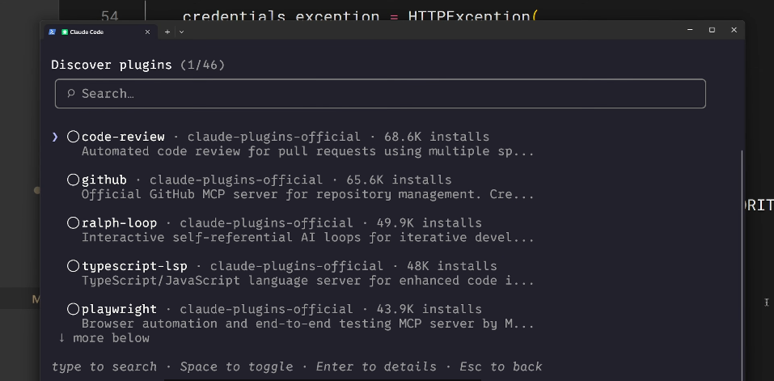
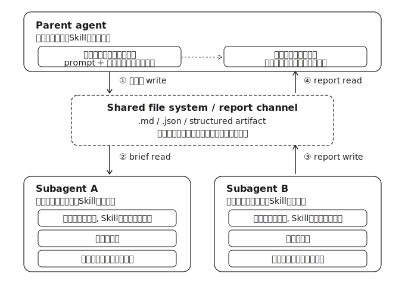

## Index {.regmonkey-index-slide-no-title}

::::: {.columns}



:::: {.column width="30%"}



:::: {.sidebar}

::::{.component-card-index .pl-4 .pr-4 .pt-1 .pb-6 .border-blue-500}

:::{.flex .items-center .mb-2}



### 学習目標

:::

- Skill共有の3手段の役割の違いを説明できる
- 自チーム・組織に適した配布手段を選べる
- Subagentに正しくSkillを紐付けられる

::::



::::{.component-card-index .pl-4 .pr-4 .pt-1 .pb-6 .border-blue-500}

:::{.flex .items-center .mb-2}



### 対象レベル

:::

- 個人でSkillを自作した経験がある開発者
- チーム・組織への展開を検討している運用担当

::::



::::{.component-card-index .pl-4 .pr-4 .pt-1 .pb-6 .border-blue-500}

:::{.flex .items-center .mb-2}



### 前提知識 & 必要環境

:::

- Skillの基本構造（SKILL.md・description）を理解している
- Git・プラグイン・Subagentの存在を知っている

::::

::::
::::

::: {.column width="70%" style="padding-left:0.5em;"}



::: {.regmonkey_index style="width:1200px; line-height: 1.2"}

```yaml
regmonkey_index:
  title_fontsize: 1.2em
  bullet_fontsize: 1.0em
  children:
    - title: 1. なぜSkillを共有するのか
      description:
        - 個人利用に留めると<strong>標準化・一貫性</strong>の効果が得られない
        - チーム・組織への展開で初めて運用価値が生じる
      width: [40, 60]
    - title: 2. リポジトリへのコミット
      description:
        - <code>.claude/skills</code> にコミットすればGit経由で<strong>自動配布</strong>
        - プロジェクト固有の標準・ワークフローに最適
      width: [40, 60]
    - title: 3. プラグイン経由
      description:
        - マーケットプレイス経由で<strong>リポジトリを跨いで配布</strong>
        - 汎用的な知識・コミュニティ向けに有効
      width: [40, 60]
    - title: 4. エンタープライズ Managed Settings
      description:
        - 組織管理者が<strong>最高優先度</strong>で全社配布
        - 強制したい標準・コンプライアンス用途
      width: [40, 60]
    - title: 5. SkillsとSubagentsの関係
      description:
        - Subagentは<strong>Skillを自動継承しない</strong>のが落とし穴
        - カスタムSubagentでは<code>skills:</code>に明示列挙が必要
      width: [40, 60]
```

:::
:::
:::::

# なぜSkillを共有するのか

## 共有して初めてSkillの運用価値が立ち上がる

[個人利用のSkillはレビューを助けるが，チーム共有で初めて標準化・一貫性が手に入る]{.h2-submessage}



:::{.info-box}

[共有が生む3つの効果]{.info-box-title}

:::{.info-contents .pl-5 .font-10 .lh-14}

- 個人で使うPRレビューSkillは便利だが，[**チーム全体の基準を揃える**]{.regmonkey-bold}には届かない
- 同じSkillを全員が使うことで，[**コードレビュー・スタイル・運用**]{.regmonkey-bold}が標準化される
- 結果としてレビュー結果の[**一貫性**]{.regmonkey-bold}が上がり，組織横断で同じ品質が保てる

:::

:::



[配布手段は3種類．スコープと優先度で使い分ける]{.mini-section}



::: {.regmonkey_index style="width:1600px; line-height: 1.2"}

```yaml
regmonkey_index:
  title_fontsize: 1.1em
  bullet_fontsize: 1.0em
  children:
    - title: リポジトリコミット
      description:
        - <strong>プロジェクト単位</strong>
        - Gitで自動配布される最もシンプルな手段
      width: [40, 60]
    - title: プラグイン
      description:
        - <strong>複数リポジトリ横断型</strong>．
        - マーケットプレイス経由でコミュニティ配布
      width: [40, 60]
    - title: エンタープライズ Managed Settings
      description:
        - <strong>組織全体</strong>
        - 最高優先度でポリシーを強制
      width: [40, 60]
```

:::

# 配布手段①：リポジトリへのコミット

## .claude/skills へのコミットがチーム共有の基本形

[Gitでの版管理に乗せるだけで，cloneしたメンバー全員が追加導入なしにSkillを使える]{.h2-submessage}



:::{.info-box}

[最もシンプルな共有方法]{.info-box-title}

:::{.info-contents .pl-5 .font-10 .lh-14}

- リポジトリ直下の `.claude/skills` 配下にSkillを配置：[**clone時に自動で読み込まれる**]{.regmonkey-bold}
- 更新を `git push` すれば，次の `git pull` でチーム全員に反映される
- `.claude` ディレクトリにはagents・hooks・skills・settingsが入り，[**通常のGitワークフロー**]{.regmonkey-bold}で版管理される

:::

:::



[向いているユースケース]{.mini-section}



:::{.font-09}

- チームのコーディング標準（言語・フレームワーク・命名規則）
- プロジェクト固有のワークフロー（リリース手順・PR作成手順など）
- リポジトリの[**コードベース構造に依存**]{.regmonkey-bold}するSkill

:::

# 配布手段②：プラグイン経由

## プラグインはリポジトリを跨いで配布する手段

[マーケットプレイスに登録すれば，他のチームや個人も自分のClaude Codeに導入できる]{.h2-submessage}



:::{.info-box}

[プラグインの構造と配布フロー]{.info-box-title}

:::{.info-contents .pl-5 .font-10 .lh-14}

- プラグインプロジェクトに `skills` ディレクトリを作る：[**`.claude` と同じ構造**]{.regmonkey-bold}でSkillを並べる
- 各Skillは独自フォルダを持ち，中に `SKILL.md` を置く
- マーケットプレイスへ配布すると，[**他ユーザーが自分のClaude Codeに導入**]{.regmonkey-bold}できる

:::

:::



:::: {.columns}
::: {.column width="50%"}

[向いているユースケース]{.mini-section}



:::{.font-09}

- 特定プロジェクトに依存しない[**汎用的な知識・手順**]{.regmonkey-bold}
- 自チーム以外のコミュニティメンバーにも価値があるSkill
- 例：言語別ベストプラクティス・テスト作法・図表生成のフォーマット

:::

:::
::: {.column width="50%"}



:::
::::

# 配布手段③：エンタープライズ Managed Settings

## 組織全体に最高優先度で強制配布する仕組み

[管理者がmanaged settings経由で配布したSkillは，個人・プロジェクト・プラグインを上書き]{.h2-submessage}



:::{.info-box}

[Managed Settings の特徴]{.info-box-title}

:::{.info-contents .pl-5 .font-10 .lh-14}

- 同名Skillが衝突した場合，managed settings経由のものが[**最高優先度**]{.regmonkey-bold}で上書きする
- ポリシー・コンプライアンス・セキュリティなど[**「絶対に守らせたい」標準**]{.regmonkey-bold}に向く
- `strictKnownMarketplaces` でプラグイン導入元を制限し，[**承認済みソースのみ**]{.regmonkey-bold}を許可できる

:::

:::



[strictKnownMarketplaces の設定例]{.mini-section}



:::{.font-12}

```json
"strictKnownMarketplaces": [
  { 
    "source": "github", 
    "repo": "acme-corp/approved-plugins" 
  },
  { 
    "source": "npm",
    "package": "@acme-corp/compliance-plugins" 
  }
]
```

:::


## 3つの配布手段は優先度・スコープで切り分ける

[個人ニーズはリポジトリへ，コミュニティ価値はプラグインへ，全社強制はManaged Settingsへ]{.h2-submessage}



::::{.custom-table style="width:100%; height:80%; font-size: 0.85em !important;"}
:::{.yaml2table .yaml2table-custom-top #yaml-distribution-summary data-col-widths="[20, 35, 45]"}

```yaml
record1:
  category: リポジトリ<br>コミット
  rule:
    - <span class="regmonkey-bold">プロジェクト単位</span>でGit経由配布．clone&pullで自動同期
  actions:
    - <code>.claude/skills</code> にSkillを置きコミット
    - チーム標準・プロジェクト固有ワークフローに最適
    - リポジトリ構造に依存するSkillはここに置く

record2:
  category: プラグイン<br>経由
  rule:
    - <span class="regmonkey-bold">複数リポジトリ跨ぎ</span>．マーケットプレイス経由で広域配布
  actions:
    - 独立したプラグインプロジェクトに <code>skills/</code> を作る
    - 各Skillは <code>SKILL.md</code> を含むフォルダに分ける
    - 汎用的・コミュニティ価値のあるSkill向け

record3:
  category: エンタープライズ<br>Managed Settings
  rule:
    - <span class="regmonkey-bold">組織全体・最高優先度</span>．個人・プロジェクト・プラグインを上書き
  actions:
    - 強制したい標準・コンプライアンス・セキュリティ用途
    - <code>strictKnownMarketplaces</code> で導入元を制限可能
    - 「<span class="regmonkey-bold">絶対に守らせたい</span>」基準のときに選ぶ
```

:::
::::

# SkillsとSubagentsの関係

## Subagentは親のSkillを自動継承しない

[親セッションでロード済みのSkillでも，Subagentは新しいコンテキストで起動するため引き継がれない]{.h2-submessage}



:::{.caution-box .font-10}

[落とし穴：Subagentでよくある誤解]{.info-box-title}

:::{.info-contents .pl-5 .lh-14}

- Subagentは[**まっさらなコンテキスト**]{.regmonkey-bold}で立ち上がる：「親で動くから子でも動くはず」という前提は[**通用しない**]{.regmonkey-bold}
- Skillは[**Subagent起動時に一括ロード**]{.regmonkey-bold}される：本セッションのオンデマンドとは挙動が違う
- サブエージェントはあくまで，[独立した検証・分析を担当]{.regmonkey-bold}する

:::

:::



[Subagent活用のメリット]{.mini-section}

- 専門領域ごとに[**作業を隔離して委譲**]{.regmonkey-bold}したいとき：本セッションのコンテキストを汚さずに済む
- フロントレビュアー・バックレビュアーのように[**異なるSkillセット**]{.regmonkey-bold}を持たせられる
- プロンプトに頼らず，[**標準を委譲作業に強制**]{.regmonkey-bold}できる：エージェント定義に組み込めば毎回適用される
- 意図しないSubagentsの起動を防ぐ


## 組み込みエージェントとカスタムエージェントの差

[組み込みエージェントはそもそもSkillを使えない．カスタムエージェントだけがSkillを宣言できる]{.h2-submessage}



:::::: {.columns}
::::: {.column width="50%"}

::::{.pentagon-box-500}

:::{.border-bottom-header-left}

組み込みエージェント

:::

:::{.squaredmark style="font-size: 0.9em"}

- 例：[**Explorer・Plan・Verify**]{.regmonkey-bold}
- Skillをロードする仕組みがそもそも[**存在しない**]{.regmonkey-bold}
  - 親セッションでロード済みでも継承されない
- 専門知識を補強したい場合，組み込みエージェントには委譲できない

[REMARKS]{.mini-section}

- 「組み込みエージェントにSkillを使わせたい」場合は，目的を満たす[**カスタムエージェントを自作する**]{.regmonkey-bold}しかない

:::

::::
:::::

::::: {.column width="50%"}

::::{.square-box-500}

:::{.border-bottom-header-left}

カスタムエージェント

:::

:::{.squaredmark style="font-size: 0.9em"}

- `.claude/agents` 配下に[**自分で定義する**]{.regmonkey-bold}エージェント
- frontmatterの `skills:` フィールドで[**ロードしたいSkillを明示**]{.regmonkey-bold}
- 列挙されたSkillだけが委譲時にロードされる
- フロント用・バック用などタスク別に[**異なるSkill構成**]{.regmonkey-bold}を組める



[REMARKS]{.mini-section}

- プロジェクトレベルのSubagentsは，ユーザーレベルのSubagentsよりも優先される

:::

::::
:::::
::::::

## カスタムエージェントへのSkill紐付け方法

[エージェント定義のfrontmatterに `skills:` フィールドを追加し，使わせたいSkill名を列挙する]{.h2-submessage}



:::{.info-box}

[紐付け手順の3ステップ]{.info-box-title}

:::{.info-contents .pl-5 .font-09 .lh-14}

- まず `.claude/skills` 配下にSkillを[**配置済み**]{.regmonkey-bold}であることを確認する
- `/agents` コマンドで対話的に作成するか，`.claude/agents` 配下にmarkdownファイルを直接書く
- frontmatterの[**`skills:` フィールド**]{.regmonkey-bold}に，ロードしたいSkill名をカンマ区切りで列挙する

:::

:::



[frontmatterの記述例]{.mini-section}



```yaml
---
name: frontend-security-accessibility-reviewer
description: "Use this agent when you need to review frontend code for accessibility..."
tools: Bash, Glob, Grep, Read, WebFetch, WebSearch, Skill
model: sonnet
color: blue
skills: accessibility-audit, performance-check
---
```



:::{.font-09}

- 委譲時にこのSubagentは `accessibility-audit` と `performance-check` を[**両方ロードした状態で起動**]{.regmonkey-bold}する
- レビュー対象が変わるたびに「Skillを思い出して」と指示する必要がない

:::

## エージェント間のコンテクスト共有Tips

[永続化されたファイル(`.md` / `.json`)を介した非同期通信に置き換えることでメモリを共有する]{.h2-submessage}


:::: {.columns}
::: {.column width="70%"}



:::

:::: {.column width="30%"}



:::: {.sidebar}

::::{.component-card-index .pl-4 .pr-4 .pt-1 .pb-6 .border-blue-500}

:::{.flex .items-center .mb-2}



### [自己完結性]{.padding-L-05}


:::

- 指示書だけで実行可能
- 前提・制約・成果物を明示的に記述する

::::



::::{.component-card-index .pl-4 .pr-4 .pt-1 .pb-6 .border-blue-500}

:::{.flex .items-center .mb-2}



### [構造化出力]{.padding-L-05}

:::

- スキーマを事前定義
- JSON / Markdown見出し等機械可読な形式を優先

::::



::::{.component-card-index .pl-4 .pr-4 .pt-1 .pb-6 .border-blue-500}

:::{.flex .items-center .mb-2}



### [追跡可能性]{.padding-L-05}

:::

- 入出力をファイル化
- 監査・再現・デバッグが後続工程で容易になる

::::

::::
::::
::::


## Summary



::::{.custom-table style="width:100%; height:80%; font-size: 0.8em !important;"}
:::{.yaml2table .yaml2table-custom-top #yaml-tidy-table data-col-widths="[20, 35, 45]"}

```yaml
record1:
  category: 共有の意義
  rule:
    - 個人利用ではなく<span class="regmonkey-bold">チーム・組織配布</span>で運用価値が立ち上がる
  actions:
    - 同じSkillを全員で使い，レビュー・スタイル・運用を標準化
    - 配布スコープと優先度で3手段を使い分ける

record2:
  category: リポジトリ<br>コミット
  rule:
    - <span class="regmonkey-bold">プロジェクト単位</span>．Git経由で自動配布される最もシンプルな手段
  actions:
    - <code>.claude/skills</code> にコミット．clone&pullで全員に反映
    - チーム標準・プロジェクト固有ワークフロー向け

record3:
  category: プラグイン<br>経由
  rule:
    - <span class="regmonkey-bold">複数リポジトリ跨ぎ</span>．マーケットプレイス経由で広域配布
  actions:
    - プラグインプロジェクトに <code>skills/</code> を作り <code>SKILL.md</code> を配置
    - 汎用的・コミュニティ価値のあるSkillに最適

record4:
  category: Managed<br>Settings
  rule:
    - 組織全体・<span class="regmonkey-bold">最高優先度</span>．個人・プロジェクト・プラグインを上書き
  actions:
    - 強制したい標準・コンプライアンス・セキュリティ用途
    - <code>strictKnownMarketplaces</code> でプラグイン導入元を制限

record5:
  category: SubagentsとSkill
  rule:
    - Subagentは<span class="regmonkey-bold">Skillを自動継承しない</span>．明示的な紐付けが必要
  actions:
    - 組み込みエージェント（Explorer・Plan・Verify）はSkill不可
    - カスタムエージェントの frontmatter に <code>skills:</code> を列挙
    - タスク別エージェント×専用Skillで標準を委譲作業に強制
```

:::
::::
