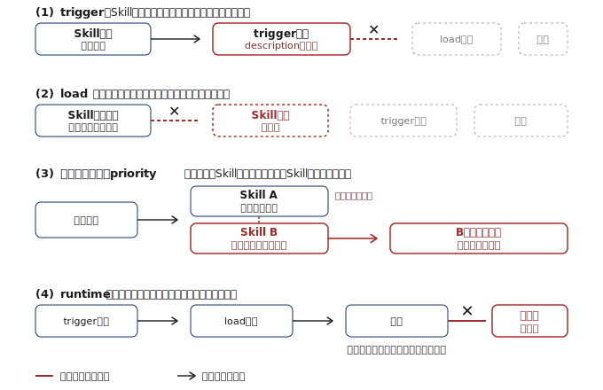

## Index {.regmonkey-index-slide-no-title}

::::: {.columns}



:::: {.column width="30%"}



:::: {.sidebar}

::::{.component-card-index .pl-4 .pr-4 .pt-1 .pb-6 .border-blue-500}

:::{.flex .items-center .mb-2}



### [学習目標]{.padding-L-05}

:::

- Skill不調を4カテゴリに切り分けて原因を特定できる
- Skills Validatorと`claude --debug`で構造・読込み問題を診断できる
- description調整・priority整理・runtime修正で復旧できる

::::



::::{.component-card-index .pl-4 .pr-4 .pt-1 .pb-6 .border-blue-500}

:::{.flex .items-center .mb-2}



### [対象レベル]{.padding-L-05}

:::

- Skillを自作・運用しており不具合に遭遇した開発者

::::



::::{.component-card-index .pl-4 .pr-4 .pt-1 .pb-6 .border-blue-500}

:::{.flex .items-center .mb-2}



### [前提知識 & 必要環境]{.padding-L-05}

:::

- Skillの基本構造（SKILL.md・description）を理解している
- 配布手段（プロジェクト・プラグイン・enterprise）の概要を把握

::::

::::
::::

::: {.column style="width:70%; padding-left:0.5em;"}



::: {.regmonkey_index style="width:1200px; line-height: 1.2"}

```yaml
regmonkey_index:
  title_fontsize: 1.2em
  bullet_fontsize: 1.0em
  children:
    - title: 1. トラブルは4カテゴリ<br>に分かれる
      description:
        - <strong>trigger / load / 重複 / runtime</strong>のどれかに収束する
        - カテゴリを先に当てれば対処手順が一意に決まる
      width: [40, 60]
    - title: 2. Skills Validator<br>から始める
      description:
        - 構造的な問題は<strong>デバッグ前に弾く</strong>のが定石
        - <code>claude --debug</code>で読込みエラーを補完
      width: [40, 60]
    - title: 3. trigger / load / 重複<br>の切り分け
      description:
        - 起動しない・読込まれない・他Skillが選ばれるの3症状
        - 大半は<strong>descriptionの書き方</strong>に帰着する
      width: [40, 60]
    - title: 4. Priorityとプラグイン特有<br>の症状
      description:
        - enterprise > project > personalの<strong>優先順位</strong>で上書きされる
        - プラグインSkillはcache再構築で復活することが多い
      width: [40, 60]
    - title: 5. Runtime errorsの<br>3点チェック
      description:
        - <strong>依存・実行権限・パス区切り</strong>を順に確認
        - SKILL.md冒頭にdependency情報を明記
      width: [40, 60]
```

:::
:::
:::::

# トラブル分類とSkills Validator

## Skill不調は4カテゴリのいずれかに収束する

[「動かない」を漠然と探さず，trigger / load / 重複 / runtimeのどれかに当てはめる]{.h2-submessage}



:::: {.columns}

::: {.column width="70%"}



:::

::: {.column width="30%"}



[切り分けの基本姿勢]{.mini-section}

:::{.font-09 .lh-14}

- 症状を4カテゴリのどれかに当てはめてから対処に進む：カテゴリが決まれば手順は一意
- 「動かない」「効かない」のような曖昧な記述で深追いしない：まず分類してから具体策へ

:::

:::

::::


## Skills Validatorで構造的な問題を先に弾く

[descriptionや実行ロジックを疑う前に，構造バリデーションでファイル配置・YAMLを確認する]{.h2-submessage}



:::{.info-box}

[最初に試すコマンド]{.info-box-title}

:::{.info-contents .pl-5 .font-10 .lh-14}

- `agent skills verifier` を導入：[**uv経由のインストールが最短**]{.regmonkey-bold}，`uv tool install skills-ref`
- Skillディレクトリ内，もしくは任意の場所から実行できる
- ファイル名・配置・YAML構造などの[**機械的に検出可能な不備**]{.regmonkey-bold}を先にすべて潰す

:::

:::



[validate コマンドの実行例]{.mini-section}



:::{.font-14}

```console
$ agentskills validate ./.claude/skills/regmonkey-slide-skill
Valid skill: .claude/skills/regmonkey-slide-skill
```

:::



:::{.font-09}

- `agentskills validate <skillパス>` で実行：成功時は `Valid skill: <パス>` のみ出力
- 構造OKでも動かない場合は `claude --debug` で[**Skill名を含むエラー行**]{.regmonkey-bold}を探し，trigger / load / 重複 / runtimeの切り分けに進む

:::

# trigger / load / 重複の切り分け

## Skillがtriggerしない時はdescriptionを疑う

[Skill選択 = 依頼文とdescriptionの意味マッチ．重なりが薄いと発火しない]{.h2-submessage}



:::{.caution-box}

[descriptionとユーザ語彙のズレを見直す]{.info-box-title}

:::{.info-contents .pl-5 .font-10 .lh-14}

- 自分が[**実際に発する依頼の言い回し**]{.regmonkey-bold}とdescriptionが意味的に重なっているか確認する
- ユーザが[**口にしそうなトリガーフレーズ**]{.regmonkey-bold}をdescriptionに足す
- `help me profile this` / `why is this slow?` / `make this faster` 等のバリエーションでテストする
- 発火しなかった表現の[**キーワードを追記**]{.regmonkey-bold}してセマンティックマッチの当たりを広げる

:::

:::



[NGパターン]{.mini-section}



:::{.font-09}

- description が抽象的・自己満足的：「コード品質を高めるSkill」だけだとマッチしない
- 動詞・対象・状況を含めて書き直す：「[**Pythonのプロファイリングを実施し，遅い処理を特定する**]{.regmonkey-bold}」のように具体化

:::

## Skillがloadしない時はSKILL.mdの構造を疑う

[`claude` の一覧に出てこない = Skillは読み込まれていない．配置とファイル名から確認する]{.h2-submessage}



:::{.caution-box}

[Skill読込み時の必須要件]{.info-box-title}

:::{.info-contents .pl-5 .font-10 .lh-14}

- SKILL.md は[**名前付きディレクトリの中**]{.regmonkey-bold}に置く：skillsルート直下に置いてはいけない
- ファイル名は厳密に `SKILL.md`：[**`SKILL` 大文字・`md` 小文字**]{.regmonkey-bold}を守る
- `claude --debug` で読込みエラーを表示し，[**Skill名を含むメッセージ**]{.regmonkey-bold}を確認する

:::

:::



[正しい配置例]{.mini-section}



:::{.font-14}

```text
.claude/skills/
├── code-review/
│   └── SKILL.md         ← OK：名前付きディレクトリ + 正確なファイル名
└── SKILL.md             ← NG：skillsルート直下に置かれている
```

:::

## 違うSkillが選ばれる時はdescriptionの差別化

[Claudeが似たSkillを取り違える，あるいは混乱する場合，description同士の意味が近すぎる]{.h2-submessage}



:::{.warning-box}

[descriptionは独立性を高める]{.info-box-title}

:::{.info-contents .pl-5 .font-10 .lh-14}

- 各Skillのdescriptionを[**互いに差別化**]{.regmonkey-bold}：守備範囲・対象・タイミングを書き分ける
- 「具体的に書く」ことは[**選ばれやすさ + 取り違え防止**]{.regmonkey-bold}の両方に効く
- 似た名前のSkillが既にある場合，差別化に失敗するとどちらか一方が常に勝つ

:::

:::



[書き分けの観点]{.mini-section}



:::{.font-09}

- 対象範囲：「Pythonコード全般」 vs 「Pandasデータフレーム操作」
- 起動タイミング：「PR作成時のレビュー」 vs 「実装中のリファクタ提案」
- 期待出力：「指摘リスト」 vs 「修正案を含む差分」

:::

# Priorityとプラグイン特有の症状

## 上位スコープのSkillに名前が衝突すると常に負ける

[個人Skillが無視される場合，同名のenterprise Skillが優先されているのが定番パターン]{.h2-submessage}



:::{.caution-box}

[Skill priorityの基本ルール]{.info-box-title}

:::{.info-contents .pl-5 .font-10 .lh-14}

- 同名Skillが複数スコープに存在する場合，[**enterprise > project > personal**]{.regmonkey-bold}の順で優先される
- 「enterpriseの`code-review`」と「個人の`code-review`」が並ぶと，[**enterprise側が必ず勝つ**]{.regmonkey-bold}
- 自分のSkillが反応しない時はまず同名Skillの存在を疑う

:::

:::



[対処の選択肢]{.mini-section}



:::{.font-09}

- [**Skill名を変更**]{.regmonkey-bold}してより独自性の高い名前にする：実務上はこれが最短
- 組織管理者にenterprise Skillの仕様・上書き可否について相談する
- 役割が同じなら統合，異なるなら名前で[**機能差を表現**]{.regmonkey-bold}し直す

:::

## プラグインSkillが現れない時はキャッシュを疑う

[インストール直後の不具合は環境状態の問題が多い．構造の問題はvalidatorで弾く]{.h2-submessage}



:::{.warning-box}

[復旧手順は3ステップ固定]{.info-box-title}

:::{.info-contents .pl-5 .font-10 .lh-14}

- [**キャッシュをクリア**]{.regmonkey-bold}する : `rm ~/.claude/plugins/cache`
- Claude Codeを[**再起動**]{.regmonkey-bold}する
- 該当プラグインを[**再インストール**]{.regmonkey-bold}する

:::

:::



[それでも見えない場合]{.mini-section}



:::{.font-09}

- プラグイン側の構造に不備がある可能性が高い：[**Skills Validatorの本領が活きる場面**]{.regmonkey-bold}
- プラグインの`skills/`ディレクトリ配下に，個別Skillが`SKILL.md`を持つフォルダで分かれているか確認する

:::

# Runtime errorsの3点チェック

## Runtime失敗は依存・権限・パスの3点で決まる

:::::{.hop-step-jump-container}
::::{.step .step-1}
:::{.step-number}
依存
:::
:::{.step-title}
Missing dependencies
:::
:::{.info-content}
- 外部パッケージ未インストールで失敗
- description冒頭に[**必要パッケージを明記**]{.regmonkey-bold}
- Claudeが事前に必要環境を判断できる
:::
::::
::::{.step .step-2}
:::{.step-number}
権限
:::
:::{.step-title}
Permission issues
:::
:::{.info-content}
- スクリプトに実行権限がない
- `chmod +x` を[**全スクリプトに適用**]{.regmonkey-bold}
- Skillが参照する全ファイルが対象
:::
::::
::::{.step .step-3}
:::{.step-number}
パス
:::
:::{.step-title}
Path separators
:::
:::{.info-content}
- Windowsでも[**forward slash**]{.regmonkey-bold}を使う
- バックスラッシュは互換性問題の温床
- Skill内のパス記述すべてに適用
:::
::::
:::::

## Quick Troubleshooting Checklist

::::{.custom-table style="width:100%; height:80%; font-size: 0.7em !important;"}
:::{.yaml2table .yaml2table-custom-top #yaml-troubleshoot-checklist data-col-widths="[20, 35, 45]"}

```yaml
record1:
  category: triggerしない
  rule:
    - <span class="regmonkey-bold">descriptionとユーザ語彙のズレ</span>が原因のほぼ全て
  actions:
    - 実際の依頼フレーズをdescriptionに反映
    - トリガーフレーズ・キーワードを追加
    - バリエーションでテストし発火を確認

record2:
  category: loadしない
  rule:
    - <span class="regmonkey-bold">配置・ファイル名・YAML</span>のいずれかが破綻
  actions:
    - 名前付きディレクトリ配下に <code>SKILL.md</code> を置く
    - ファイル名を <code>SKILL.md</code> に厳密一致させる
    - <code>claude --debug</code> でSkill名を含む行を確認

record3:
  category: 違うSkillが選ばれる
  rule:
    - description同士の<span class="regmonkey-bold">意味が近すぎる</span>
  actions:
    - 対象範囲・タイミング・出力で書き分ける
    - Skill名と説明から重複を解消
    - 統合可能なら1つにまとめる

record4:
  category: Priorityで負ける
  rule:
    - 上位スコープに<span class="regmonkey-bold">同名Skill</span>が存在
  actions:
    - Skill名を独自性の高い名前に変更
    - 管理者にenterprise Skillの扱いを相談
    - 役割の重複は機能差で名前に表現

record5:
  category: プラグイン未表示
  rule:
    - <span class="regmonkey-bold">キャッシュ・再起動・再インストール</span>で大半復旧
  actions:
    - キャッシュをクリア
    - Claude Codeを再起動
    - プラグインを再インストール．残ればvalidator

record6:
  category: Runtime失敗
  rule:
    - <span class="regmonkey-bold">依存・権限・パス</span>の3点を順に確認
  actions:
    - 必要パッケージをdescriptionに明記
    - <code>chmod +x</code> でスクリプトに実行権限
    - パス区切りは全環境でforward slashに統一
```

:::
::::
