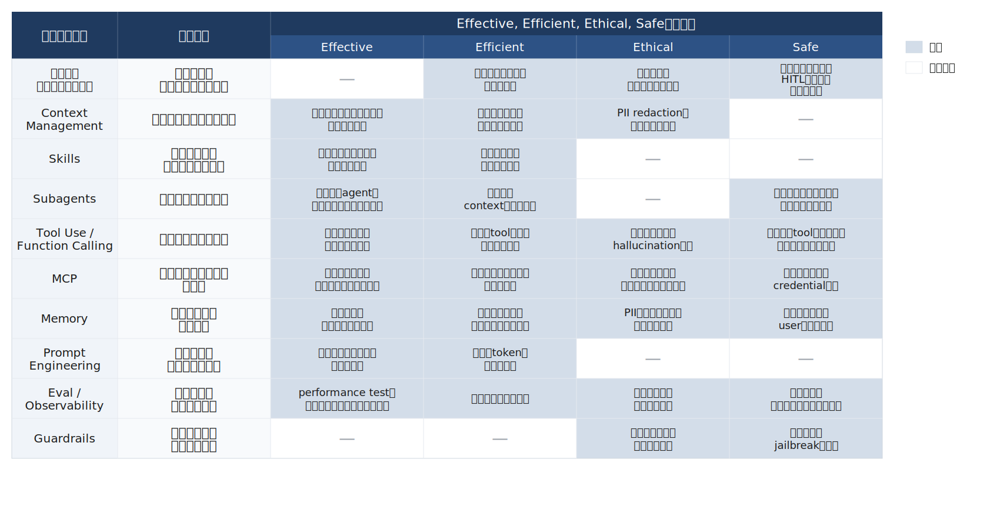

## Index {.regmonkey-index-slide-no-title}

::::: {.columns}



:::: {.column width="30%"}



:::: {.sidebar}

::::{.component-card-index .pl-4 .pr-4 .pt-1 .pb-6 .border-blue-500}

:::{.flex .items-center .mb-2}



### [学習目標]{.padding-L-05}

:::

- 4D Frameworkを自分の言葉で説明できる
- 業務をAIに切り分ける軸を持つ

::::



::::{.component-card-index .pl-4 .pr-4 .pt-1 .pb-6 .border-blue-500}

:::{.flex .items-center .mb-2}



### [対象レベル]{.padding-L-05}

:::

- AIを業務で使い始めているエンジニア
- claude-code等のコーディングエージェント利用者

::::



::::{.component-card-index .pl-4 .pr-4 .pt-1 .pb-6 .border-blue-500}

:::{.flex .items-center .mb-2}



### [前提知識]{.padding-L-05}

:::

- LLMの基本概念（生成・推論・コンテキスト）
- プロンプトを書いた経験

::::

::::
::::

::: {.column width="70%" style="padding-left:0.5em;"}
::: {.regmonkey_index style="width:1100px"}

```yaml
regmonkey_index:
  title_fontsize: 1.2em
  bullet_fontsize: 0.9em
  children:
    - title: 1. 導入：AccessとFluencyのギャップ
      description:
        - "AIへのアクセスは入口でしかなく，Fluencyへの到達には4観点の運用判断が要る"
        - "effective・efficient・ethical・safeを満たす状態を，個人技ではなくチームで再現できるかが軸"
      width: [45,55]
    - title: 2. 3つのインタラクション
      description:
        - "Automation・Augmentation・Agencyを段階で並べ，責任範囲・必要スキルを可視化する"
        - "無自覚にAgencyへ滑り込む事故を防ぐため，いま自分がどの様式にいるかを意識する"
      width: [45,55]
    - title: 3. 4D Framework
      description:
        - "Delegation・Description・Discernment・Diligenceの4能力で，AI協働の質を底上げする"
        - "4能力は独立ではなく相互に補完する関係"
      width: [45,55]
    - title: 4. Summary
      description:
        - "4D × 主原則 × 具体アクションの3列でスライド全体を俯瞰する"
        - "実務に持ち帰れる「次の一手」をDごとに1つずつ抜き出せる構成"
      width: [45,55]
```

:::
:::
:::::


# 導入：AccessとFluencyのギャップ

## "AIが使える"と"AIで成果を出せる"は別の能力
[ツールへのアクセスはスタート地点で，4Dの能力で初めて成果に変わる]{.h2-submessage}



:::::: {.columns}
::::: {.column width="50%"}

::::{.pentagon-box-500}

:::{.border-bottom-header-left}

Access：AIに触れている状態
:::

:::{.squaredmark style="font-size: 0.9em"}

- ChatGPT・claude-code・Copilotを開ける
- プロンプトを書けば応答が返る
- 使った気分にはなるが
  - 出力をそのまま貼って事故を起こす
  - どこに任せどこで手綱を握るかが定まらない
  - チームへ展開すると属人的にしか機能しない

:::

::::
:::::

::::: {.column width="50%"}

::::{.square-box-500}

:::{.border-bottom-header-left}

Fluency：AIで成果を出せる状態
:::

:::{.squaredmark style="font-size: 0.9em"}

- AIへの依頼判断と責任の引き受けが言語化されている
- 目的・制約・参考例を渡し出力を構造的に評価できる
- effective・efficient・ethical・safeの4観点で運用
- 個人技に閉じずチームへ移植できる
  - レビュー観点・チェックリスト・教え方として残せる

:::

::::
:::::
::::::


## AI Fluencyは4つの観点でAIと協働する能力



:::: {.def-block style="font-size:1.2em;"}

[AI Fluency（Dakan・Feller・Anthropic, 2025）]{.def-title}

::: {.def-contents}

AIシステムとのやり取りを **effective・efficient・ethical・safe** な状態に保ち続けるために必要な，相互に絡み合った能力・知識・洞察・価値観の集合

:::
::::



::::{.custom-table style="width:100%; font-size: 0.9em !important;"}
:::{.yaml2table .yaml2table-custom-top #yaml-fluency-4obs-table data-col-widths="[15, 30, 55]"}

```yaml
record1:
  観点: Effective
  問い:
    - 意図した成果に届いているか
  ポイント:
    - 目的に対して<span class="regmonkey-bold">出力が役に立っているか</span>を測れる
    - 「らしい応答」と「正しい応答」を切り分ける

record2:
  観点: Efficient
  問い:
    - 時間とコストに見合うか
  ポイント:
    - 自分でやったほうが速い領域を<span class="regmonkey-bold">見極める</span>
    - トークン・レビュー時間を含めた総工数で判断

record3:
  観点: Ethical
  問い:
    - 他者と社会への影響は許容できるか
  ポイント:
    - 著作権・誤情報・差別的出力を<span class="regmonkey-bold">事前に潰す</span>
    - 顧客データ・個人情報の境界を引く

record4:
  観点: Safe
  問い:
    - 自分とプロジェクトを守れているか
  ポイント:
    - 破壊的操作・本番反映の前にゲートを置く
    - AI出力の最終責任は<span class="regmonkey-bold">人間にある</span>と認識する
```

:::
::::

## AI協働の実装層: どの技術がどの観点を支えるか



:::{style="position:absolute; left:0; right:0; width:1700px; text-align:center;"}

{width="100%"}

:::


# AIとの関わり方：3つの様式

## AIとの関わり方には3つの様式がある
[Automation・Augmentation・Agencyを意識的に使い分ける]{.h2-submessage}



:::{.info-box}

:::{.info-contents .font-10 .padding-L-05 .lh-12}



- 同じAIでも， [どの様式で関わるかによって責任範囲・必要スキルが変わる]{.regmonkey-bold}
- エンジニアは3様式を [意識的に使い分け]{.regmonkey-bold} ，無自覚にAgencyへ滑らないようにする

:::

:::



:::::{.hop-step-jump-container style="height:60%;"}

::::{.step .step-1}
:::{.step-number}
Automation
:::
:::{.step-title}
AIに作業を実行させる
:::
:::{.info-content}

- 仕様を明示した上で，AIが [指示どおりに作業]{.regmonkey-bold} を完了させる
- 例：定型コードの生成・テストケースの量産
- 責任の重心は [指示を出す側]{.regmonkey-bold} に残る

:::
::::

::::{.step .step-2}
:::{.step-number}
Augmentation
:::
:::{.step-title}
AIと一緒に考える
:::
:::{.info-content}

- 人間とAIが [思考のパートナー]{.regmonkey-bold} として往復する
- 例：設計案のレビュー・トレードオフの整理
- 自分の知識量がAI出力の [評価精度を決める]{.regmonkey-bold}

:::
::::

::::{.step .step-3}
:::{.step-number}
Agency
:::
:::{.step-title}
AIを設定して任せる
:::
:::{.info-content}

- AIが [独立して将来の作業]{.regmonkey-bold} を遂行できるよう構成する
- 例：エージェントを常駐させ定期的にレビューさせる
- 設計者は [振る舞いと境界を事前に定める責任]{.regmonkey-bold} を負う

:::
::::

:::::


# 4D Framework

## 4D Frameworkは4つの能力で構成される
[Delegation・Description・Discernment・Diligenceは互いに支え合う]{.h2-submessage}



:::: {.info-box style="font-size: 1.1em;"}

[4D Framework]{.info-box-title}

::: {.info-contents .pl-5 .lh-12}

- 4つの能力は [独立ではなく相互に支え合う]{.regmonkey-bold} 関係にある
- どれか1つが欠けると，AIとの協働は不安定になる

:::
::::



::::{.custom-table style="width:100%; font-size: 0.9em !important;"}
:::{.yaml2table .yaml2table-custom-top #yaml-4d-overview-table data-col-widths="[18, 27, 55]"}

```yaml
record1:
  能力: ① Delegation
  役割:
    - 何をAIに任せるか決める
  ポイント:
    - ゴール設定と関わり方の選択を担う
    - 「自分でやる・AIと組む・AIに任せる」の<span class="regmonkey-bold">切り分け</span>

record2:
  能力: ② Description
  役割:
    - 意図を伝える
  ポイント:
    - 目的・制約・参考例を渡し，出力を<span class="regmonkey-bold">予測可能にする</span>
    - 「良い例・悪い例」のセットで指示の解像度を上げる

record3:
  能力: ③ Discernment
  役割:
    - 出力を見極める
  ポイント:
    - AIの出力と振る舞いを<span class="regmonkey-bold">批判的に評価</span>する
    - 自分の知識量が評価精度の上限を決める

record4:
  能力: ④ Diligence
  役割:
    - 責任を持って関わる
  ポイント:
    - Creation・Transparency・Deploymentの<span class="regmonkey-bold">3観点で倫理と安全を担保</span>
    - 「AIが言った」は責任放棄の言い訳にならない
```

:::
::::


## Delegation：3つの認識でAIへの任せ方を決める
[Problem Awareness × Platform Awareness × Task Delegationを揃える]{.h2-submessage}



:::: {.info-box style="font-size: 1.1em;"}

[ドメイン知識とAI理解の両輪が判断の質を決める]{.info-box-title}

::: {.info-contents .pl-5 .lh-12}

- Delegationの目的は「すべて自動化する」ことではなく， [人とAIの強みを活かす最適な分担]{.regmonkey-bold} を設計すること
- 自分の業務理解とAIの能力理解の両方が揃って初めて， [何を任せ，何を残すか]{.regmonkey-bold} を判断できる

:::
::::



::: {.regmonkey_index style="width:1500px"}

```yaml
regmonkey_index:
  title_fontsize: 1.2em
  bullet_fontsize: 0.9em
  children:
    - title: 1. Problem Awareness<br>（課題の認識）
      description:
        - "達成したいゴールと，そこに至るまでの<strong>作業の構造</strong>を言語化する"
        - "「ドラフト作成・リサーチ・最終判断」のように分解できないと，任せる単位が決まらない"
      width: [35,65]
    - title: 2. Platform Awareness<br>（AIの能力認識）
      description:
        - "利用可能なAIシステムの<strong>得意領域・限界・運用コスト</strong>を把握する"
        - "コーディングエージェント・チャットLLM・RAG・自律エージェントで適性が異なる"
      width: [35,65]
    - title: 3. Task Delegation<br>（戦略的な分配）
      description:
        - "<strong>判断・責任・戦略</strong>は人に残し，反復・展開・初稿生成をAIに渡す"
        - "Automation・Augmentation・Agencyのどの様式で関わるかも併せて決める"
      width: [35,65]
```

:::


## Description：6つの要素を渡せば指示の解像度が上がる
[抽象語ではなく要素分解で渡し，特に「悪い例」を添える]{.h2-submessage}



::: {.regmonkey_index style="width:1500px"}

```yaml
regmonkey_index:
  title_fontsize: 1.2em
  bullet_fontsize: 0.9em
  children:
    - title: 1. 目的
      description:
        - "AIが達成すべきゴールを1文で渡す"
        - "例：「既存顧客の再購入促進」「休眠顧客の掘り起こし」"
      width: [30,70]
    - title: 2. 対象（ペルソナ）
      description:
        - "年齢・関心・購買履歴・課題を<strong>具体</strong>に書き下す"
        - "「ユーザー」より「30代・育児中・時間不足が課題」のように粒度を上げる"
      width: [30,70]
    - title: 3. トーン
      description:
        - "「親しみやすいが過度にカジュアルではない」のようにブランド規範を渡す"
        - "<strong>避ける表現</strong>の例も併せると逸脱が減る"
      width: [30,70]
    - title: 4. 構造的制約
      description:
        - "件名は何文字以内・本文は何ワード・CTAは1つ など出力フォーマットを枠で縛る"
        - "枠を渡さないと、AIは「らしい長さ」に落ちる"
      width: [30,70]
    - title: 5. 成功基準
      description:
        - "開封率○％・CTR○％・コンバージョン○件 など定量で渡す"
        - "評価軸を共有しないと品質判断が定まらない"
      width: [30,70]
    - title: 6. 参考例
      description:
        - "良い例と<strong>悪い例</strong>を対で提示する"
        - "「こういうのはNG」の提示は、抽象的な指示よりはるかに効く"
      width: [30,70]
```

:::


## Discernment：出力・過程・振る舞いを3観点で見極める



:::: {.info-box style="font-size: 1.1em;"}

[LLMの性能差以上に，ユーザーの評価能力差が品質を決める]{.info-box-title}

::: {.info-contents .pl-5 .lh-12}

- 実運用では「LLM能力」よりも「ユーザー側のドメイン知識による出力制御能力」が品質上限を決める
- 未知領域では，生成コストより検証コストが支配的になり，Description と Discernment の反復が必要になる
- AI活用では「何を生成できるか」だけでなく，「何を疑えるか」が重要になる

:::
::::



::: {.regmonkey_index style="width:1600px"}

```yaml
regmonkey_index:
  title_fontsize: 1.2em
  bullet_fontsize: 0.9em
  children:
    - title: 1. Product Discernment<br>（出力の質）
      description:
        - "<strong>正確性・適切性・整合性・関連性</strong>の4軸で出力そのものを評価する"
        - "「らしい応答」と「正しい応答」を切り分け，ハルシネーションを見抜く"
      width: [35,65]
    - title: 2. Process Discernment<br>（過程の妥当性）
      description:
        - "AIが<strong>どう推論したか</strong>を点検：論理飛躍・観点の抜け・不適切な前提を疑う"
        - "結論が合って見えても，前提が誤っていれば下流で破綻する"
      width: [35,65]
    - title: 3. Performance Discernment<br>（Agent挙動の適切さ）
      description:
        - "対話中の<strong>コミュニケーション様式</strong>が自分の用途に合うかを評価する"
        - "冗長・追従的・断定的な応答は，協働の質を下げる兆候として扱う"
      width: [35,65]
```

:::


## Diligence：3観点で責任ある協働を実装する
[Creation・Transparency・Deploymentで倫理と安全を担保する]{.h2-submessage}



:::: {.info-box style="font-size: 1.1em;"}

[他の3DはEffective・Efficient，DiligenceはEthical・Safeを担う]{.info-box-title}

::: {.info-contents .pl-5 .lh-12}

- 文脈（個人・学術・業務）ごとに，開示と検証への期待値は異なる
- 期待値を理解し満たす責任は，<strong>使う側（=人間側）にある</strong>

:::
::::



::: {.regmonkey_index style="width:1500px"}

```yaml
regmonkey_index:
  title_fontsize: 1.1em
  bullet_fontsize: 0.9em
  children:
    - title: 1. Creation Diligence<br>（協働の入り口）
      description:
        - "<strong>どのAIシステムを使い・どう関わるか</strong>を意図的に選ぶ"
        - "用途・データ感度・能力特性に合わせ，モデル・契約・運用ラインを使い分ける"
        - "<strong>悪い例</strong>：機密データを無償汎用LLMに貼る → 学習データ化と情報流出のリスク"
      width: [30,70]
    - title: 2. Transparency Diligence<br>（協働の見える化）
      description:
        - "AIが関与した事実を<strong>知る必要のある人すべて</strong>に開示する"
        - "個人・学術・業務など文脈ごとに開示の粒度と検証の期待値は異なる"
        - "<strong>悪い例</strong>：個人で使い黙って成果物に統合 → 後追いで疑念が走り信頼が崩れる"
      width: [30,70]
    - title: 3. Deployment Diligence<br>（協働の出口）
      description:
        - "共有・公開する出力は<strong>自分で検証し保証する</strong>責任を引き受ける"
        - "正確性・著作権・引用元を確認してから配信判断する"
        - "<strong>悪い例</strong>：誤情報をそのまま発信 → 「AIが言った」は責任放棄の言い訳にならない"
      width: [30,70]
```

:::


## Summary



::::{.custom-table style="width:100%; height:80%; font-size: 0.9em !important;"}
:::{.yaml2table .yaml2table-custom-top #yaml-summary-table data-col-widths="[15, 30, 55]"}

```yaml
record1:
  category: Delegation
  rule:
    - <span class="regmonkey-bold">Problem・Platform・Task</span>の3観点で任せ方を決める
  actions:
    - Problem Awareness：ゴールと作業の構造を言語化する
    - Platform Awareness：AIシステムの得手不得手を把握する
    - Task Delegation：判断・責任・戦略は人，反復・展開はAIに渡す

record2:
  category: Description
  rule:
    - <span class="regmonkey-bold">6つの要素</span>に分解して指示する
  actions:
    - 目的・対象・トーン・制約・成功基準・参考例を渡す
    - 「悪い例」を必ず添える
    - 抽象指示と具体例の両方を併走させる

record3:
  category: Discernment
  rule:
    - <span class="regmonkey-bold">自分の知識量</span>が評価精度の上限を決める
  actions:
    - 既知領域では誤りを即時に見抜く
    - 未知領域では教科書・1次資料で裏取り
    - 固有名詞・数値・年代は幻覚を疑う

record4:
  category: Diligence
  rule:
    - <span class="regmonkey-bold">Creation・Transparency・Deployment</span>の3観点で責任を担保する
  actions:
    - Creation：用途とデータ感度に合うAIシステムを選ぶ
    - Transparency：AI関与の事実を知る必要のある人に開示する
    - Deployment：共有・公開する出力は自分で検証し保証する
```

:::
::::

# Appendix{.no-auto-agenda}

## Planning and delegation
[プロジェクト選定→ビジョン化→分担設計の3段で精度を積む]{.h2-submessage}



:::: {.info-box style="font-size: 1.05em;"}

[3段は次の入力を作るための連続作業]{.info-box-title}

::: {.info-contents .pl-5 .lh-12}

- 各ステップは [次の入力を準備する作業]{.regmonkey-bold} ：選定が雑だとビジョンが具体化せず，ビジョンが薄いと分担が機械的になる
- 各ステップは [Claudeとの対話を介して言語化する]{.regmonkey-bold} ：単独で書こうとせず質問を投げ返してもらう

:::
::::



:::::{.hop-step-jump-container style="height:55%;"}

::::{.step .step-1}
:::{.step-number}
Step 1
:::
:::{.step-title}
題材を1つ選定する
:::
:::{.info-content}

- 1時間で着地できる [中規模・多段階のプロジェクト]{.regmonkey-bold} を1つ選ぶ
- 選定軸：複数のタスク種を含む・期限内に完結する・自分の関心がある
- 選定後は他の候補をいったん閉じ [題材を1つに絞る]{.regmonkey-bold}

:::
::::

::::{.step .step-2}
:::{.step-number}
Step 2
:::
:::{.step-title}
成功条件を言語化する
:::
:::{.info-content}

- Claudeに [質問を投げ返してもらいながら]{.regmonkey-bold} ビジョンを詰める
- 「完成形は何か」「自分にとっての価値は何か」の2問は必ず答える
- 出力は [誰が読んでも同じ完成像が描ける]{.regmonkey-bold} 1段落の説明

:::
::::

::::{.step .step-3}
:::{.step-number}
Step 3
:::
:::{.step-title}
タスク分解と分担を決める
:::
:::{.info-content}

- 主要タスクごとに [人の強み・AIの強み・協働の強み]{.regmonkey-bold} を1つずつ整理
- Automation・Augmentation・Agencyのどの様式で関わるかも併せて決める
- 完成した分担表は [後続のDescription演習で再利用する]{.regmonkey-bold}

:::
::::

:::::


## Description–Discernment Loop
[明確に「伝える」3軸と正しく「見極める」3軸を反復で噛み合わせる増幅装置]{.h2-submessage}



:::: {.info-box style="font-size: 1.05em;"}

[ループの本質：対の3軸を同時に鍛える]{.info-box-title}

::: {.info-contents .pl-5 .lh-12}

- 「[何をどう作ってほしいか]{.regmonkey-bold}」を伝え（Description），返ってきた成果物を [多角的に評価]{.regmonkey-bold} し（Discernment），フィードバックで反復する協働ワークフロー
- 自分が [評価できないものは指示できず]{.regmonkey-bold} ，言語化できない期待は評価基準にもならないため，2スキルは [対で鍛える]{.regmonkey-bold}
- サイクル：Describe → AI生成 → Discern → Refine → [Integrate（人間が意思決定責任を引き受ける）]{.regmonkey-bold}

:::
::::



::::{.custom-table style="width:100%; font-size: 0.85em !important;"}
:::{.yaml2table .yaml2table-custom-top #yaml-dd-loop-table data-col-widths="[16, 42, 42]"}

```yaml
record1:
  観点: Product
  Description（伝える）:
    - フォーマット・スタイル・長さ・詳細度を<span class="regmonkey-bold">具体化</span>
    - 例：「2,000字・見出し3つ・結論を冒頭」
  Discernment（見極める）:
    - 要件充足・<span class="regmonkey-bold">正確性・有用性</span>を点検
    - 出力そのものの質を直接評価する

record2:
  観点: Process
  Description（伝える）:
    - フレームワーク・参照方法論・<span class="regmonkey-bold">踏むべき手順</span>を指定
    - 例：「前提整理 → 反対意見 → 統合的結論」
  Discernment（見極める）:
    - 指示した手順を踏んだか・<span class="regmonkey-bold">論理は妥当か</span>
    - 観点の抜け・前提の不適切を疑う

record3:
  観点: Performance
  Description（伝える）:
    - 簡潔か詳細か・挑戦的か支援的かなど<span class="regmonkey-bold">スタンス</span>を指定
    - 例：「同意せず弱点を積極的に指摘して」
  Discernment（見極める）:
    - 詳しすぎ・<span class="regmonkey-bold">迎合的すぎ</span>でないか
    - 必要な反論をしてくれたかを評価する
```

:::
::::


## ループの5ステップを反復することで精度が積み上がる
[Describe → AI生成 → Discern → Refine → Integrate を，一往復で終わらせず満足するまで回す]{.h2-submessage}



:::::::::{.shannon-model .font-09}

::::{.shannon-component}
[① 入力]{.shannon-process-tag}



:::{.shannon-icon-box}
<i class="fa-solid fa-pen-to-square"></i>
:::

[Describe]{.shannon-label}



:::{.shannon-annotation-box}

- 3観点で指示
- 期待を明確化

:::

::::

:::{.shannon-arrow}



<i class="fa-solid fa-arrow-right"></i>

:::

::::{.shannon-component}
[② 生成]{.shannon-process-tag}



:::{.shannon-icon-box}
<i class="fa-solid fa-robot"></i>
:::

[AI生成]{.shannon-label}



:::{.shannon-annotation-box}

- 成果物が返る
- 乖離を含む

:::

::::

:::{.shannon-arrow}



<i class="fa-solid fa-arrow-right"></i>

:::

::::{.shannon-component}
[③ 評価]{.shannon-process-tag}



:::{.shannon-icon-box}
<i class="fa-solid fa-magnifying-glass-chart"></i>
:::

[Discern]{.shannon-label}



:::{.shannon-annotation-box}

- 3観点で評価
- 質を見極める

:::

::::

:::{.shannon-arrow}



<i class="fa-solid fa-arrow-right"></i>

:::

::::{.shannon-component}
[④ 調整]{.shannon-process-tag}



:::{.shannon-icon-box}
<i class="fa-solid fa-arrows-rotate"></i>
:::

[Refine]{.shannon-label}



:::{.shannon-annotation-box}

- 機能点を整理
- 指示を再調整

:::

::::

:::{.shannon-arrow}



<i class="fa-solid fa-arrow-right"></i>

:::

::::{.shannon-component}
[⑤ 統合]{.shannon-process-tag}



:::{.shannon-icon-box}
<i class="fa-solid fa-user-check"></i>
:::

[Integrate]{.shannon-label}



:::{.shannon-annotation-box}

- 専門知識を加える
- 意思決定責任

:::

::::

:::::::::

:::{.shannon-overview-arrow .font-12}
<div class="shannon-overview-arrow-head" style="border-left: none; border-right: 10px solid #0e3666;"></div><div class="shannon-overview-arrow-line"></div><div class="shannon-overview-arrow-text">満足できる結果になるまで反復し精度を上げる対話</div><div class="shannon-overview-arrow-line"></div>
:::



:::: {.info-box style="font-size: 1.0em;"}

[反復が前提：一往復で完結させない]{.info-box-title}

::: {.info-contents .pl-5 .lh-12}

- ④ Refine が起点となり [Description を再調整]{.regmonkey-bold} して① に戻る → フィードバック駆動の対話
- ⑤ Integrate で [人間が最終意思決定者]{.regmonkey-bold} を引き受ける（AIに判断を委ねる仕組みではなく増幅装置）

:::
::::
