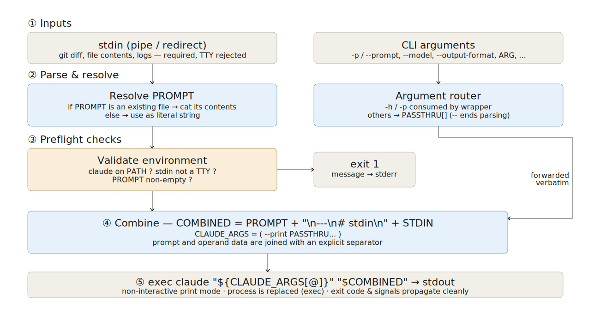

# はじめに

## claude-stdin-prompt とは

[stdin と prompt を結合し `claude --print` に流す bash ラッパー]{.h2-submessage}



:::{.info-box}



:::{.info-contents .font-10 .padding-L-05 .lh-12}

- `claude-stdin-prompt` は[**pipe で受けたデータと prompt を1つに結合し，`claude --print` に渡すシェルスクリプト**]{.regmonkey-bold}
- `-p`/`--prompt` 以外の全フラグ（`--model`・`--output-format`・`--debug` 等）はそのまま claude へ転送
- `prompt` の値が[**既存ファイルパスならその中身**]{.regmonkey-bold}を，そうでなければリテラル文字列をプロンプトとして使用
- stdin が TTY（対話端末）だと起動拒否：必ず pipe か redirect で材料を渡す前提

:::

:::



[基本形]{.mini-section}



:::{.font-12}

```bash
# git diff をネタに commit message を生成
git diff --cached | claude-stdin-prompt --model sonnet -p "commit message を作成してください"

# memo.md を要約
claude-stdin-prompt -p "要約して" < memo.md
```

:::

## なぜラッパーが必要か

[`claude --print` の引数結合・stdin 連携の煩雑さを Unix 流に整理]{.h2-submessage}



:::::: {.columns}
::::: {.column width="50%"}

::::{.pentagon-box-500}

:::{.border-bottom-header-left}
`claude --print` 単体運用の課題
:::

:::{.squaredmark style="font-size: 0.85em"}

- prompt と入力データを毎回[**1つの引数文字列に詰め直す**]{.regmonkey-bold}必要
  - shell escape・改行・バッククォートに気を使う
- 「指示は引数・データはパイプ」という Unix 流の[**書き分けが直接できない**]{.regmonkey-bold}
- ステージ済み diff やログを流す場面で[**変数経由のコマンド合成**]{.regmonkey-bold}が必須となり可読性低下
- prompt をファイル化したい場合，毎回 `$(cat prompts/x.md)` の手書きが必要

:::

::::
:::::

::::: {.column width="50%"}

::::{.square-box-500}

:::{.border-bottom-header-left}
`claude-stdin-prompt` が提供する解決
:::

:::{.squaredmark style="font-size: 0.85em"}

- stdin を読み，prompt の後ろに[**自動で連結**]{.regmonkey-bold}し `claude --print` に exec
- prompt 引数が[**既存ファイルなら自動で中身に展開**]{.regmonkey-bold}
- TTY からの誤実行をブロック：必ず pipe・redirect 強制
- claude の全オプションは[**素通しで転送**]{.regmonkey-bold}：機能を失わない
- 結果として `cmd | claude-stdin-prompt -p "指示"` の[**ワンライナー化**]{.regmonkey-bold}が成立

:::

::::
:::::
::::::


# 使い方

## 基本的な使い方

[位置引数または `-p` で指示を渡し，stdin で材料を流す]{.h2-submessage}



:::{.info-box}

:::{.info-contents .font-10 .padding-L-05 .lh-12}

- `claude-stdin-prompt` は[**指示（prompt）と材料（stdin）を分離**]{.regmonkey-bold}して受け取る
- stdin が空・TTY のとき，あるいは prompt 未指定のときは[**起動を拒否**]{.regmonkey-bold}してエラー終了
- claude のオプションはすべて[**そのまま転送**]{.regmonkey-bold}されるので `claude --help` の機能をそのまま利用可

:::

:::



:::: {.columns}
::: {.column width="50%"}

[Usage]{.mini-section}



:::{.font-12}

```bash
# commit メッセージ生成
git diff --cached | claude-stdin-prompt \
  --model sonnet -p "commit message を作成して"

# prompt をファイルから読み込み
claude-stdin-prompt --model opus \
  -p prompts/review.md < diff.patch

# release note を JSON 形式で
git log -n 20 | claude-stdin-prompt \
  --output-format json -p "リリースノート作成"

# 位置引数として prompt を渡す
cat data.csv | claude-stdin-prompt \
  --model sonnet "外れ値を指摘して"
```

:::

:::
::: {.column width="50%"}

[claude 標準のみで書いた等価形]{.mini-section}



:::{.font-12}

```bash
# stdin と prompt を自前で結合する必要がある
PROMPT="commit message を作成して"
INPUT="$(git diff --cached)"

claude --print --model sonnet "${PROMPT}

---
# stdin
${INPUT}"
```

:::



[REMARKS]{.mini-section}

:::{.padding-L-10 .font-09}

- 変数経由・heredoc・引用符に気を使う必要が消える
- ラッパー側でエラー検出（TTY・prompt 欠如）も担保

:::

:::
::::

## オプション体系：ラッパー所有 vs claude 転送

[wrapper が消費するのは2種類のみ・残りは claude --help の全機能をそのまま利用可]{.h2-submessage}



:::: {.columns}
::: {.column width="48%"}

[ラッパーが消費するオプション]{.mini-section}



:::{.font-09}

| Option | 説明 |
|:-------|:-----|
| `-p`, `--prompt <text\|file>` | プロンプト文字列・またはプロンプトファイルパス |
| `-h`, `--help` | ヘルプ表示 |
| `--` | 以降を claude へ verbatim 転送 |

:::



[REMARKS]{.mini-section}

:::{.padding-L-10 .font-09}

- 真偽値フラグの直後に裸の位置引数を置くと[**flag の値**]{.regmonkey-bold}と誤解される場合あり
- 曖昧さは `-p` を明示するか `--` で区切ると解消
  - 例：`claude-stdin-prompt --debug -p "PROMPT"`

:::

:::
::: {.column width="52%"}

[claude へ素通しされるオプション例]{.mini-section}



:::{.font-09}

| Option | 用途 |
|:-------|:-----|
| `--model sonnet\|opus\|haiku-...` | モデル選択 |
| `--output-format json\|text` | 出力フォーマット |
| `--append-system-prompt <text>` | system prompt 追記 |
| `--add-dir <path>` | 参照ディレクトリ追加 |
| `--max-budget-usd <N>` | 予算上限 |
| `--json-schema <path>` | 出力スキーマ強制 |
| `--debug` | デバッグログ表示 |

:::



:::{.padding-L-10 .font-09}

- 全リストは `claude --help` を参照
- 未知のフラグは[**フラグ＋次の非フラグ引数を1組にして転送**]{.regmonkey-bold}するヒューリスティクスで処理

:::

:::
::::

## 動作フロー：stdin と prompt の合流

[4ステップで「pipe された材料 + 指示」を `claude --print` に exec]{.h2-submessage}



:::{.info-box}

:::{.info-contents .font-10 .padding-L-05 .lh-12}

1. **オプション解析**：`-h`/`-p` を消費，他は `PASSTHRU` 配列に転送用として蓄積
2. **prompt 解決**：値が既存ファイルなら `cat` で中身に展開，そうでなければリテラル文字列
3. **stdin 取り込み**：TTY なら即エラー終了．それ以外は `cat` で全量読み込み
4. **claude 起動**：`exec claude --print [PASSTHRU...] "<combined>"`（プロセス置換でシェル離脱）

:::

:::



[claude へ渡される最終的な引数文字列]{.mini-section}



:::{.font-12}

```text
<PROMPT 本文>

---
# stdin
<STDIN の内容>
```

:::



:::{.padding-L-10 .font-09}

- 区切りは `---` ＋ Markdown 見出し `# stdin`：claude 側がプロンプトとデータを文脈的に区別しやすい
- claude 側のレスポンスは[**そのまま stdout**]{.regmonkey-bold}に流れる：パイプ後段で `jq` 等にも繋げられる

:::


# ユースケース

## ① Commit メッセージ生成：staged diff を要約しコミットまで

[ノートブック JSON diff のノイズから実質的な変更点だけを抽出し，そのまま `git commit` へ]{.h2-submessage}



:::{.info-box}

:::{.info-contents .font-10 .padding-L-05 .lh-12}

- ノートブック差分は[**JSON のノイズが多く `update notebook` のような雑メッセージ**]{.regmonkey-bold}になりがち
- claude に要約を任せると `feat(eda): 売上の曜日効果を可視化` のような[**実質的な変更点**]{.regmonkey-bold}を抽出可能
- 出力を pipe で `git commit -F -` に直結すれば[**メッセージ手書き不要**]{.regmonkey-bold}でワンライン化

:::

:::



:::: {.columns}
::: {.column width="55%"}

[Pipeline：diff → 要約 → コミット]{.mini-section}



:::{.font-12}

```bash
# 標準ルート：そのままコミット
git diff --cached \
  | claude-stdin-prompt --model sonnet \
      -p prompts/commit.md \
  | git commit -F -

# 確認したい場合は tee で分岐
git diff --cached \
  | claude-stdin-prompt --model sonnet \
      -p prompts/commit.md \
  | tee /tmp/last-commit-msg.txt \
  | git commit -F -
```

:::

:::
::: {.column width="45%"}

[`prompts/commit.md` の例]{.mini-section}



:::{.font-12}

```text
あなたは Conventional Commits の専門家です．
以下のステージ済み diff を分析し，
1行のコミットメッセージのみ出力してください．

- 形式: <type>(<scope>): <summary>
- type: feat/fix/refactor/docs/test/chore
- scope: 主要な変更モジュール
- 50字以内・命令形・末尾ピリオドなし
```

:::



[REMARKS]{.mini-section}

:::{.padding-L-10 .font-09}

- `--output-format text`（既定）の出力は[**そのまま下流コマンドの引数**]{.regmonkey-bold}に流せる
- prompt はファイル化しチーム共通規約として共有

:::

:::
::::

## ② Release note 自動化：git log を CHANGELOG / Release へ

[2タグ間の `git log` をユーザー視点のリリースノートに変換し，そのまま GitHub Release に投稿]{.h2-submessage}



:::{.info-box}

:::{.info-contents .font-10 .padding-L-05 .lh-12}

- 「リリース毎に変更点を整理して書き直す作業」は[**手作業だと負荷が高い**]{.regmonkey-bold}
- `git log v1.0..v1.1 --oneline` を投げて[**Features / Fixes / Internal の3カテゴリ整形**]{.regmonkey-bold}を AI に依頼
- 出力を `gh release create --notes-file -` に直結すれば[**1パイプでリリース完了**]{.regmonkey-bold}

:::

:::



:::: {.columns}
::: {.column width="55%"}

[Pipeline：log → 整形 → Release 投稿]{.mini-section}



:::{.font-12}

```bash
# git log → claude → GitHub Release を一気通貫
git log v1.2.0..v1.3.0 --oneline \
  | claude-stdin-prompt --model opus \
      -p prompts/release-note.md \
  | gh release create v1.3.0 \
      --title "v1.3.0" --notes-file -

# CHANGELOG.md に追記する亜種
git log v1.2.0..v1.3.0 --oneline \
  | claude-stdin-prompt -p prompts/release-note.md \
  | tee -a CHANGELOG.md
```

:::

:::
::: {.column width="45%"}

[`prompts/release-note.md` の例]{.mini-section}



:::{.font-12}

```text
以下の git log（oneline）を読み，
ユーザー視点のリリースノートを Markdown で生成．

セクション構成：
## ✨ Features
## 🐛 Fixes
## 🔧 Internal

各項目は1行・体言止め・PR番号は保持．
内部リファクタはユーザー無関係なら省略．
```

:::



[REMARKS]{.mini-section}

:::{.padding-L-10 .font-09}

- `--max-budget-usd 0.5` で[**長尺ログ送信時のコスト天井**]{.regmonkey-bold}を設定
- 投稿前に `tee` でローカル保存しておくと再投稿しやすい

:::

:::
::::

## ③ コードレビュー補助：PR diff から自動レビュー投稿

[`gh pr diff` を観点付きでレビュー → そのまま `gh pr comment` で PR にコメント投稿]{.h2-submessage}



:::{.info-box}

:::{.info-contents .font-10 .padding-L-05 .lh-12}

- 大型 PR の[**初手レビュー観点抽出**]{.regmonkey-bold}を AI に並走させ，人間レビュアーは判断に集中
- `prompts/review.md` に観点（セキュリティ・テスト・命名・性能）を[**チーム標準として集約**]{.regmonkey-bold}
- 出力を `gh pr comment --body-file -` に直結すれば[**自動投稿**]{.regmonkey-bold}まで1パイプ

:::

:::



:::: {.columns}
::: {.column width="55%"}

[Pipeline：PR diff → レビュー → PR コメント]{.mini-section}



:::{.font-12}

```bash
# PR diff を取得 → claude → PR にコメント投稿
gh pr diff 123 \
  | claude-stdin-prompt --model opus \
      -p prompts/review.md \
  | gh pr comment 123 --body-file -

# 投稿はせずローカル確認 (glow で markdown 整形)
gh pr diff 123 \
  | claude-stdin-prompt --model opus \
      -p prompts/review.md \
  | tee review.md \
  | glow -
```

:::

:::
::: {.column width="45%"}

[`prompts/review.md` の例]{.mini-section}



:::{.font-12}

```text
あなたはシニアエンジニア．以下の PR diff を
次の観点でレビューしてください．

1. セキュリティ：認証・認可・入力検証
2. テスト：カバレッジ・境界条件
3. 命名・可読性
4. 性能：N+1・メモリ・I/O

各観点は ## 見出しで分け，問題なしなら省略．
指摘は file:line 形式で具体的に．
```

:::



[REMARKS]{.mini-section}

:::{.padding-L-10 .font-09}

- `--add-dir .` で[**リポジトリ全体の文脈**]{.regmonkey-bold}を補強
- `glow` は terminal 上で markdown を整形表示する CLI

:::

:::
::::

## ④ データ要約：CSV を JSON 出力し `jq` で後段処理

[`--output-format json` ＋ `--json-schema` で型固定し，`jq` 経由で集計・可視化スクリプトへ]{.h2-submessage}



:::{.info-box}

:::{.info-contents .font-10 .padding-L-05 .lh-12}

- DB クエリ結果や CSV を流し，[**外れ値・トレンド・相関**]{.regmonkey-bold}の初手分析を AI に依頼
- `--output-format json` ＋ `--json-schema` で[**型固定の構造化出力**]{.regmonkey-bold}に統一
- `jq` でフィールド抽出すれば[**後段の集計・通知・可視化スクリプト**]{.regmonkey-bold}にそのまま連結可

:::

:::



:::: {.columns}
::: {.column width="55%"}

[Pipeline：query → 構造化要約 → jq → 下流]{.mini-section}



:::{.font-12}

```bash
# DB → claude (JSON) → jq → 集計
psql -A -F, -c "SELECT date, sales FROM orders" \
  | claude-stdin-prompt --output-format json \
      --json-schema schemas/outliers.json \
      -p "外れ値の日付を outliers 配列で返して" \
  | jq -r '.outliers[] | .date' \
  | xargs -I{} python plot_outlier.py {}

# CSV → 自然文要約 → Slack 投稿
cat sales.csv \
  | claude-stdin-prompt --model sonnet \
      -p "曜日効果を箇条書きで要約" \
  | slack-cli post --channel "#data-analysis" -
```

:::

:::
::: {.column width="45%"}

[`schemas/outliers.json`]{.mini-section}



:::{.font-12}

```json
{
  "type": "object",
  "required": ["outliers"],
  "properties": {
    "outliers": {
      "type": "array",
      "items": {
        "type": "object",
        "required": ["date", "reason"],
        "properties": {
          "date": {"type": "string"},
          "reason": {"type": "string"}
        }
      }
    }
  }
}
```

:::



:::{.padding-L-10 .font-09}

- schema 強制で[**parse 失敗による下流クラッシュ**]{.regmonkey-bold}を防止

:::

:::
::::

# Appendix{.no-auto-agenda}

## 全体の処理の流れ：概念図

[2系統の入力（stdin・CLI 引数）を結合し，`exec` で claude プロセスに置換]{.h2-submessage}

:::: {.columns}
::: {.column width="70%"}




:::
::: {.column width="30%"}



:::{.font-09}

- 入力は[**stdin（材料）と CLI 引数（指示・制御）の2系統**]{.regmonkey-bold}・出力は claude の stdout
- `claude` コマンドに割ったす直前に，`stdin` と `prompt` を結合させ，それを`claude`に渡す
- ラッパーは状態を持たず[**1度の起動で1度だけ exec**]{.regmonkey-bold} する非常駐コマンド

:::

:::
::::

## 設計上の工夫

[小さな実装に Unix 流のセーフティと拡張性を凝縮]{.h2-submessage}



::::: {.columns}
:::: {.column width="50%"}

:::{.info-box-bare style="min-height: 220px;"}

[① `exec` でプロセス置換]{.info-box-title}

:::{.info-contents .font-09 .lh-14}
- 最終行 `exec claude ...` で[**bash プロセスを claude に置換**]{.regmonkey-bold}
- claude の signal handling・終了コードがそのまま呼び元に伝わる
- 中間プロセスを残さず PID も1段階で済む
:::

:::



:::{.info-box-bare style="min-height: 220px;"}

[② PREV_WAS_FLAG ヒューリスティクス]{.info-box-title}

:::{.info-contents .font-09 .lh-14}
- 未知の `-flag` の[**直後の非フラグトークンを value として組にする**]{.regmonkey-bold}
- claude 側の全フラグ仕様を知らずに `--model sonnet` 等を正しく転送可
:::

:::



:::{.info-box-bare style="min-height: 250px;"}

[③ `-p` 1引数で2モード]{.info-box-title}

:::{.info-contents .font-09 .lh-14}
- 値が[**既存ファイルなら中身展開・そうでなければリテラル**]{.regmonkey-bold}
- `-f` 別フラグを増やさず短く保つ（同名ファイルが偶然存在する場合の挙動変化はトレードオフ）
:::

:::

::::
:::: {.column width="50%"}

:::{.info-box-bare style="min-height: 220px;"}

[④ TTY ガード `[ -t 0 ]`]{.info-box-title}

:::{.info-contents .font-09 .lh-14}
- stdin が対話端末なら即エラー終了
- claude の[**対話モード誤起動**]{.regmonkey-bold}を1行で防止
- pipe・redirect を強制し用途を明確化
:::


:::



:::{.info-box-bare style="min-height: 220px;"}

[⑤ `--` 強制エスケープ]{.info-box-title}

:::{.info-contents .font-09 .lh-14}
- 引数衝突時の[**脱出口**]{.regmonkey-bold}を確保：`--` 以降は無条件で claude へ転送
- ヒューリスティクスが誤判断する場面でも[**強制的に正しい挙動**]{.regmonkey-bold}を取れる
:::


:::



:::{.info-box-bare style="min-height: 250px;"}

[⑥ `---` ＋ Markdown 見出し区切り]{.info-box-title}

:::{.info-contents .font-09 .lh-14}
- prompt と stdin の境界を `\n\n---\n# stdin\n` で明示
- claude にとって[**Markdown ネイティブな構造**]{.regmonkey-bold}でデータ範囲を解釈しやすい
- XML タグ等の独自境界より周辺ツールとも親和的
:::

:::

::::
:::::
