## Index {.regmonkey-index-slide-no-title}

::::: {.columns}



:::: {.column width="28%"}



:::: {.sidebar}

::::{.component-card-index .pl-4 .pr-4 .pt-1 .pb-6 .border-blue-500}

:::{.flex .items-center .mb-2}



### [目的]{.padding-left-05}

:::

- 社外の手元マシンから対象環境へ安全に接続する
- OpenVPN トンネルで通信を暗号化・認証する

::::



::::{.component-card-index .pl-4 .pr-4 .pt-1 .pb-6 .border-blue-500}

:::{.flex .items-center .mb-2}



### [前提]{.padding-left-05}

:::

- 接続申請が承認済み
- 接続情報一式を受領済み

::::



::::{.component-card-index .pl-4 .pr-4 .pt-1 .pb-6 .border-blue-500}

:::{.flex .items-center .mb-2}



### [必要環境]{.padding-left-05}

:::

- Windows クライアント
- vpnux Client（OpenVPN）

::::

::::
::::

::: {.column width="72%" style="padding-left:1em;"}



::: {.regmonkey_index style="width:1100px"}

```yaml
regmonkey_index:
  title_fontsize: 1.3em
  bullet_fontsize: 0.85em
  numbering: true
  bullet_position: 0.5em
  children:
    - title: 接続の全体像
      description:
        - <strong>全体像</strong>：受領 → 導入 → 設定 → 接続の 4 ステップで対象環境につなぐ
        - <strong>通信経路</strong>：TCP/443 の暗号化トンネル＋3 要素認証を俯瞰する
      width: [42,58]
    - title: 環境情報の受領
      description:
        - <strong>受領物</strong>：設定ファイル・CA 証明書・TLS-Auth 共有鍵・ユーザ情報
        - ID/パスワード・鍵・証明書は秘匿情報として扱う
      width: [42,58]
    - title: vpnux Client の導入
      description:
        - <strong>導入</strong>：配布元から取得しウィザードでインストール
        - <strong>役割</strong>：OpenVPN 接続を担うクライアントソフトウェア
      width: [42,58]
    - title: プロファイルの作成
      description:
        - <strong>一般設定</strong>：接続先・デバイス・プロトコル・認証を入力
        - <strong>詳細設定</strong>：TLS-Auth と証明書検証を有効化し保存
      width: [42,58]
    - title: OpenVPN 接続
      description:
        - <strong>接続</strong>：作成したプロファイルを選び接続を実行
        - <strong>確認</strong>：タスクトレイの通知で接続の成否を確認
      width: [42,58]
```

:::
:::
:::::

# 接続の全体像

## 手元マシンから対象環境へ 4 ステップで接続する

[環境情報の受領 → クライアント導入 → プロファイル作成 → 接続の順で進める]{.h2-submessage}



::::{data-step-flow="1"}

:::{.step-flow-data}

```yaml
step-flow__row_height: 4.5em
col_width: [22, 38, 40]
header_font: 1.4em
top-aligned: true
line_height: 1.1
header:
  step: ステップ
  description: 行うこと
  example: ポイント
font:
  step: 1.6em
  description: 1.4em
  example: 1.4em
record:
  - step: ① 環境情報の受領
    description:
      - 申請後に届く接続情報一式を確認
    example:
      - 設定ファイル・CA 証明書
      - TLS-Auth 共有鍵・ユーザ情報
  - step: ② クライアント導入
    description:
      - vpnux Client をウィザードでインストール
    example:
      - OpenVPN 接続を担うクライアントソフトウェア
  - step: ③ プロファイル作成
    description:
      - 一般設定・詳細設定を手順どおりに入力し保存
    example:
      - 接続先・プロトコル・認証を設定
      - TLS-Auth と証明書検証を有効化
  - step: ④ 接続
    description:
      - 作成したプロファイルを選び接続ボタンを押下
    example:
      - タスクトレイの通知で接続完了を確認
```

:::

::::

## 通信は暗号化トンネル越しに認証されて確立する

[TCP/443 のトンネル上で ID/パスワード・CA 証明書・TLS-Auth 共有鍵の 3 要素を照合する]{.h2-submessage}



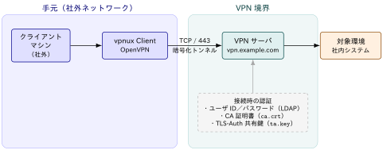

# 環境情報の受領

## 接続情報一式がフォルダをユーザーに配布する

[LDAP アカウント作成通知：受領後は取り扱い注意を促すこと]{.h2-submessage}



:::: {.columns}

::: {.column width="38%"}


:::{.border-bottom-header}

OpenVPNの環境設定情報ファイル構成

:::



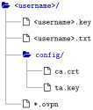

:::

::: {.column width="62%"}



:::{.font-10 .lh-19}

:::{.yaml2table .yaml2table-custom-top data-col-widths="[35,65]"}

```yaml
record1:
  ファイル・フォルダ: "<code>&lt;username&gt;/</code>"
  役割: ユーザ毎フォルダ
record2:
  ファイル・フォルダ: "<code>&lt;username&gt;.key</code>"
  役割: ユーザ毎の秘密鍵（本手順では利用しない）
record3:
  ファイル・フォルダ: "<code>&lt;username&gt;.txt</code>"
  役割: VPN ログイン用のユーザ ID・パスワードを記載
record4:
  ファイル・フォルダ: "<code>config/</code>"
  役割: OpenVPN 設定フォルダ
record5:
  ファイル・フォルダ: "<code>config/ca.crt</code>"
  役割: 認証用 CA 証明書
record6:
  ファイル・フォルダ: "<code>config/ta.key</code>"
  役割: TLS-Auth 用共有鍵
record7:
  ファイル・フォルダ: "<code>*.ovpn</code>"
  役割: OpenVPN 設定ファイル（接続先、ポート、使用する証明書・鍵などを記述）
```

:::

:::

:::

::::


# vpnux Client の導入

## vpnux Client を入れて接続クライアントを用意する



:::: {.main-message-box}

::: {.info-contents .font-08 .padding-left-05 .lh-12}



- vpnux Client は，OpenVPN 経由で対象環境へ接続するための [Windows 向けクライアントソフトウェア]{.regmonkey-bold}（Plum Systems 製・日本語 GUI）
- 受領した設定ファイル・証明書・共有鍵を読み込み，暗号化トンネルの確立を担う

:::
::::



::: {.regmonkey_index style="width:100%" .padding-left-10}

```yml
regmonkey_index:
  title_fontsize: 1.1em
  bullet_fontsize: 0.9em
  numbering: false
  children:
    - title: ① GUI だけでプロファイルを管理できる
      description:
        - 設定ファイルをテキストエディタで直接編集せず，GUI から接続プロファイルを作成・切り替えできる
        - 複数の接続先を使い分ける場合もプロファイルを追加するだけでよい
      width: [40,60]
    - title: ② 無償の Standard Edition を使用する
      description:
        - 一定の条件で商用利用も可能な無償版：問い合わせサポート・保守サービスは提供されない
        - サポートや企業向け機能が必要な場合は有償の Business Edition を利用する
      width: [40,60]
    - title: ③ インストールはウィザードに従うだけ
      description:
        - 公式サイト <code>https://www.vpnux.jp/</code> からインストーラを取得し，既定設定のまま導入する
        - 管理者権限が必要なのはインストール時のみ：導入後の VPN 接続操作は一般ユーザ権限で行える
      width: [40,60]

```

:::

# プロファイルの作成

## プロファイルの追加画面を開く

[起動画面 → 「プロファイル」→「追加」の 2 クリックで編集画面が開く]{.h2-submessage}



:::::: {.columns}

::::: {.column width="46%"}

:::{.border-bottom-header}
① 起動画面で「プロファイル」を押下
:::



:::{style="text-align:center;"}
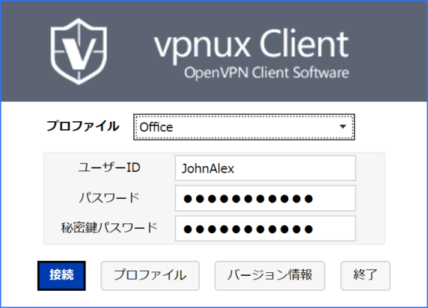{fig-alt="vpnux Client の起動画面：下部に接続・プロファイル・バージョン情報・終了のボタンが並ぶ" height="380px"}
:::

:::{.font-09 .lh-12}
- 画面下部のボタン列，[「接続」の右隣]{.regmonkey-bold} にある
:::

:::::

::::: {.column width="8%"}



:::{style="text-align:center; font-size:2em;"}

:::

:::::

::::: {.column width="46%"}

:::{.border-bottom-header}
② 一覧画面で「追加」を押下
:::



:::{style="text-align:center;"}
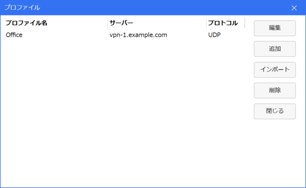{fig-alt="プロファイル一覧画面：右側に編集・追加・インポート・削除・閉じるのボタンが並ぶ" height="380px"}
:::

:::{.font-09 .lh-12}
- 画面右側のボタン列，[上から 2 番目]{.regmonkey-bold} にある
- 押下すると編集画面（一般設定）が開く
:::

:::::

::::::

## 一般設定：接続先とデバイス・プロトコルと認証を設定する



:::::: {.columns}

::::: {.column width="36%"}

:::{style="text-align:center;"}
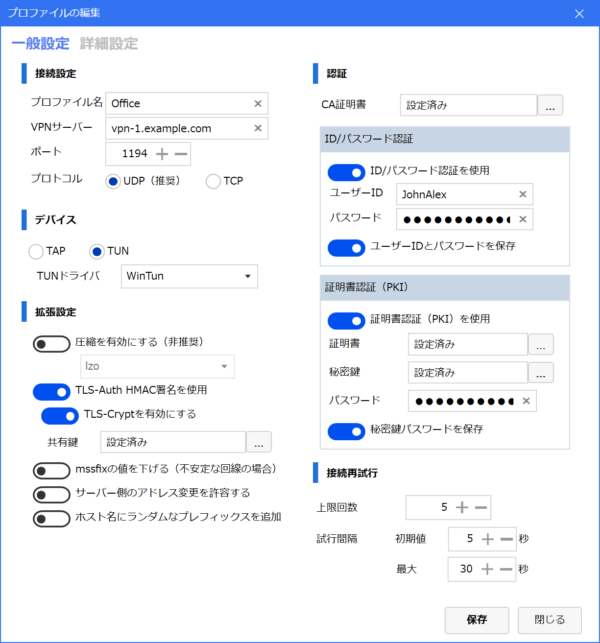{fig-alt="プロファイルの編集画面の一般設定タブ：左に接続設定・デバイス・拡張設定，右に認証の入力欄が並ぶ" height="560px"}
:::

:::{.font-08 .lh-12 style="text-align:center;"}
「一般設定」タブの画面例（値はサンプル）
:::

:::::

::::: {.column style="width:64%; padding-left:0.8em;"}



::::{.font-10 .lh-15}

:::{.yaml2table .yaml2table-custom-top data-col-widths="[26,74]"}

```yaml
record1:
  項目: プロファイル名
  設定値: 任意文字列（例：<code>MY_VPN</code>）
record2:
  項目: VPN サーバ
  設定値: <code>vpn.example.com</code> を入力
record3:
  項目: ポート
  設定値: <code>443</code> を入力
record4:
  項目: デバイス
  設定値: <code>TUN</code> を選択 (仮想ネットワークインターフェースの種類)
record5:
  項目: プロトコル
  設定値: <code>TCP</code> を選択
record6:
  項目: 拡張設定
  設定値: 「LZO 圧縮を有効にする」「サーバ側のアドレス変更を許容する」をチェック
record7:
  項目: CA 証明書
  設定値: <code>config/ca.crt</code> から読み込み保存
record8:
  項目: 認証
  設定値: 「ID/パスワード認証を使用」をチェック
record9:
  項目: ID・パスワード
  設定値: "<code>&lt;username&gt;.txt</code> の ID・パスワードを入力し「保存」をチェック"
```

:::

::::

:::::

::::::

## 詳細設定：TLS-Auth と証明書検証を有効化して保存する



:::::: {.columns}

::::: {.column width="36%"}

:::{style="text-align:center;"}
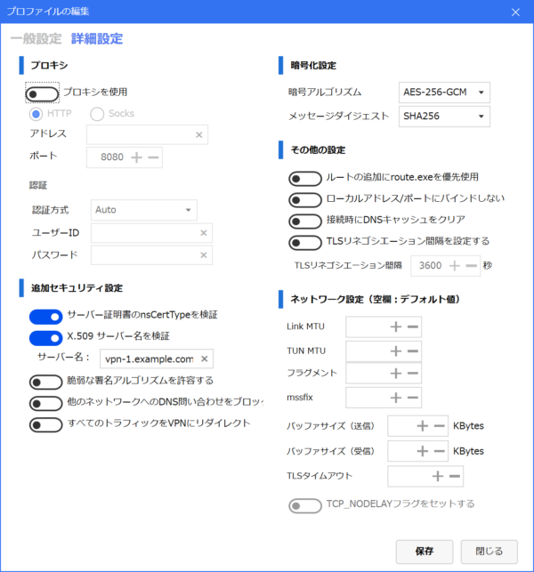{fig-alt="プロファイルの編集画面の詳細設定タブ：左にプロキシ・追加セキュリティ設定，右に暗号化設定・その他の設定・ネットワーク設定が並ぶ" height="560px"}
:::

:::{.font-08 .lh-12 style="text-align:center;"}
「詳細設定」タブの画面例（値はサンプル）
:::

:::::

::::: {.column style="width:64%; padding-left:0.8em;"}



::::{.font-10 .lh-18}

:::{.yaml2table .yaml2table-custom-top data-col-widths="[28,72]"}

```yaml
record1:
  項目: 暗号アルゴリズム
  設定値: 「デフォルト」を選択
record2:
  項目: 追加セキュリティ
  設定値: 「TLS-Auth HMAC 署名を使用」をチェック
record3:
  項目: 共有鍵
  設定値: <code>config/ta.key</code> から読み込み保存
record4:
  項目: サーバ証明書
  設定値: 「サーバ証明書の nsCertType を検証」をチェック
record5:
  項目: ネットワーク
  設定値: 「ローカルアドレス/ポートにバインドしない」をチェック
record6:
  項目: 保存
  設定値: 「保存」ボタンをクリックしプロファイル作成を完了
```

:::

::::

:::::

::::::

# OpenVPN 接続

## プロファイルを選んで接続すると通知で成否がわかる

[ログイン画面で作成したプロファイルを選び「接続」を押す]{.h2-submessage}



:::::: {.columns}

::::: {.column width="42%"}

:::{style="text-align:center;"}
{fig-alt="vpnux Client のログイン画面：上部のプロファイル選択プルダウンと，下部左端の接続ボタン" height="420px"}
:::

:::{.font-08 .lh-12 style="text-align:center;"}
ログイン画面の画面例（値はサンプル）
:::

:::::

::::: {.column style="width:58%; padding-left:0.8em;"}



:::{.main-message-box}

[接続手順と確認]{.info-box-title}

:::{.info-contents .font-08 .padding-left-05 .lh-12}



- 起動直後のログイン画面に戻り，画面上部の [「プロファイル」プルダウン]{.regmonkey-bold} で作成したプロファイルを選択する
- ユーザー ID・パスワードの入力を確認し，左下の [「接続」ボタン]{.regmonkey-bold} をクリックする
- 正常に接続すると，Windows のタスクトレイに [接続完了のアイコンと通知]{.regmonkey-bold} が表示される

:::

:::

:::::

::::::

# Appendix{.no-auto-agenda}

## TCP/443

[HTTPS と同じポートを使い，制限されたネットワークからも到達しやすくする]{.h2-submessage}



:::: {.main-message-box}

::: {.info-contents .font-08 .padding-left-05 .lh-12}



- TCP/443 とは，[トランスポートプロトコルに TCP・ポート番号に 443 を用いる通信]{.regmonkey-bold} のこと
- 443 番ポートは HTTPS（TLS で暗号化された Web 通信）の標準ポートとして割り当てられている

:::
::::



[本手順で TCP/443 を採用する理由]{.mini-section}

:::{.font-09 .lh-13 .padding-left-05}
- 社内ネットワークや公衆 Wi-Fi では外向き通信が制限されることが多い一方，HTTPS 用の TCP/443 はほとんどの環境で許可されている
- OpenVPN の待ち受けを TCP/443 にすることで，接続元のファイアウォール設定を変更せずに幅広い環境から接続できる
:::



[留意点]{.mini-section}

:::{.font-09 .lh-13 .padding-left-05}
- OpenVPN は UDP の方が転送効率は高いが，TCP のトンネル上に TCP 通信を重ねる際の再送の重複を許容し，本構成では到達性を優先して TCP を採用している
:::


## TLS 通信路

[通信内容の暗号化・通信相手の認証・改ざんの検知を備えた安全な通信経路]{.h2-submessage}



:::: {.main-message-box}

::: {.info-contents .font-08 .padding-left-05 .lh-12}



- TLS 通信路とは，[TLS（Transport Layer Security）によって暗号化・認証された通信経路]{.regmonkey-bold} のこと
- 確立すると [暗号化・認証・完全性]{.regmonkey-bold} の 3 つが保証され，盗聴・なりすまし・改ざんを防げる

:::
::::



:::::: {.columns}

::::: {.column width="58%"}

:::{style="text-align:center;"}
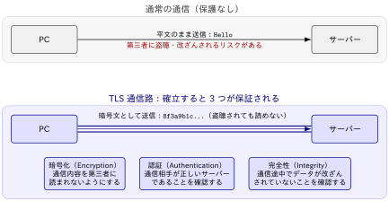{fig-alt="通常の通信では平文が盗聴・改ざんされるリスクがあるのに対し，TLS 通信路では暗号文として送信され，暗号化・認証・完全性の3つが保証される" style="width:96%; display:block; margin:0 auto;"}
:::

:::::

::::: {.column style="width:42%; padding-left:0.8em;"}

:::{.border-bottom-header}

HTTPS 通信との関係

:::



:::{.font-08 .lh-13 .padding-left-05}
- HTTPS とは，[HTTP 通信を TLS 通信路の上で行う方式]{.regmonkey-bold}（HTTP over TLS）のこと
- ブラウザのアドレスバーの鍵マークは，Web サーバーとの間に TLS 通信路が確立されたことを示す
- 標準ポートは TCP/443：OpenVPN が同じポートで待ち受けることで，HTTPS が通る環境なら同様に到達できる
:::

:::::

::::::

## TLS 通信路：HTTPS と OpenVPN の違い

[どちらも TLS を利用するが，保護する対象の範囲が異なる]{.h2-submessage}



:::: {.main-message-box}

::: {.info-contents .font-08 .padding-left-05 .lh-12}



- HTTPS は [Web ブラウザと Web サーバー間の通信]{.regmonkey-bold} だけを TLS 通信路で保護する
- OpenVPN は [ネットワーク全体を保護する TLS トンネル]{.regmonkey-bold} を構築し，ファイル共有・SSH・Web・データベースなどの通信をまとめて保護する

:::
::::



:::{style="text-align:center;"}
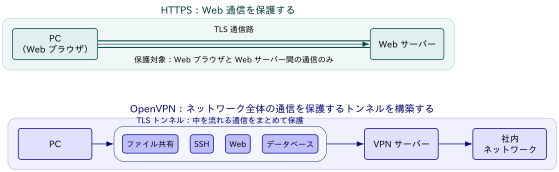{fig-alt="HTTPS は Web ブラウザと Web サーバー間の通信のみを保護するのに対し，OpenVPN は TLS トンネルの中を流れるファイル共有・SSH・Web・データベースの通信をまとめて保護する" style="width:80%; display:block; margin:0 auto;"}
:::

## LDAP: Lightweight Directory Access Protocol

[VPN ログインの ID・パスワードはディレクトリサービスで一元管理される]{.h2-submessage}



:::: {.main-message-box}

::: {.info-contents .font-08 .padding-left-05 .lh-12}



- LDAP とは，ユーザー・組織・機器などの情報を木構造で管理する [ディレクトリサービスへ問い合わせるための標準プロトコル]{.regmonkey-bold}
- Active Directory・OpenLDAP などが対応しており，複数システムの認証情報を一元管理できる

:::
::::

:::::: {.columns}

::::: {.column width="46%"}

:::{.border-bottom-header}
Without LDAP：サービスごとに個別管理
:::



:::{style="text-align:center;"}
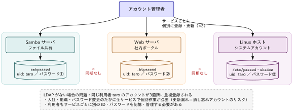{fig-alt="LDAP がない場合：アカウント管理者が Samba・Web・Linux の3つの認証 DB へ個別に登録・更新し，DB 同士は同期されない" width="100%"}
:::

:::::

::::: {.column width="8%"}



:::{style="text-align:center; font-size:2em;"}

:::

:::::

::::: {.column width="46%"}

:::{.border-bottom-header}
With LDAP：ディレクトリで一元管理
:::



:::{style="text-align:center;"}
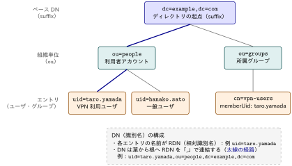{fig-alt="LDAP がある場合：利用者・グループをディレクトリ情報ツリーで一元管理し，各エントリを DN で一意に識別する" width="92%"}
:::

:::::

::::::

## ca.crt と ta.key

[VPN 通信路を安全に確立するための証明書と共有鍵]{.h2-submessage}



:::: {.main-message-box}

::: {.info-contents .font-08 .padding-left-05 .lh-12}



- `ca.crt` は，[VPN サーバーの正当性を検証するための CA（認証局）証明書]{.regmonkey-bold}：公開情報のため秘匿は不要
- `ta.key` は，[サーバーとクライアントだけが共有する TLS-Auth 共有鍵]{.regmonkey-bold}：秘密情報のため第三者に渡さない

:::
::::



[ca.crt：VPN サーバーが本物か検証する]{.mini-section}

:::{.font-09 .lh-13 .padding-left-05}
- 接続時にサーバーが提示する証明書が CA に署名されているか検証し，正しければ本物の VPN サーバーと判断して通信を続行する
- HTTPS で Web サイトの証明書をブラウザが確認するのと同じ考え方
:::



[ta.key：不正な接続要求を TLS 開始前に遮断する]{.mini-section}

:::{.font-09 .lh-13 .padding-left-05}
- 共有鍵が一致しない相手とは TLS ハンドシェイク自体を開始せず，接続要求を即座に破棄する
- 不正アクセスの排除・DoS 攻撃の軽減・ポートスキャンへの応答抑止に寄与する
:::

## ca.crt と ta.key は VPN 管理者が発行する

[利用者が自分で作成するものではなく，接続設定一式として配布される]{.h2-submessage}



:::: {.main-message-box}

::: {.info-contents .font-08 .padding-left-05 .lh-12}



- `ca.crt` は，VPN 管理者が [CA（認証局）を作成して発行する公開証明書]{.regmonkey-bold}：この CA がサーバー証明書 `server.crt` に署名する
- `ta.key` は，VPN 管理者が [OpenVPN の `--genkey` コマンドで生成する共有鍵]{.regmonkey-bold}：同一のものをサーバーと全クライアントに配布する

:::
::::



:::::: {.columns}

::::: {.column style="width:50%; padding-right:0.8em;"}

[ca.crt の発行：CA を作成し server.crt に署名する]{.mini-section}



:::{.font-15}


```bash
openssl genrsa -out ca.key 4096
openssl req -x509 -new -nodes -key ca.key \
  -sha256 -days 3650 -out ca.crt
```

:::

:::{.font-08 .lh-13 .padding-left-05}
- `ca.key` は CA の秘密鍵として VPN 管理者のみが保持し，`ca.crt` は公開証明書としてクライアントへ配布する
- クライアントは `ca.crt` を使って，接続先のサーバー証明書がこの CA の署名によるものかを検証する
:::

:::::

::::: {.column style="width:50%; padding-left:0.8em;"}

[ta.key の発行：OpenVPN コマンドで生成する]{.mini-section}



:::{.font-15}

```bash
openvpn --genkey secret ta.key
```

:::

:::{.font-08 .lh-13 .padding-left-05}
- 生成した同一の `ta.key` をサーバーと全クライアントに配置する
- サーバー側は `tls-auth ta.key 0`，クライアント側は `tls-auth ta.key 1` と設定して方向を区別する
:::

:::::

::::::

## 秘密鍵 ca.key は VPN 管理者のみが保持する

[ca.crt・ta.key はサーバーと全クライアントに同じものを配布する]{.h2-submessage}



::::{.font-10 .lh-19}

:::{.yaml2table .yaml2table-custom-top data-col-widths="[16,44,40]"}

```yaml
record1:
  ファイル: "<code>ca.key</code>"
  役割: CA の秘密鍵
  保持者: VPN 管理者のみ（外部へ配布しない）
record2:
  ファイル: "<code>ca.crt</code>"
  役割: CA の公開証明書（サーバー証明書の検証に利用）
  保持者: VPN 管理者・サーバー・全クライアント
record3:
  ファイル: "<code>ta.key</code>"
  役割: TLS-Auth 用共有鍵
  保持者: VPN 管理者・サーバー・全クライアント（全端末で同一）
```

:::

::::



[実務では Easy-RSA による一元管理が一般的]{.mini-section}

:::{.font-09 .lh-13 .padding-left-05}
- 企業では OpenVPN の Easy-RSA を利用して CA を管理し，`ca.crt`・`server.crt`・`client.crt` の発行・更新を一元的に行うことが多い
- `ta.key` は OpenVPN コマンドで一度生成し，その共有鍵を各クライアントへ配布する運用が一般的
:::

## TLS-Auth 検証：HMAC 署名で接続の入口を守る

[署名が一致しないパケットは TLS ハンドシェイク前に破棄される]{.h2-submessage}



:::: {.main-message-box}

::: {.info-contents .font-08 .padding-left-05 .lh-12}



- TLS-Auth 検証とは，[事前共有した `ta.key` で OpenVPN の全制御パケットに HMAC 署名を付与・照合する仕組み]{.regmonkey-bold} のこと
- 署名が一致しないパケットには応答せず破棄するため，`ta.key` を持たない相手は TLS ハンドシェイクを開始できない

:::
::::



:::::: {.columns}

::::: {.column width="58%"}

:::{style="text-align:center;"}
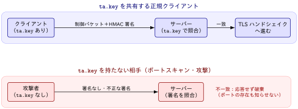{fig-alt="ta.key を共有する正規クライアントは制御パケットに HMAC 署名を付与してサーバーの照合を通過し TLS ハンドシェイクへ進むのに対し，ta.key を持たない攻撃者のパケットは不一致として応答されずに破棄される" style="width:96%; display:block; margin:0 auto;"}
:::

:::::

::::: {.column style="width:42%; padding-left:0.8em;"}



[検証の流れ]{.mini-section}

:::{.font-08 .lh-13 .padding-left-05}
- サーバーとクライアントが同一の `ta.key` を事前に共有する（環境情報の受領時に配布される）
- 送信側は制御パケットごとに HMAC 署名を計算して付与し，受信側は同じ鍵で署名を再計算して一致を確認する
:::



[入口対策としての効果]{.mini-section}

:::{.font-08 .lh-13 .padding-left-05}
- 不一致のパケットには一切応答しないため，ポートスキャンに対して OpenVPN の稼働を検知されにくい
- TLS ハンドシェイク前に遮断するため，TLS 実装の脆弱性を突く攻撃や DoS の処理負荷を軽減できる
:::

:::::

::::::

## VPN 接続の確立と LDAP 認証の役割分担

[接続設定一式と同時に配布されるが，担う役割は異なる]{.h2-submessage}



:::: {.main-message-box}

::: {.info-contents .font-08 .padding-left-05 .lh-12}



- VPN 接続は，[通信路の確立（ca.crt・ta.key）]{.regmonkey-bold} と [ユーザー認証（LDAP の ID・パスワード）]{.regmonkey-bold} の2段階で成立する
- LDAP アカウント発行時に接続設定一式（`*.ovpn`・`ca.crt`・`ta.key`）が併せて配布されるが，役割は独立している

:::
::::



[接続時に照合が行われる順序]{.mini-section}

::: {.regmonkey_index style="width:100%" .padding-left-10}

```yml
regmonkey_index:
  title_fontsize: 1.05em
  bullet_fontsize: 0.86em
  numbering: false
  children:
    - title: ① TLS-Auth 検証（ta.key）
      description:
        - クライアントは <code>ta.key</code> を用いて接続要求に HMAC を付与
        - サーバーは同じ <code>ta.key</code> で HMAC を検証
        - 一致しない接続要求は TLS ハンドシェイク前に破棄
      width: [35,65]

    - title: ② TLS ハンドシェイク（ca.crt）
      description:
        - サーバーは <code>server.crt</code> をクライアントへ送信
        - クライアントは <code>ca.crt</code> により証明書の署名・有効期限を検証
        - ECDHE 等でセッション鍵を生成し，共通鍵を共有
        - TLS 通信路（暗号化トンネル）を確立
      width: [35,65]

    - title: ③ LDAP 認証
      description:
        - TLS 通信路上で ID・パスワードを安全に送信
        - VPN サーバーは LDAP サーバーへ認証を要求し，LDAP サーバーが利用者情報を照合
        - 認証成功後，仮想 IP を割り当て VPN 利用開始
      width: [35,65]
```

:::
