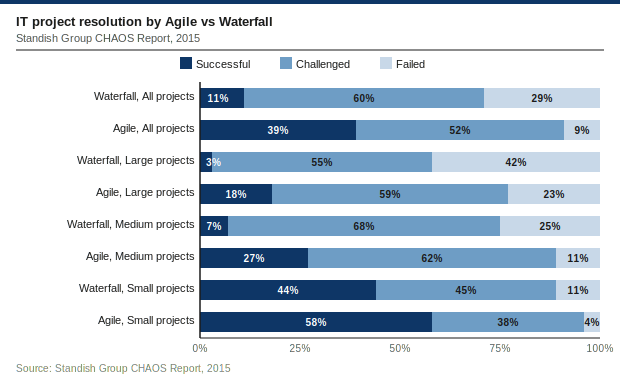
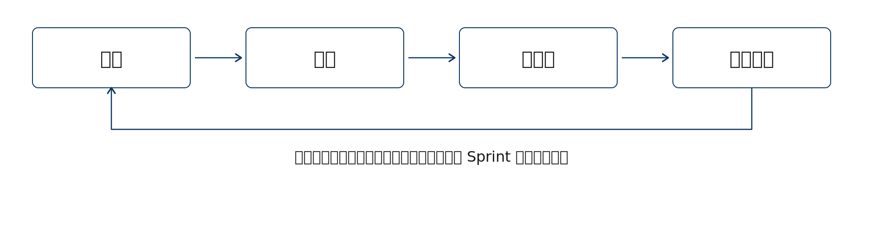
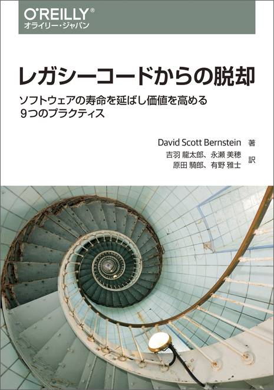

## ウォーターフォール開発のステージ
[製造業や建設業をベースに1970年にウィンストン・ロイスによって提唱された開発モデル]{.h2-submessage}

::::{data-step-flow="1"}

:::{.step-flow-data}

```yaml
step-flow__row_height: 4.5em
col_width: [13, 22, 22, 45]
header_font: 1.2em
top-aligned: true
line_height: 1.1
header:
  step: ステップ
  description: 作業内容
  output: アウトプット
  risk: リスク
font:
  step: 1.5em
  description: 1.1em
  output: 1.1em
  risk: 1.1em
record:
  - step: 要求
    description:
      - 要求文章を作るために，情報を専門家や将来のユーザーから集める
    output:
      - 現在のリリースで開発予定の機能（ソフトウェアが行うこと）を指示する文章
    risk:
      - ステークホルダー間の認識齟齬により，要求が不完全・矛盾したまま確定
  - step: 設計
    description:
      - 要求文章をもとに，システム構成・モジュール分割・データフロー・インターフェースを計画する
    output:
      - ソフトウェアの作り方を説明する図や文章
    risk:
      - 要求の曖昧な箇所を設計者が独自解釈し，意図と異なる設計が発生
      - 非機能要件（性能・スケーラビリティ）の考慮が漏れる
  - step: 実装
    description:
      - 設計資料に記載された要件を満たすようにコーディング
    output:
      - 各モジュール・コンポーネントのソースコード
    risk:
      - 設計文章の不備や誤りをそのまま実装し，バグの原因が設計まで遡る
  - step: 統合
    description:
      - チームメンバーそれぞれが書いたコードをまとめる段階
    output:
      - 全モジュールを結合した統合済みシステム（ビルド成果物）
    risk:
      - 各モジュールは個別には動作したが，結合時にインターフェース不一致発覚
  - step: テスト
    description:
      - 統合されたソフトウェアが意図した通りに振る舞うか確認
    output:
      - テスト結果レポート，バグレポート，修正済みコード
    risk:
      - 要求・設計の上流工程での誤りがここで初めて発覚
      - テスト期間の圧縮によりカバレッジが不足し，重大なバグが見逃される
  - step: インストール
    description:
      - ソフトウェアを本番環境に展開し，動作に必要な設定・データ移行を行う
    output:
      - 本番環境で稼働中のシステム，インストール・設定手順書
    risk:
      - 開発・テスト環境との差異により本番でのみ障害が発生
  - step: 保守
    description:
      - 問題の修正，新機能の追加，アップデートを実施
    output:
      - パッチ・修正版リリース，新機能追加版，更新されたドキュメント
    risk:
      - 設計書・仕様書の更新が追いつかず，ドキュメントとコードの乖離が蓄積
      - 開発チームメンバーが会社を去ってしまって，ドキュメント参照だけでは既存の設計が理解できない
```

:::

::::

## ウォーターフォールはなぜ機能しないのか
[ウィンストン・ロイス本人も，「このやり方は機能しないだろう」と言及していた]{.h2-submessage}



::::{.main-message-box .font-12}


:::{ .pl-10}

**従来のウォーターフォール開発では，何かが動作するためには，全てが動作しなくてはならない**

:::

::::



[ウォーターフォールが機能しない4つの構造的理由]{.mini-section}



::: {.regmonkey_index style="width:100%"}

```yml
regmonkey_index:
  title_fontsize: 1.1em
  bullet_fontsize: 0.8em
  numbering: true
  children:
    - title: 動作確認は統合後にしかできない
      description:
        - 実装中に検証できるのはモジュール単体（ユニットテスト）だけ
        - システム全体の整合性は結合フェーズまで確認手段がない
      width: [48, 52]
    - title: 多くのバグは結合フェーズで一斉に発覚する
      description:
        - 長期間独立して書いたコードを一度に結合するため齟齬が顕在化
        - インターフェース不一致・前提の齟齬・依存関係の誤りが一気に出る
      width: [48, 52]
    - title: 結合テストFailの原因の切り分けが難しい
      description:
        - 要求の誤りか・設計の誤解釈か・実装ミスかを判別しづらい
        - 設計の論理的誤りなら手戻りは設計フェーズまで遡る
      width: [48, 52]
    - title: 結合テスト段階でのバグ修正コストが肥大化
      description:
        - 設計レベルのバグが一斉に顕在化し，修正が新たなバグを生む連鎖
        - 締め切り圧力でテスト期間が削られ，技術的負債として残る
      width: [48, 52]

```

:::

## ウォーターフォールはアジャイルと比べプロジェクト成功率が低い
[Standish Group CHAOS Report（2015）：Successful・Challenged・Failed[^chaos-def] の3区分で集計]{.h2-submessage}



::::{.columns}

:::{.column width="55%"}



{width="100%"}

:::

:::{.column width="45%"}

:::{.border-bottom-header-left}
ウォーターフォールの成功率[^chaos-project-size-def]
:::

:::{.squaredmark .font-09 .lh-13}

[全プロジェクト：成功率 **11%**（Agile **39%**）]{.regmonkey-bold}

- プロジェクト規模が大きくなるほど成功率は低下する傾向にあり，特に大規模案件ではウォーターフォールの限界が顕著に現れる


[大規模プロジェクト：成功率 **3%** （Agile **18%**）]{.regmonkey-bold}

[中規模プロジェクト：成功率 **7%**（Agile **27%**）]{.regmonkey-bold}

- 統合フェーズまで動作確認ができないリスクが直接的に失敗率を押し上げる

[小規模プロジェクト：成功率 **44%**（Agile **58%**）]{.regmonkey-bold}

- 要件が固定されやすい小規模案件では差が縮まるが，それでも Agile に劣る

:::

:::

::::

<!-- footer -->

[^chaos-def]: **Successful**：予算内・納期内・要求仕様通りに完了．**Challenged**：完了したが予算超過・納期遅延・要求削減のいずれかが発生．**Failed**：キャンセルまたは完成品を一度も使用せずに廃棄．
[^chaos-project-size-def]: **Small**：予算100万ドル未満．**Medium**：予算100万〜1000万ドル．**Large**：予算1000万ドル超．

## アジャイルは変化を前提に短サイクルで動くソフトを届ける

[個人と対話・動くソフトウェア・顧客との協調・変化への対応に価値をおく]{.h2-submessage}



:::: {.columns}
::: {.column width="35%"}

::::{.message-card .position-left-05 .font-08}

:::{.message-card-title-no-margin .center}

① 変化を前提とする

:::

:::{.message-card-body .squaredmark .font-08}

- 開発後期の要件変更も対応し，変化を顧客の競争優位へ
- 計画通りの完遂より，価値ある成果への適応を優先する
:::

::::



::::{.message-card .position-left-05 .font-08}

:::{.message-card-title-no-margin .center}

② スコープを小さく定義する

:::

:::{.message-card-body .squaredmark .font-08}

- 数週間〜数ヶ月で動くソフトを届けられる単位までスコープを分割する
- やらない仕事を最大化し，シンプルさを保つ

:::

::::




::::{.message-card .position-left-05 .font-08}

:::{.message-card-title-no-margin .center}

③ 技術的卓越性を保ち続ける

:::

:::{.message-card-body .squaredmark .font-08}

- どの素材を，いつ，どんな形で使うかを理解する
- 設計を疎かにすると技術的負債が反復ごとに蓄積する

:::

::::




::::{.message-card .position-left-05 .font-08}

:::{.message-card-title-no-margin .center}

④ 自己組織化チームと対話

:::

:::{.message-card-body .squaredmark .font-08}

- 動機づけられた個人を信頼し，対面の対話で情報を伝える
- 定期的に振り返り，進め方を継続的に調整する

:::

::::

:::
::: {.column width="65%"}

::::{.message-card .font-08 style="min-height: 350px; max-height: 350px;"}

:::{.message-card-title-no-margin}
アジャイル：短い反復サイクルを繰り返す
:::

:::{.message-card-body}


::::{.step-container style="height: 4em" .padding-TB-none}

:::{.step}

[Sprint 1]{.step .outline-phase .active-phase-sm}

:::

:::{.step}

[Sprint 2]{.step .outline-phase .active-phase-sm }

:::
:::{.step}

[Sprint 3]{.step .outline-phase .active-phase-sm}

:::

:::{.step}

[Sprint 4]{.step .outline-phase .active-phase-sm}

:::

:::{.step}

[...]{.step .outline-phase .active-phase-sm style="height:50px;"}

:::

::::

[同じ workflow を Sprint ごとに反復し，毎回動くソフトを顧客に届ける]{.regmonkey-bold .font-09}

{fig-alt="1つの Sprint の中で計画→開発→テスト→レビューの workflow を循環的に回す" style="width:80%; display:block; margin:0 auto;"}

:::

::::



::::{.message-card .font-08  style="min-height: 330px; max-height: 350px;"}


:::{.message-card-title-no-margin style="background: #575757;"}

ウォーターフォール：一括・直列で工程を進める

:::

:::{.message-card-body}

[全工程を直列に進め，動作確認は統合フェーズまで先送りされる]{.regmonkey-bold .font-09}


::::{.step-container style="height: 4em" .padding-TB-none}

:::{.step}

[①要求]{.step .outline-phase .active-phase-sm}

:::

:::{.step}

[②設計]{.step .outline-phase .active-phase-sm }

:::
:::{.step}

[③実装]{.step .outline-phase .active-phase-sm}

:::
:::{.step}

[④統合]{.step .danger-phase .active-phase-sm style="height:50px;"}

:::
:::{.step}

[⑤テスト]{.step .outline-phase .active-phase-sm}

:::
:::{.step}

[⑥リリース]{.step .active-phase .active-phase-sm style="height:50px;"}

:::

::::

:::{.font-09 .squaredmark .lh-11}
[【特性】計画駆動・後戻りを想定しない]{.regmonkey-bold}

- 要件は初期に固定され，後工程での変更コストが大きい
- 統合まで動くソフトが見えず，問題の発覚が遅れる

:::

:::

::::


:::
::::


# References{.no-auto-agenda}

## レガシーコードからの脱却



:::: {.columns}
::: {.column .book-image}



:::

::: {.column .book-info}
### 書籍情報

| | |
|----------|------|
| タイトル  |[レガシーコードからの脱却](https://www.oreilly.co.jp/books/9784873118864/)|
| 著者     | David Scott Bernstein 著／吉羽 龍太郎・永瀬 美穂・原田 騎郎・有野 雅士 訳 |
| 発売日   | 2019/09/19 |
| ISBN13   | 978-4-87311-886-4 |
| 体裁     | 344ページ |

### この本の内容

- ウォーターフォール型開発が生み出す技術的負債とレガシーコードの構造的原因を解説
- テスト駆動開発・継続的インテグレーション・リファクタリングなど，コードを健全に保つ9つのプラクティスを紹介
- 「動かないコードを直すより，最初から壊れにくいコードを書く」という発想の転換を促す

:::
::::
