# ネットワーク基礎

## コンピューターネットワークとは



:::: {.main-message-box}

::: {.info-contents .font-08 .padding-L-05 .lh-12}



- コンピューターネットワークとは，コンピューター同士をケーブルや電波など何かしらの手段でつないで，様々なデータをやり取りできる状態にしたもの
- ネットワークのおかげで，Webサービス，電子メール，ファイル共有，SSHなどの通信サービスが成立している

:::
::::

:::: {.columns}
::: {.column width="60%"}

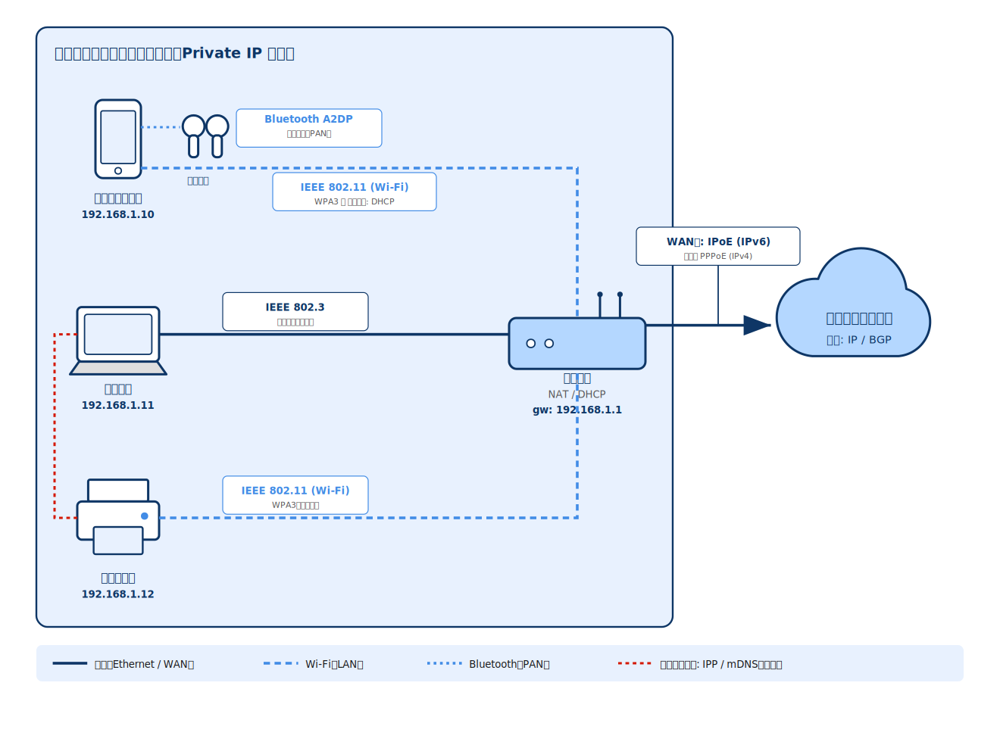

:::
::: {.column width="40%"}



::::{.message-card .position-left-05 .font-08}

:::{.message-card-title-no-margin .center}

① LAN（Local Area Network）

:::

:::{.message-card-body .squaredmark .font-08}

- 自宅や社内など狭い範囲を結ぶネットワーク
- Wi-Fi・Ethernet でルーター配下の機器を相互接続
- 社内限定のWebサイトやファイル共有システム（イントラネット）の基盤として利用される

:::

::::



::::{.message-card .position-left-05 .font-08}

:::{.message-card-title-no-margin .center}

② WAN（Wide Area Network）

:::

:::{.message-card-body .squaredmark .font-08}

- 拠点間など広域を結ぶネットワーク
- ルーターの WAN 側から ISP 経由で外部へ接続
:::

::::



::::{.message-card .position-left-05 .font-08}

:::{.message-card-title-no-margin .center}

③ インターネット

:::

:::{.message-card-body .squaredmark .font-08}

- 世界中の LAN・WAN を相互接続した巨大な網
- IP・BGP を基盤に異なるネットワーク同士を中継
:::

::::

:::
::::

## ネットワーク接続の基盤: NIC



:::: {.main-message-box}

::: {.info-contents .font-08 .padding-L-05 .lh-12}



- コンピューターをネットワークに接続するには，接続部分にNIC(Network Interface card)という機器が必要
- 各 NIC には製造時にメーカーによる固有番号 MAC(Media Access Control)アドレスが割り当てられている

:::
::::

:::: {.columns}
::: {.column width="50%"}

:::{.border-bottom-header}

Network Interface card

:::

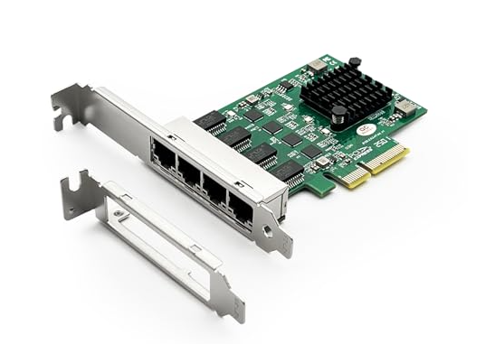{fig-align="center" width="100%"}


:::
::: {.column width="50%"}



::::{.message-card .font-08}

:::{.message-card-title-no-margin .center}

① NICはコンピューターとネットワークをつなぐ玄関口

:::

:::{.message-card-body .squaredmark .font-09}

- 送信時：コンピューター内部のデータ（ビット列）を，ネットワークを流れる信号（光や電圧）に変換
- 受信時：受信した信号をビット列へ戻す

:::

::::




::::{.message-card .font-08}

:::{.message-card-title-no-margin .center}

② 接続の方式は有線・無線で異なる

:::

:::{.message-card-body .squaredmark .font-09}

- 有線LANでは Ethernet ケーブルを介して接続する
- 無線LANでは Wi-Fi の電波を介して接続する
- いずれも物理的な接続を担うのが NIC

:::

::::




::::{.message-card .font-08}

:::{.message-card-title-no-margin .center}

③ NICはMACアドレスで相手を識別

:::

:::{.message-card-body .squaredmark .font-09}

- MACアドレスは各NICに固有の識別番号
- 同一ネットワーク内では，このMACアドレスで送信先・送信元を特定する

:::

::::


:::
::::


## ネットワーク上のコンピューター同士が通信するためのルール
[通信プロトコル]{.topleftbox}



:::: {.main-message-box}

::: {.info-contents .font-08 .padding-L-05 .lh-12}



- データ通信は，「データをデジタル信号にする」→「送り先に届ける」→「信号をデータに戻す」の流れが基本
- 通信には，送信側と受信側で予め着られたら共通ルール（=プロトコル）が必要

:::
::::

:::: {.columns}
::: {.column width="50%"}

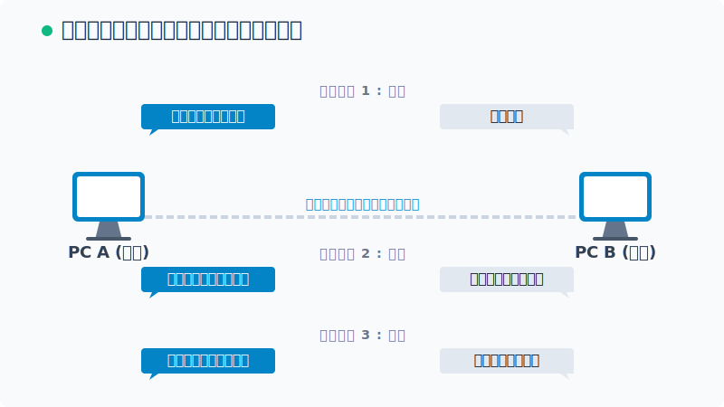

:::

::: {.column width="50%"}

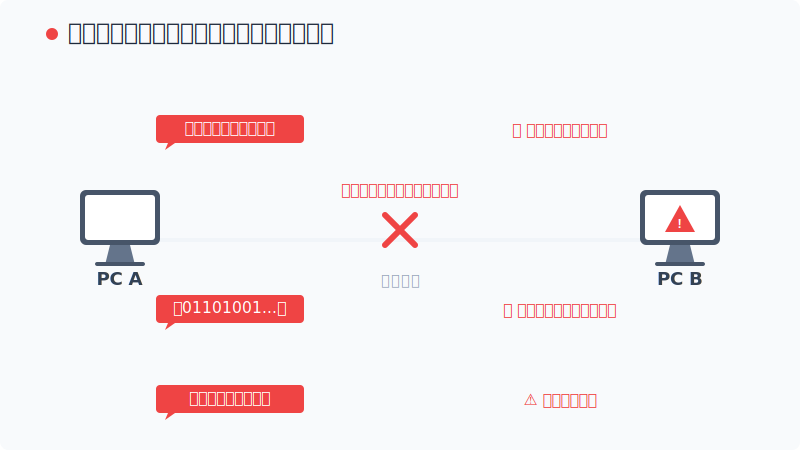

:::
::::

## コンピューターネットワークによりファイル転送が可能になる
[コンピューターネットワーク活用事例]{.topleftbox}



:::: {.main-message-box}

::: {.info-contents .font-08 .padding-L-05 .lh-12}

- SFTPサービスとはSFTPクライアントとSFTPサーバーがSFTPというプロトコルを用いてファイル転送をできるようにするサービス
- ファイルは1つずつでなくても，まとめて転送可能

:::
::::

:::{style="width: 100%"}

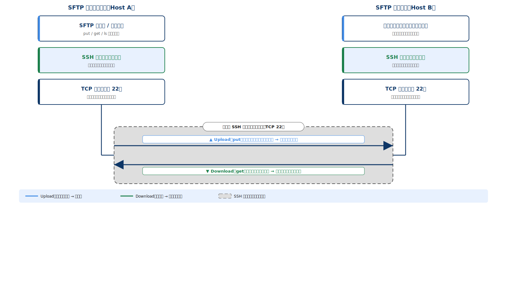

:::


# TCP/IPの概要
## TCP/IPでは送受信の一連の作業を層に分けて処理している



:::: {.main-message-box}

::: {.info-contents .font-08 .padding-L-05 .lh-12}

- TCP/IPでは送受信に関わる一連の作業を5層にわけて処理
- 上の層ほどユーザーに近く，下の層ほど機器に近い作業を担当

:::
::::


:::{.center}

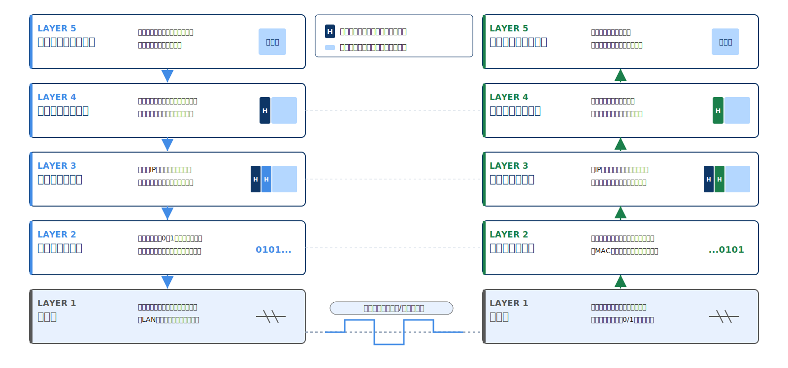

:::

## 各層は役割ごとに代表的なプロトコルを担当する



::::{.custom-table style="width:100%; font-size: 0.8em !important;"}
:::{.yaml2table .yaml2table-custom-top #yaml-tcpip-layers data-col-widths="[20, 54, 26]"}

```yaml
record1:
  Layer:
    - アプリケーション層
  Description:
    - アプリケーションが扱うデータ形式に変換
    - アプリケーション毎に様々なプロトコルが存在
    - この層は「クライアントとサーバー」という概念を持っている
  Protocol:
    - HTTP・HTTPS・DNS・SMTP・POP3・NTP

record2:
  Layer:
    - トランスポート層
  Description:
    - アプリケーション間の通信を管理し，データをセグメントに分割して送受信する
    - エラー検知・再送・順序制御により通信の信頼性を確保する
  Protocol:
    - TCP・UDP・TLS

record3:
  Layer:
    - ネットワーク層
  Description:
    - 宛先IPを付与してパケット化し，ネットワーク間の最適な経路を決定する
    - 届けたデータの整合性確認は担当しない
  Protocol:
    - IP・ICMP・IPsec

record4:
  Layer:
    - データリンク層
  Description:
    - 同一ネットワーク内で機器同士のデータ送受信を管理する
    - MACアドレスを利用して，次の機器へデータを受け渡す
  Protocol:
    - Ethernet・Wi-Fi（IEEE 802.11）

record5:
  Layer:
    - 物理層
  Description:
    - ビット列を電気・光信号に変換し，ケーブルや電波などの媒体へ送出する
    - 変換方法は通信媒体に依存するため，特定のプロトコルは決められない
  Protocol:
    - IEEE 802.3・光ファイバ
```

:::
::::

- プロトコルの組み合わせを変えることで，いろいろなアプリケーションや機器に対応できる
  - 電子メールの送信: SMTP + TCP + IP
  - 電子メールの受信: POP3 + TCP + IP

## カプセル化: データと情報をひとまとめにして扱うこと



:::: {.main-message-box}

::: {.info-contents .font-08 .padding-L-05 .lh-12}



- カプセルのように，データを各層の制御情報で包みながら送信する仕組み
- 各層の制御情報は受信側の同じ層でのみ使用される
- 通信を行う際に，上位層から渡されたデータに対して，各階層独自の制御情報（ヘッダー）を付加していく
- 一個上の層で付与されたヘッダは，下の層ではデータとしてみなされる
- 受信側では逆に外側から順番に制御情報を取り除く（カプセル化の解除）

:::
::::



[データは配送される荷物のように，各層で必要な情報を追加しながら送り先へ届けられる]{.mini-section}

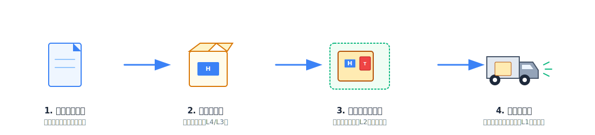

## カプセル化を構成する要素



:::: {.main-message-box}

::: {.info-contents .font-08 .padding-L-05 .lh-12}



- 送信側の各層では，受信側の同じ総出必要となる情報を共通の書式でデータに付加していく
- データよりも前に付加した情報を[ヘッダ]{.regmonkey-bold}，後ろに付加した情報を[トレーラ]{.regmonkey-bold}と呼ぶ

:::
::::



::: {.regmonkey_index style="width:95%" .padding-L-10}

```yml
regmonkey_index:
  title_fontsize: 1.1em
  bullet_fontsize: 0.9em
  numbering: false
  children:
    - title: ヘッダ（Header）
      description:
        - 各層がデータの前に付加する制御情報
        - 宛先・送信元・順序番号など，その層の処理に必要な情報を格納する
      width: [30,70]
    - title: データ（Payload）
      description:
        - 上位層から渡された運ぶべき本体部分
        - 一つ上の層で付与されたヘッダも，下の層ではデータとしてみなされる
      width: [30,70]
    - title: トレーラ（Trailer）
      description:
        - 一部の層がデータの後ろに付加する制御情報
        - 主にデータリンク層で，誤り検出用のチェック情報（FCS）として利用される
        - トレーラーはないこもとありえる
      width: [30,70]

```

:::


## ネットワーク通信時には細かく分割してデータを送信する



:::: {.main-message-box}

::: {.info-contents .font-08 .padding-L-05 .lh-12}



- 大容量のデータをそのまま送ると通信路を占有してしまうため，データを扱いやすい小さな単位に分割して送信する
- **ネットワーク層（インターネット層）でカプセル化され，IPヘッダが付与されたデータのまとまり**を[パケット]{.regmonkey-bold}と呼ぶ
- 各層でカプセル化されたデータの単位（PDU：Protocol Data Unit）は，階層ごとに固有の名称を持つ

:::
::::



[上位層から順に分割・包み込まれ，最終的に「パケット」などの単位（PDU）としてネットワークを流れる]{.mini-section}



::::{data-step-flow="1"}

:::{.step-flow-data}

```yaml
step-flow__row_height: 4.5em
col_width: [17, 25, 33, 25]
header_font: 1.2em
top-aligned: true
line_height: 1.1
header:
  step: 層
  unit: データ単位（PDU）
  description: 行われる処理
  example: 付与されるヘッダ例
font:
  step: 1.2em
  unit: 1.2em
  description: 1.2em
  example: 1.2em
record:
  - step: ① アプリケーション層
    unit:
      - データ（Data / Message）
    description:
      - Webページやメールなどのデータ本体
      - まだ分割されていないひとまとまりの状態
    example:
      - ヘッダ付与なし（データ本体のまま）
  - step: ② トランスポート層
    unit:
      - セグメント（Segment）
    description:
      - データを扱いやすい大きさに分割
      - TCPヘッダ（ポート番号など）を付与
    example:
      - 送信元・宛先ポート番号
      - シーケンス番号・確認応答番号
  - step: ③ ネットワーク層
    unit:
      - パケット（Packet）
    description:
      - セグメントにIPヘッダ（IPアドレスなど）を付与
      - 経路制御（ルーティング）の最小単位
    example:
      - 送信元・宛先IPアドレス
      - TTL（生存時間）
  - step: ④ データリンク層
    unit:
      - フレーム（Frame）
    description:
      - パケットにMACアドレスを含むヘッダを付与
      - 誤り検出用のトレーラ（FCS）を末尾に付与
    example:
      - 送信元・宛先MACアドレス
      - FCS（誤り検出用・トレーラ）
```

:::

::::

## パケットの旅

:::: {.columns}
::: {.column width="65%"}



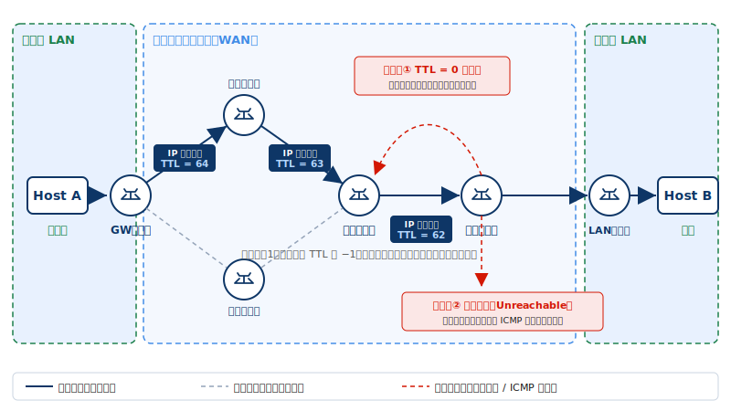

::: {.info-contents .font-08 .padding-L-05 .lh-12 style="margin-right:2em"}



- データ配送はバケツリレー（Hop-by-Hop 転送）
- 各ルータ[^router-roles]は「次にどこへ渡すか」だけを判断してパケットを隣のルータへ手渡す．全体の経路を1台が把握する必要はない．

:::


:::
::: {.column width="35%"}



::::{.message-card .position-left-05 .font-08}

:::{.message-card-title-no-margin .center}

① LANから別のLANへの旅

:::

:::{.message-card-body .squaredmark .font-08}

- 同一LAN外への通信は，まずデフォルトゲートウェイ（ルーター）へ転送される．
- ルーター間の移動（1ホップ）ごとに，L2のヘッダは書き換わるが，L3パケット（IP宛先）は維持され

:::

::::




::::{.message-card .position-left-05 .font-08}

:::{.message-card-title-no-margin .center}

② TTL（生存時間）切れによる破

:::

:::{.message-card-body .squaredmark .font-08}

- ルーターを1つ通過するたびに，IPヘッダ内のTTL値が1ずつ減算される．
- 経路ループ等でパケットが迷子になり，TTL=0になった時点でそのルーターがパケットを破棄する

:::

::::



::::{.message-card .position-left-05 .font-08}

:::{.message-card-title-no-margin .center}

③ 宛先不明による破棄

:::

:::{.message-card-body .squaredmark .font-08}

- ルーターの持つ「ルーティングテーブル（経路表）」に，該当する宛先IPの経路情報が存在しない場合．
- パケットは即座に破棄され，送信元へエラー（ICMP）が通知される．
:::

::::

:::
::::

<!-- footer -->

[^router-roles]: **中継ルータ**：WAN内でパケットを次のルータへ転送する一般的なルータ（経路選択を担う）．**コアルータ**：ISP網の中心で大量のトラフィックを高速転送する基幹ルータ．**境界ルータ**：自網と外部網（別ISP・LAN）の接点に置かれ，網をまたぐ出入口となるルータ．

# アプリケーション層
## アプリケーションプロトコル


# トランスポート層
## トランスポート層の役割



:::: {.main-message-box}

::: {.info-contents .font-08 .padding-L-05 .lh-12}

- トランスポート層の役割は，データを適切なアプリケーションへ届けること
- アプリケーションから大量のデータが渡された場合は，送信可能な大きさに分割する（TCP: セグメント化，UDP: データグラム化）

:::
::::

:::: {.columns}
::: {.column width="50%"}

:::{.border-bottom-header}

TCP: 信用第一（WWW，電子メール）

:::

```{mermaid}
%%| fig-width: 8
%%{ init: {
    'theme': 'default',
    'themeVariables': {
        'fontFamily': 'Meiryo'
    },
    'sequence': {
        'useMaxWidth': true,
        'actorMargin': 260,
        'width': 130,
        'height': 28,
        'boxMargin': 4,
        'boxTextMargin': 3,
        'noteMargin': 6,
        'messageMargin': 18
    }
} }%%
sequenceDiagram
    participant C as 送信側
    participant S as 受信側
    Note over C,S: ① コネクション確立（3ウェイハンドシェイク）
    C->>S: SYN（接続したい）
    S->>C: SYN/ACK（了解，どうぞ）
    C->>S: ACK（確認OK）
    Note over C,S: ② データ転送（受信確認つき）
    C->>S: データ
    S->>C: ACK（受け取った）
    Note over C,S: ③ コネクション切断
    C->>S: FIN（終了します）
    S->>C: ACK（了解）
```

:::
::: {.column width="50%"}

:::{.border-bottom-header}

UDP: 速さで勝負（IP電話，ストリーミングサービス）

:::

```{mermaid}
%%| fig-width: 8
%%{ init: {
    'theme': 'default',
    'themeVariables': {
        'fontFamily': 'Meiryo'
    },
    'sequence': {
        'useMaxWidth': true,
        'actorMargin': 260,
        'width': 130,
        'height': 40,
        'boxMargin': 8,
        'boxTextMargin': 4,
        'noteMargin': 6,
        'messageMargin': 18
    }
} }%%
sequenceDiagram
    participant C as 送信側
    participant S as 受信側
    Note over C,S: 確立も確認もなく一方的に送る
    C->>S: データ
    C->>S: 次のデータ
    C->>S: さらにデータ
    Note right of S: 受信確認（ACK）なし<br/>欠落しても再送しない
```

:::
::::


## アプリケーション層の出入り口としてのポート



:::: {.main-message-box}

::: {.info-contents .font-08 .padding-L-05 .lh-12}

- アプリケーションごとの「出入り口」がポート (Port) であり，通信相手はポート番号を指定してデータを送る
- IPアドレスが「どのコンピュータか」を識別するのに対し，ポート番号は「そのコンピュータ内のどのアプリケーションか」を識別
- ポート番号を独自に設定することもできるが，よく利用されるサービス向けには ウェルノウンポート (0～1023) が予約されている

:::
::::



::::{.custom-table style="width:100%; font-size: 0.7em !important;"}
:::{.yaml2table .yaml2table-custom-top #yaml-wellknown-ports data-col-widths="[22, 24, 24, 30]"}

```yaml
record1:
  サービス:
    - Web（HTTP）
  アプリケーション層プロトコル:
    - HTTP
  ポート / トランスポート:
    - 80 / TCP
  説明:
    - 暗号化なしのWebページ閲覧

record2:
  サービス:
    - Web（HTTPS）
  アプリケーション層プロトコル:
    - HTTP over TLS
  ポート / トランスポート:
    - 443 / TCP
  説明:
    - TLSで暗号化されたWebページ閲覧

record3:
  サービス:
    - メール送信
  アプリケーション層プロトコル:
    - SMTP
  ポート / トランスポート:
    - 25 / TCP
  説明:
    - サーバー間でのメール転送

record3b:
  サービス:
    - メール送信（認証付き）
  アプリケーション層プロトコル:
    - SMTP（Submission）
  ポート / トランスポート:
    - 587 / TCP
  説明:
    - メールソフトからサーバーへ送信
    - SMTP-AUTHで認証・STARTTLSで暗号化

record4:
  サービス:
    - メール受信
  アプリケーション層プロトコル:
    - POP3
  ポート / トランスポート:
    - 110 / TCP
  説明:
    - サーバーからメールを取り出す

record5:
  サービス:
    - 名前解決
  アプリケーション層プロトコル:
    - DNS
  ポート / トランスポート:
    - 53 / UDP・TCP
  説明:
    - ドメイン名とIPアドレスの相互変換

record6:
  サービス:
    - リモート接続
  アプリケーション層プロトコル:
    - SSH
  ポート / トランスポート:
    - 22 / TCP
  説明:
    - 暗号化された遠隔ログイン・操作

record7:
  サービス:
    - 時刻同期
  アプリケーション層プロトコル:
    - NTP
  ポート / トランスポート:
    - 123 / UDP
  説明:
    - 機器の時刻をサーバーに合わせる

record8:
  サービス:
    - ファイル転送
  アプリケーション層プロトコル:
    - FTP
  ポート / トランスポート:
    - 21 / TCP（制御）
    - 20 / TCP（データ）
  説明:
    - ファイルのアップロード・ダウンロード
    - 制御用とデータ用で2つのポートを使う
```

:::
::::

# データリンク層
## PPP: Point-to-Point Protocol



:::: {.main-message-box}

::: {.info-contents .font-08 .padding-L-05 .lh-12}

- 2点間で1:1の通信を行うプロトコル（主に電話回線やISDN，専用回線やATM回線などの通信で使用）
- 通信にリンク制御プロトコル(LCP)とネットワーク制御プロトコル(NCP)を使用
- 送信と受信を同時に行うことができる全二重方式(電話のようにやりとりができる ↔ トランシーバーのように待ち発生)

:::
::::


:::: {.columns}
::: {.column width="50%"}

:::{.border-bottom-header}

PPP 接続シーケンス

:::

```{mermaid}
%%| fig-width: 8
%%{ init: {
    'theme': 'default',
    'themeVariables': {
        'fontFamily': 'Meiryo'
    },
    'sequence': {
        'useMaxWidth': true,
        'actorMargin': 240,
        'width': 130,
        'height': 20,
        'boxMargin': 4,
        'boxTextMargin': 3,
        'noteMargin': 6,
        'messageMargin': 18
    }
} }%%
sequenceDiagram
    participant C as 接続元
    participant S as 接続先
    Note over C,S: ① リンク確立（LCP）: 通信要求の送信
    C->>S: リンク確立要求
    S->>C: 設定の合意
    Note over C,S: ② 認証フェーズ（PAP/CHAP）: 利用者認証
    C->>S: ユーザー名・パスワード
    S->>C: 認証OK
    Note over C,S: ③ ネットワーク設定（NCP/IPCP）: 通信条件相談
    C->>S: IPアドレス割り当て要求
    S->>C: IPアドレス通知
    Note over C,S: 通信開始: IPパケットの送受信
```


:::
::: {.column width="50%"}

:::{.border-bottom-header}

PPPフレーム

:::

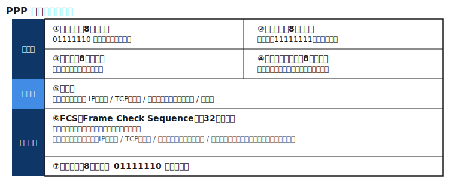


- PPPはTCP/IP以外のプロトコルにも対応
- ネットワーク層のプロトコルがIPになるとは限らない


:::
::::


# Appendix{.no-auto-agenda}

## OSI参照モデル



::::{.custom-table style="width:100%; font-size: 0.8em !important;"}
:::{.yaml2table .yaml2table-custom-top #yaml-osi-layers data-col-widths="[25, 50, 25]"}

```yaml
record1:
  Layer:
    - 第7層 アプリケーション層
  Description:
    - ユーザーアプリケーションに通信機能を提供する
    - Web閲覧・メール送受信・名前解決などを実現する
  Protocol:
    - HTTP・FTP・SMTP・DNS

record2:
  Layer:
    - 第6層 プレゼンテーション層
  Description:
    - データの表現形式を統一する
    - 文字コード変換・暗号化・圧縮を担当する
  Protocol:
    - TLS・SSL・MIME

record3:
  Layer:
    - 第5層 セッション層
  Description:
    - 通信の開始・維持・終了を管理する
    - 複数回のやり取りを1つの会話として扱う
  Protocol:
    - NetBIOS・RPC

record4:
  Layer:
    - 第4層 トランスポート層
  Description:
    - アプリケーション間の通信を実現する
    - ポート番号による識別や信頼性制御を行う
  Protocol:
    - TCP・UDP

record5:
  Layer:
    - 第3層 ネットワーク層
  Description:
    - IPアドレスを用いて宛先を識別する
    - ルーターを経由して異なるネットワーク間を中継する
  Protocol:
    - IP・ICMP

record6:
  Layer:
    - 第2層 データリンク層
  Description:
    - MACアドレスを用いて隣接機器へデータを届ける
    - フレーム化や誤り検出を行う
  Protocol:
    - Ethernet・PPP

record7:
  Layer:
    - 第1層 物理層
  Description:
    - ビット列を電気・光・電波へ変換する
    - ケーブルや無線媒体上で信号を伝送する
  Protocol:
    - IEEE 802.3・光ファイバ
```

:::
::::


## WWWとは？
[コンピューターネットワーク活用事例]{.topleftbox}



:::: {.main-message-box}

::: {.info-contents .font-08 .padding-L-05 .lh-12}



- WWW（World Wide Web）の仕組みは，情報を保持するサーバーと，閲覧するブラウザの対話で成り立つ
- やり取りは，アプリケーション層のプロトコルである**HTTP (Hypertext Transfer Protocol)**に則って処理

:::
::::

:::: {.columns}
::: {.column width="60%"}

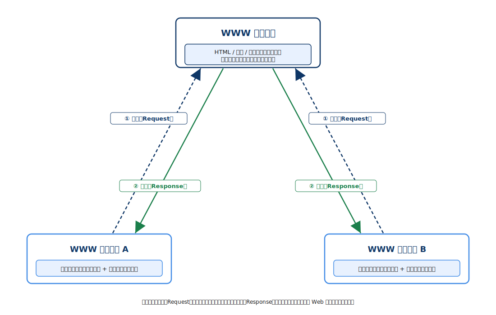

:::
::: {.column width="40%"}



::::{.message-card .position-left-05 .font-08}

:::{.message-card-title-no-margin .center}

① HTTPリクエスト（要求）

:::

:::{.message-card-body .squaredmark .font-08}

- ブラウザにURLを入力するかリンクをクリックすると，サーバーに対して「このデータをください」というHTTPリクエストが送信

:::

::::



::::{.message-card .position-left-05 .font-08}

:::{.message-card-title-no-margin .center}

② HTTPレスポンス（応答）

:::

:::{.message-card-body .squaredmark .font-08}

- クエストを受け取ったWWWサーバーは，指定されたファイル（HTMLや画像など）を探す
- 正常であればステータスコード（200 OK）と共にデータを送り返す

:::

::::



::::{.message-card .position-left-05 .font-08}

:::{.message-card-title-no-margin .center}

③ ブラウザによるレンダリング

:::

:::{.message-card-body .squaredmark .font-08}

- ダウンロードしたHTMLやCSSをブラウザが解析・翻訳し，人間が見やすいWeb画面として組み立てて表示（レンダリング）

:::

::::

:::
::::

## 電子メールはアプリケーション層プロトコルであるSMTP・POP・MIMEの組み合わせで成り立つ


::::: {.columns}

:::: {.column style="width: 33.3%; height:100%"}



:::{.horizontal-keypoints-block style="height:70%;"}

:::{.block-header}
SMTP
:::



:::{style="text-align:center;"}

:::



:::{style="text-align:center; font-size:1.1em;"}
[「送り届ける」役割]{.regmonkey-bold}
:::



:::{.block  style="font-size:0.8em; padding-right:0.5em;" .lh-12}

- Simple Mail Transfer Protocol
- 送信者が書いたメールを郵便局（サーバー）へ，あるいは郵便局間で宛先まで運ぶ
- イメージ：配達員・配送トラック
:::

:::
::::

:::: {.column style="width: 33.3%; height:100%"}



:::{.horizontal-keypoints-block style="height:70%;"}

:::{.block-header}
POP（POP3）
:::


:::{style="text-align:center; height:2.3em; line-height:2.3em; overflow:visible;"}



:::



:::{style="text-align:center; font-size:1.1em;"}
[「受け取る」役割]{.regmonkey-bold}
:::



:::{.block  style="font-size:0.8em; padding-right:0.5em;" .lh-12}

- Post Office Protocol
- 郵便局（サーバー）に保管された荷物を，受取人が自分の手元へ引き出す仕組み
- イメージ：私書箱・自宅のポスト

:::

:::
::::

:::: {.column style="width: 33.3%; height:100%"}



:::{.horizontal-keypoints-block-no-border style="height:70%;"}

:::{.block-header}
MIME
:::



:::{style="text-align:center;"}

:::



:::{style="text-align:center; font-size:1.1em;"}
[「中身を整える」役割]{.regmonkey-bold}
:::



:::{.block  style="font-size:0.8em; padding-right:0.5em;" .lh-12}

- Multipurpose Internet Mail Extensions
- テキストだけでなく，画像や添付ファイルを「小包」として梱包するプロトコル
- SMTPやPOPでは扱えない形式の情報を扱える形に変換してくれる[^MAIL-PROTOCOL]
- イメージ：小包の梱包・荷姿

:::

:::
::::

:::::

<!-- footer -->

[^MAIL-PROTOCOL]: SMTPやPOPでは，「電子メールで扱えるのはテキストデータのみ」，「電子メールの件名（Subject）に利用できるのは，半角英数字のみ」という原則があります

## 無線LANとIEEE 802.11



:::: {.main-message-box}

::: {.info-contents .font-08 .padding-L-05 .lh-12}

- 無線LANとは，電波を利用して複数の機器間でデータの送受信を行なう通信方法（狭義には IEEE 802.11 規格に準拠した方式を指す）
- 有線LANと異なり，電波という単一の空間を共有するため，送信用と受信用の物理的な通り道（経路）が分けられていない[^channel]

:::
::::



::::{.custom-table style="width:100%; height:60%; font-size: 0.65em !important;"}
:::{.yaml2table .yaml2table-custom-top #yaml-ieee80211-generations data-col-widths="[14, 16, 16, 18, 36]"}

```yaml
record1:
  世代名称: （名称なし）
  IEEE規格: IEEE 802.11a
  最大通信速度: 54 Mbps
  利用周波数帯: 5 GHz
  特徴・主な用途:
    - 1999年策定；11bと同年だが互換性はなく普及は限定的

record2:
  世代名称: （名称なし）
  IEEE規格: IEEE 802.11b
  最大通信速度: 11 Mbps
  利用周波数帯: 2.4 GHz
  特徴・主な用途:
    - 1999年策定；無線LAN普及の最初期を担った

record3:
  世代名称: （名称なし）
  IEEE規格: IEEE 802.11g
  最大通信速度: 54 Mbps
  利用周波数帯: 2.4 GHz
  特徴・主な用途:
    - 2003年策定；11bと互換しつつ54Mbpsへ高速化

record4:
  世代名称: Wi-Fi 4
  IEEE規格: IEEE 802.11n
  最大通信速度: 600 Mbps
  利用周波数帯: 2.4 / 5 GHz
  特徴・主な用途:
    - MIMO（複数アンテナ）を初採用し，2.4/5GHz両対応に
    - 家庭・オフィスでの普及の起点となった世代

record5:
  世代名称: Wi-Fi 5
  IEEE規格: IEEE 802.11ac
  最大通信速度: 約 6.9 Gbps
  利用周波数帯: 5 GHz
  特徴・主な用途:
    - 5GHz専用・広帯域チャネルで動画ストリーミングに対応
    - MU-MIMOで複数端末への同時通信を実現

record6:
  世代名称: Wi-Fi 6
  IEEE規格: IEEE 802.11ax
  最大通信速度: 約 9.6 Gbps
  利用周波数帯: 2.4 / 5 GHz
  特徴・主な用途:
    - OFDMAで<span class="regmonkey-bold">多端末同時接続時の効率</span>を改善
    - IoT・高密度環境（駅・スタジアム等）に強い

record7:
  世代名称: Wi-Fi 6E
  IEEE規格: IEEE 802.11ax
  最大通信速度: 約 9.6 Gbps
  利用周波数帯: 2.4 / 5 / 6 GHz
  特徴・主な用途:
    - 6GHz帯を新規開放し，混雑の少ない帯域を確保
    - 低遅延・大容量通信に対応

record8:
  世代名称: Wi-Fi 7
  IEEE規格: IEEE 802.11be
  最大通信速度: 約 46 Gbps
  利用周波数帯: 2.4 / 5 / 6 GHz
  特徴・主な用途:
    - 320MHz幅・4096-QAM・MLO（複数帯域同時利用）を採用
    - VR・8K動画など<span class="regmonkey-bold">超高帯域用途</span>を想定
```

:::
::::

<!-- footer -->

[^channel]: 半二重通信と呼ぶ


## 無線LANとCSMA/CA方式: 通信の衝突を回避する技術
[CSMA/CA方式 with RTS/CTS]{.topleftbox}



:::: {.main-message-box}

::: {.info-contents .font-08 .padding-L-05 .lh-12}



- 半二重通信においてフレームが衝突するの回避するための仕組み(CA: Collision Avoidance)
- 周波数帯が使われないことを確認して，少し待ってから[^backofftime]フレームを送信する

:::
::::

::::{.step-container style="height: 22em; padding-top: 0em"}

:::{.step}

[Step 1：RTS（送信要求）]{.step .active-phase .active-phase-sm}


:::{.step-label style="width: 100%" .font-08}

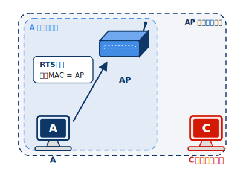


1. 通信を開始する前に利用したい周波数帯が利用されているかどうかを確認
2. ランダムバックオフ後，RTSをAP宛に送信

:::

:::

:::{.step}

[Step 2：CTS（送信許可）]{.step .active-phase .active-phase-sm}

:::{.step-label style="width: 100%" .font-08}

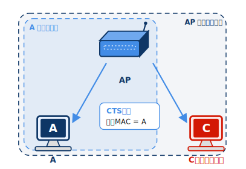


1. APはCTSをすべてのノードに送信（宛先は端末A）
2. 端末Aは CTS を受信し，送信権を獲得
3. 端末Cは自分宛てではないことを読み取り，送信抑制

:::

:::

:::{.step}

[Step 3：フレーム送信]{.step .active-phase .active-phase-sm}

:::{.step-label style="width: 100%" .font-08}

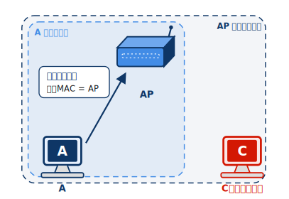

1. SIFS 後にAはフレーム送信

- SIFS は非常に短い待機時間
- 他の端末は CTS によって送信を抑制しているため，衝突が発生しにくい

:::

:::

:::{.step}

[Step 4：ACK(受信確認)]{.step .active-phase .active-phase-sm}

:::{.step-label style="width: 100%" .font-08}

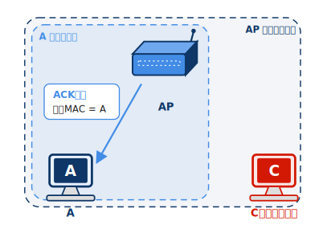

1. SIFS 後にAPはACK返送（L2 レベルの受信確認）
2. 端末Aは ACK を受信し，フレームが正常に届いたことを確認
3. ACK が受信できない場合は，衝突や通信エラーが発生したと判断し，再送を行う

:::

:::


::::


<!-- footer -->

[^backofftime]: このランダムな待ち時間のことをバックオフ制御時間と呼ぶ


## インターネット利用時の注意点



::::{.custom-table style="width:100%; height:70%; font-size: 0.7em !important;"}
:::{.yaml2table .yaml2table-custom-top #yaml-claude-md-design data-col-widths="[20, 35, 45]"}

```yaml
record1:
  category: ポート管理
  rule:
    - 利用しないポートは<span class="regmonkey-bold">必ず閉じる</span>
  actions:
    - 使用中のポートを定期的に棚卸し（<code>netstat -an</code> 等）
    - 不要なサービス・デーモンは停止し，ポートを解放
    - ウェルノウンポート（20/21/23 等）は用途がなければ即閉鎖
    - 開放ポートはアクセス元IPをACLで絞り込む

record2:
  category: ファイアウォール
  rule:
    - <span class="regmonkey-bold">デフォルト拒否</span>を原則とし，許可ルールを最小限に保つ
  actions:
    - インバウンド・アウトバウンドの両方向にルールを設定
    - 常時接続は<span class="regmonkey-bold">玄関を開けっ放しにするのと同義</span>と認識する
    - 不審なIPレンジはブラックリスト登録
    - ルール変更は変更管理ログに記録し定期レビューする

record3:
  category: セキュリティパッチ
  rule:
    - 既知脆弱性は<span class="regmonkey-bold">公開直後に適用</span>することが最大の防御
  actions:
    - OS・ミドルウェア・ファームウェアの自動更新を有効化
    - CVEアドバイザリを購読し，重大度 Critical/High を優先対応

record4:
  category: 通信暗号化
  rule:
    - 平文通信は<span class="regmonkey-bold">LAN内でも傍受リスクがある</span>と想定する
  actions:
    - Wi-Fi は WPA2/WPA3（AES-CCMP）を使用；TKIP は脆弱なため非推奨
    - HTTP・FTP・Telnet は TLS/SSH 版（HTTPS・SFTP・SSH）に移行

record5:
  category: MACアドレスフィルタリング
  rule:
    - 登録済みデバイス以外の<span class="regmonkey-bold">接続を物理層で排除</span>する
  actions:
    - AP・スイッチに許可MACリストを登録し，未登録端末を遮断
    - 新規デバイス追加時は申請フローを設け，無断接続を抑止
    - 定期的にDHCPリースログを確認し，未知MACを検出する

record6:
  category: LAN内脅威対策
  rule:
    - 内部ネットワークも<span class="regmonkey-bold">ゼロトラストで扱う</span>
  actions:
    - ARPスプーフィング対策としてDAI（Dynamic ARP Inspection）を有効化
    - 接続端末のエンドポイント保護（EDR/AV）を必須化
    - 不審な通信量・パターンをIDSで監視し，アラートを設定
```

:::
::::
