# ネットワーク基礎

## コンピューターネットワークとは



:::: {.main-message-box}

::: {.info-contents .font-08 .padding-L-05 .lh-12}



- コンピューターネットワークとは，コンピューター同士をケーブルや電波など何かしらの手段でつないで，様々なデータをやり取りできる状態にしたもの
- ネットワークのおかげで，Webサービス，電子メール，ファイル共有，SSHなどの通信サービスが成立している

:::
::::

:::: {.columns}
::: {.column width="60%"}

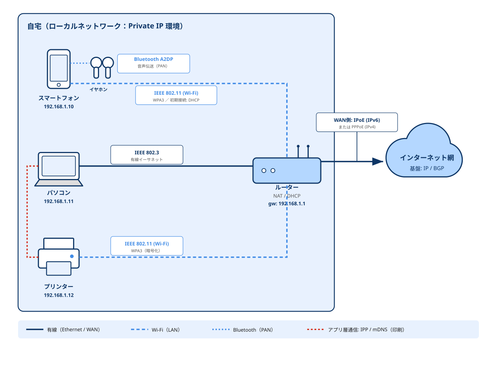

:::
::: {.column width="40%"}



::::{.message-card .position-left-05 .font-08}

:::{.message-card-title-no-margin .center}

① LAN（Local Area Network）

:::

:::{.message-card-body .squaredmark .font-08}

- 自宅や社内など狭い範囲を結ぶネットワーク
- Wi-Fi・Ethernet でルーター配下の機器を相互接続
- 社内限定のWebサイトやファイル共有システム（イントラネット）の基盤として利用される

:::

::::



::::{.message-card .position-left-05 .font-08}

:::{.message-card-title-no-margin .center}

② WAN（Wide Area Network）

:::

:::{.message-card-body .squaredmark .font-08}

- 拠点間など広域を結ぶネットワーク
- ルーターの WAN 側から ISP 経由で外部へ接続
:::

::::



::::{.message-card .position-left-05 .font-08}

:::{.message-card-title-no-margin .center}

③ インターネット

:::

:::{.message-card-body .squaredmark .font-08}

- 世界中の LAN・WAN を相互接続した巨大な網
- IP・BGP を基盤に異なるネットワーク同士を中継
:::

::::

:::
::::

## ネットワーク接続の基盤: NIC



:::: {.main-message-box}

::: {.info-contents .font-08 .padding-L-05 .lh-12}



- コンピューターをネットワークに接続するには，接続部分にNIC(Network Interface card)という機器が必要
- 各 NIC には製造時にメーカーによる固有番号 MAC(Media Access Control)アドレスが割り当てられている

:::
::::

:::: {.columns}
::: {.column width="50%"}

:::{.border-bottom-header}

Network Interface card

:::

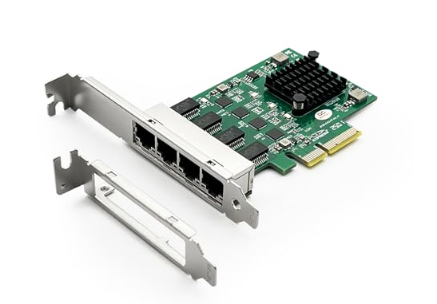{fig-align="center" width="100%"}


:::
::: {.column width="50%"}



::::{.message-card .font-08}

:::{.message-card-title-no-margin .center}

① NICはコンピューターとネットワークをつなぐ玄関口

:::

:::{.message-card-body .squaredmark .font-09}

- 送信時：コンピューター内部のデータ（ビット列）を，ネットワークを流れる信号（光や電圧）に変換
- 受信時：受信した信号をビット列へ戻す

:::

::::




::::{.message-card .font-08}

:::{.message-card-title-no-margin .center}

② 接続の方式は有線・無線で異なる

:::

:::{.message-card-body .squaredmark .font-09}

- 有線LANでは Ethernet ケーブルを介して接続する
- 無線LANでは Wi-Fi の電波を介して接続する
- いずれも物理的な接続を担うのが NIC

:::

::::




::::{.message-card .font-08}

:::{.message-card-title-no-margin .center}

③ NICはMACアドレスで相手を識別

:::

:::{.message-card-body .squaredmark .font-09}

- MACアドレスは各NICに固有の識別番号
- 同一ネットワーク内では，このMACアドレスで送信先・送信元を特定する

:::

::::


:::
::::


## ネットワーク上のコンピューター同士が通信するためのルール
[通信プロトコル]{.topleftbox}



:::: {.main-message-box}

::: {.info-contents .font-08 .padding-L-05 .lh-12}



- データ通信は，「データをデジタル信号にする」→「送り先に届ける」→「信号をデータに戻す」の流れが基本
- 通信には，送信側と受信側で予め着られたら共通ルール（=プロトコル）が必要

:::
::::

:::: {.columns}
::: {.column width="50%"}

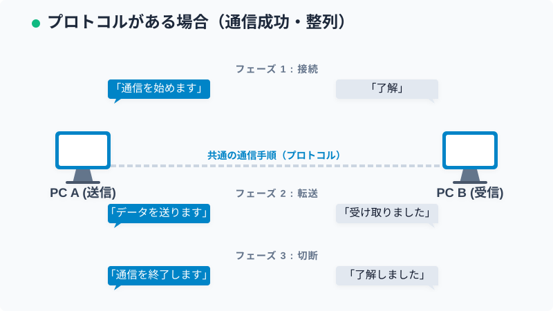

:::

::: {.column width="50%"}

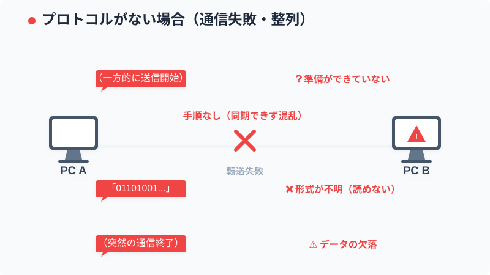

:::
::::

## コンピューターネットワークによりファイル転送が可能になる
[コンピューターネットワーク活用事例]{.topleftbox}



:::: {.main-message-box}

::: {.info-contents .font-08 .padding-L-05 .lh-12}

- SFTPサービスとはSFTPクライアントとSFTPサーバーがSFTPというプロトコルを用いてファイル転送をできるようにするサービス
- ファイルは1つずつでなくても，まとめて転送可能

:::
::::

:::{style="width: 100%"}

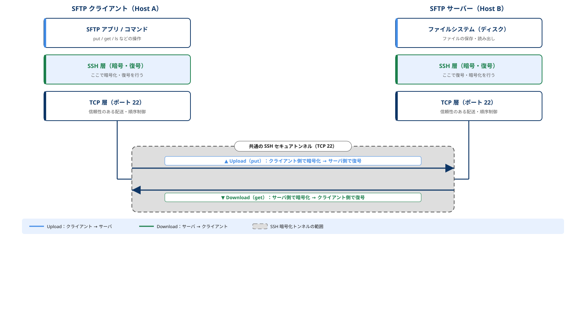

:::


# TCP/IPの概要{.nested}
## TCP/IPでは送受信の一連の作業を層に分けて処理している



:::: {.main-message-box}

::: {.info-contents .font-08 .padding-L-05 .lh-12}

- TCP/IPでは送受信に関わる一連の作業を5層にわけて処理
- 上の層ほどユーザーに近く，下の層ほど機器に近い作業を担当

:::
::::


:::{.center}

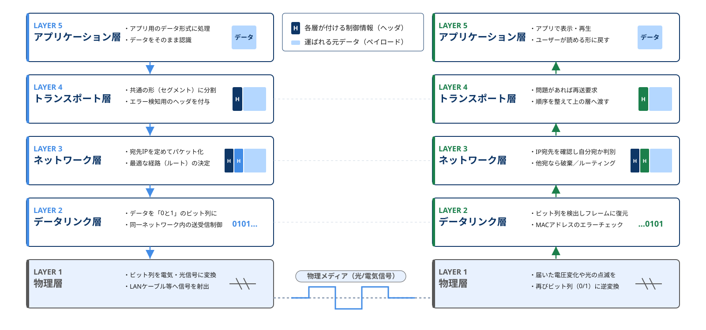

:::

## 各層は役割ごとに代表的なプロトコルを担当する



::::{.custom-table style="width:100%; font-size: 0.8em !important; margin-bottom:0.5em;"}
:::{.yaml2table .yaml2table-custom-top #yaml-tcpip-layers data-col-widths="[20, 54, 26]"}

```yaml
record1:
  Layer:
    - アプリケーション層
  Description:
    - アプリケーションが扱うデータ形式に変換
    - アプリケーション毎に様々なプロトコルが存在
    - この層は「クライアントとサーバー」という概念を持っている
  Protocol:
    - HTTP・HTTPS・DNS・SMTP・POP3・NTP

record2:
  Layer:
    - トランスポート層
  Description:
    - アプリケーション間の通信を管理し，データをセグメントに分割して送受信する
    - エラー検知・再送・順序制御により通信の信頼性を確保する
  Protocol:
    - TCP・UDP・TLS

record3:
  Layer:
    - ネットワーク層
  Description:
    - 宛先IPを付与してパケット化し，ネットワーク間の最適な経路を決定する
    - 届けたデータの整合性確認は担当しない
  Protocol:
    - IP・ICMP・IPsec

record4:
  Layer:
    - データリンク層
  Description:
    - 同一ネットワーク内で機器同士のデータ送受信を管理する
    - MACアドレスを利用して，次の機器へデータを受け渡す
  Protocol:
    - Ethernet・Wi-Fi（IEEE 802.11）

record5:
  Layer:
    - 物理層
  Description:
    - ビット列を電気・光信号に変換し，ケーブルや電波などの媒体へ送出する
    - 変換方法は通信媒体に依存するため，特定のプロトコルは決められない
  Protocol:
    - IEEE 802.3・光ファイバ
```

:::
::::

:::{.font-08}

- 各階層に存在する通信機器などの実態を[エンティティ]{.regmonkey-bold}と呼ぶ
- プロトコルの組み合わせを変えることで，いろいろなアプリケーションや機器に対応できる
  - 電子メールの送信: SMTP + TCP + IP
  - 電子メールの受信: POP3 + TCP + IP


:::


## カプセル化: データと情報をひとまとめにして扱うこと



:::: {.main-message-box}

::: {.info-contents .font-08 .padding-L-05 .lh-12}



- カプセルのように，データを各層の制御情報で包みながら送信する仕組み
- 各層の制御情報は受信側の同じ層でのみ使用される
- 通信を行う際に，上位層から渡されたデータに対して，各階層独自の制御情報（ヘッダー）を付加していく
- 一個上の層で付与されたヘッダは，下の層ではデータとしてみなされる
- 受信側では逆に外側から順番に制御情報を取り除く（カプセル化の解除）

:::
::::



[データは配送される荷物のように，各層で必要な情報を追加しながら送り先へ届けられる]{.mini-section}

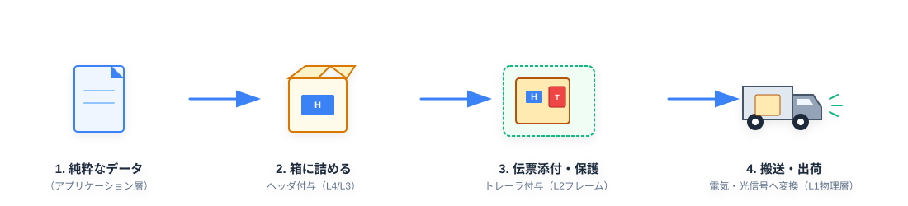

## カプセル化を構成する要素



:::: {.main-message-box}

::: {.info-contents .font-08 .padding-L-05 .lh-12}



- 送信側の各層では，受信側の同じ総出必要となる情報を共通の書式でデータに付加していく
- データよりも前に付加した情報を[ヘッダ]{.regmonkey-bold}，後ろに付加した情報を[トレーラ]{.regmonkey-bold}と呼ぶ

:::
::::



::: {.regmonkey_index style="width:95%" .padding-L-10}

```yml
regmonkey_index:
  title_fontsize: 1.1em
  bullet_fontsize: 0.9em
  numbering: false
  children:
    - title: ヘッダ（Header）
      description:
        - 各層がデータの前に付加する制御情報
        - 宛先・送信元・順序番号など，その層の処理に必要な情報を格納する
      width: [30,70]
    - title: データ（Payload）
      description:
        - 上位層から渡された運ぶべき本体部分
        - 一つ上の層で付与されたヘッダも，下の層ではデータとしてみなされる
      width: [30,70]
    - title: トレーラ（Trailer）
      description:
        - 一部の層がデータの後ろに付加する制御情報
        - 主にデータリンク層で，誤り検出用のチェック情報（FCS）として利用される
        - トレーラーはないこともありえる
      width: [30,70]

```

:::


## ネットワーク通信時には細かく分割してデータを送信する



:::: {.main-message-box}

::: {.info-contents .font-08 .padding-L-05 .lh-12}



- 大容量のデータをそのまま送ると通信路を占有してしまうため，データを扱いやすい小さな単位に分割して送信する
- **ネットワーク層（インターネット層）でカプセル化され，IPヘッダが付与されたデータのまとまり**を[パケット]{.regmonkey-bold}と呼ぶ
- 各層でカプセル化されたデータの単位（PDU：Protocol Data Unit）は，階層ごとに固有の名称を持つ

:::
::::



[上位層から順に分割・包み込まれ，最終的に「パケット」などの単位（PDU）としてネットワークを流れる]{.mini-section}



::::{data-step-flow="1"}

:::{.step-flow-data}

```yaml
step-flow__row_height: 4.5em
col_width: [17, 25, 33, 25]
header_font: 1.2em
top-aligned: true
line_height: 1.1
header:
  step: 層
  unit: データ単位（PDU）
  description: 行われる処理
  example: 付与されるヘッダ例
font:
  step: 1.2em
  unit: 1.2em
  description: 1.2em
  example: 1.2em
record:
  - step: ① アプリケーション層
    unit:
      - データ（Data / Message）
    description:
      - Webページやメールなどのデータ本体
      - まだ分割されていないひとまとまりの状態
    example:
      - ヘッダ付与なし（データ本体のまま）
  - step: ② トランスポート層
    unit:
      - セグメント（Segment）
    description:
      - データを扱いやすい大きさに分割
      - TCPヘッダ（ポート番号など）を付与
    example:
      - 送信元・宛先ポート番号
      - シーケンス番号・確認応答番号
  - step: ③ ネットワーク層
    unit:
      - パケット（Packet）
    description:
      - セグメントにIPヘッダ（IPアドレスなど）を付与
      - 経路制御（ルーティング）の最小単位
    example:
      - 送信元・宛先IPアドレス
      - TTL（生存時間）
  - step: ④ データリンク層
    unit:
      - フレーム（Frame）
    description:
      - パケットにMACアドレスを含むヘッダを付与
      - 誤り検出用のトレーラ（FCS）を末尾に付与
    example:
      - 送信元・宛先MACアドレス
      - FCS（誤り検出用・トレーラ）
```

:::

::::

## パケットの旅

:::: {.columns}
::: {.column width="65%"}



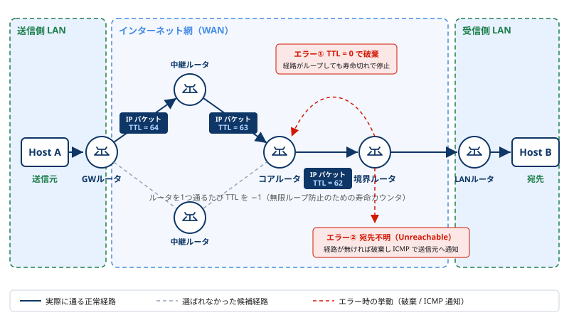

::: {.info-contents .font-08 .padding-L-05 .lh-12 style="margin-right:2em"}



- データ配送はバケツリレー（Hop-by-Hop 転送）
- 各ルータ[^router-roles]は「次にどこへ渡すか」だけを判断してパケットを隣のルータへ手渡す．全体の経路を1台が把握する必要はない．

:::


:::
::: {.column width="35%"}



::::{.message-card .position-left-05 .font-08}

:::{.message-card-title-no-margin .center}

① LANから別のLANへの旅

:::

:::{.message-card-body .squaredmark .font-08}

- 同一LAN外への通信は，まずデフォルトゲートウェイ（ルーター）へ転送される．
- ルーター間の移動（1ホップ）ごとに，L2のヘッダは書き換わるが，L3パケット（IP宛先）は維持され

:::

::::




::::{.message-card .position-left-05 .font-08}

:::{.message-card-title-no-margin .center}

② TTL（生存時間）切れによる破

:::

:::{.message-card-body .squaredmark .font-08}

- ルーターを1つ通過するたびに，IPヘッダ内のTTL値が1ずつ減算される．
- 経路ループ等でパケットが迷子になり，TTL=0になった時点でそのルーターがパケットを破棄する

:::

::::



::::{.message-card .position-left-05 .font-08}

:::{.message-card-title-no-margin .center}

③ 宛先不明による破棄

:::

:::{.message-card-body .squaredmark .font-08}

- ルーターの持つ「ルーティングテーブル（経路表）」に，該当する宛先IPの経路情報が存在しない場合．
- パケットは即座に破棄され，送信元へエラー（ICMP）が通知される．
:::

::::

:::
::::

<!-- footer -->

[^router-roles]: **中継ルータ**：WAN内でパケットを次のルータへ転送する一般的なルータ（経路選択を担う）．**コアルータ**：ISP網の中心で大量のトラフィックを高速転送する基幹ルータ．**境界ルータ**：自網と外部網（別ISP・LAN）の接点に置かれ，網をまたぐ出入口となるルータ．

# アプリケーション層{.nested}
## アプリケーションプロトコル


# トランスポート層{.nested}
## トランスポート層の役割



:::: {.main-message-box}

::: {.info-contents .font-08 .padding-L-05 .lh-12}

- トランスポート層の役割は，データを適切なアプリケーションへ届けること
- アプリケーションから大量のデータが渡された場合は，送信可能な大きさに分割する（TCP: セグメント化，UDP: データグラム化）

:::
::::

:::: {.columns}
::: {.column width="50%"}

:::{.border-bottom-header}

TCP: 信用第一（WWW，電子メール）

:::

```{mermaid}
%%| fig-width: 8
%%{
  init: {
    'theme': 'base',
    'themeVariables': {
      'fontFamily': 'Meiryo',
      'primaryColor': '#E8F1FE',
      'primaryTextColor': '#1A1A1A',
      'primaryBorderColor': '#428CE6',
      'secondaryColor': '#B4D7FF',
      'tertiaryColor': '#E8F1FE',
      'noteBkgColor': '#FBE7E6',
      'noteTextColor': '#1A1A1A',
      'noteBorderColor': '#D31804',
      'activationBorderColor': '#0E3666',
      'activationBkgColor': '#B4D7FF',
      'sequenceNumberColor': '#FFFFFF',
      'actorBkg': '#0E3666',
      'actorTextColor': '#FFFFFF',
      'actorLineColor': '#575757',
      'labelBoxBkgColor': '#E8F1FE',
      'labelBoxBorderColor': '#428CE6',
      'labelTextColor': '#0E3666',
      'loopTextColor': '#0E3666',
      'signalColor': '#0E3666',
      'signalTextColor': '#1A1A1A'
    },
    'sequence': {
      'useMaxWidth': true,
      'actorMargin': 260,
      'width': 130,
      'height': 28,
      'boxMargin': 4,
      'boxTextMargin': 3,
      'noteMargin': 6,
      'messageMargin': 18
    }
  }
}%%
sequenceDiagram
    participant C as 送信側
    participant S as 受信側
    Note over C,S: ① コネクション確立（3ウェイハンドシェイク）
    C->>S: SYN（接続したい）
    S->>C: SYN/ACK（了解，どうぞ）
    C->>S: ACK（確認OK）
    Note over C,S: ② データ転送（受信確認つき）
    C->>S: データ
    S->>C: ACK（受け取った）
    Note over C,S: ③ コネクション切断
    C->>S: FIN（終了します）
    S->>C: ACK（了解）
```

:::
::: {.column width="50%"}

:::{.border-bottom-header}

UDP: 速さで勝負（IP電話，ストリーミングサービス）

:::

```{mermaid}
%%| fig-width: 8
%%{
  init: {
    'theme': 'base',
    'themeVariables': {
      'fontFamily': 'Meiryo',
      'primaryColor': '#E8F1FE',
      'primaryTextColor': '#1A1A1A',
      'primaryBorderColor': '#428CE6',
      'secondaryColor': '#B4D7FF',
      'tertiaryColor': '#E8F1FE',
      'noteBkgColor': '#FBE7E6',
      'noteTextColor': '#1A1A1A',
      'noteBorderColor': '#D31804',
      'activationBorderColor': '#0E3666',
      'activationBkgColor': '#B4D7FF',
      'sequenceNumberColor': '#FFFFFF',
      'actorBkg': '#0E3666',
      'actorTextColor': '#FFFFFF',
      'actorLineColor': '#575757',
      'labelBoxBkgColor': '#E8F1FE',
      'labelBoxBorderColor': '#428CE6',
      'labelTextColor': '#0E3666',
      'loopTextColor': '#0E3666',
      'signalColor': '#0E3666',
      'signalTextColor': '#1A1A1A'
    },
    'sequence': {
      'useMaxWidth': true,
      'actorMargin': 260,
      'width': 130,
      'height': 28,
      'boxMargin': 4,
      'boxTextMargin': 3,
      'noteMargin': 6,
      'messageMargin': 18
    }
  }
}%%
sequenceDiagram
    participant C as 送信側
    participant S as 受信側
    Note over C,S: 確立も確認もなく一方的に送る
    C->>S: データ
    C->>S: 次のデータ
    C->>S: さらにデータ
    Note right of S: 受信確認（ACK）なし<br/>欠落しても再送しない
```

:::
::::


## アプリケーション層の出入り口としてのポート



:::: {.main-message-box}

::: {.info-contents .font-08 .padding-L-05 .lh-12}

- アプリケーションごとの「出入り口」がポート (Port) であり，通信相手はポート番号を指定してデータを送る
- IPアドレスが「どのコンピュータか」を識別するのに対し，ポート番号は「そのコンピュータ内のどのアプリケーションか」を識別
- ポート番号を独自に設定することもできるが，よく利用されるサービス向けには ウェルノウンポート (0～1023) が予約されている

:::
::::



::::{.custom-table style="width:100%; font-size: 0.7em !important;"}
:::{.yaml2table .yaml2table-custom-top #yaml-wellknown-ports data-col-widths="[22, 24, 24, 30]"}

```yaml
record1:
  サービス:
    - Web（HTTP）
  アプリケーション層プロトコル:
    - HTTP
  ポート / トランスポート:
    - 80 / TCP
  説明:
    - 暗号化なしのWebページ閲覧

record2:
  サービス:
    - Web（HTTPS）
  アプリケーション層プロトコル:
    - HTTP over TLS
  ポート / トランスポート:
    - 443 / TCP
  説明:
    - TLSで暗号化されたWebページ閲覧

record3:
  サービス:
    - メール送信
  アプリケーション層プロトコル:
    - SMTP
  ポート / トランスポート:
    - 25 / TCP
  説明:
    - サーバー間でのメール転送

record3b:
  サービス:
    - メール送信（認証付き）
  アプリケーション層プロトコル:
    - SMTP（Submission）
  ポート / トランスポート:
    - 587 / TCP
  説明:
    - メールソフトからサーバーへ送信
    - SMTP-AUTHで認証・STARTTLSで暗号化

record4:
  サービス:
    - メール受信
  アプリケーション層プロトコル:
    - POP3
  ポート / トランスポート:
    - 110 / TCP
  説明:
    - サーバーからメールを取り出す

record5:
  サービス:
    - 名前解決
  アプリケーション層プロトコル:
    - DNS
  ポート / トランスポート:
    - 53 / UDP・TCP
  説明:
    - ドメイン名とIPアドレスの相互変換

record6:
  サービス:
    - リモート接続
  アプリケーション層プロトコル:
    - SSH
  ポート / トランスポート:
    - 22 / TCP
  説明:
    - 暗号化された遠隔ログイン・操作

record7:
  サービス:
    - 時刻同期
  アプリケーション層プロトコル:
    - NTP
  ポート / トランスポート:
    - 123 / UDP
  説明:
    - 機器の時刻をサーバーに合わせる

record8:
  サービス:
    - ファイル転送
  アプリケーション層プロトコル:
    - FTP
  ポート / トランスポート:
    - 21 / TCP（制御）
    - 20 / TCP（データ）
  説明:
    - ファイルのアップロード・ダウンロード
    - 制御用とデータ用で2つのポートを使う
```

:::
::::

# ネットワーク層{.nested}
## ネットワーク層[^osimodelbased]の役割



:::: {.main-message-box}

::: {.info-contents .font-08 .padding-L-05 .lh-12}



- ネットワーク層の役割は，異なるコンピュータネットワーク間でパケットを目的地へ転送すること
- トランスポート層で「セグメント」と呼ばれていたものをデータとして，それにIPヘッダを付与して[IPデータグラム]{.regmonkey-bold}を生成する

:::
::::

::::: {.columns}

:::: {.column style="width: 50%; height:90%"}

:::{.horizontal-keypoints-block style="height:70%;"}

:::{.block-header}
通信相手を特定する
:::



:::{style="text-align:center;"}

:::



:::{style="text-align:center; font-size:1.1em;"}
[「誰に届けるか」を決める役割]{.regmonkey-bold}
:::



:::{.block style="font-size:0.8em; padding-right:0.5em;" .lh-12}

- IPアドレスによって，送信元と宛先のコンピュータを一意に識別する
- データリンク層のMACアドレスがリンク内の識別であるのに対し，IPアドレスはネットワークをまたいだ識別を担う
- イメージ：宛名（住所）を書く

:::

:::
::::

:::: {.column style="width: 50%; height:90%"}


:::{.horizontal-keypoints-block-no-border style="height:70%;"}

:::{.block-header}
宛先までの経路を決める
:::



:::{style="text-align:center;"}

:::



:::{style="text-align:center; font-size:1.1em;"}
[「どの道で届けるか」を決める役割]{.regmonkey-bold}
:::



:::{.block style="font-size:0.8em; padding-right:0.5em;" .lh-12}

- 複数のネットワークを経由して，宛先まで最適な経路でパケットを中継する（ルーティング）
- ルータが経路表をもとに，次にどのネットワークへ転送するかを判断する
- イメージ：配送ルートを選ぶ

:::

:::
::::

:::::


<!-- footer -->

[^osimodelbased]: TCP/IPモデルではインターネット層のほうが用語としてよく使用される．OSI参照モデルではネットワーク層．

## IP プロトコルの役割と特徴



:::: {.main-message-box}

::: {.info-contents .font-08 .padding-L-05 .lh-12}

- IP（Internet Protocol）は，異なるネットワーク同士を接続した環境でデータを届けるための通信ルール
- データは**IPデータグラム（IPパケット）**という単位で送受信される
- 送信元・宛先をIPアドレスで識別し，宛先までデータを転送するための経路選択（ルーティング）を可能にする[^routing]

:::
::::



[IPプロトコルの特徴]{.mini-section}

::: {.regmonkey_index style="width:100%" .padding-L-10}

```yml
regmonkey_index:
  title_fontsize: 1.1em
  bullet_fontsize: 0.85em
  numbering: true
  children:
    - title: コネクションレス型通信
      description:
        - 通信相手の確認と通信経路設定を行わずに直ちに通信を始める
        - 各データグラムは他のデータグラムと無関係に独立して扱われる
      width: [35,65]
    - title: ベストエフォート型
      description:
        - 到達保証・順序保証・フロー制御・再送制御はいずれも提供しない
        - ヘッダチェックサムによるヘッダ検証のみ行い，エラー検出時はデータグラムを破棄してICMPで通知
      width: [35,65]
    - title: フラグメンテーションと再組立
      description:
        - MTUの小さいネットワークを通過する際，データグラムを分割（フラグメント）して送信する（データリンク層で扱えるサイズより大きいときは分割してからヘッダをつける）
        - 分割されたデータグラムは最終宛先で再組立される
      width: [35,65]
    - title: TTLによるループ防止
      description:
        - 送信者がTTL（Time to Live）値をセットし，経路上の各ノードで減算される
        - TTLがゼロになると該当データグラムは破棄され，ネットワーク内での無限滞留を防ぐ
      width: [35,65]
```

:::


<!-- footer -->

[^routing]: IPはルーティング（経路選択）を可能にするプロトコルであって，実際の経路選択はルーターが行う


## コンピューターのネットワーク上の住所を示すIPアドレス



:::: {.main-message-box}

::: {.info-contents .font-08 .padding-L-05 .lh-12}

- IPアドレスは，ネットワーク上の機器を区別するための番号(=コンピューターのネットワーク上の住所)
- IPアドレスは，住所でいう「町名」にあたる「ネットワーク部」と，「番地」にあたる「ホスト部」から構成されている
- 32 bit列からなるIPv4と，128 bit列からなるIPv6がある

:::
::::

:::: {.columns}
::: {.column width="55%"}

:::{.border-bottom-header}

IPアドレスがあることで，コンピューター間で通信が可能

:::

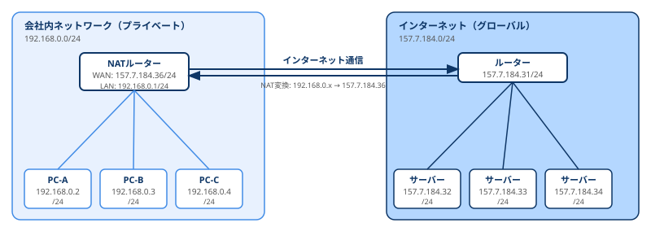

:::{.font-08}

- NATとはプライベートアドレス[^private-ip]とグローバルアドレスを1:1に対応変換する仕組み
- NATルーターを通過後は送信元が 157.7.184.36 に書き換わる

:::


:::
::: {.column width="45%"}



::::{.message-card .font-08}

:::{.message-card-title-no-margin .center}

IPアドレスの構造 (192.168.0.2/24)

:::

:::{.message-card-body .squaredmark .font-09}

- `192.168.0.2/24` のうち，`/24` はCIDR表記[^subnetmask]で，ネットワークのbit数を示す
- `192.168.0.2/24` のうち，先頭24bit（`192.168.0`）が**ネットワーク部**（町名），残り8bit（`.2`）が**ホスト部**（番地）
- 同じネットワーク部を持つ機器は同一ネットワークに属し，ホスト部で個々の機器を識別する


:::

::::



::::{.message-card .font-08}

:::{.message-card-title-no-margin .center}

IPv4 vs IPv6

:::



:::{.message-card-body .squaredmark style="font-size: 0.85em;"}

| 項目 | IPv4 | IPv6 |
|------|---------|---------|
| アドレス長 | 32 ビット | 128 ビット |
| 表記例 | `192.168.0.1`（10進法） | `2001:db8::1`（16進法） |
| アドレス空間 | $2^{32}$ = 約 43 億 | $2^{128}$ = 約 $3.4 \times 10^{38}$ |
| 自動設定 | DHCP が必要 | SLAAC で自動設定可能 |

:::

::::

:::
::::


<!-- footer -->

[^private-ip]: プライベートアドレスはLAN内でのみ利用できるアドレスであり，そのままではインターネットと通信できない
[^subnetmask]: IPv4の場合，ネットワークの範囲はサブネットマスクを用いて示す場合もある． CIDR表記の `/24` は，サブネットマスク `255.255.255.0` に相当する．

## CIDRの`/n`はネットワーク部のビット数を表す
[IPv4 CIDR表記とサブネットマスク]{.topleftbox}



:::: {.main-message-box}

::: {.info-contents .font-08 .padding-L-05 .lh-12}



- CIDRは，クラスA~CのIPアドレスクラス[^addressclass]にとらわれずに，ネットワーク部とホスト部の区切りを1 bit単位で設定できる方式のこと
- CIDR表記 `/n` は先頭から `n` ビットがネットワーク部，残り `32 - n` ビットがホスト部であることを表す
- サブネットマスクの最終オクテットは[`255 − ホスト部最大値（2^ホスト部ビット数 − 1）`]{.regmonkey-bold}で求められる

:::
::::



::::{.custom-table style="width:100%; font-size: 0.9em !important;"}

| CIDR | ホスト部のビット数 | ホスト部の最大値 (`2^n − 1`) | 計算式 | サブネットマスク |
| ---- | ----------: | ---------------: | ----------------- | --------------- |
| /24  |         8 |                  255 | `255 − 255 = 0`   | 255.255.255.0   |
| /25  |         7 |                  127 | `255 − 127 = 128` | 255.255.255.128 |
| /26  |         6 |                   63 | `255 − 63 = 192`  | 255.255.255.192 |
| /27  |         5 |                   31 | `255 − 31 = 224`  | 255.255.255.224 |
| /28  |         4 |                   15 | `255 − 15 = 240`  | 255.255.255.240 |
| /29  |         3 |                    7 | `255 − 7 = 248`   | 255.255.255.248 |
| /30  |         2 |                    3 | `255 − 3 = 252`   | 255.255.255.252 |
| /31  |         1 |                    1 | `255 − 1 = 254`   | 255.255.255.254 |
| /32  |         0 |                    0 | `255 − 0 = 255`   | 255.255.255.255 |

::::

<!-- footer -->

[^addressclass]: Pアドレスクラスとは，IPアドレスをネットワーク規模に応じてクラスA (`/8`: 大規模ネットワーク)，クラスB (`/26`: 中規模)，クラスC (`/24`: 小規模)に分類する方式のこと

## サブネットマスクとサブネットワークアドレス



:::: {.main-message-box}

::: {.info-contents .font-08 .padding-L-05 .lh-12}

サブネットマスクが `255.255.252.0` のとき，IPアドレス `172.30.123.45` のホストが属するサブネットワークアドレスは？

:::
::::



[① CIDR表記への変換]{.mini-section}


- サブネットマスク `255.255.252.0` を2進数に変換: `11111111.11111111.11111100.00000000`[^subnetmaskrule]
- 1が連続する個数を数える → **CIDR 表記は `/22`**（$255-252=3$より $8 + 2 = 10$ bitがホスト部とも計算可能）



[② ネットワークアドレスの計算]{.mini-section}

:::: {.columns}
::: {.column width="50%"}

- IPアドレス `172.30.123.45` とサブネットマスクの AND 演算
- よってサブネットワークアドレスは **`172.30.120.0`**


::: {.callout-note}
### [ネットワークアドレス]{.padding-L-10}

- ネットワークアドレスとは、ネットワークの代表となるアドレス
- IPアドレスのホスト部をすべて `0` にした値で表される
  - ネットワークアドレス: `172.30.120.0`
  - 利用可能ホスト: `172.30.120.1` ～ `172.30.123.254`
  - ブロードキャストアドレス: `172.30.123.255`

:::


:::
::: {.column width="50%"}

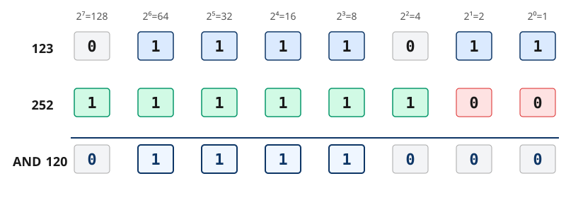

:::
::::

[^subnetmaskrule]: 左端から始まる「1」の部分がネットワーク部を表すので，`255.255.255.1` などは設定不可能


## ネットワークの細分化



:::: {.main-message-box}

::: {.info-contents .font-08 .padding-L-05 .lh-12}

- 1つの大きなネットワークを複数の小さなネットワークに分ける仕組みを[サブネット]{.regmonkey-bold}と呼ぶ
- 会社などでは，部署ごとにネットワークを分割，来客用Wi-Fiと社内ネットワークを分離を目的に使用される場合が多い

:::
::::

:::: {.columns}
::: {.column width="50%"}

:::{.border-bottom-header}
サブネットの作り方
:::

::::{.message-card .font-08}

:::{.message-card-title-no-margin .center}

① 必要なサブネット数・ホスト数を決める

:::

:::{.message-card-body .squaredmark .font-09}

- 何個のサブネットに分割するか，各サブネットに何台接続するかを整理する

:::

::::



::::{.message-card .font-08}

:::{.message-card-title-no-margin .center}

② サブネットマスクのビット数を決める

:::

:::{.message-card-body .squaredmark .font-09}

- 必要サブネット数を2の累乗で上回る最小のビット数 $n$ を借りる
- CIDR表記：元のプレフィックス長 $+\,n$

:::

::::



::::{.message-card .font-08}

:::{.message-card-title-no-margin .center}

③ 各サブネットのアドレス範囲を割り当てる

:::

:::{.message-card-body .squaredmark .font-09}

- ネットワークアドレス・ブロードキャストアドレスを除いた残りがホストに割り当て可能
- 割り当て可能ホスト数 $= 2^{(32-\text{prefix})} - 2$

:::

::::

:::
::: {.column width="50%"}

:::{.border-bottom-header}

Quiz: サブネットの分割

:::

:::{.font-08}

[問題]{.mini-section}

:::{.padding-L-20}

クラスC[^classcip]のIPアドレスを分割して，10個のサブネットを使用したい．ホスト数が最も多くなるように分割した場合のサブネットマスクはどうなるか？

:::


[解答]{.mini-section}

:::{.padding-L-20}

10個以上のサブネットを作るには

- $2^3 = 8$ 個 → 不足
- $2^4 = 16$ 個 → 十分

したがってホスト部から4bit追加で必要．クラスCのサブネットマスクが`/24` であるので

$$
24 + 4 = 28
$$

よって，$255 - (2^4 - 1) = 240$より，`255.255.255.240` が答え．

:::

:::
:::

::::


<!-- footer -->

[^classcip]: クラスCのデフォルトサブネットマスクは `255.255.255.0`（`/24`）


## IPv6の表記ルール

:::: {.columns}
::: {.column width="65%"}



::::{.message-card .font-08}

:::{.message-card-title-no-margin .center}

① 基本表記

:::

:::{.message-card-body .squaredmark .font-10}

- 128ビットを16ビットずつ8グループに分割し，`:`（コロン）で区切る
- 各グループは**16進数**で表記
- 例：`2001:0db8:0000:0000:0000:0000:0000:0001`

:::

::::



::::{.message-card .font-08}

:::{.message-card-title-no-margin .center}

② 省略ルール

:::

:::{.message-card-body .squaredmark .font-10}

- **先頭の連続する `0` は省略可**：`0db8` → `db8`，`0001` → `1`
- **連続するゼログループは `::` で1か所だけ省略可**：`0000:0000:0000:0000:0000:0000` → `::`
- 両方を適用：`2001:0db8:0000:0000:0000:0000:0000:0001` → `2001:db8::1`
- `2001:db8::3ab::ff01` は二箇所で `::` が使用されているので間違った表記

:::

::::



::::{.message-card .font-08}

:::{.message-card-title-no-margin .center}

③ CIDR表記（サブネットマスク）

:::

:::{.message-card-body .squaredmark .font-10}

- IPv4 同様，`/プレフィックス長` でネットワーク部のビット数を示す
- `/64`：通常のLANサブネット　`/48`：サイト単位　`/32`：ISPブロック　`/128`：ホスト1台
- 例：`2001:db8::/32`，`2001:db8:1:2::/64`

:::

::::

:::
::: {.column width="35%" .padding-L-10}



:::{.border-bottom-header}

`fe80::` から始まるIPv6

:::

:::{.font-08}

`ip addr` コマンドを実行すると，`fe80::` で始まるアドレスが表示される場合があります




:::{.font-14}

```bash
$ ip addr show eth0
2: eth0: <BROADCAST,MULTICAST,UP>
    inet6 fe80::1a2b:3cff:fe4d:5e6f/64
         scope link
```

:::



- これは[リンクローカルアドレス]{.regmonkey-bold}と呼ばれる特殊なIPv6アドレスを示す
- 1台の機器に割り当てられるIPv6アドレスで，同一リンク（同じネットワークセグメント）内だけで有効
- ルーターを越えて転送されない（インターネットには出ていかない）
- 同じリンク（同じLAN）内であれば他の機器からアクセス可能
- NICが起動すると**MACアドレスから自動生成**される（DHCPもDNSも不要）

:::


:::
::::

## IPアドレスの設定
[固定で割り当てる方法と，サーバーがクライアントに対して自動に割り当てる方式がある]{.h2-submessage}



::::{.custom-table style="width:100%; font-size: 0.8em !important; margin-bottom:0.5em;"}
:::{.yaml2table .yaml2table-custom-top #yaml-ip-config-methods data-col-widths="[16, 26, 58]"}

```yaml
record1:
  方法:
    - 静的設定
  誰がIPアドレスを決めるか:
    - 人間（管理者）
  備考:
    - OS のネットワーク設定に直接記入する
    - サーバーやルーターなど，アドレスが変わると困る機器に用いる

record2:
  方法:
    - RARP
  誰がIPアドレスを決めるか:
    - RARP サーバー
  備考:
    - クライアントの MAC アドレスに対応する IP アドレスを返す
    - ディスクレス端末などで使われた古い仕組みで，現在は DHCP に置き換えられている

record3:
  方法:
    - DHCP
  誰がIPアドレスを決めるか:
    - DHCP サーバー
  備考:
    - IP アドレスに加えて，サブネットマスク・デフォルトゲートウェイ・DNS サーバーなどの設定も配布する
    - 現在の LAN における自動設定の標準
```

:::
::::



[IPv6 の自動設定：RA の M・O フラグ[^raflags]により3方式に分かれる]{.mini-section}



:::: {.columns}
::: {.column width="33%"}

::::{.message-card .font-08}

:::{.message-card-title-no-margin .center}

① SLAAC のみ（M=0・O=0）

:::

:::{.message-card-body .squaredmark .font-09}

- RA（ルーター広告）の情報だけでクライアントがアドレスを自動生成（DHCPv6 は使わない）

:::

::::

:::
::: {.column width="33%"}

::::{.message-card .font-08}

:::{.message-card-title-no-margin .center}

② ステートレス DHCPv6（M=0・O=1）

:::

:::{.message-card-body .squaredmark .font-09}

- アドレスは SLAAC で生成し，DNS サーバーなどの付加情報だけを DHCPv6 が配布する

:::

::::

:::
::: {.column width="33%"}

::::{.message-card .font-08}

:::{.message-card-title-no-margin .center}

③ ステートフル DHCPv6（M=1）

:::

:::{.message-card-body .squaredmark .font-09}

- IPv4 の DHCP と同様に，DHCPv6 サーバーがアドレスそのものを配布・管理する

:::

::::

:::
::::

<!-- footer -->

[^raflags]: SLAAC はステートレスアドレス自動設定（RFC 4862）．RA の M（Managed）フラグはアドレスを DHCPv6 で配布するか，O（Other）フラグは DNS などの付加情報を DHCPv6 から取得するかを示す．

## DHCPの仕組み
[DHCPサーバーがアドレスプールから割当可能なIPアドレスを都度割り当てる]{.h2-submessage}

:::: {.columns}
::: {.column width="75%"}



:::{style="text-align:center;"}

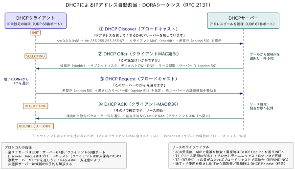{width=100%}

:::


:::
::: {.column width="25%"}

:::{.border-bottom-header}

DHCPのポイント

:::

:::{.font-08}

- [DHCPクライアント]{.regmonkey-bold}：IP設定を持たずに起動し，ネットワーク設定を要求する側（PC・スマホなど）



- [DHCPサーバー]{.regmonkey-bold}：アドレスプールから空きIPを選び，サブネットマスク・デフォルトゲートウェイ・DNSとあわせて期限付きで貸し出す（家庭ではルーターが兼務）



- [送信元 0.0.0.0]{.regmonkey-bold}：クライアントは自分のIPアドレスをまだ持っていないため，「未割り当て」を意味する 0.0.0.0 を送信元にする



- [宛先 255.255.255.255]{.regmonkey-bold}：サーバーのIPアドレスも不明なため，同一セグメント全体に届くブロードキャスト宛に送る（ルーターは越えない）

:::

:::
::::

## NAT・NAPTによるIPアドレス変換



:::: {.main-message-box}

::: {.info-contents .font-08 .padding-L-05 .lh-12}



- NAT（Network Address Translation）は，IPアドレスを別のIPアドレスへ変換する技術
- NAPT（Network Address Port Translation）は，IPアドレスとポート番号を変換する技術
- 家庭用や企業のルーターでは，NAPTを利用して複数の端末が1つのグローバルIPアドレスを共有してインターネットへ接続している

:::
::::


:::: {.columns}
::: {.column width="50%"}

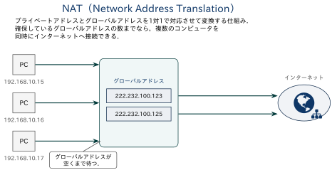{width=100%}

:::{.font-07}

- ルーターがIPヘッダの送信元IPアドレスを書き換える
  - NAT → ネットワーク層の情報を書き換える

:::

:::
::: {.column width="50%"}


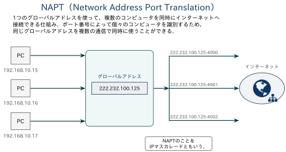{width=100%}

:::{.font-07}


- IPヘッダの送信元IPアドレスとTCP/UDPヘッダの送信元ポート番号が書き換えられる
  - NAPT → ネットワーク層 + トランスポート層の情報を書き換える
- 返信パケットを受信した際には，ルーターが変換テーブルを参照して元のIPアドレスやポート番号に復元する

:::


:::
::::


# データリンク層{.nested}
## 機器を同一の方法でつなげたひとかたまりをデータリンクという



:::: {.main-message-box}

::: {.info-contents .font-08 .padding-L-05 .lh-12}



- データリンクとは，同じ通信方式（プロトコル・媒体）で接続された機器のひとかたまり＝1つのリンクセグメント
- この「データリンク = 接続方式が共通な範囲」内での通信を管理するのがデータリンク層の役割
  - ネットワーク層（IP）は複数のデータリンクをまたいで通信を実現するための仕組み

:::
::::



[インターネットはデータリンクの集まり]{.mini-section}




:::{.hotfix-mermaid-label style="width:100%"}

```{mermaid}
%%| fig-width: 20
%%{init: {'theme': 'base',
          'flowchart': { 'padding': 10, 'nodeSpacing': 120, 'rankSpacing': 70, 'htmlLabels': false, 'wrappingWidth': 800 },
          'themeVariables': { 'background': '#ffffff',
                              'primaryColor': '#ffffff',
                              'primaryTextColor': '#1A1A1A',
                              'primaryBorderColor': '#0E3666',
                              'lineColor': '#0E3666',
                              'clusterBkg': '#F2F5F9',
                              'clusterBorder': '#0E3666',
                              'fontFamily': 'Meiryo, sans-serif',
                              'fontSize': '22px' }}}%%
graph LR
    subgraph Global [インターネット]
        direction LR

        subgraph DL1 ["データリンクA<br>（Ethernet）"]
            PC1[PC] --- SW[スイッチ]
            PC2[PC] --- SW
            SW --- R1((ルータ))
        end

        subgraph DL2 ["データリンクB<br>（WAN/PPP）"]
            direction LR
            R1 ===|IPパケットが<br>データリンクを<br>跨いで転送| R2((ルータ))
        end

        subgraph DL3 ["データリンクC<br>（Wi-Fi）"]
            R2 --- AP[アクセスポイント]
            AP -.- SP1[ノートPC]
            AP -.- SP2[iPhone&nbsp;&nbsp;&nbsp;:&nbsp;]
        end
    end

style DL1 fill:#EAF1F8,stroke:#0E3666,stroke-width:2px,stroke-dasharray: 5 5
style DL2 fill:#FBEFE6,stroke:#C2611B,stroke-width:2px,stroke-dasharray: 5 5
style DL3 fill:#EAF1F8,stroke:#0E3666,stroke-width:2px,stroke-dasharray: 5 5
style Global fill:none,stroke:#9AA7B5,stroke-width:1px
style R1 fill:#0E3666,stroke:#0E3666,stroke-width:2px,color:#ffffff
style R2 fill:#0E3666,stroke:#0E3666,stroke-width:2px,color:#ffffff
style SW fill:#ffffff,stroke:#0E3666
style AP fill:#ffffff,stroke:#0E3666
```

:::

:::{.font-09}

- ルータはデータリンクの境界
- 同じIPパケットでも，通過するデータリンクごとに異なるフレームへ包み直される

:::


## データリンクの構成要素
[1つのリンクセグメント（データリンク）は，主に以下の3つの要素によって構成される]{.h2-submessage}



::::: {.columns}

:::: {.column style="width: 33.3%; height:100%"}



:::{.horizontal-keypoints-block style="height:70%;"}

:::{.block-header}
ノードとNIC
:::



:::{style="text-align:center;"}

:::



:::{style="text-align:center; font-size:1.1em;"}
[「通信の主体」]{.regmonkey-bold}
:::



:::{.block  style="font-size:0.8em; padding-right:0.5em;" .lh-12}

- 通信を行う主体となるPCやルータなどの[機器（ノード）]{.regmonkey-bold}
- それらを媒体に接続するための[ネットワークインターフェース（NIC）]{.regmonkey-bold}

:::

:::
::::

:::: {.column style="width: 33.3%; height:100%"}



:::{.horizontal-keypoints-block style="height:70%;"}

:::{.block-header}
通信媒体
:::



:::{style="text-align:center;"}

:::



:::{style="text-align:center; font-size:1.1em;"}
[「信号の通り道」]{.regmonkey-bold}
:::



:::{.block  style="font-size:0.8em; padding-right:0.5em;" .lh-12}

- 信号が物理的に伝わる道筋
- LANケーブルや光ファイバー[^cabletype]などの[有線媒体]{.regmonkey-bold}
- 電波や赤外線などの[無線媒体]{.regmonkey-bold}がある

:::

:::
::::

:::: {.column style="width: 33.3%; height:100%"}



:::{.horizontal-keypoints-block-no-border style="height:70%;"}

:::{.block-header}
L2プロトコル
:::



:::{style="text-align:center;"}

:::



:::{style="text-align:center; font-size:1.1em;"}
[「共通ルール」]{.regmonkey-bold}
:::



:::{.block  style="font-size:0.8em; padding-right:0.5em;" .lh-12}

- 同じ媒体上で衝突を防ぎ，データを正しく届けるための[共通ルール]{.regmonkey-bold}
- EthernetやWi-Fi(802.11)などがこれに該当する

:::

:::
::::

:::::

<!-- footer -->

[^cabletype]: 光ファイバーは，光の明滅で信号を伝える．金属線ケーブルの場合は，電圧の変化で信号を伝える．金属線ケーブルにおける電圧の波形は歪みやすいので，長距離の伝送には信号を増幅する・修正するリピーターが必要


## ネットワーク層と物理層の橋渡しとしてのデータリンク層



:::: {.main-message-box}

::: {.info-contents .font-08 .padding-L-05 .lh-12}

- データリンク層では，データにヘッダを付けたものを[フレーム]{.regmonkey-bold}と呼ぶ
- 送信側は，上位から受け取った IP パケットに Header（MAC アドレス等）と FCSを付けてフレームを構成する
- 受信側は， FCS で誤り検出を行い，宛先MACが自分宛のフレームのみ受け取り，IP パケットを取り出し，上位層へ渡す

:::
::::



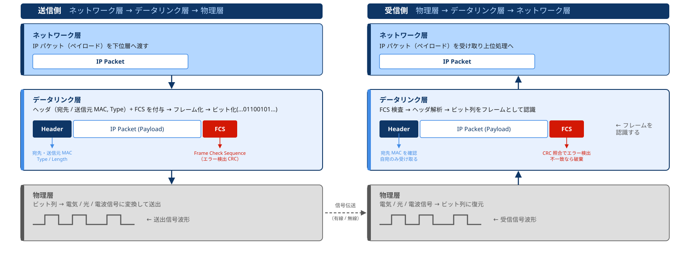


## PPP: Point-to-Point Protocol



:::: {.main-message-box}

::: {.info-contents .font-08 .padding-L-05 .lh-12}

- 2点間で1:1の通信を行うプロトコル（主に電話回線やISDN，専用回線やATM回線などの通信で使用）
- 通信にリンク制御プロトコル(LCP)とネットワーク制御プロトコル(NCP)を使用
- 送信と受信を同時に行うことができる全二重方式(電話のようにやりとりができる ↔ トランシーバーのように待ち発生)

:::
::::


:::: {.columns}
::: {.column width="50%"}

:::{.border-bottom-header}

PPP 接続シーケンス

:::

```{mermaid}
%%| fig-width: 8
%%{
  init: {
    'theme': 'base',
    'themeVariables': {
      'fontFamily': 'Meiryo',
      'primaryColor': '#E8F1FE',
      'primaryTextColor': '#1A1A1A',
      'primaryBorderColor': '#428CE6',
      'secondaryColor': '#B4D7FF',
      'tertiaryColor': '#E8F1FE',
      'noteBkgColor': '#FBE7E6',
      'noteTextColor': '#1A1A1A',
      'noteBorderColor': '#D31804',
      'activationBorderColor': '#0E3666',
      'activationBkgColor': '#B4D7FF',
      'sequenceNumberColor': '#FFFFFF',
      'actorBkg': '#0E3666',
      'actorTextColor': '#FFFFFF',
      'actorLineColor': '#575757',
      'labelBoxBkgColor': '#E8F1FE',
      'labelBoxBorderColor': '#428CE6',
      'labelTextColor': '#0E3666',
      'loopTextColor': '#0E3666',
      'signalColor': '#0E3666',
      'signalTextColor': '#1A1A1A'
    },
    'sequence': {
      'useMaxWidth': true,
      'actorMargin': 260,
      'width': 130,
      'height': 28,
      'boxMargin': 4,
      'boxTextMargin': 3,
      'noteMargin': 6,
      'messageMargin': 18
    }
  }
}%%
sequenceDiagram
    participant C as 接続元
    participant S as 接続先
    Note over C,S: ① リンク確立（LCP）: 通信要求の送信
    C->>S: リンク確立要求
    S->>C: 設定の合意
    Note over C,S: ② 認証フェーズ（PAP/CHAP）: 利用者認証
    C->>S: ユーザー名・パスワード
    S->>C: 認証OK
    Note over C,S: ③ ネットワーク設定（NCP/IPCP）: 通信条件相談
    C->>S: IPアドレス割り当て要求
    S->>C: IPアドレス通知
    Note over C,S: 通信開始: IPパケットの送受信
```


:::
::: {.column width="50%"}

:::{.border-bottom-header}

PPPフレーム

:::

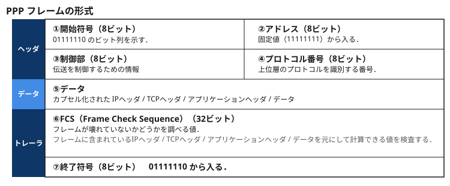


- PPPはTCP/IP以外のプロトコルにも対応
- ネットワーク層のプロトコルがIPになるとは限らない


:::
::::

## IEEE 802.1X: LANへの接続を制御する認証技術
[ネットワークの入口で正規のユーザや端末だけを接続させるための仕組み]{.h2-submessage}

:::: {.columns}
::: {.column width="50%"}



::::{.custom-table style="width:100%; font-size: 0.63em !important;"}
:::{.yaml2table .yaml2table-custom-top #yaml-ieee8021x-components data-col-widths="[22, 25, 33, 20]"}

```yaml
record1:
  構成要素:
    - サプリカント<br>(Supplicant)
  役割:
    - 認証を受けるクライアント
  備考:
    - IEEE802.1Xにおけるクライアント端末，またはクライアントにインストールする認証用ソフトウェア
    - 認証を受けるには対応ソフトウェアが必要だが，近年のOSには標準搭載されていることが多い
  デバイス例:
    - PC

record2:
  構成要素:
    - 認証装置<br>(Authenticator)
  役割:
    - サプリカントと認証サーバの仲介
  備考:
    - IEEE802.1X対応のLANスイッチや無線LANアクセスポイントなど，サプリカントと認証サーバの間に位置するネットワーク機器
    - 認証サーバからの認証結果を受けて，ポート単位でネットワークへのアクセスを許可・遮断する
  デバイス例:
    - 社内LANスイッチ
    - 無線LANアクセスポイント
    - L2スイッチ
    - L3スイッチ

record3:
  構成要素:
    - 認証サーバ<br>(Authentication Server)
  役割:
    - ユーザ・端末の認証を実施
  備考:
    - IEEE802.1X・EAPに対応したRADIUSサーバを用いて認証を行う
  デバイス例:
    - 認証用Linuxサーバ
```

:::
::::


:::
::: {.column width="50%"}

:::{.border-bottom-header}

不正PCのFSへの接続拒否構築例

:::

:::{style="text-align:center;"}

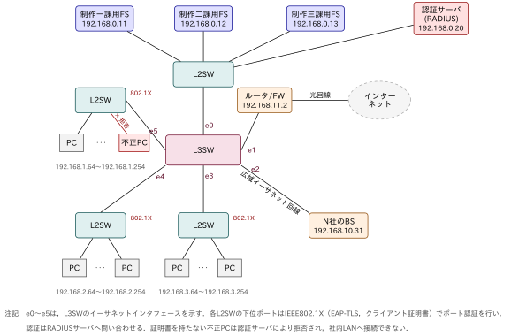{width=100%}

:::

:::
::::


## イーサネットフレームとIPデータグラムの違い
<!-- [コンテンツを記載]{.h2-submessage} -->



:::: {.main-message-box}

::: {.info-contents .font-08 .padding-L-05 .lh-12}



- イーサネットフレーム：TCP/IPモデルのリンク層（Network Access Layer）
- IPデータグラム：TCP/IPモデルのインターネット層（Internet Layer）

:::
::::

:::: {.columns}
::: {.column width="50%"}

:::{.border-bottom-header}

役割と伝送範囲の違い

:::

::: {.font-08 .lh-12}

- イーサネットフレーム：同一リンク内（隣接ノード間）の伝送を担い，宛先は[MACアドレス]{.regmonkey-bold}で指定する
- IPデータグラム：エンドツーエンド（送信元ホストから宛先ホストまで）の伝送を担い，宛先は[IPアドレス]{.regmonkey-bold}で指定する
- ルータを1つ越えるたびにイーサネットフレームは付け替えられるが，IPデータグラムは終端まで同じヘッダを保持する

:::




:::{.border-bottom-header}

右図におけるイーサネットフレームとIPデータグラムの宛先

:::



::: {.font-09 .lh-11}

| 区間 | Ethernet<br>宛先 / 送信元 | IPデータグラム<br>宛先 / 送信元 |
|:--|:--:|:--:|
| **LAN1**（A→ルータ） | MAC3 / MAC1 | IP2 / IP1 |
| **LAN2**（ルータ→B） | MAC2 / MAC4 | IP2 / IP1 |

: {tbl-colwidths="[34,33,33]"}

:::


:::
::: {.column width="50%"}



:::{style="text-align:center;"}

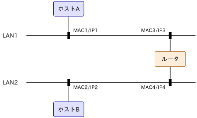{width="100%"}

:::


:::
::::


# 物理層{.nested}
## リピーター: ケーブルで流れる電気信号を増幅し波形を整える機器



:::: {.main-message-box}

::: {.info-contents .font-08 .padding-L-05 .lh-12}



- リピータはケーブルで流れる電気信号を増幅し波形を整えてもう一方のインターフェースから電気信号を流す機器
- 1つのポートからの信号を増幅するという特性上，半二重通信しかできない
- Wi-Fiリピーターはアクセスポイントから受信した無線信号を再送信し，通信可能範囲を広げる機器

:::
::::

:::: {.columns}
::: {.column width="50%"}

:::{.border-bottom-header}

Wi-Fi Repeater

:::

:::: {.columns}
::: {.column width="40%"}

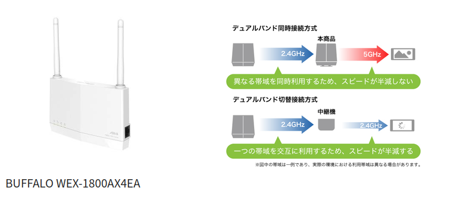{}

:::

::: {.column width="60%"}



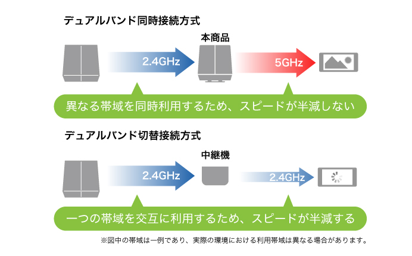

:::
::::

:::

::: {.column width="50%"}



::::{.message-card .font-08}

:::{.message-card-title-no-margin .center}

① 電波が届かない場所への橋渡し

:::

:::{.message-card-body .squaredmark .font-09}

- アクセスポイントからの電波を受信して再送信する
- 壁や距離の影響で電波が弱い場所でも通信しやすくなる
- 利用者からは同じ無線LANの一部として利用できる

:::

::::



::::{.message-card .font-08}

:::{.message-card-title-no-margin .center}

② 通信速度が低下することがある

:::

:::{.message-card-body .squaredmark .font-09}

- Wi-Fiは半二重通信である
- シングルバンド構成では実効スループットが理論上 約 1/2 に低下する（デュアルバンド構成では別チャネルで回避可能）

:::

::::

:::

:::

# ルーティング{.nested}

## レイヤー3スイッチのルーティング



:::: {.main-message-box}

::: {.info-contents .font-08 .padding-L-05 .lh-12}



- L3スイッチは，L2スイッチの機能に加えて「ルーティング機能」を搭載している機器（TCP/IP のネットワーク層で動作）
- 同一組織内の複数の IP ネットワーク（VLAN）を高速に接続する際に利用される
- 主にLAN同士の接続が役割なので，基本的には，NAT/NAPT は搭載されていない

:::
::::


# ネットワーク実践
## L3スイッチのフィルタリングルール設定例



:::: {.main-message-box}

::: {.info-contents .font-08 .padding-L-05 .lh-12}



- 各課のPCから自課のFSへの [ファイル共有 SMB（宛先ポート TCP 445）のみ許可]{.regmonkey-bold} し，FS(ファイルサーバー)を保護する
- FSからN社BSへのバックアップは [SCP（宛先ポート TCP 22）]{.regmonkey-bold} ：広域イーサ回線側の e2 を行き OUT・戻り IN の対で許可
- 各課PCへのIP割当ては [L3SWのDHCP機能（サーバ／リレー）]{.regmonkey-bold} が担い，セグメントごとに 64～254 を配布レンジとする

:::
::::




:::::: {.columns}
::::: {.column width="46%"}


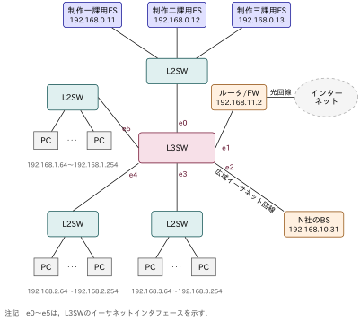{width=100%}

:::::
::::: {.column width="54%"}

:::{.border-bottom-header}

L3スイッチフィルタリングルール例

:::

::::{.custom-table style="width:100%; font-size: 0.55em !important;"}
:::{.yaml2table .yaml2table-custom-top #yaml-l3sw-filtering data-col-widths="[7, 9, 18, 17, 12, 14, 13, 10]"}

```yaml
record1:
  IF:
    - e5
  方向:
    - IN
  送信元IPアドレス:
    - 192.168.1.0/24
  宛先IPアドレス:
    - 192.168.0.11
  プロトコル:
    - TCP
  送信元ポート:
    - ANY
  宛先ポート:
    - 445
  処理:
    - 許可

record2:
  IF:
    - e5
  方向:
    - OUT
  送信元IPアドレス:
    - 192.168.0.11
  宛先IPアドレス:
    - 192.168.1.0/24
  プロトコル:
    - TCP
  送信元ポート:
    - 445
  宛先ポート:
    - ANY
  処理:
    - 許可

record3:
  IF:
    - e4
  方向:
    - IN
  送信元IPアドレス:
    - 192.168.2.0/24
  宛先IPアドレス:
    - 192.168.0.12
  プロトコル:
    - TCP
  送信元ポート:
    - ANY
  宛先ポート:
    - 445
  処理:
    - 許可

record4:
  IF:
    - e4
  方向:
    - OUT
  送信元IPアドレス:
    - 192.168.0.12
  宛先IPアドレス:
    - 192.168.2.0/24
  プロトコル:
    - TCP
  送信元ポート:
    - 445
  宛先ポート:
    - ANY
  処理:
    - 許可

record5:
  IF:
    - e3
  方向:
    - IN
  送信元IPアドレス:
    - 192.168.3.0/24
  宛先IPアドレス:
    - 192.168.0.13
  プロトコル:
    - TCP
  送信元ポート:
    - ANY
  宛先ポート:
    - 445
  処理:
    - 許可

record6:
  IF:
    - e3
  方向:
    - OUT
  送信元IPアドレス:
    - 192.168.0.13
  宛先IPアドレス:
    - 192.168.3.0/24
  プロトコル:
    - TCP
  送信元ポート:
    - 445
  宛先ポート:
    - ANY
  処理:
    - 許可

record7:
  IF:
    - e2
  方向:
    - OUT
  送信元IPアドレス:
    - 192.168.0.0/24
  宛先IPアドレス:
    - 192.168.10.31
  プロトコル:
    - TCP
  送信元ポート:
    - ANY
  宛先ポート:
    - 22
  処理:
    - 許可

record8:
  IF:
    - e2
  方向:
    - IN
  送信元IPアドレス:
    - 192.168.10.31
  宛先IPアドレス:
    - 192.168.0.0/24
  プロトコル:
    - TCP
  送信元ポート:
    - 22
  宛先ポート:
    - ANY
  処理:
    - 許可
```

:::
::::

:::{.font-07}

- 上記の他にインターネットアクセスに関するルールなどの設定が必要
- ルールは上から読まれていくので，最後に [`ANY`, `IN/OUT`, `ANY`, `ANY`, `TCP/UDP`, `ANY`, `ANY`,`遮断`]のようなルールを加えることでホワイトリスト形式でルール運用することがきでる

:::


:::::
::::::


# Appendix{.no-auto-agenda}

## OSI参照モデル



::::{.custom-table style="width:100%; font-size: 0.8em !important;"}
:::{.yaml2table .yaml2table-custom-top #yaml-osi-layers data-col-widths="[25, 50, 25]"}

```yaml
record1:
  Layer:
    - 第7層 アプリケーション層
  Description:
    - ユーザーアプリケーションに通信機能を提供する
    - Web閲覧・メール送受信・名前解決などを実現する
  Protocol:
    - HTTP・FTP・SMTP・DNS

record2:
  Layer:
    - 第6層 プレゼンテーション層
  Description:
    - データの表現形式を統一する
    - 文字コード変換・暗号化・圧縮を担当する
  Protocol:
    - TLS・SSL・MIME

record3:
  Layer:
    - 第5層 セッション層
  Description:
    - 通信の開始・維持・終了を管理する
    - 複数回のやり取りを1つの会話として扱う
  Protocol:
    - NetBIOS・RPC

record4:
  Layer:
    - 第4層 トランスポート層
  Description:
    - アプリケーション間の通信を実現する
    - ポート番号による識別や信頼性制御を行う
  Protocol:
    - TCP・UDP

record5:
  Layer:
    - 第3層 ネットワーク層
  Description:
    - IPアドレスを用いて宛先を識別する
    - ルーターを経由して異なるネットワーク間を中継する
  Protocol:
    - IP・ICMP

record6:
  Layer:
    - 第2層 データリンク層
  Description:
    - MACアドレスを用いて隣接機器へデータを届ける
    - フレーム化や誤り検出を行う
  Protocol:
    - Ethernet・PPP

record7:
  Layer:
    - 第1層 物理層
  Description:
    - ビット列を電気・光・電波へ変換する
    - ケーブルや無線媒体上で信号を伝送する
  Protocol:
    - IEEE 802.3・光ファイバ
```

:::
::::


## WWWとは？
[コンピューターネットワーク活用事例]{.topleftbox}



:::: {.main-message-box}

::: {.info-contents .font-08 .padding-L-05 .lh-12}



- WWW（World Wide Web）の仕組みは，情報を保持するサーバーと，閲覧するブラウザの対話で成り立つ
- やり取りは，アプリケーション層のプロトコルである**HTTP (Hypertext Transfer Protocol)**に則って処理

:::
::::

:::: {.columns}
::: {.column width="60%"}

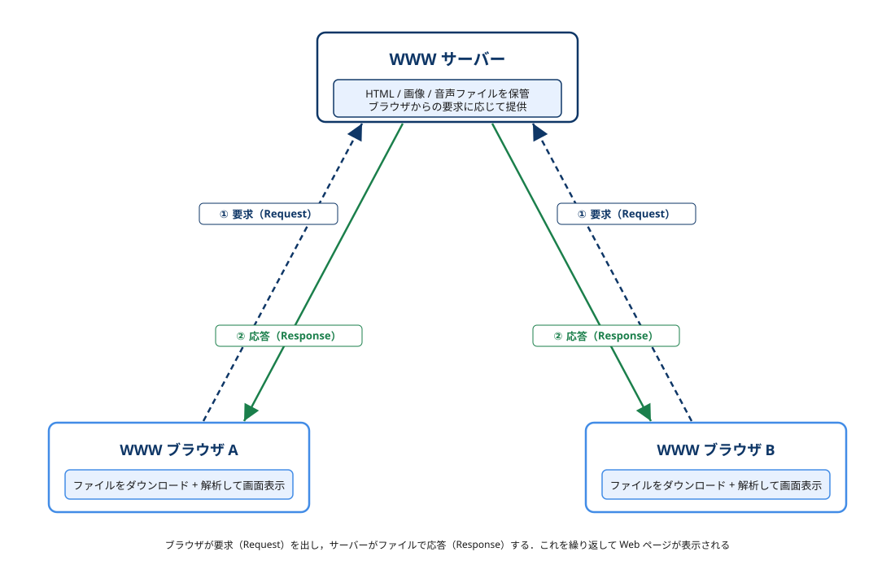

:::
::: {.column width="40%"}



::::{.message-card .position-left-05 .font-08}

:::{.message-card-title-no-margin .center}

① HTTPリクエスト（要求）

:::

:::{.message-card-body .squaredmark .font-08}

- ブラウザにURLを入力するかリンクをクリックすると，サーバーに対して「このデータをください」というHTTPリクエストが送信

:::

::::



::::{.message-card .position-left-05 .font-08}

:::{.message-card-title-no-margin .center}

② HTTPレスポンス（応答）

:::

:::{.message-card-body .squaredmark .font-08}

- クエストを受け取ったWWWサーバーは，指定されたファイル（HTMLや画像など）を探す
- 正常であればステータスコード（200 OK）と共にデータを送り返す

:::

::::



::::{.message-card .position-left-05 .font-08}

:::{.message-card-title-no-margin .center}

③ ブラウザによるレンダリング

:::

:::{.message-card-body .squaredmark .font-08}

- ダウンロードしたHTMLやCSSをブラウザが解析・翻訳し，人間が見やすいWeb画面として組み立てて表示（レンダリング）

:::

::::

:::
::::

## 電子メールはアプリケーション層プロトコルであるSMTP・POP・MIMEの組み合わせで成り立つ


::::: {.columns}

:::: {.column style="width: 33.3%; height:100%"}



:::{.horizontal-keypoints-block style="height:70%;"}

:::{.block-header}
SMTP
:::



:::{style="text-align:center;"}

:::



:::{style="text-align:center; font-size:1.1em;"}
[「送り届ける」役割]{.regmonkey-bold}
:::



:::{.block  style="font-size:0.8em; padding-right:0.5em;" .lh-12}

- Simple Mail Transfer Protocol
- 送信者が書いたメールを郵便局（サーバー）へ，あるいは郵便局間で宛先まで運ぶ
- イメージ：配達員・配送トラック
:::

:::
::::

:::: {.column style="width: 33.3%; height:100%"}



:::{.horizontal-keypoints-block style="height:70%;"}

:::{.block-header}
POP（POP3）
:::


:::{style="text-align:center; height:2.3em; line-height:2.3em; overflow:visible;"}



:::



:::{style="text-align:center; font-size:1.1em;"}
[「受け取る」役割]{.regmonkey-bold}
:::



:::{.block  style="font-size:0.8em; padding-right:0.5em;" .lh-12}

- Post Office Protocol
- 郵便局（サーバー）に保管された荷物を，受取人が自分の手元へ引き出す仕組み
- イメージ：私書箱・自宅のポスト

:::

:::
::::

:::: {.column style="width: 33.3%; height:100%"}



:::{.horizontal-keypoints-block-no-border style="height:70%;"}

:::{.block-header}
MIME
:::



:::{style="text-align:center;"}

:::



:::{style="text-align:center; font-size:1.1em;"}
[「中身を整える」役割]{.regmonkey-bold}
:::



:::{.block  style="font-size:0.8em; padding-right:0.5em;" .lh-12}

- Multipurpose Internet Mail Extensions
- テキストだけでなく，画像や添付ファイルを「小包」として梱包するプロトコル
- SMTPやPOPでは扱えない形式の情報を扱える形に変換してくれる[^MAIL-PROTOCOL]
- イメージ：小包の梱包・荷姿

:::

:::
::::

:::::

<!-- footer -->

[^MAIL-PROTOCOL]: SMTPやPOPでは，「電子メールで扱えるのはテキストデータのみ」，「電子メールの件名（Subject）に利用できるのは，半角英数字のみ」という原則があります

## IPアドレス重複防止のため，ICANNがIPアドレスを管理



:::: {.main-message-box}

::: {.info-contents .font-08 .padding-L-05 .lh-12}

- ICANNは，InterNICの後身として1998年に設立された非営利組織（民営化は2016年）
- インターネット上でコンピューター間が重複なく通信できるよう、ICANNはドメイン名とIPアドレスの一意性を管理
- ICANNは直接ユーザーへIPアドレスを配布するわけではなく，あくまでIPv4・IPv6アドレスブロックを管理

:::
::::

:::: {.columns}
::: {.column width="65%"}

:::{.border-bottom-header}

IPアドレス割当の流れ

:::

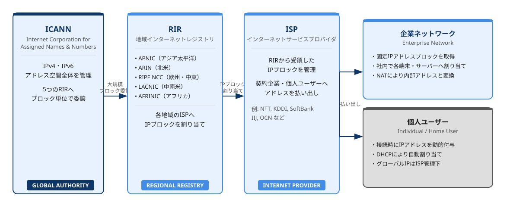

:::
::: {.column width="35%"}



::::{.message-card .position-left-05 .font-08}

:::{.message-card-title-no-margin .center}

IPアドレスブロック

:::

:::{.message-card-body .squaredmark .font-09 style="padding-top:0em; padding-bottom:0em"}

- `1.0.0.0/8` や `2001::/16` などの大きなブロックをICANN(実際はIANA)はRIRへ割り当て
- 家庭向け回線では，割り当てられるのは単一の固定IPアドレスであることが多い

:::

::::



::::{.message-card .position-left-05 .font-08}

:::{.message-card-title-no-margin .center}

RIR（地域インターネットレジストリ）

:::

:::{.message-card-body .squaredmark .font-09 style="padding-top:0em; padding-bottom:0em"}

- 世界を5地域に分けて，地域ごとにアドレスを管理する組織（日本はAPNIC管轄）

:::

::::



::::{.message-card .position-left-05 .font-08}

:::{.message-card-title-no-margin .center}

ISP（インターネットサービスプロバイダ）

:::

:::{.message-card-body .squaredmark .font-09 style="padding-top:0em; padding-bottom:0em"}

- RIR・NIRから割り当てを受けた事業者
- So-net，KDDI，ニフティなど

:::

::::


:::
::::

## 送信元IPアドレスだけでは個人を特定できない



:::: {.main-message-box}

::: {.info-contents .font-08 .padding-L-05 .lh-12}

- 送信元IPアドレスは比較的簡単に偽造できるため，それだけで送信者を特定する根拠にはならない
- DoS攻撃では，使われるパケットの大半が送信元IPアドレスを偽造している

:::
::::

:::: {.columns}
::: {.column width="50%"}

:::{.border-bottom-header}

Python製UDPパケット送信モジュール

:::


:::{.font-09}

```python
import logging
from typing import Optional
import typer

logging.getLogger("scapy").setLevel(logging.ERROR)
app = typer.Typer()

@app.command()
def send_packet(
    dst: str = typer.Option(..., help="Destination IP address"),
    src: Optional[str] = typer.Option(None, help="Source IP address (spoofed)"),
    dport: int = typer.Option(53, help="Destination port"),
    payload: str = typer.Option("hello", help="Raw UDP payload"),
    show: bool = typer.Option(False, "--show/--no-show", help="Show IP header before sending"),
):
    from scapy.all import IP, UDP, Raw, send

    ip_layer = IP(dst=dst)
    if src:
        ip_layer.src = src

    pkt = ip_layer / UDP(dport=dport) / Raw(payload.encode())

    if show:
        pkt.show()

    send(pkt, verbose=True)

if __name__ == "__main__":
    app()

```


:::

:::
::: {.column width="50%" .padding-L-10}

:::{.border-bottom-header}

送信IPの変更確認手順

:::

:::: {.tool-item .pt-0 .pb-0}

::: {.tool-content}
::: {.tool-name}

① 送信元IPに `1.2.3.4` を指定して送る

:::

::: {.tool-description style="font-size:1.1em;color: black !important"}

```bash
sudo uv run python main.py --dst 8.8.8.8 --src 1.2.3.4
```



:::

::: {.tool-description style="font-size:0.8em;color: black !important"}

- カーネル経由ではなく，raw socketでパケットを組み立てるためには，通常 `root` 権限が必要
- `8.8.8.8`: Google Public DNS

:::
:::
::::

:::: {.tool-item .pt-0 .pb-2}

::: {.tool-content}
::: {.tool-name}

② tcpdump で実際に流れたパケットを観測する

:::
::: {.tool-description style="font-size:1.1em;color: black !important"}



```bash
$ sudo tcpdump -i any udp port 53 -v
...
13:30:07.461475 enp6s0 Out IP (... proto UDP (17), length 33)
    1.2.3.4.domain > dns.google.domain: ...
```



:::

::: {.tool-description style="font-size:0.8em;color: black !important"}

- 自分のIPではなく，指定した `1.2.3.4` が[送信元として送出されている]{.regmonkey-bold}
- このように，送信元IPアドレスは送信者側で[自由に書き換えられ，簡単に偽装できてしまう]{.regmonkey-bold}

:::
:::
::::

:::
::::


## IPアドレスから個人を特定できるのは原則プロバイダだけ



:::: {.main-message-box}

::: {.info-contents .font-08 .padding-L-05 .lh-12}



- Webアクセスをすると，IPデータグラムに書かれた発信者のIPアドレスがWebサーバー側にログとして残る
- このIPアドレスから[プロバイダ・企業名までは第三者でも判明する]{.regmonkey-bold}が，その先の氏名・住所は通信の秘密として守られ，第三者が追跡するのは困難

:::
::::



::: {.regmonkey_index style="width:100%" .padding-L-10}

```yml
regmonkey_index:
  title_fontsize: 1.1em
  bullet_fontsize: 0.9em
  numbering: false
  children:
    - title: ① プロバイダ・企業名まではすぐわかる
      description:
        - IPアドレスはアドレス管理組織が範囲ごとに割り当て，その範囲ごとに管理者名が公開されている
        - このため，ログに残る送信元IPから接続先のプロバイダや企業を特定するのは比較的簡単
      width: [40,60]
    - title: ② 原理的には個人まで特定できる
      description:
        - プロバイダや企業の管理者は，どのIPアドレスを誰に割り当てたかを把握している
        - IPアドレスとその利用時刻がわかれば，記録から氏名・住所をたどることは原理的に可能
      width: [40,60]
    - title: ③ しかし第三者が追跡するのは困難
      description:
        - 電気通信事業法により，プロバイダには利用者の通信の秘密を守る義務がある
        - 割り当て先を第三者に明かすのは原則違反で，犯罪捜査など強い理由がない限り開示されない
      width: [40,60]

```

:::

## 無線LANとIEEE 802.11



:::: {.main-message-box}

::: {.info-contents .font-08 .padding-L-05 .lh-12}

- 無線LANとは，電波を利用して複数の機器間でデータの送受信を行なう通信方法（狭義には IEEE 802.11 規格に準拠した方式を指す）
- 有線LANと異なり，電波という単一の空間を共有するため，送信用と受信用の物理的な通り道（経路）が分けられていない[^channel]

:::
::::



::::{.custom-table style="width:100%; height:60%; font-size: 0.65em !important;"}
:::{.yaml2table .yaml2table-custom-top #yaml-ieee80211-generations data-col-widths="[14, 16, 16, 18, 36]"}

```yaml
record1:
  世代名称: （名称なし）
  IEEE規格: IEEE 802.11a
  最大通信速度: 54 Mbps
  利用周波数帯: 5 GHz
  特徴・主な用途:
    - 1999年策定；11bと同年だが互換性はなく普及は限定的

record2:
  世代名称: （名称なし）
  IEEE規格: IEEE 802.11b
  最大通信速度: 11 Mbps
  利用周波数帯: 2.4 GHz
  特徴・主な用途:
    - 1999年策定；無線LAN普及の最初期を担った

record3:
  世代名称: （名称なし）
  IEEE規格: IEEE 802.11g
  最大通信速度: 54 Mbps
  利用周波数帯: 2.4 GHz
  特徴・主な用途:
    - 2003年策定；11bと互換しつつ54Mbpsへ高速化

record4:
  世代名称: Wi-Fi 4
  IEEE規格: IEEE 802.11n
  最大通信速度: 600 Mbps
  利用周波数帯: 2.4 / 5 GHz
  特徴・主な用途:
    - MIMO（複数アンテナ）を初採用し，2.4/5GHz両対応に
    - 家庭・オフィスでの普及の起点となった世代

record5:
  世代名称: Wi-Fi 5
  IEEE規格: IEEE 802.11ac
  最大通信速度: 約 6.9 Gbps
  利用周波数帯: 5 GHz
  特徴・主な用途:
    - 5GHz専用・広帯域チャネルで動画ストリーミングに対応
    - MU-MIMOで複数端末への同時通信を実現

record6:
  世代名称: Wi-Fi 6
  IEEE規格: IEEE 802.11ax
  最大通信速度: 約 9.6 Gbps
  利用周波数帯: 2.4 / 5 GHz
  特徴・主な用途:
    - OFDMAで<span class="regmonkey-bold">多端末同時接続時の効率</span>を改善
    - IoT・高密度環境（駅・スタジアム等）に強い

record7:
  世代名称: Wi-Fi 6E
  IEEE規格: IEEE 802.11ax
  最大通信速度: 約 9.6 Gbps
  利用周波数帯: 2.4 / 5 / 6 GHz
  特徴・主な用途:
    - 6GHz帯を新規開放し，混雑の少ない帯域を確保
    - 低遅延・大容量通信に対応

record8:
  世代名称: Wi-Fi 7
  IEEE規格: IEEE 802.11be
  最大通信速度: 約 46 Gbps
  利用周波数帯: 2.4 / 5 / 6 GHz
  特徴・主な用途:
    - 320MHz幅・4096-QAM・MLO（複数帯域同時利用）を採用
    - VR・8K動画など<span class="regmonkey-bold">超高帯域用途</span>を想定
```

:::
::::

<!-- footer -->

[^channel]: 半二重通信と呼ぶ


## 無線LANとCSMA/CA方式: 通信の衝突を回避する技術
[CSMA/CA方式 with RTS/CTS]{.topleftbox}



:::: {.main-message-box}

::: {.info-contents .font-08 .padding-L-05 .lh-12}



- 半二重通信においてフレームが衝突するの回避するための仕組み(CA: Collision Avoidance)
- 周波数帯が使われないことを確認して，少し待ってから[^backofftime]フレームを送信する

:::
::::

::::{.step-container style="height: 22em; padding-top: 0em"}

:::{.step}

[Step 1：RTS（送信要求）]{.step .active-phase .active-phase-sm}


:::{.step-label style="width: 100%" .font-08}

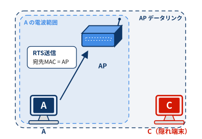


1. 通信を開始する前に利用したい周波数帯が利用されているかどうかを確認
2. ランダムバックオフ後，RTSをAP宛に送信

:::

:::

:::{.step}

[Step 2：CTS（送信許可）]{.step .active-phase .active-phase-sm}

:::{.step-label style="width: 100%" .font-08}

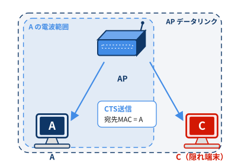


1. APはCTSをすべてのノードに送信（宛先は端末A）
2. 端末Aは CTS を受信し，送信権を獲得
3. 端末Cは自分宛てではないことを読み取り，送信抑制

:::

:::

:::{.step}

[Step 3：フレーム送信]{.step .active-phase .active-phase-sm}

:::{.step-label style="width: 100%" .font-08}

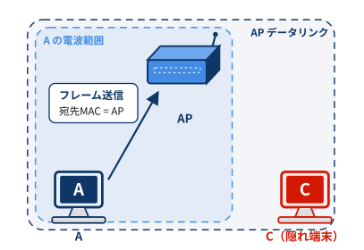

1. SIFS 後にAはフレーム送信

- SIFS は非常に短い待機時間
- 他の端末は CTS によって送信を抑制しているため，衝突が発生しにくい

:::

:::

:::{.step}

[Step 4：ACK(受信確認)]{.step .active-phase .active-phase-sm}

:::{.step-label style="width: 100%" .font-08}

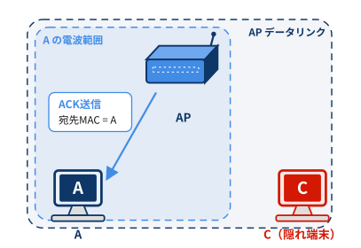

1. SIFS 後にAPはACK返送（L2 レベルの受信確認）
2. 端末Aは ACK を受信し，フレームが正常に届いたことを確認
3. ACK が受信できない場合は，衝突や通信エラーが発生したと判断し，再送を行う

:::

:::


::::


<!-- footer -->

[^backofftime]: このランダムな待ち時間のことをバックオフ制御時間と呼ぶ


## インターネット利用時の注意点



::::{.custom-table style="width:100%; height:70%; font-size: 0.7em !important;"}
:::{.yaml2table .yaml2table-custom-top #yaml-claude-md-design data-col-widths="[20, 35, 45]"}

```yaml
record1:
  category: ポート管理
  rule:
    - 利用しないポートは<span class="regmonkey-bold">必ず閉じる</span>
  actions:
    - 使用中のポートを定期的に棚卸し（<code>netstat -an</code> 等）
    - 不要なサービス・デーモンは停止し，ポートを解放
    - ウェルノウンポート（20/21/23 等）は用途がなければ即閉鎖
    - 開放ポートはアクセス元IPをACLで絞り込む

record2:
  category: ファイアウォール
  rule:
    - <span class="regmonkey-bold">デフォルト拒否</span>を原則とし，許可ルールを最小限に保つ
  actions:
    - インバウンド・アウトバウンドの両方向にルールを設定
    - 常時接続は<span class="regmonkey-bold">玄関を開けっ放しにするのと同義</span>と認識する
    - 不審なIPレンジはブラックリスト登録
    - ルール変更は変更管理ログに記録し定期レビューする

record3:
  category: セキュリティパッチ
  rule:
    - 既知脆弱性は<span class="regmonkey-bold">公開直後に適用</span>することが最大の防御
  actions:
    - OS・ミドルウェア・ファームウェアの自動更新を有効化
    - CVEアドバイザリを購読し，重大度 Critical/High を優先対応

record4:
  category: 通信暗号化
  rule:
    - 平文通信は<span class="regmonkey-bold">LAN内でも傍受リスクがある</span>と想定する
  actions:
    - Wi-Fi は WPA2/WPA3（AES-CCMP）を使用；TKIP は脆弱なため非推奨
    - HTTP・FTP・Telnet は TLS/SSH 版（HTTPS・SFTP・SSH）に移行

record5:
  category: MACアドレスフィルタリング
  rule:
    - 登録済みデバイス以外の<span class="regmonkey-bold">接続を物理層で排除</span>する
  actions:
    - AP・スイッチに許可MACリストを登録し，未登録端末を遮断
    - 新規デバイス追加時は申請フローを設け，無断接続を抑止
    - 定期的にDHCPリースログを確認し，未知MACを検出する

record6:
  category: LAN内脅威対策
  rule:
    - 内部ネットワークも<span class="regmonkey-bold">ゼロトラストで扱う</span>
  actions:
    - ARPスプーフィング対策としてDAI（Dynamic ARP Inspection）を有効化
    - 接続端末のエンドポイント保護（EDR/AV）を必須化
    - 不審な通信量・パターンをIDSで監視し，アラートを設定
```

:::
::::


# Reference{.no-auto-agenda}

## 関連Request for Comments一覧

[ネットワーク層：IP・IPv6の基本仕様]{.h2-submessage}



::::{.message-card .font-08}

:::{.message-card-title-no-margin .center}

[**RFC 791: Internet Protocol**](https://datatracker.ietf.org/doc/html/rfc791){style="color: white"}

:::

:::{.message-card-body .squaredmark .font-09}

- IPv4の基本仕様を定めたIETFの標準文書
- IPアドレス・フラグメンテーション・TTL・プロトコルフィールドなどの構造を規定

:::

::::



::::{.message-card .font-08}

:::{.message-card-title-no-margin .center}

[**RFC 8200: Internet Protocol, Version 6 (IPv6) Specification**](https://datatracker.ietf.org/doc/html/rfc8200){style="color: white"}

:::

:::{.message-card-body .squaredmark .font-09}

- IPv6の基本仕様を定めた標準文書：RFC 2460を置き換える現行版
- 128ビットアドレス・40バイト固定の基本ヘッダー・拡張ヘッダーの構造を規定

:::

::::



::::{.message-card .font-08}

:::{.message-card-title-no-margin .center}

[**RFC 4862: IPv6 Stateless Address Autoconfiguration**](https://datatracker.ietf.org/doc/html/rfc4862){style="color: white"}

:::

:::{.message-card-body .squaredmark .font-09}

- ルーター広告（RA）のプレフィックスから端末が自力でアドレスを生成するSLAACの仕様
- 重複アドレス検出（DAD）やアドレスの有効期限の管理手順を規定

:::

::::


## 関連Request for Comments一覧

[ネットワーク層：アドレスの配布・管理]{.h2-submessage}



::::{.message-card .font-08}

:::{.message-card-title-no-margin .center}

[**RFC 2131: Dynamic Host Configuration Protocol**](https://datatracker.ietf.org/doc/html/rfc2131){style="color: white"}

:::

:::{.message-card-body .squaredmark .font-09}

- IPアドレス・サブネットマスク・デフォルトゲートウェイなどをサーバーから自動配布するDHCPの仕様
- Discover → Offer → Request → ACK の4段階でリース（貸与）を確立

:::

::::



::::{.message-card .font-08}

:::{.message-card-title-no-margin .center}

[**RFC 1918: Address Allocation for Private Internets**](https://datatracker.ietf.org/doc/html/rfc1918){style="color: white"}

:::

:::{.message-card-body .squaredmark .font-09}

- 組織内で自由に使えるプライベートアドレス空間（`10.0.0.0/8`・`172.16.0.0/12`・`192.168.0.0/16`）を予約
- インターネット上にはルーティングされないため，外部との通信にはNATによる変換が必要

:::

::::


## 関連Request for Comments一覧

[トランスポート層：TCP・UDP]{.h2-submessage}



::::{.message-card .font-08}

:::{.message-card-title-no-margin .center}

[**RFC 9293: Transmission Control Protocol (TCP)**](https://datatracker.ietf.org/doc/html/rfc9293){style="color: white"}

:::

:::{.message-card-body .squaredmark .font-09}

- コネクション型で信頼性のあるデータ転送を提供するTCPの現行標準：RFC 793を置き換え
- 3ウェイハンドシェイク・再送制御・ウィンドウによるフロー制御を規定

:::

::::



::::{.message-card .font-08}

:::{.message-card-title-no-margin .center}

[**RFC 768: User Datagram Protocol**](https://datatracker.ietf.org/doc/html/rfc768){style="color: white"}

:::

:::{.message-card-body .squaredmark .font-09}

- コネクションレスで軽量なデータグラム転送を提供するUDPの標準文書
- 再送・順序保証を持たない分オーバーヘッドが小さく，DNS・DHCP・音声・動画配信などで利用

:::

::::


## 関連Request for Comments一覧

[アプリケーション層：Web・電子メール]{.h2-submessage}



::::{.message-card .font-08}

:::{.message-card-title-no-margin .center}

[**RFC 9110: HTTP Semantics**](https://datatracker.ietf.org/doc/html/rfc9110){style="color: white"}

:::

:::{.message-card-body .squaredmark .font-09}

- Webで用いるHTTPの意味論（メソッド・ステータスコード・ヘッダー）を定義する現行標準
- HTTP/1.1・HTTP/2・HTTP/3 に共通する概念を一つの文書に整理

:::

::::



::::{.message-card .font-08}

:::{.message-card-title-no-margin .center}

[**RFC 5321: Simple Mail Transfer Protocol**](https://datatracker.ietf.org/doc/html/rfc5321){style="color: white"}

:::

:::{.message-card-body .squaredmark .font-09}

- 電子メールを送信・中継するSMTPの仕様：メールサーバー間の配送手順を規定
- 添付ファイルや日本語件名はMIME（[RFC 2045](https://datatracker.ietf.org/doc/html/rfc2045)）による拡張で実現

:::

::::



::::{.message-card .font-08}

:::{.message-card-title-no-margin .center}

[**RFC 1939: Post Office Protocol - Version 3**](https://datatracker.ietf.org/doc/html/rfc1939){style="color: white"}

:::

:::{.message-card-body .squaredmark .font-09}

- メールサーバーの受信箱からメールを取り出すPOP3の標準文書
- ダウンロード後にサーバーから削除する利用形態を想定：サーバー側でのメール管理はIMAPが担う

:::

::::


## 関連Request for Comments一覧

[データリンク層：PPP・ARP]{.h2-submessage}



::::{.message-card .font-08}

:::{.message-card-title-no-margin .center}

[**RFC 1661: The Point-to-Point Protocol (PPP)**](https://datatracker.ietf.org/doc/html/rfc1661){style="color: white"}

:::

:::{.message-card-body .squaredmark .font-09}

- 2点間を1対1で接続するデータリンク層プロトコルの標準文書
- LCPによるリンク確立・NCPによる上位プロトコル設定・認証（PAP・CHAP）の枠組みを規定

:::

::::



::::{.message-card .font-08}

:::{.message-card-title-no-margin .center}

[**RFC 826: An Ethernet Address Resolution Protocol**](https://datatracker.ietf.org/doc/html/rfc826){style="color: white"}

:::

:::{.message-card-body .squaredmark .font-09}

- IPアドレスから宛先のMACアドレスを解決するARPの標準文書
- 同一データリンク内へのブロードキャスト問い合わせで宛先NICを特定する

:::

::::


## TCP/IPの絵本 第2版



:::: {.columns}
::: {.column .book-image}

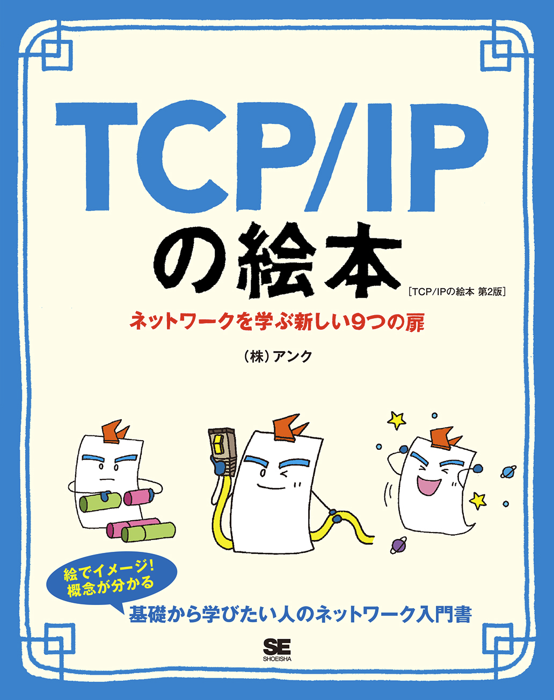

:::

::: {.column .book-info}
### 書籍情報

| | |
|----------|------|
| タイトル  | [TCP/IPの絵本 第2版 ネットワークを学ぶ新しい9つの扉](https://www.shoeisha.co.jp/book/detail/9784798155159) |
| 著者     | 株式会社アンク 著 |
| 発売日   | 2018/07/11 |
| ISBN13   | 978-4-7981-5515-9 |
| 体裁     | 208ページ，B5判 |

: {tbl-colwidths="[25,65]"}

### この本の内容

- 前提知識不要でネットワークの仕組みをイラストで解説する入門書
- IPv6・ファイアウォール・セキュリティなど現代的なトピックを2ページ単位でコンパクトに学べる
- TCP/IPの5層モデルを軸に，パケット通信の流れを視覚的に理解できる構成

:::
::::
